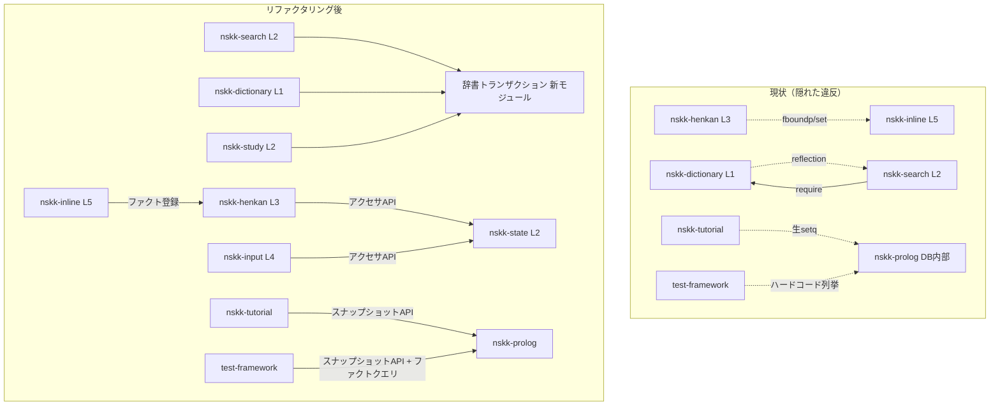

# NSKK 大規模リファクタリング 要件定義書

本書の file:line 根拠はすべて main (4396868, v0.3.0) 時点のツリーに対して検証されたもの。実装が進んだブランチ上では行番号がずれている可能性があるため、根拠を再確認する際は当該リビジョンを参照すること。

## Summary

**要求**: nskk.el（src/ 28モジュール・21,597行・469関数）の大規模リファクタリング。既存のCPS変換（`defun/k` 系、18/28モジュールで使用）とPrologエンジンを実装機構として活用する。

**Why**: ゲート（byte-compile warning=error・checkdoc・package-lint・5,000超テスト・CI 4バージョンマトリクス)は完備だが、ツールで見えない構造欠陥がある。モジュール横断のプライベートシンボル依存が95個あり、うち変異系（生setq・リフレクション・ハードコード列挙）が最悪。ユーザー決定により**95個全ての解消**をスコープとする。

**期待成果**:

1. 「7 strict layers, zero circular deps」が実行時セマンティクスでも真になる
2. src/ 内にモジュール横断の `nskk--*` 参照ゼロ（機械検証可能）
3. 状態変数の単一所有権
4. 重複約440行の共通化と100行超関数13件の棚卸し
5. 全Emacsバージョンでゲート緑維持

## Current State

| 項目 | 状態 | 根拠 |
|---|---|---|
| レイヤールール | 各ファイル `;; Layer position:` ヘッダ（study.elのヘッダは実依存と乖離 — `nskk-study.el:29` がdictionary依存を欠く） | verified |
| 静的require循環 | ゼロ（DFS検証） | verified |
| 横断プライベートシンボル | 95個（prolog 19・henkan 14・input 12・dictionary 12・state 9・nskk.el 6・converter 5・他） | verified（定義スコープの相互参照走査） |
| 変異系の最悪例 | `nskk-tutorial.el:1067-1111` がProlog DB内部7変数を生setqで保存/復元、`nskk-converter.el:534-535` が動的let束縛 | verified |
| テスト基盤 | `test/nskk-test-framework.el:510-545` が内部変数名・initializedフラグ8モジュール分をハードコード列挙 | verified |
| 100行超関数 | 13件（最大360行）。括弧平衡パーサによる計測値（下記Constraints「測定の罠」参照） | verified |
| CI | Emacs 29.1 / 29.4 / 30.1 / snapshot × compile/test/lint/package-lint | verified（ci.yml） |
| ハウスイディオム | CPS `/k` 継続規約（18モジュール）、Prologファクト登録（`clearable-input-var/1` 前例） | verified |

宣言済み負債はゼロ（TODO/FIXME/HACK・廃止マーカー・コメントアウトコードなし、grep全滅確認済み）。意図的に文書化された設計制約が2箇所（`nskk-prolog.el:98-117` のProlog制約、キャッシュAPIのnil/miss区別）。オープンなIssue/PRなし。

## Functional Requirements

### 系統A: レイヤー違反とモジュール結合の解消

**FR-001: henkan(L3)→inline(L5) 逆依存の解消 ＋ クリーンアップ登録プロトコル新設**（mandatory）

- 提示層・入力層がクリーンアップ/リセット処理をPrologファクトとして登録し、henkanは列挙実行のみ行う（`clearable-input-var/1` の一般化）。henkanのソースからinlineシンボル参照が消えること（現況: `nskk-henkan.el:786-787, 828-834, 1540, 2030, 2049-2050, 2062-2068` の呼び出し5箇所＋プライベート変数 `nskk--inline-overlay` の直接変更2箇所）。
- 保存すべき不変条件: `nskk-henkan.el:818-834` の2段構え（コールバック実行後に、コールバック再実行なしで終端状態＝全オーバーレイ消滅を再保証）。登録方式でも「クリーンアップ処理自体がエラーを起こした場合を含め、変換終了後に全オーバーレイが消えている」ことが観察可能であること。
- inline未ロード時も変換動作が成立すること（nskk.el はinlineをソフトrequireしており、任意性を保持する）。
- 受け入れ基準: `grep -c "nskk-inline\|nskk--inline" src/nskk-henkan.el` = 0、inline未ロードで変換完走、異常系オーバーレイ消滅テスト新設、既存テスト緑。

**FR-002: 辞書トランザクションモジュールの抽出**（mandatory）

- dictionary私有6関数（`nskk--dict-clear-pending-rollback` / `nskk--dict-ensure-rollback-complete` / `nskk--dict-rollback-and-resignal` / `nskk--dict-predicate-snapshot` / `nskk--dict-apply-predicate-snapshot` / `nskk--dict-insert-file-contents-pinned`）を新モジュール（下位レイヤー）へ移し公開API化。公開APIは `/k` 継続規約（成功/失敗の2継続、`defun/3k` 相当）に従う。
- 対象呼び出し元は search.el（`nskk-search.el:773-849`）と study.el（`nskk-study.el:240-305`、直接require経由）の両方。FR-006と同一行を編集するため同一Phaseで実施。
- dictionary→searchのリフレクション（`nskk-dictionary.el:1640-1644` → `nskk-search.el:689,718`）はキャッシュスナップショットの正方向依存化で解消。
- 付随作業: Makefile SRCへの挿入位置（prolog直後）、package-lint対象追加、`/k` 名のsane-prefixes追加、新旧モジュールのレイヤーヘッダ更新（study.elの既存ヘッダドリフト修正を含む）、require経路の明示（nskk.elのrequireブロックは網羅的でないため、消費3モジュール各自がrequireする）。
- 根拠: 3ファイルが同一契約を共有しており、`nskk--dict-commit-staged-predicate`（`nskk-dictionary.el:544-566`）という既存の再利用ヘルパーを両呼び出し元が使い損ねている事実が、契約の置き場所が悪いことの直接証拠。

**FR-009: Prolog DBスナップショット/リストア公開API**（mandatory）

- Prolog DB内部（`nskk--prolog-database` 等7変数）の保存/復元/一時差し替えを公開APIとして提供し、生操作を全廃する。移行対象: `nskk-tutorial.el:1067-1075, 1102-1111`（生setq）、`nskk-converter.el:534-535`（let束縛）、`test/nskk-test-framework.el:510-537`（ハードコード列挙）。dictionary/server/search等の読み取り参照もAPI経由化。
- 受け入れ基準: prolog.el外での `nskk--prolog-*` 参照ゼロ（grep検証）、Prolog単体テスト・tutorial系テスト緑。

**FR-010: モジュール初期化/リセットの登録プロトコル**（mandatory）

- 各モジュールの `nskk--*-initialized` フラグとリセット手続きをFR-001の登録プロトコルに載せ、テスト基盤のハードコード列挙（`test/nskk-test-framework.el:538-545`）をファクトクエリによる列挙へ置換。`nskk--state-prolog-initialized` を含む。
- 受け入れ基準: test-framework内のsrc内部シンボル列挙ゼロ、全スイート緑。

**FR-011: 残余の横断プライベートシンボルの全処分**（mandatory）

- FR-001/002/004/009/010で吸収されない残り約50シンボル（henkan 14、input 12の一部、dictionary 6、nskk.el 6、converter 5、modeline/keymap/isearch 各3、annotation 2、他）を、シンボルごとに「公開API昇格（docstring付き）／所有モジュールへのロジック移設／登録プロトコル化による廃止」のいずれかに処分する。処分表はPhase 0で機械生成する目録を入力とし、実装時に判断・記録する。
- 受け入れ基準: **src/ 全体で「他ファイル定義の `nskk--*` シンボルへの参照」がゼロ**（Phase 0の走査スクリプトを完了判定に再利用）。単体テストは対象モジュール自身のプライベート参照のみ許容し、公開API昇格分は改名追随（アサーション弱体化は禁止）。

**FR-003は独立FRとしては存在しない**: `clearable-input-var/1` のL3→L4暗黙結合の形式化はFR-001の登録プロトコルに吸収済み。

### 系統B: 状態管理の一元化

**FR-004: 状態変数の単一所有権**（mandatory）

- `nskk-state.el:631-705` の8変数（`nskk--romaji-buffer`、`nskk--conversion-start-marker`、`nskk--conversion-overlay`、`nskk--pending-romaji-overlay`、`nskk--candidate-overlay`、`nskk--dcomp-multiple-overlay`、`nskk--henkan-count`、`nskk--registration-depth`）にアクセサAPIを設ける。既存state.elの流儀に合わせ、nil/未設定の区別が要る箇所は `/k` スタイル。
- 移行対象: henkan（30箇所超）・input（20箇所超）・keymap（8）・candidate-window・inline・nskk.el（`nskk.el:655` 等）・tutorial（`nskk-tutorial.el:1441-1442`）。
- テスト側追随の規模（counted）: `nskk-henkan-test.el` 459参照、`nskk-input-test.el` 102、`nskk-keymap-test.el` 68、`nskk-candidate-window-test.el` 44、`nskk-bench.el` 11、`nskk-test-macros.el` 13シンボル。
- 制約: 8変数はバッファローカルのまま。PrologグローバルDBには載せない（`nskk-prolog.el:98-117` のバッファ非分離制約による機械的棄却）。

### 系統C: 重複・巨大関数

**FR-005: 100行超関数13件の棚卸し**（mandatory・トリアージ付き）

- 対象は括弧平衡パーサ計測で確定した13件。最大は `nskk--dict-insert-file-contents-pinned`（`nskk-dictionary.el:880-1239`、360行、cl-labels 13関数、ディレクトリ属性取得の同型4重複を内包）。prologの159行トランザクション関数（`nskk--prolog-replace-clause-transaction`、`nskk-prolog.el:1257-1415`）を含む。
- 各関数を「分解する」か「凝集で分割不適と判断し理由を報告する」（`nskk-undo-kakutei`・`nskk--program-dict-run-calculation` は後者の判定前例あり — 単一目的のステートマシンで、所有権分析なしの分割は改悪リスクが上回る）。
- 360行関数は直接名指しするテストがゼロ（verified）のため、分解前に特性テスト（symlink拒否・サイズ上限・リトライ等の観察可能挙動）を追加してから着手する。TOCTOU対策セマンティクス（symlink競合・所有権検査・ハードリンクスナップショット・リトライ）は観察可能な挙動として不変。

**FR-006: トランザクショナル読込パターンの共通化**（mandatory)

- `nskk-search.el:763-870` と `nskk-study.el:234-308` のほぼ逐語的重複（検証→読込→単一フォーム検査→retract/assert→ロールバック、約120行）をFR-002の新モジュール上で統合。エントリ解析部（両者で唯一異なる箇所）のみパラメータ化。FR-002と同一Phase。

**FR-007: ディープコピー統合**（optional）

- `nskk-prolog.el:813-984`（外部12呼び出し箇所を持つ主実装）と `nskk-tutorial.el:911-1061` の統合。prolog版を拡張しtutorial版を薄いラッパー化。意図的差分（tutorial側: 外部memo・bool-vector対応・GC閾値調整 / prolog側: functionp同一性保持）を統合後も保存すること。
- bench比較必須（converter×5・cache×2等ホットパス呼び出し元12箇所）。

**FR-008: 死コード削除・命名統一**（mandatory）

- `nskk--converter-copy-prolog-state`（`nskk-converter.el:511-552`、全ツリーで参照ゼロ・動的ディスパッチ除外確認済み）の削除。削除直前に参照ゼロを再確認すること。
- `nskk-cache--key-equal-p`（`nskk-cache.el:99`）を支配的規約 `nskk--cache-key-equal-p` へ改名（プロジェクト全体で `nskk--MODULE-` 296件 vs 逆形18件）。
- `nskk-tutorial--*` の17定義は触らない — ファイル内で自己一貫しており、defectではない。

## Non-Functional Requirements

- **NFR-001 挙動不変**: 既存スイート緑。内部シンボル改名へのテスト側追随は機械的置換に限定し、アサーション弱体化・skip追加は禁止。
- **NFR-002 マルチバージョン**: CIマトリクス（Emacs 29.1/29.4/30.1/snapshot）全緑。ローカル検証は使用バージョンを明記し、CI通過を最終判定とする。
- **NFR-003 性能非退行**: Phase 0で `make bench` を記録し各Phase末に比較。特にFR-007とFR-009（Prolog API経由化によるオーバーヘッド）はbench必須。CHANGELOG 0.3.0が変換時間33-52%短縮を実測記載しており、これを毀損しない。
- **NFR-004 ゲート維持**: 新モジュール含む全ファイルでcompile（warning=error）/checkdoc/package-lint緑。新設 `/k` 公開関数はMakefileのsane-prefixes更新を伴う（`package-lint--sane-prefixes` は個別シンボル名を列挙する正規表現のため、追加を忘れるとゲートが赤になる）。

## Technical Specifications（設計方針と根拠）

1. **依存反転はPrologファクト登録で行う**（FR-001/010/011の一部）: `clearable-input-var/1` が同一パス上で現に稼働する自家前例。テスト基盤のハードコード列挙も同じ機構で置換でき、3つの問題が1つのプロトコルに収束する。却下案: Emacs標準hook — 動作するが、ハウスイディオムから外れ、テスト基盤の列挙問題に自然に延びない。却下案: henkanに `(require 'nskk-inline)` を追加 — 循環は生じないが、L3→L5の逆方向依存を「隠れた違反」から「公式な違反」に変えるだけ。
2. **新公開APIは `/k` 継続規約**（FR-002/004/009）: 18/28モジュールの支配的イディオム。`nskk-cache-get/k` のnil/miss区別前例に従う。
3. **状態はバッファローカルのまま、所有権はstate.el**: 移行対象ファイルは全てstate.elを既にrequire済みでrequireグラフ変更不要。却下案: 実質的所有者henkan（L3）への移設 — L5提示層がオーバーレイを読むため、L5→L3依存の新設が必要になりrequireグラフの変更が大きい。
4. **破壊的変更の許可は保持、行使は最小**: 対象シンボルは全て `nskk--*`。公開API「追加」は非破壊。既存公開シンボルを触る場合のみ0.4.0破壊枠を使い、CHANGELOGに記録。既存5,000超テストを無傷の回帰ゲートとして使えることが最大の資産。
5. **スコープ外（理由付き）**:
   - henkan.el（2,482行）のファイル分割 — 自然な縫目なし（preedit・登録・送り仮名・候補ナビゲーションが内部seamなしに混在、verified）。テスト7,300行超の移行コストが分割益を上回る。FR-011完了後に境界が見えたら再提案。
   - エラーハンドリング様式統一 — 現状の `error`/`signal`/`user-error` の使い分けはidiomaticと判定済み。

## Architecture Impact

Makefileへの影響: SRC変数へ新モジュール追加（挿入位置は依存から導出、prolog直後）、package-lint対象・sane-prefixes更新。CI定義への影響はMakefile経由の間接のみ（ci.ymlはファイル列挙を持たない、verified）。

## Constraints

- 各ファイルの `;; Layer position:` ヘッダが唯一の権威的レイヤールール。全変更はこれに整合させ、ヘッダの依存宣言も同時更新する。
- Serenaはこのリポジトリをnix言語として検出するため、Elispのシンボル操作ツールは使えない。Grep/Read＋paredit-cliで作業する。
- **測定の罠**: `defun/k`/`defun/done`/`defun/3k` もトップレベル定義子。`(defun ` のみを境界とするスパン走査は小さなCPS関数群を巨大関数に誤合算する。関数長は括弧平衡パーサで測ること。
- Makefile SRCは手動順序の網羅列挙。byte-compile-error-on-warn=t のため前方宣言管理が全移動で必須。input.elの前方宣言11個（`nskk-input.el:123-141`）はFR-011の処分対象と連動。
- git書き込み操作（commit/push/branch/PR）はユーザーの明示指示があるまで行わない。

## Test Requirements

- **Phase 0ベースライン**: 選択テスト数（README「5,000+」との桁整合を確認、ゼロ選択の空虚緑を排除）、bench数値、横断シンボル目録（処分表の入力＋完了判定スクリプト）。
- 各Phase末: `make compile && make test && make lint && make package-lint` 全緑＋grepベースの機械検証（FR-001/009/010/011の各ゼロ基準）。
- 新設テスト: FR-001の異常系オーバーレイ消滅テスト、FR-002/009/010新APIの単体テスト、FR-005の特性テスト（分解前に追加）。
- 最終: CIマトリクス4バージョン全緑。

## Outstanding Issues

なし。スコープ分岐（結合解消範囲＝95個全解消・巨大関数の対象拡張・API互換性＝0.4.0破壊許容・モジュール新設許容）はすべてユーザー回答で確定済み。

## Task Breakdown

| Phase | 内容 | 主対象 | 依存 |
|---|---|---|---|
| 0 | ベースライン（テスト数・bench・全ゲート）＋横断シンボル目録生成（処分表の器） | — | なし |
| 1a | FR-001: クリーンアップ登録プロトコル＋henkan→inline解消 | henkan, inline | 0 |
| 1b | FR-002+006: トランザクションモジュール抽出＋読込共通化＋study/searchヘッダ修正 | dictionary, search, study, 新モジュール, Makefile | 0（1aと並行可） |
| 1c | FR-009: Prolog DBスナップショットAPI＋tutorial/converter/テスト基盤移行 | prolog, tutorial, converter, test-framework | 0（並行可） |
| 2 | FR-004: 状態アクセサ＋7ファイル移行＋テスト側追随（684参照） | state, henkan, input, keymap, candidate-window, inline, nskk.el, tutorial, test各所 | 1a |
| 3 | FR-010: initialized/リセット登録化＋テスト基盤の列挙排除 | 各モジュール, test-framework | 1a, 1c |
| 4 | FR-011: 残余約50シンボルの処分（目録駆動） | henkan, input, dictionary, nskk.el, converter, 他 | 1a-3 |
| 5 | FR-005（特性テスト→分解トリアージ）/ FR-007（optional, bench比較）/ FR-008 | dictionary, prolog, tutorial, converter, cache | 1b（FR-005の360行分） |
| 6 | ドキュメント: CHANGELOG 0.4.0、READMEのモジュール数・レイヤー数更新、全レイヤーヘッダ整合確認 | README.org, CHANGELOG.md, src/*ヘッダ | 全Phase |

**実装者が前提にしてはならないこと**:

1. Serenaシンボル操作の可用性（不可 — nix検出）
2. `(defun ` 境界のスパン走査による関数長測定（誤測定する）
3. テストがプライベートシンボルに触れていないこと（henkan-testだけで459参照 — 改名は必ずtest/を含めて実施）
4. test-frameworkを触らずに内部改名が通ること（`test/nskk-test-framework.el:510-545` のハードコードが先に壊れる）
5. ローカル1バージョンの緑がCI緑を意味すること（CIは29.1/29.4/30.1/snapshot）
6. henkan.elファイル分割がスコープ内であること（スコープ外）
