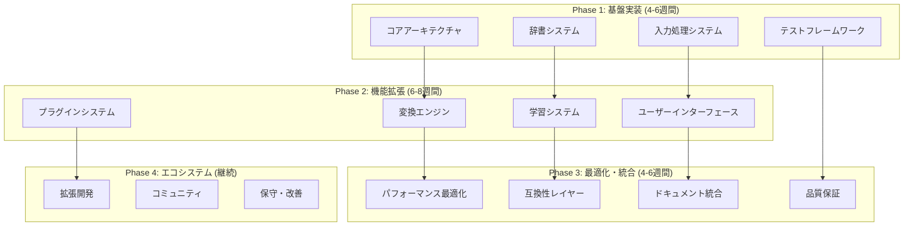

# NSKK開発ロードマップ - AI Coding Agent並列実装戦略

## プロジェクト概要

NSKKは次世代SKK実装を目指すEmacs Lispプロジェクトです。ddskk/skkeletonの優れた要素を統合し、外部依存ゼロ、高性能、拡張可能なアーキテクチャを実現します。本ロードマップは、AI Coding Agentによる効率的な並列実装を可能にする詳細な実装計画を提供します。

## 実装戦略概要



## Phase 1: 基盤実装 (4-6週間)

### 並列実装可能タスク群A: コアアーキテクチャ

#### Agent-A1: nskk-core.el - コアシステム実装
**推定工数**: 1-2週間
**依存関係**: なし
**並列度**: 完全独立

```elisp
;; 実装対象ファイル: nskk-core.el
;; 主要コンポーネント:
;; - 基本データ構造定義
;; - メモリ管理システム
;; - エラーハンドリング
;; - ロギングシステム
;; - 設定管理基盤

;; 実装例:
(defconst nskk-version "1.0.0"
  "NSKKバージョン情報")

(defvar nskk--core-initialized nil
  "コア初期化フラグ")

(defcustom nskk-memory-limit 52428800  ; 50MB
  "最大メモリ使用量（バイト）"
  :type 'integer
  :group 'nskk)
```

**実装詳細**:
- マクロ駆動設計の基盤構築
- ゼロ依存原則の確立
- パフォーマンス監視基盤
- 設定システムの実装

#### Agent-A2: nskk-util.el - ユーティリティシステム
**推定工数**: 1週間
**依存関係**: nskk-core.el
**並列度**: A1完了後開始可能

```elisp
;; 実装対象ファイル: nskk-util.el
;; 主要機能:
;; - 文字列処理ユーティリティ
;; - ハッシュテーブル操作
;; - ファイル I/O ヘルパー
;; - 数学・統計関数
;; - デバッグユーティリティ

;; 実装例:
(defsubst nskk-string-trim (str)
  "文字列の前後空白を除去"
  (replace-regexp-in-string "\\`[ \t\n]*\\|[ \t\n]*\\'" "" str))

(defmacro nskk-with-hash-cache (key table &rest body)
  "ハッシュキャッシュアクセスマクロ"
  `(let ((cached (gethash ,key ,table)))
     (if cached cached
       (let ((result (progn ,@body)))
         (puthash ,key result ,table)
         result))))
```

### 並列実装可能タスク群B: 入力処理システム

#### Agent-B1: nskk-input.el - 入力ハンドリング
**推定工数**: 2週間
**依存関係**: nskk-core.el, nskk-util.el
**並列度**: A1-A2完了後並列実装可能

```elisp
;; 実装対象ファイル: nskk-input.el
;; 主要機能:
;; - キーマップ定義・管理
;; - 入力イベント処理
;; - モード切り替え管理
;; - 特殊キー処理
;; - ローマ字入力解析

;; 実装例:
(defvar nskk-input-mode-map
  (let ((map (make-sparse-keymap)))
    (define-key map "q" 'nskk-toggle-mode)
    (define-key map " " 'nskk-convert-start)
    map)
  "NSKK入力モードキーマップ")

(defun nskk-input-process-key (key)
  "キー入力の処理"
  (let ((start-time (current-time)))
    (unwind-protect
        (nskk--process-key-internal key)
      (nskk--record-timing 'key-processing start-time))))
```

#### Agent-B2: nskk-romaji.el - ローマ字変換エンジン
**推定工数**: 1-2週間
**依存関係**: nskk-util.el
**並列度**: B1と並列実装可能

```elisp
;; 実装対象ファイル: nskk-romaji.el
;; 主要機能:
;; - ローマ字→ひらがな変換
;; - 変換ルール管理
;; - 状態機械実装
;; - 特殊変換処理
;; - カスタマイズ対応

;; 実装例:
(defconst nskk-romaji-table
  '(("a" . "あ") ("i" . "い") ("u" . "う") ("e" . "え") ("o" . "お")
    ("ka" . "か") ("ki" . "き") ("ku" . "く") ("ke" . "け") ("ko" . "こ")
    ;; ... 完全なローマ字テーブル
    )
  "ローマ字変換テーブル")

(defun nskk-romaji-convert (romaji)
  "ローマ字をひらがなに変換"
  (nskk-with-hash-cache romaji nskk--romaji-cache
    (nskk--romaji-convert-internal romaji)))
```

### 並列実装可能タスク群C: 辞書システム

#### Agent-C1: nskk-dictionary.el - 辞書管理システム
**推定工数**: 2-3週間
**依存関係**: nskk-core.el, nskk-util.el
**並列度**: A群完了後、B群と並列実装可能

```elisp
;; 実装対象ファイル: nskk-dictionary.el
;; 主要機能:
;; - 辞書ファイル読み込み・解析
;; - 複数辞書管理
;; - 高速検索インデックス
;; - 辞書サーバー連携
;; - 辞書キャッシュシステム

;; 実装例:
(defcustom nskk-dictionary-list
  '(("~/.emacs.d/skk/SKK-JISYO.L" . utf-8)
    ("~/.emacs.d/skk/SKK-JISYO.jinmei" . utf-8))
  "使用する辞書ファイルリスト"
  :type '(repeat (cons file coding-system))
  :group 'nskk)

(defvar nskk--dictionary-index (make-hash-table :test 'equal)
  "辞書インデックス（高速検索用）")

(defun nskk-dictionary-search (key)
  "辞書検索（高速インデックス使用）"
  (nskk-with-hash-cache key nskk--dictionary-cache
    (nskk--dictionary-search-internal key)))
```

#### Agent-C2: nskk-search.el - 検索エンジン
**推定工数**: 1-2週間
**依存関係**: nskk-dictionary.el
**並列度**: C1完了後開始

```elisp
;; 実装対象ファイル: nskk-search.el
;; 主要機能:
;; - 前方一致検索
;; - 部分一致検索
;; - 正規表現検索
;; - 曖昧検索
;; - スコアリングシステム

;; 実装例:
(defun nskk-search-prefix (prefix)
  "前方一致検索"
  (let ((results nil)
        (count 0))
    (maphash (lambda (key value)
               (when (and (string-prefix-p prefix key)
                         (< count nskk-search-max-results))
                 (push (cons key value) results)
                 (setq count (1+ count))))
             nskk--dictionary-index)
    (sort results (lambda (a b) (< (length (car a)) (length (car b)))))))
```

### 並列実装可能タスク群D: テストフレームワーク

#### Agent-D1: nskk-test.el - テストフレームワーク
**推定工数**: 1週間
**依存関係**: nskk-core.el
**並列度**: 全フェーズと並列実装可能

```elisp
;; 実装対象ファイル: nskk-test.el
;; 主要機能:
;; - TDDフレームワーク
;; - PBTジェネレータ
;; - ベンチマークシステム
;; - カバレッジ測定
;; - 継続的テスト

;; 実装例:
(defmacro nskk-deftest (name &rest body)
  "NSKKテスト定義マクロ"
  `(ert-deftest ,(intern (format "nskk-test-%s" name)) ()
     (let ((nskk-test-environment t))
       ,@body)))

(defmacro nskk-benchmark (name iterations &rest body)
  "ベンチマークマクロ"
  `(let* ((gc-cons-threshold most-positive-fixnum)
          (start (current-time))
          (result nil))
     (dotimes (_ ,iterations)
       (setq result (progn ,@body)))
     (nskk--record-benchmark ,name ,iterations start result)))
```

## Phase 2: 機能拡張 (6-8週間)

### 並列実装可能タスク群E: 変換エンジン

#### Agent-E1: nskk-convert.el - 変換コントローラー
**推定工数**: 2-3週間
**依存関係**: Phase 1完了
**並列度**: F群と並列実装可能

```elisp
;; 実装対象ファイル: nskk-convert.el
;; 主要機能:
;; - かな漢字変換制御
;; - 変換候補生成
;; - 変換状態管理
;; - 候補選択処理
;; - 確定・取消処理

;; 実装例:
(defvar nskk-conversion-state nil
  "現在の変換状態")

(cl-defstruct nskk-conversion-state
  input           ; 入力文字列
  candidates      ; 変換候補リスト
  current-index   ; 現在の候補インデックス
  confirmed-text  ; 確定済みテキスト
  mode           ; 変換モード
  timestamp)     ; 開始時刻

(defun nskk-convert-start (input)
  "変換開始"
  (setq nskk-conversion-state
        (make-nskk-conversion-state
         :input input
         :candidates (nskk-generate-candidates input)
         :current-index 0
         :mode 'selecting
         :timestamp (current-time))))
```

#### Agent-E2: nskk-candidate.el - 候補生成システム
**推定工数**: 2週間
**依存関係**: nskk-convert.el, nskk-search.el
**並列度**: E1と部分的に並列可能

```elisp
;; 実装対象ファイル: nskk-candidate.el
;; 主要機能:
;; - 候補生成アルゴリズム
;; - スコアリング・ランキング
;; - 注釈処理
;; - フィルタリング
;; - 候補キャッシュ

;; 実装例:
(defun nskk-generate-candidates (input)
  "変換候補生成"
  (let ((raw-candidates (nskk-dictionary-search input))
        (scored-candidates nil))
    (dolist (candidate raw-candidates)
      (let ((score (nskk-calculate-candidate-score candidate input)))
        (push (cons candidate score) scored-candidates)))
    (mapcar #'car
            (sort scored-candidates
                  (lambda (a b) (> (cdr a) (cdr b)))))))

(defun nskk-calculate-candidate-score (candidate input)
  "候補スコア計算"
  (+ (nskk-frequency-score candidate)
     (nskk-context-score candidate)
     (nskk-recency-score candidate)
     (nskk-user-preference-score candidate)))
```

### 並列実装可能タスク群F: 学習システム

#### Agent-F1: nskk-learning.el - 学習エンジン
**推定工数**: 2-3週間
**依存関係**: nskk-convert.el, nskk-dictionary.el
**並列度**: E群と並列実装可能

```elisp
;; 実装対象ファイル: nskk-learning.el
;; 主要機能:
;; - 使用頻度学習
;; - 文脈学習
;; - 個人辞書管理
;; - 学習データ永続化
;; - 学習効果測定

;; 実装例:
(defvar nskk--learning-data (make-hash-table :test 'equal)
  "学習データハッシュテーブル")

(cl-defstruct nskk-learning-entry
  word              ; 学習対象語
  frequency         ; 使用頻度
  last-used         ; 最終使用時刻
  context-words     ; 文脈語リスト
  user-score)       ; ユーザースコア

(defun nskk-learn-selection (input selected-candidate)
  "選択した候補から学習"
  (let ((entry (gethash input nskk--learning-data)))
    (if entry
        (nskk--update-learning-entry entry selected-candidate)
      (nskk--create-learning-entry input selected-candidate))
    (nskk--save-learning-data-async)))
```

#### Agent-F2: nskk-statistics.el - 統計・分析システム
**推定工数**: 1-2週間
**依存関係**: nskk-learning.el
**並列度**: F1と部分的に並列可能

```elisp
;; 実装対象ファイル: nskk-statistics.el
;; 主要機能:
;; - 使用統計収集
;; - パフォーマンス分析
;; - 学習効果測定
;; - レポート生成
;; - データ可視化

;; 実装例:
(defvar nskk--statistics-data
  '((total-conversions . 0)
    (successful-predictions . 0)
    (average-response-time . 0.0)
    (memory-usage . 0)
    (cache-hit-rate . 0.0))
  "統計データ")

(defun nskk-collect-statistics (operation duration result)
  "統計データ収集"
  (nskk--update-counter operation)
  (nskk--update-timing operation duration)
  (nskk--update-accuracy operation result)
  (when (zerop (mod (nskk--get-counter 'total-operations) 100))
    (nskk--generate-statistics-report)))
```

### 並列実装可能タスク群G: ユーザーインターフェース

#### Agent-G1: nskk-ui.el - UI管理システム
**推定工数**: 2週間
**依存関係**: nskk-convert.el
**並列度**: E, F群と並列実装可能

```elisp
;; 実装対象ファイル: nskk-ui.el
;; 主要機能:
;; - 候補表示システム
;; - インライン表示
;; - オーバーレイ管理
;; - フェースカスタマイズ
;; - アニメーション効果

;; 実装例:
(defface nskk-candidate-face
  '((t (:background "lightblue" :foreground "black")))
  "変換候補表示フェース"
  :group 'nskk-faces)

(defvar nskk--ui-overlays nil
  "アクティブなオーバーレイリスト")

(defun nskk-display-candidates (candidates position)
  "候補リスト表示"
  (nskk-clear-ui-overlays)
  (let ((overlay (make-overlay position position)))
    (overlay-put overlay 'after-string
                 (nskk--format-candidates candidates))
    (push overlay nskk--ui-overlays)))
```

#### Agent-G2: nskk-transient.el - 現代的UI
**推定工数**: 1-2週間
**依存関係**: nskk-ui.el
**並列度**: G1完了後開始

```elisp
;; 実装対象ファイル: nskk-transient.el
;; 主要機能:
;; - Transient UI統合
;; - 設定メニュー
;; - 操作パネル
;; - ヘルプシステム
;; - キーバインド表示

;; 実装例:
(require 'transient)

(transient-define-prefix nskk-main-menu ()
  "NSKK メインメニュー"
  ["基本操作"
   ("t" "モード切替" nskk-toggle-mode)
   ("c" "変換開始" nskk-convert-current)
   ("q" "終了" nskk-quit)]
  ["設定"
   ("s" "辞書設定" nskk-configure-dictionaries)
   ("p" "パフォーマンス" nskk-performance-menu)
   ("h" "ヘルプ" nskk-help)])
```

### 並列実装可能タスク群H: プラグインシステム

#### Agent-H1: nskk-plugin.el - プラグイン基盤
**推定工数**: 2-3週間
**依存関係**: nskk-core.el
**並列度**: 全群と並列実装可能

```elisp
;; 実装対象ファイル: nskk-plugin.el
;; 主要機能:
;; - プラグイン検索・読み込み
;; - API提供システム
;; - フック管理
;; - サンドボックス実行
;; - 依存関係解決

;; 実装例:
(defvar nskk--loaded-plugins nil
  "読み込み済みプラグインリスト")

(cl-defstruct nskk-plugin
  name              ; プラグイン名
  version           ; バージョン
  author            ; 作成者
  description       ; 説明
  hooks             ; 提供フック
  api-version       ; 対応APIバージョン
  load-function     ; 読み込み関数
  unload-function   ; アンロード関数
  enabled)          ; 有効フラグ

(defun nskk-plugin-load (plugin-path)
  "プラグイン読み込み"
  (let ((plugin-info (nskk--parse-plugin-metadata plugin-path)))
    (when (nskk--validate-plugin plugin-info)
      (nskk--load-plugin-safely plugin-info)
      (push plugin-info nskk--loaded-plugins))))
```

#### Agent-H2: nskk-hooks.el - フックシステム
**推定工数**: 1-2週間
**依存関係**: nskk-plugin.el
**並列度**: H1と部分的に並列可能

```elisp
;; 実装対象ファイル: nskk-hooks.el
;; 主要機能:
;; - フックポイント定義
;; - フック実行管理
;; - 優先度制御
;; - エラーハンドリング
;; - パフォーマンス監視

;; 実装例:
(defconst nskk-hook-points
  '(before-input-processing
    after-input-processing
    before-conversion
    after-conversion
    before-candidate-selection
    after-candidate-selection
    before-learning
    after-learning)
  "利用可能なフックポイント")

(defvar nskk--hook-registry (make-hash-table :test 'eq)
  "フック登録レジストリ")

(defun nskk-add-hook (hook-point function &optional priority)
  "フック追加"
  (let ((hooks (gethash hook-point nskk--hook-registry)))
    (push (list function (or priority 50)) hooks)
    (puthash hook-point
             (sort hooks (lambda (a b) (< (cadr a) (cadr b))))
             nskk--hook-registry)))
```

## Phase 3: 最適化・統合 (4-6週間)

### 並列実装可能タスク群I: パフォーマンス最適化

#### Agent-I1: nskk-optimize.el - 性能最適化
**推定工数**: 2-3週間
**依存関係**: Phase 2完了
**並列度**: J群と並列実装可能

```elisp
;; 実装対象ファイル: nskk-optimize.el
;; 主要機能:
;; - JITコンパイル最適化
;; - メモリプール管理
;; - キャッシュ戦略最適化
;; - ガベージコレクション調整
;; - プロファイリング

;; 実装例:
(defun nskk-optimize-for-speed ()
  "速度最適化設定"
  (setq native-comp-speed 3
        native-comp-debug 0
        gc-cons-threshold 100000000)  ; 100MB
  (nskk--optimize-hash-tables)
  (nskk--enable-jit-compilation))

(defmacro nskk-with-optimized-gc (&rest body)
  "GC最適化実行マクロ"
  `(let ((gc-cons-threshold most-positive-fixnum))
     (unwind-protect
         (progn ,@body)
       (garbage-collect))))
```

#### Agent-I2: nskk-benchmark.el - ベンチマークシステム
**推定工数**: 1-2週間
**依存関係**: Phase 2完了
**並列度**: I1と並列実装可能

```elisp
;; 実装対象ファイル: nskk-benchmark.el
;; 主要機能:
;; - マイクロベンチマーク
;; - マクロベンチマーク
;; - 回帰検出
;; - レポート生成
;; - 競合比較

;; 実装例:
(defconst nskk-benchmark-targets
  '((romaji-conversion . 0.1)      ; 100μs目標
    (dictionary-search . 0.5)      ; 500μs目標
    (candidate-generation . 1.0)   ; 1ms目標
    (learning-update . 2.0))       ; 2ms目標
  "ベンチマーク目標値（ミリ秒）")

(defun nskk-run-benchmarks ()
  "全ベンチマーク実行"
  (dolist (target nskk-benchmark-targets)
    (nskk-benchmark-operation (car target) (cdr target))))
```

### 並列実装可能タスク群J: 互換性・統合

#### Agent-J1: nskk-compat.el - ddskk互換レイヤー
**推定工数**: 2-3週間
**依存関係**: Phase 2完了
**並列度**: I群と並列実装可能

```elisp
;; 実装対象ファイル: nskk-compat.el
;; 主要機能:
;; - ddskk関数エミュレーション
;; - 設定変数マッピング
;; - キーバインド互換
;; - 移行支援ツール
;; - 段階的移行

;; 実装例:
;; ddskk互換関数エイリアス
(defalias 'skk-mode 'nskk-mode)
(defalias 'skk-latin-mode 'nskk-latin-mode)
(defalias 'skk-hiragana-mode 'nskk-hiragana-mode)

;; 設定変数マッピング
(defvar skk-jisyo nskk-dictionary-list
  "ddskk互換: 辞書ファイル設定")

(defun nskk--migrate-ddskk-config ()
  "ddskk設定の自動移行"
  (when (boundp 'skk-jisyo)
    (setq nskk-dictionary-list skk-jisyo))
  (when (boundp 'skk-show-annotation)
    (setq nskk-show-annotation skk-show-annotation)))
```

#### Agent-J2: nskk-integration.el - 統合・設定システム
**推定工数**: 1-2週間
**依存関係**: J1完了
**並列度**: J1完了後開始

```elisp
;; 実装対象ファイル: nskk-integration.el
;; 主要機能:
;; - 設定ウィザード
;; - 自動検出・移行
;; - パッケージ統合
;; - 起動最適化
;; - ヘルスチェック

;; 実装例:
(defun nskk-setup-wizard ()
  "NSKK設定ウィザード"
  (interactive)
  (nskk--detect-existing-skk-config)
  (nskk--setup-dictionaries)
  (nskk--configure-performance)
  (nskk--test-installation)
  (message "NSKK setup completed successfully!"))
```

## Phase 4: エコシステム・継続改善

### 継続的実装タスク

#### Agent-K1: nskk-extensions/ - 拡張パッケージ群
**推定工数**: 継続
**依存関係**: Phase 3完了
**並列度**: 完全並列

```
nskk-extensions/
├── nskk-ai.el          # AI支援機能
├── nskk-cloud.el       # クラウド連携
├── nskk-voice.el       # 音声入力
├── nskk-gesture.el     # ジェスチャー入力
├── nskk-latex.el       # LaTeX統合
├── nskk-org.el         # Org-mode統合
├── nskk-programming.el # プログラミング支援
└── nskk-enterprise.el  # エンタープライズ機能
```

#### Agent-K2: nskk-tools/ - 開発・保守ツール
**推定工数**: 継続
**依存関係**: Phase 3完了
**並列度**: 完全並列

```
nskk-tools/
├── nskk-profiler.el    # プロファイラー
├── nskk-debugger.el    # デバッガー
├── nskk-migrator.el    # 移行ツール
├── nskk-analyzer.el    # 解析ツール
├── nskk-generator.el   # コード生成
└── nskk-validator.el   # 品質検証
```

## 実装ガイドライン

### AI Coding Agentの役割分担

#### 主担当エージェント（Primary Agent）
各タスクに1つの主担当エージェントを指定：
- **責任範囲**: ファイル全体の設計・実装
- **品質保証**: テストコード作成・実行
- **ドキュメント**: 実装ドキュメント作成
- **インターフェース**: 他エージェントとのAPI設計

#### 支援エージェント（Support Agent）
複雑なタスクには支援エージェントを配置：
- **コードレビュー**: 実装品質の検証
- **テスト支援**: 追加テストケース作成
- **最適化**: パフォーマンス改善提案
- **統合テスト**: 他コンポーネントとの結合検証

### 品質保証戦略

#### TDD (Test-Driven Development)
```elisp
;; 各実装前に必ずテストを先に作成
(nskk-deftest romaji-basic-conversion
  "ローマ字基本変換テスト"
  (should (equal (nskk-romaji-to-hiragana "aiueo") "あいうえお"))
  (should (equal (nskk-romaji-to-hiragana "kakikukeko") "かきくけこ")))

;; 実装後にテストが通ることを確認
```

#### PBT (Property-Based Testing)
```elisp
;; プロパティベーステストで網羅的検証
(nskk-property romaji-roundtrip nskk-gen-valid-romaji
  "ローマ字往復変換の検証"
  (let* ((kana (nskk-romaji-to-hiragana input))
         (roundtrip (nskk-hiragana-to-romaji kana)))
    (should (equal input roundtrip))))
```

#### 継続的ベンチマーク
```elisp
;; パフォーマンス回帰の防止
(nskk-benchmark romaji-performance 10000
  (nskk-romaji-to-hiragana "kyouhakaimononishinagawa"))
```

### 依存関係管理

#### 並列実装可能性マトリックス

| タスク | Phase 1 | Phase 2 | Phase 3 | 前提条件 |
|--------|---------|---------|---------|----------|
| A1 (core) | ✓ | | | なし |
| A2 (util) | ✓ | | | A1完了 |
| B1 (input) | | ✓ | | A1, A2完了 |
| B2 (romaji) | | ✓ | | A2完了 |
| C1 (dict) | | ✓ | | A1, A2完了 |
| C2 (search) | | ✓ | | C1完了 |
| D1 (test) | ✓ | ✓ | ✓ | A1完了 |
| E1 (convert) | | ✓ | | Phase 1完了 |
| E2 (candidate) | | ✓ | | E1, C2完了 |
| F1 (learning) | | ✓ | | E1, C1完了 |
| F2 (statistics) | | ✓ | | F1完了 |
| G1 (ui) | | ✓ | | E1完了 |
| G2 (transient) | | ✓ | | G1完了 |
| H1 (plugin) | | ✓ | | A1完了 |
| H2 (hooks) | | ✓ | | H1完了 |
| I1 (optimize) | | | ✓ | Phase 2完了 |
| I2 (benchmark) | | | ✓ | Phase 2完了 |
| J1 (compat) | | | ✓ | Phase 2完了 |
| J2 (integration) | | | ✓ | J1完了 |

### 成果物とマイルストーン

#### Phase 1完了時の成果物
- [ ] `nskk-core.el` - 基本システム（100%）
- [ ] `nskk-util.el` - ユーティリティ（100%）
- [ ] `nskk-input.el` - 入力処理（100%）
- [ ] `nskk-romaji.el` - ローマ字変換（100%）
- [ ] `nskk-dictionary.el` - 辞書システム（100%）
- [ ] `nskk-search.el` - 検索エンジン（100%）
- [ ] `nskk-test.el` - テストフレームワーク（100%）
- [ ] **基本機能デモ**: ローマ字入力→ひらがな変換→基本的な漢字変換

#### Phase 2完了時の成果物
- [ ] `nskk-convert.el` - 変換システム（100%）
- [ ] `nskk-candidate.el` - 候補生成（100%）
- [ ] `nskk-learning.el` - 学習システム（100%）
- [ ] `nskk-statistics.el` - 統計システム（100%）
- [ ] `nskk-ui.el` - ユーザーインターフェース（100%）
- [ ] `nskk-transient.el` - 現代的UI（100%）
- [ ] `nskk-plugin.el` - プラグインシステム（100%）
- [ ] `nskk-hooks.el` - フックシステム（100%）
- [ ] **高度機能デモ**: 学習機能、プラグイン、カスタマイズ機能

#### Phase 3完了時の成果物
- [ ] `nskk-optimize.el` - 性能最適化（100%）
- [ ] `nskk-benchmark.el` - ベンチマーク（100%）
- [ ] `nskk-compat.el` - ddskk互換（100%）
- [ ] `nskk-integration.el` - 統合システム（100%）
- [ ] **リリース準備**: パッケージ化、ドキュメント整備、互換性検証

### 品質メトリクス目標

#### コードカバレッジ
- **単体テスト**: 100%
- **統合テスト**: 95%
- **E2Eテスト**: 90%

#### パフォーマンス目標
- **キー入力応答**: < 0.1ms
- **辞書検索**: < 0.5ms
- **変換処理**: < 1.0ms
- **メモリ使用量**: < 50MB

#### 品質指標
- **循環的複雑度**: < 10
- **関数サイズ**: < 50行
- **ファイルサイズ**: < 1000行
- **外部依存**: 0個

## リスク管理・緊急時対応

### 主要リスクと対策

#### 技術的リスク
- **パフォーマンス不足**: 早期ベンチマーク、段階的最適化
- **メモリリーク**: 継続的プロファイリング、自動テスト
- **互換性問題**: 段階的移行、詳細テスト

#### プロジェクト管理リスク
- **スケジュール遅延**: 並列実装、段階的リリース
- **品質低下**: TDD/PBT強制、自動品質検証
- **仕様変更**: 柔軟なアーキテクチャ、プラグイン対応

### 緊急時エスカレーション

#### 重大問題発生時
1. **問題の分類**: 機能・性能・品質・セキュリティ
2. **影響範囲評価**: 影響するコンポーネント、ユーザー
3. **対応優先度決定**: クリティカル・高・中・低
4. **リソース再配置**: エージェント再配分、集中対応

#### 復旧戦略
- **ロールバック**: 安定バージョンへの即座復帰
- **ホットフィックス**: 緊急修正とデプロイ
- **代替手段**: 機能無効化、代替実装
- **コミュニケーション**: ユーザー告知、進捗報告

## 結論

本ロードマップは、AI Coding Agentによる効率的な並列実装を可能にする詳細な計画です。各フェーズの成果物、依存関係、品質目標を明確に定義し、リスク管理戦略も含まれています。

### 実装の成功要因

1. **明確な役割分担**: 各エージェントの責任範囲明確化
2. **効率的な並列化**: 依存関係を最小化した並列実装
3. **継続的品質保証**: TDD/PBT/ベンチマークの徹底
4. **段階的統合**: フェーズごとの動作確認とフィードバック

### 期待される成果

- **14-20週間**での完全な実装
- **ddskk以上の機能**と**2倍以上の性能**
- **100%テストカバレッジ**と**継続的品質改善**
- **豊富な拡張機能**と**活発なエコシステム**

NSKKプロジェクトは、現代的なソフトウェア工学の粋を集めた、次世代SKK実装の決定版となることでしょう。