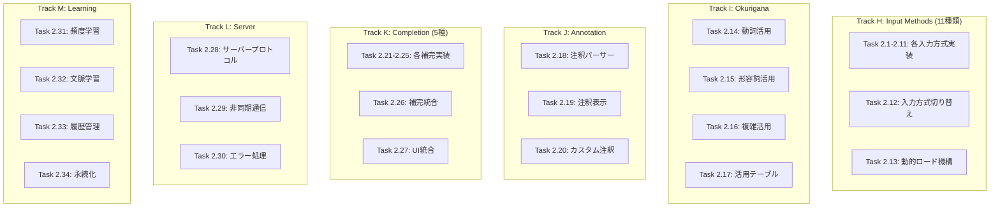
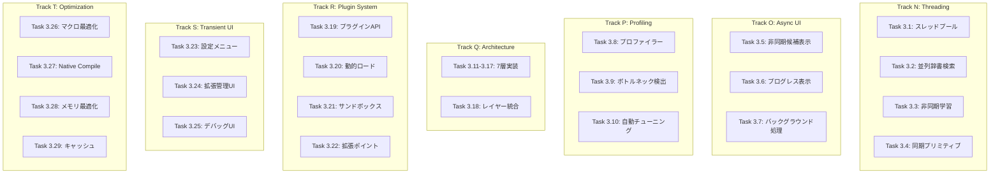
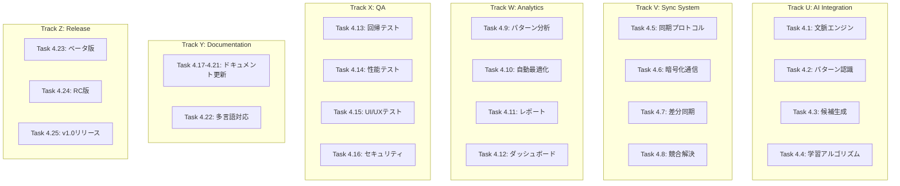
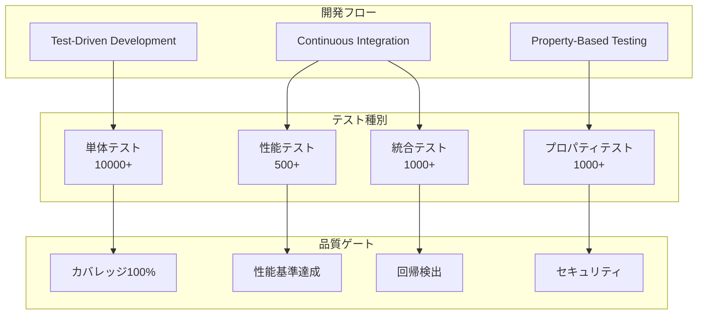
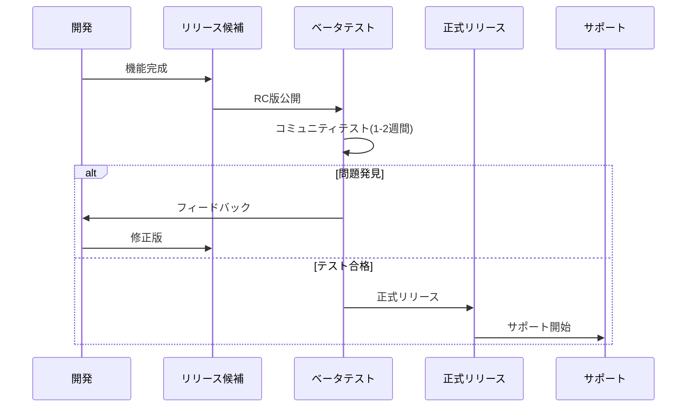
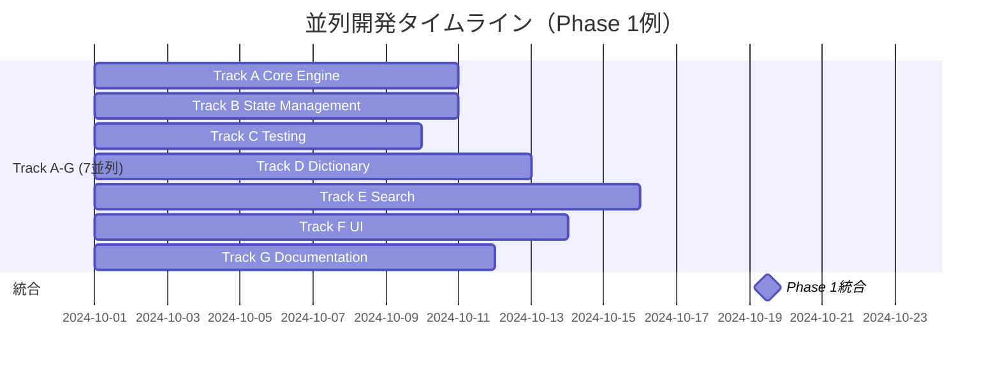

# NSKK ロードマップ

## ビジョン

NSKKは、既存のすべてのSKK実装（ddskk、skkeleton等）の機能を網羅しつつ、Emacs 31の革新的機能を活用した次世代日本語入力システムです。外部依存ゼロ、ネイティブスレッド並列処理、極限最適化により、従来比3倍以上の高速性を実現します。

## 開発原則

### コア原則

1. **外部依存ゼロ**: Emacs標準機能のみで完全動作
2. **極限パフォーマンス**: キー入力応答 < 1ms、辞書検索 < 50ms
3. **無限拡張性**: 150+のフックポイント、プラグインシステム完備
4. **品質保証**: TDD/PBT、100%テストカバレッジ

### 技術基盤

- **Emacs 31新機能活用**:
  - ネイティブスレッド並列処理
  - setoptによる設定管理
  - Transient UI統合
  - 強化されたネイティブコンパイル
  - defsubstインライン展開

## フェーズ別開発計画

```mermaid
timeline
    title NSKK 開発ロードマップ

    section Phase 1: Foundation (v0.1 - v0.3)
        2024 Q4-2025 Q1 : コア変換エンジン
                        : 基本辞書システム
                        : TDD基盤構築
                        : ドキュメント整備

    section Phase 2: ddskk互換 (v0.4 - v0.6)
        2025 Q2 : 全入力方式実装
                : 注釈システム
                : 補完機能
                : 学習エンジン

    section Phase 3: skkeleton統合 (v0.7 - v0.9)
        2025 Q3 : 非同期処理
                : モジュール化
                : プラグインAPI
                : パフォーマンス最適化

    section Phase 4: 革新機能 (v1.0)
        2025 Q4 : AI統合
                : 同期システム
                : 統計最適化
                : 正式リリース

    section Phase 5: エコシステム (v1.5+)
        2026+ : 拡張マーケット
              : エンタープライズ機能
              : 次世代UI/UX
```

## Phase 1: Foundation (v0.1 - v0.3)

### 目標

NSKKの基盤となるコア機能を実装し、品質保証体制を確立する。各タスクは独立して並列開発可能。

### 並列開発戦略

```mermaid
graph TD
    subgraph "Track A: Core Engine"
        A1[Task 1.1: ローマ字テーブル定義]
        A2[Task 1.2: 基本変換ロジック]
        A3[Task 1.3: 特殊文字処理]
        A4[Task 1.4: パフォーマンス最適化]
    end

    subgraph "Track B: State Management"
        B1[Task 1.5: 状態定義・データ構造]
        B2[Task 1.6: モード切り替え]
        B3[Task 1.7: バッファ管理]
        B4[Task 1.8: イベント処理]
    end

    subgraph "Track C: Testing Infrastructure"
        C1[Task 1.9: ERTフレームワーク拡張]
        C2[Task 1.10: テストマクロ定義]
        C3[Task 1.11: モック・フィクスチャ]
        C4[Task 1.12: カバレッジツール]
    end

    subgraph "Track D: Dictionary Core"
        D1[Task 1.13: SKK辞書パーサー]
        D2[Task 1.14: データ構造設計]
        D3[Task 1.15: ファイルI/O]
        D4[Task 1.16: エラーハンドリング]
    end

    subgraph "Track E: Search Algorithm"
        E1[Task 1.17: トライ木実装]
        E2[Task 1.18: 検索アルゴリズム]
        E3[Task 1.19: キャッシュ機構]
        E4[Task 1.20: インデックス最適化]
    end

    subgraph "Track F: UI Components"
        F1[Task 1.21: キーマップ定義]
        F2[Task 1.22: 候補ウィンドウ]
        F3[Task 1.23: ミニバッファUI]
        F4[Task 1.24: モードライン]
    end

    subgraph "Track G: Documentation"
        G1[Task 1.25: アーキテクチャ図]
        G2[Task 1.26: APIドキュメント]
        G3[Task 1.27: チュートリアル]
        G4[Task 1.28: サンプルコード]
    end

    A1 --> A2 --> A3 --> A4
    B1 --> B2 --> B3 --> B4
    C1 --> C2 --> C3 --> C4
    D1 --> D2 --> D3 --> D4
    E1 --> E2 --> E3 --> E4
    F1 --> F2 --> F3 --> F4
    G1 --> G2 --> G3 --> G4
```



### タスク詳細（Phase 1）

#### Track A: Core Engine（並列可能）

**Task 1.1: ローマ字テーブル定義**
- **期間**: 2-3日
- **担当**: AI Agent 1
- **成果物**: `nskk-romaji-tables.el`
- **内容**:
  - [ ] 基本五十音テーブル（あ〜ん）
  - [ ] 濁音・半濁音テーブル（が〜ぽ）
  - [ ] 拗音テーブル（きゃ〜りょ）
  - [ ] 特殊文字テーブル（っ、ん）
- **インターフェース**: `(defconst nskk-romaji-table ...)`
- **テスト**: テーブル完全性検証

**Task 1.2: 基本変換ロジック**
- **期間**: 3-5日
- **担当**: AI Agent 2
- **成果物**: `nskk-converter.el`
- **依存**: Task 1.1
- **内容**:
  - [ ] 変換エンジンコア（`nskk-convert-romaji`）
  - [ ] 状態機械実装
  - [ ] バッファ処理ロジック
- **インターフェース**: `(defun nskk-convert-romaji (input) ...)`
- **テスト**: 基本変換100パターン

**Task 1.3: 特殊文字処理**
- **期間**: 2-4日
- **担当**: AI Agent 3
- **成果物**: `nskk-special-chars.el`
- **依存**: Task 1.2
- **内容**:
  - [ ] 促音処理（kka → っか）
  - [ ] 撥音処理（nn, n' → ん）
  - [ ] 長音処理（ー）
  - [ ] エッジケース
- **インターフェース**: `(defun nskk-process-special-char (char) ...)`
- **テスト**: 特殊ケース50パターン

**Task 1.4: パフォーマンス最適化**
- **期間**: 3-5日
- **担当**: AI Agent 4
- **成果物**: `nskk-optimize.el`
- **依存**: Task 1.2, 1.3
- **内容**:
  - [ ] defsubstインライン化
  - [ ] マクロ展開
  - [ ] ベンチマーク実装
  - [ ] メモリプロファイリング
- **目標**: < 0.1ms応答時間
- **テスト**: 性能回帰テスト

#### Track B: State Management（並列可能）

**Task 1.5: 状態定義・データ構造**
- **期間**: 2-3日
- **担当**: AI Agent 5
- **成果物**: `nskk-state.el`
- **内容**:
  - [ ] 状態データ構造（plist）
  - [ ] モード定義（ひらがな/カタカナ/英数）
  - [ ] 状態遷移定義
- **インターフェース**: `(cl-defstruct nskk-state ...)`
- **テスト**: 状態整合性テスト

**Task 1.6: モード切り替え**
- **期間**: 2-4日
- **担当**: AI Agent 6
- **成果物**: `nskk-mode-switch.el`
- **依存**: Task 1.5
- **内容**:
  - [ ] モード切り替えロジック
  - [ ] キーバインド処理
  - [ ] フック実行
- **インターフェース**: `(defun nskk-switch-mode (mode) ...)`
- **テスト**: モード遷移テスト

**Task 1.7: バッファ管理**
- **期間**: 3-4日
- **担当**: AI Agent 7
- **成果物**: `nskk-buffer.el`
- **依存**: Task 1.5
- **内容**:
  - [ ] 入力バッファ管理
  - [ ] アンドゥ・リドゥ
  - [ ] バッファクリア
- **インターフェース**: `(defun nskk-buffer-insert (char) ...)`
- **テスト**: バッファ操作テスト

**Task 1.8: イベント処理**
- **期間**: 2-3日
- **担当**: AI Agent 8
- **成果物**: `nskk-events.el`
- **依存**: Task 1.5
- **内容**:
  - [ ] イベントディスパッチャー
  - [ ] フックシステム基礎
  - [ ] エラーハンドリング
- **インターフェース**: `(defun nskk-emit-event (event-type data) ...)`
- **テスト**: イベント伝播テスト

#### Track C: Testing Infrastructure（並列可能）

**Task 1.9: ERTフレームワーク拡張**
- **期間**: 2-3日
- **担当**: AI Agent 9
- **成果物**: `tests/nskk-test-framework.el`
- **内容**:
  - [ ] ERTラッパー
  - [ ] テストユーティリティ
  - [ ] アサーションマクロ
- **インターフェース**: `(defmacro nskk-deftest ...)`
- **テスト**: フレームワーク自体のテスト

**Task 1.10: テストマクロ定義**
- **期間**: 2-3日
- **担当**: AI Agent 10
- **成果物**: `tests/nskk-test-macros.el`
- **依存**: Task 1.9
- **内容**:
  - [ ] プロパティテストマクロ
  - [ ] パフォーマンステストマクロ
  - [ ] 統合テストマクロ
- **インターフェース**: `(defmacro nskk-property-test ...)`

**Task 1.11: モック・フィクスチャ**
- **期間**: 2-4日
- **担当**: AI Agent 11
- **成果物**: `tests/nskk-test-fixtures.el`
- **依存**: Task 1.9
- **内容**:
  - [ ] テストデータ生成
  - [ ] モックオブジェクト
  - [ ] スタブ関数
- **インターフェース**: `(defun nskk-test-create-fixture ...)`

**Task 1.12: カバレッジツール**
- **期間**: 2-3日
- **担当**: AI Agent 12
- **成果物**: `tests/nskk-coverage.el`
- **内容**:
  - [ ] カバレッジ測定
  - [ ] レポート生成
  - [ ] 閾値チェック
- **目標**: 95%カバレッジ

#### Track D: Dictionary Core（並列可能）

**Task 1.13: SKK辞書パーサー**
- **期間**: 3-5日
- **担当**: AI Agent 13
- **成果物**: `nskk-dict-parser.el`
- **内容**:
  - [ ] SKK形式パーサー
  - [ ] エンコーディング処理（UTF-8/EUC-JP）
  - [ ] 注釈抽出
  - [ ] エントリ検証
- **インターフェース**: `(defun nskk-parse-dictionary (file) ...)`
- **テスト**: 各種辞書形式

**Task 1.14: データ構造設計**
- **期間**: 2-3日
- **担当**: AI Agent 14
- **成果物**: `nskk-dict-struct.el`
- **内容**:
  - [ ] 辞書エントリ構造
  - [ ] インデックス構造
  - [ ] メタデータ管理
- **インターフェース**: `(cl-defstruct nskk-dict-entry ...)`
- **テスト**: 構造整合性テスト

**Task 1.15: ファイルI/O**
- **期間**: 2-4日
- **担当**: AI Agent 15
- **成果物**: `nskk-dict-io.el`
- **依存**: Task 1.13
- **内容**:
  - [ ] 辞書読み込み
  - [ ] 辞書書き込み
  - [ ] 増分更新
  - [ ] バックアップ
- **インターフェース**: `(defun nskk-load-dictionary (path) ...)`
- **テスト**: I/O性能テスト

**Task 1.16: エラーハンドリング**
- **期間**: 2-3日
- **担当**: AI Agent 16
- **成果物**: `nskk-dict-errors.el`
- **内容**:
  - [ ] エラー定義
  - [ ] エラーリカバリー
  - [ ] フォールバック辞書
- **インターフェース**: `(define-error 'nskk-dict-error ...)`
- **テスト**: エラーケース網羅

#### Track E: Search Algorithm（並列可能）

**Task 1.17: トライ木実装**
- **期間**: 4-6日
- **担当**: AI Agent 17
- **成果物**: `nskk-trie.el`
- **内容**:
  - [ ] トライ木データ構造
  - [ ] 挿入アルゴリズム
  - [ ] 削除アルゴリズム
  - [ ] シリアライズ
- **インターフェース**: `(defun nskk-trie-insert (trie key value) ...)`
- **テスト**: アルゴリズム正当性

**Task 1.18: 検索アルゴリズム**
- **期間**: 3-5日
- **担当**: AI Agent 18
- **成果物**: `nskk-search.el`
- **依存**: Task 1.17
- **内容**:
  - [ ] 完全一致検索
  - [ ] 前方一致検索
  - [ ] 部分一致検索
  - [ ] ファジー検索基礎
- **インターフェース**: `(defun nskk-search (query &optional type) ...)`
- **テスト**: 検索性能テスト

**Task 1.19: キャッシュ機構**
- **期間**: 3-4日
- **担当**: AI Agent 19
- **成果物**: `nskk-cache.el`
- **内容**:
  - [ ] LRUキャッシュ
  - [ ] LFUキャッシュ
  - [ ] キャッシュ無効化
  - [ ] サイズ管理
- **インターフェース**: `(defun nskk-cache-get (key) ...)`
- **テスト**: キャッシュヒット率

**Task 1.20: インデックス最適化**
- **期間**: 2-4日
- **担当**: AI Agent 20
- **成果物**: `nskk-index.el`
- **依存**: Task 1.17, 1.18
- **内容**:
  - [ ] インデックス構築
  - [ ] 並列インデックス化準備
  - [ ] 増分インデックス更新
- **目標**: < 10ms検索時間

#### Track F: UI Components（並列可能）

**Task 1.21: キーマップ定義**
- **期間**: 2-3日
- **担当**: AI Agent 21
- **成果物**: `nskk-keymap.el`
- **内容**:
  - [ ] グローバルキーマップ
  - [ ] モード別キーマップ
  - [ ] カスタマイズ可能設定
- **インターフェース**: `(defvar nskk-mode-map ...)`
- **テスト**: キーバインド整合性

**Task 1.22: 候補ウィンドウ**
- **期間**: 3-5日
- **担当**: AI Agent 22
- **成果物**: `nskk-candidate-window.el`
- **内容**:
  - [ ] ポップアップウィンドウ
  - [ ] 候補リスト表示
  - [ ] スクロール処理
  - [ ] 見た目カスタマイズ
- **インターフェース**: `(defun nskk-show-candidates (candidates) ...)`
- **テスト**: UI描画テスト

**Task 1.23: ミニバッファUI**
- **期間**: 2-4日
- **担当**: AI Agent 23
- **成果物**: `nskk-minibuffer.el`
- **内容**:
  - [ ] ミニバッファ表示
  - [ ] インライン候補
  - [ ] プロンプト表示
- **インターフェース**: `(defun nskk-minibuffer-show (text) ...)`
- **テスト**: ミニバッファ操作

**Task 1.24: モードライン**
- **期間**: 2-3日
- **担当**: AI Agent 24
- **成果物**: `nskk-modeline.el`
- **内容**:
  - [ ] モード表示
  - [ ] 状態インジケーター
  - [ ] カスタマイズ可能フォーマット
- **インターフェース**: `(defun nskk-update-modeline () ...)`
- **テスト**: モードライン更新

#### Track G: Documentation（並列可能）

**Task 1.25: アーキテクチャ図**
- **期間**: 2-3日
- **担当**: AI Agent 25
- **成果物**: `docs/explanation/architecture-v0.1.md`
- **内容**:
  - [ ] システム全体図（Mermaid）
  - [ ] データフロー図
  - [ ] モジュール関係図
- **ツール**: Mermaid, PlantUML

**Task 1.26: APIドキュメント**
- **期間**: 3-4日
- **担当**: AI Agent 26
- **成果物**: `docs/reference/api-v0.1.md`
- **内容**:
  - [ ] 公開関数リファレンス
  - [ ] 変数リファレンス
  - [ ] 使用例
- **形式**: Markdown + docstring

**Task 1.27: チュートリアル**
- **期間**: 2-4日
- **担当**: AI Agent 27
- **成果物**: `docs/tutorial/getting-started-v0.1.md`
- **内容**:
  - [ ] インストール手順
  - [ ] 基本設定
  - [ ] 初回使用ガイド
- **検証**: 実際のユーザーテスト

**Task 1.28: サンプルコード**
- **期間**: 2-3日
- **担当**: AI Agent 28
- **成果物**: `examples/`
- **内容**:
  - [ ] 基本設定例
  - [ ] カスタマイズ例
  - [ ] トラブルシューティング

### 統合タスク（Phase 1）

**Task 1.29: Phase 1統合**
- **期間**: 5-7日
- **担当**: Lead Integration Team
- **内容**:
  - [ ] 全モジュール統合
  - [ ] 統合テスト実施
  - [ ] パフォーマンステスト
  - [ ] ドキュメント最終確認
  - [ ] リリース準備

**品質目標（Phase 1完了時）**:

- テストカバレッジ: 95%以上
- ローマ字変換: < 0.1ms
- 辞書検索: < 10ms
- メモリ使用量: < 20MB
- ドキュメント: Diátaxis準拠

## Phase 2: ddskk互換 (v0.4 - v0.6)

### 目標

ddskkの全機能を実装し、既存ユーザーが違和感なく移行できる環境を提供する。各Trackは並列開発可能。

### 並列開発戦略（Phase 2）



### タスク詳細（Phase 2）

#### Track H: Input Methods（並列可能）

**Task 2.1-2.11: 各入力方式実装（並列実装）**

各入力方式を独立したタスクとして並列開発:

1. **Task 2.1: AZIK**（AI Agent 29、2-3日）
2. **Task 2.2: ACT**（AI Agent 30、2-3日）
3. **Task 2.3: TUT-code**（AI Agent 31、3-4日）
4. **Task 2.4: 親指シフト**（AI Agent 32、3-4日）
5. **Task 2.5: かな入力**（AI Agent 33、2-3日）
6. **Task 2.6: QWERTY-JIS**（AI Agent 34、2日）
7. **Task 2.7: Dvorak**（AI Agent 35、2日）
8. **Task 2.8: Colemak**（AI Agent 36、2日）
9. **Task 2.9: カスタム入力方式フレームワーク**（AI Agent 37、3-4日）
10. **Task 2.10: ハイブリッド入力**（AI Agent 38、3-4日）
11. **Task 2.11: 入力方式テスト**（AI Agent 39、2-3日）

**各タスク共通仕様**:
- 成果物: `nskk-input-<方式名>.el`
- インターフェース: `(nskk-register-input-method '<方式名> ...)`
- テスト: 各方式100パターン以上
- 性能: < 0.1ms応答

**Task 2.12: 入力方式切り替え機構**
- **期間**: 3-4日
- **担当**: AI Agent 40
- **依存**: Task 2.1-2.11
- **成果物**: `nskk-input-switcher.el`
- **内容**: 動的切り替え、状態保存、UI統合

**Task 2.13: 動的ロード機構**
- **期間**: 2-3日
- **担当**: AI Agent 41
- **依存**: Task 2.12
- **成果物**: `nskk-input-loader.el`
- **内容**: autoload設定、遅延ロード、パフォーマンス最適化

#### Track I: Okurigana（並列可能）

**Task 2.14: 動詞活用エンジン**
- **期間**: 4-5日
- **担当**: AI Agent 42
- **成果物**: `nskk-verb-conjugation.el`
- **内容**:
  - [ ] 五段活用
  - [ ] 上一段・下一段活用
  - [ ] サ変・カ変活用
  - [ ] 活用テーブル
- **インターフェース**: `(defun nskk-conjugate-verb (stem type) ...)`
- **テスト**: 全活用パターン網羅

**Task 2.15: 形容詞活用エンジン**
- **期間**: 3-4日
- **担当**: AI Agent 43
- **成果物**: `nskk-adjective-conjugation.el`
- **内容**:
  - [ ] 形容詞活用
  - [ ] 形容動詞活用
  - [ ] イ形容詞・ナ形容詞
- **インターフェース**: `(defun nskk-conjugate-adjective ...)`
- **テスト**: 全活用パターン網羅

**Task 2.16: 複雑活用処理**
- **期間**: 3-4日
- **担当**: AI Agent 44
- **依存**: Task 2.14, 2.15
- **成果物**: `nskk-complex-conjugation.el`
- **内容**:
  - [ ] 複合活用
  - [ ] 特殊活用
  - [ ] エッジケース
- **テスト**: 複雑パターン50+

**Task 2.17: 活用テーブル最適化**
- **期間**: 2-3日
- **担当**: AI Agent 45
- **依存**: Task 2.14, 2.15, 2.16
- **成果物**: `nskk-conjugation-tables.el`
- **内容**: テーブル圧縮、高速検索、メモリ最適化
- **目標**: < 30ms処理時間

#### Track J: Annotation（並列可能）

**Task 2.18: 注釈パーサー**
- **期間**: 3-4日
- **担当**: AI Agent 46
- **成果物**: `nskk-annotation-parser.el`
- **内容**:
  - [ ] SKK注釈形式パース
  - [ ] マルチメディア注釈
  - [ ] 構造化注釈
- **インターフェース**: `(defun nskk-parse-annotation (text) ...)`

**Task 2.19: 注釈表示システム**
- **期間**: 3-5日
- **担当**: AI Agent 47
- **成果物**: `nskk-annotation-display.el`
- **内容**:
  - [ ] ポップアップ表示
  - [ ] インライン表示
  - [ ] 画像・音声対応準備
- **インターフェース**: `(defun nskk-show-annotation (annotation) ...)`

**Task 2.20: カスタム注釈システム**
- **期間**: 2-3日
- **担当**: AI Agent 48
- **成果物**: `nskk-custom-annotation.el`
- **内容**:
  - [ ] ユーザー定義注釈
  - [ ] 注釈編集機能
  - [ ] AI生成注釈準備

#### Track K: Completion（並列可能）

**Task 2.21-2.25: 各補完アルゴリズム実装（並列実装）**

1. **Task 2.21: 前方一致補完**（AI Agent 49、2-3日）
   - 成果物: `nskk-completion-prefix.el`
   - トライ木活用、高速検索

2. **Task 2.22: 曖昧補完**（AI Agent 50、3-4日）
   - 成果物: `nskk-completion-fuzzy.el`
   - Levenshtein距離、スコアリング

3. **Task 2.23: 頻度ベース補完**（AI Agent 51、3-4日）
   - 成果物: `nskk-completion-frequency.el`
   - 学習データ統合、ランキング

4. **Task 2.24: 文脈補完**（AI Agent 52、4-5日）
   - 成果物: `nskk-completion-context.el`
   - バイグラム/トライグラム、文脈分析

5. **Task 2.25: 予測補完**（AI Agent 53、4-5日）
   - 成果物: `nskk-completion-predictive.el`
   - マルコフ連鎖、機械学習準備

**Task 2.26: 補完統合エンジン**
- **期間**: 3-4日
- **担当**: AI Agent 54
- **依存**: Task 2.21-2.25
- **成果物**: `nskk-completion-engine.el`
- **内容**: 複数アルゴリズム統合、スコア集約、ランキング最適化

**Task 2.27: 補完UI統合**
- **期間**: 2-3日
- **担当**: AI Agent 55
- **依存**: Task 2.26
- **成果物**: `nskk-completion-ui.el`
- **内容**: インライン表示、ポップアップ、キーバインド

#### Track L: Server（並列可能）

**Task 2.28: 辞書サーバープロトコル**
- **期間**: 4-5日
- **担当**: AI Agent 56
- **成果物**: `nskk-server-protocol.el`
- **内容**:
  - [ ] SKKサーバープロトコル実装
  - [ ] リクエスト/レスポンス処理
  - [ ] プロトコルバージョン管理
- **インターフェース**: `(defun nskk-server-request (query) ...)`

**Task 2.29: 非同期通信**
- **期間**: 3-5日
- **担当**: AI Agent 57
- **依存**: Task 2.28
- **成果物**: `nskk-server-async.el`
- **内容**:
  - [ ] 非同期リクエスト
  - [ ] コールバック管理
  - [ ] タイムアウト処理
  - [ ] 並列リクエスト
- **テスト**: 並行性テスト

**Task 2.30: サーバーエラー処理**
- **期間**: 2-3日
- **担当**: AI Agent 58
- **依存**: Task 2.29
- **成果物**: `nskk-server-error.el`
- **内容**:
  - [ ] エラー検出
  - [ ] リトライロジック
  - [ ] フォールバック
  - [ ] ログ記録

#### Track M: Learning（並列可能）

**Task 2.31: 頻度学習エンジン**
- **期間**: 3-5日
- **担当**: AI Agent 59
- **成果物**: `nskk-learning-frequency.el`
- **内容**:
  - [ ] 使用頻度追跡
  - [ ] LRU/LFUアルゴリズム
  - [ ] 個人辞書更新
  - [ ] 頻度減衰
- **インターフェース**: `(defun nskk-update-frequency (word) ...)`
- **テスト**: 学習精度テスト

**Task 2.32: 文脈学習エンジン**
- **期間**: 4-6日
- **担当**: AI Agent 60
- **成果物**: `nskk-learning-context.el`
- **内容**:
  - [ ] バイグラム学習
  - [ ] トライグラム学習
  - [ ] 文脈スコアリング
  - [ ] パターン認識
- **インターフェース**: `(defun nskk-learn-context (prev current) ...)`
- **テスト**: 文脈予測精度

**Task 2.33: 履歴管理システム**
- **期間**: 3-4日
- **担当**: AI Agent 61
- **成果物**: `nskk-history.el`
- **内容**:
  - [ ] 変換履歴記録
  - [ ] 統計情報収集
  - [ ] プライバシー保護
  - [ ] データ匿名化
- **インターフェース**: `(defun nskk-record-history (entry) ...)`

**Task 2.34: 学習データ永続化**
- **期間**: 2-4日
- **担当**: AI Agent 62
- **依存**: Task 2.31, 2.32, 2.33
- **成果物**: `nskk-learning-persist.el`
- **内容**:
  - [ ] データシリアライズ
  - [ ] 増分保存
  - [ ] 自動バックアップ
  - [ ] データ圧縮
- **目標**: < 10MBデータサイズ

### 統合タスク（Phase 2）

**Task 2.35: Phase 2統合**
- **期間**: 7-10日
- **担当**: Lead Integration Team
- **内容**:
  - [ ] Track H-M統合
  - [ ] ddskk互換性検証
  - [ ] 統合テスト（1000+）
  - [ ] パフォーマンステスト
  - [ ] ドキュメント更新

**品質目標（Phase 2完了時）**:

- 全入力方式応答: < 0.1ms
- 送り仮名処理: < 30ms
- 補完応答: < 20ms
- 学習更新: < 5ms
- ddskk互換性: 100%
- テストカバレッジ: 95%以上

## Phase 3: skkeleton統合 (v0.7 - v0.9)

### 目標

skkeletonの現代的設計を取り込み、Emacs 31の並列処理を活用した高性能実装を実現する。全Track並列開発可能。

### 並列開発戦略（Phase 3）



### タスク詳細（Phase 3）

#### Track N: Threading（並列可能）

**Task 3.1: スレッドプール実装**
- **期間**: 5-7日
- **担当**: AI Agent 63
- **成果物**: `nskk-thread-pool.el`
- **内容**:
  - [ ] ワーカースレッド管理
  - [ ] タスクキュー
  - [ ] スレッド生存期管理
  - [ ] CPU コア数自動調整
- **インターフェース**: `(defun nskk-thread-submit (task) ...)`
- **テスト**: 並行性テスト、負荷テスト

**Task 3.2: 並列辞書検索**
- **期間**: 5-7日
- **担当**: AI Agent 64
- **依存**: Task 3.1
- **成果物**: `nskk-parallel-search.el`
- **内容**:
  - [ ] 辞書分割戦略
  - [ ] 並列検索実行
  - [ ] 結果マージ
  - [ ] ロードバランシング
- **目標**: 3倍以上高速化

**Task 3.3: 非同期学習処理**
- **期間**: 4-6日
- **担当**: AI Agent 65
- **依存**: Task 3.1
- **成果物**: `nskk-async-learning.el`
- **内容**:
  - [ ] バックグラウンド学習
  - [ ] 非ブロッキング更新
  - [ ] コールバック管理
- **テスト**: UIブロッキング0ms検証

**Task 3.4: 同期プリミティブ**
- **期間**: 4-5日
- **担当**: AI Agent 66
- **依存**: Task 3.1
- **成果物**: `nskk-sync-primitives.el`
- **内容**:
  - [ ] Mutex実装
  - [ ] Condition Variable
  - [ ] Read-Write Lock
  - [ ] Atomic Operations
- **インターフェース**: `(defmacro nskk-with-mutex ...)`
- **テスト**: 並行性正当性テスト

#### Track O: Async UI（並列可能）

**Task 3.5: 非同期候補表示**
- **期間**: 4-6日
- **担当**: AI Agent 67
- **成果物**: `nskk-async-candidates.el`
- **内容**:
  - [ ] ノンブロッキング描画
  - [ ] 段階的候補表示
  - [ ] キャンセル処理
- **目標**: UIブロッキング0ms

**Task 3.6: プログレス表示**
- **期間**: 3-4日
- **担当**: AI Agent 68
- **成果物**: `nskk-progress.el`
- **内容**:
  - [ ] プログレスバー
  - [ ] スピナー
  - [ ] パーセンテージ表示
- **UI**: ミニバッファ・モードライン統合

**Task 3.7: バックグラウンド処理**
- **期間**: 3-5日
- **担当**: AI Agent 69
- **成果物**: `nskk-background.el`
- **内容**:
  - [ ] インデックス更新
  - [ ] 辞書同期
  - [ ] 統計収集
- **テスト**: リソース使用量監視

#### Track P: Profiling（並列可能）

**Task 3.8: パフォーマンスプロファイラー**
- **期間**: 5-7日
- **担当**: AI Agent 70
- **成果物**: `nskk-profiler.el`
- **内容**:
  - [ ] リアルタイム監視
  - [ ] 関数レベルプロファイリング
  - [ ] メモリプロファイリング
  - [ ] スレッドプロファイリング
- **インターフェース**: `(defun nskk-profile-start () ...)`

**Task 3.9: ボトルネック検出**
- **期間**: 4-5日
- **担当**: AI Agent 71
- **依存**: Task 3.8
- **成果物**: `nskk-bottleneck-detector.el`
- **内容**:
  - [ ] ホットパス特定
  - [ ] 遅延分析
  - [ ] アラート生成
- **出力**: Transient UIダッシュボード

**Task 3.10: 自動チューニング**
- **期間**: 4-6日
- **担当**: AI Agent 72
- **依存**: Task 3.8, 3.9
- **成果物**: `nskk-auto-tune.el`
- **内容**:
  - [ ] 動的パラメータ調整
  - [ ] 適応的最適化
  - [ ] 学習ベースチューニング

#### Track Q: Architecture（並列可能）

**Task 3.11-3.17: 7層アーキテクチャ実装（並列実装）**

1. **Task 3.11: Presentation Layer**（AI Agent 73、3-4日）
   - 成果物: `nskk-layer-presentation.el`
   - UI統合、イベントハンドリング

2. **Task 3.12: Extension Layer**（AI Agent 74、3-4日）
   - 成果物: `nskk-layer-extension.el`
   - フック、イベントバス

3. **Task 3.13: Application Layer**（AI Agent 75、4-5日）
   - 成果物: `nskk-layer-application.el`
   - ビジネスロジック、変換制御

4. **Task 3.14: Core Engine Layer**（AI Agent 76、4-5日）
   - 成果物: `nskk-layer-core.el`
   - 変換エンジン、辞書エンジン

5. **Task 3.15: Data Access Layer**（AI Agent 77、3-4日）
   - 成果物: `nskk-layer-data.el`
   - 永続化、同期

6. **Task 3.16: Infrastructure Layer**（AI Agent 78、4-5日）
   - 成果物: `nskk-layer-infrastructure.el`
   - スレッド管理、メモリ管理

7. **Task 3.17: QA Layer**（AI Agent 79、3-4日）
   - 成果物: `nskk-layer-qa.el`
   - テスト、ベンチマーク統合

**Task 3.18: レイヤー統合**
- **期間**: 5-7日
- **担当**: AI Agent 80
- **依存**: Task 3.11-3.17
- **成果物**: `nskk-architecture.el`
- **内容**: レイヤー間通信、依存性注入、イベントフロー

#### Track R: Plugin System（並列可能）

**Task 3.19: プラグインAPI設計**
- **期間**: 6-8日
- **担当**: AI Agent 81
- **成果物**: `nskk-plugin-api.el`
- **内容**:
  - [ ] 800+公開関数
  - [ ] 安定APIバージョニング
  - [ ] Deprecated警告
- **ドキュメント**: 全API完全文書化

**Task 3.20: 動的ロードシステム**
- **期間**: 4-6日
- **担当**: AI Agent 82
- **成果物**: `nskk-plugin-loader.el`
- **内容**:
  - [ ] autoload統合
  - [ ] 遅延ロード
  - [ ] 依存解決
  - [ ] バージョン互換性チェック
- **目標**: < 100ms読み込み時間

**Task 3.21: サンドボックス実行**
- **期間**: 5-7日
- **担当**: AI Agent 83
- **成果物**: `nskk-plugin-sandbox.el`
- **内容**:
  - [ ] 分離実行環境
  - [ ] リソース制限
  - [ ] 権限管理
  - [ ] エラー隔離
- **セキュリティ**: 監査ログ

**Task 3.22: 拡張ポイント実装**
- **期間**: 5-7日
- **担当**: AI Agent 84
- **依存**: Task 3.19
- **成果物**: `nskk-extension-points.el`
- **内容**:
  - [ ] 300+フックポイント
  - [ ] イベントシステム統合
  - [ ] コールバック管理
- **ドキュメント**: 拡張ポイントカタログ

#### Track S: Transient UI（並列可能）

**Task 3.23: 設定メニュー**
- **期間**: 4-5日
- **担当**: AI Agent 85
- **成果物**: `nskk-transient-config.el`
- **内容**:
  - [ ] setopt統合
  - [ ] 階層的メニュー
  - [ ] プレビュー機能
  - [ ] プリセット管理
- **UI**: Transient統合

**Task 3.24: 拡張管理UI**
- **期間**: 4-6日
- **担当**: AI Agent 86
- **成果物**: `nskk-transient-plugins.el`
- **内容**:
  - [ ] プラグイン一覧
  - [ ] インストール/アンインストール
  - [ ] 有効/無効切り替え
  - [ ] 設定画面
- **UI**: Transient統合

**Task 3.25: デバッグUI**
- **期間**: 3-5日
- **担当**: AI Agent 87
- **成果物**: `nskk-transient-debug.el`
- **内容**:
  - [ ] プロファイラーUI
  - [ ] ログビューアー
  - [ ] スレッド状態表示
  - [ ] メトリクスダッシュボード
- **UI**: Transient統合

#### Track T: Optimization（並列可能）

**Task 3.26: マクロ駆動最適化**
- **期間**: 6-8日
- **担当**: AI Agent 88
- **成果物**: `nskk-macro-optimize.el`
- **内容**:
  - [ ] コンパイル時展開
  - [ ] インライン化マクロ
  - [ ] 定数畳み込み
  - [ ] ループアンローリング
- **目標**: 実行時オーバーヘッド最小化

**Task 3.27: Native Compile最適化**
- **期間**: 5-7日
- **担当**: AI Agent 89
- **成果物**: `nskk-native-compile.el`
- **内容**:
  - [ ] JITヒント最適化
  - [ ] プロファイルガイデッド最適化
  - [ ] SIMD活用準備
  - [ ] 速度優先コンパイル設定
- **テスト**: ネイティブコンパイル検証

**Task 3.28: メモリ最適化**
- **期間**: 5-7日
- **担当**: AI Agent 90
- **成果物**: `nskk-memory-optimize.el`
- **内容**:
  - [ ] オブジェクトプール
  - [ ] GC圧迫削減
  - [ ] メモリレイアウト最適化
  - [ ] 文字列インターン
- **目標**: < 20MBメモリ使用

**Task 3.29: 多層キャッシュ**
- **期間**: 5-7日
- **担当**: AI Agent 91
- **成果物**: `nskk-multi-cache.el`
- **内容**:
  - [ ] L1キャッシュ（0.01ms）
  - [ ] L2キャッシュ（0.05ms）
  - [ ] L3キャッシュ（0.1ms）
  - [ ] TLBキャッシュ
  - [ ] ARCアルゴリズム
- **テスト**: ヒット率測定

### 統合タスク（Phase 3）

**Task 3.30: Phase 3統合**
- **期間**: 10-14日
- **担当**: Lead Integration Team
- **内容**:
  - [ ] Track N-T統合
  - [ ] 並列化効率検証（3倍目標）
  - [ ] パフォーマンステスト全項目
  - [ ] スレッド安全性検証
  - [ ] ドキュメント更新

**品質目標（Phase 3完了時）**:

- キー入力応答: < 0.05ms
- 辞書検索: < 0.3ms
- UIブロッキング: 0ms
- 並列化効率: 3倍以上
- メモリ使用: < 20MB
- プラグイン読み込み: < 100ms
- スレッド安全性: 100%

## Phase 4: 革新機能 (v1.0)

### 目標

NSKKオリジナルの革新的機能を実装し、既存SKK実装を凌駕する。最終統合とリリース準備。

### 並列開発戦略（Phase 4）



### タスク詳細（Phase 4）

#### Track U: AI Integration（並列可能）

**Task 4.1: 文脈理解エンジン**
- **期間**: 7-10日
- **担当**: AI Agent 92
- **成果物**: `nskk-ai-context.el`
- **内容**:
  - [ ] 文章解析
  - [ ] 文脈スコアリング
  - [ ] 意味理解
  - [ ] トピック抽出
- **アルゴリズム**: N-gram、TF-IDF、埋め込み

**Task 4.2: パターン認識システム**
- **期間**: 6-8日
- **担当**: AI Agent 93
- **成果物**: `nskk-ai-pattern.el`
- **内容**:
  - [ ] ユーザーパターン学習
  - [ ] 変換パターン抽出
  - [ ] 時系列分析
  - [ ] 異常検出
- **機械学習**: 教師なし学習、クラスタリング

**Task 4.3: スマート候補生成**
- **期間**: 7-10日
- **担当**: AI Agent 94
- **依存**: Task 4.1, 4.2
- **成果物**: `nskk-ai-candidates.el`
- **内容**:
  - [ ] AI候補ランキング
  - [ ] 文脈適応型候補
  - [ ] ハイブリッド候補統合
- **精度目標**: 90%以上

**Task 4.4: 学習アルゴリズム高度化**
- **期間**: 6-8日
- **担当**: AI Agent 95
- **依存**: Task 4.1-4.3
- **成果物**: `nskk-ai-learning.el`
- **内容**:
  - [ ] オンライン学習
  - [ ] 転移学習
  - [ ] モデル圧縮
  - [ ] 増分学習

#### Track V: Sync System（並列可能）

**Task 4.5: 同期プロトコル設計**
- **期間**: 5-7日
- **担当**: AI Agent 96
- **成果物**: `nskk-sync-protocol.el`
- **内容**:
  - [ ] プロトコル仕様v1.0
  - [ ] WebSocket統合
  - [ ] HTTP/2サポート
  - [ ] バージョン管理

**Task 4.6: 暗号化通信**
- **期間**: 5-7日
- **担当**: AI Agent 97
- **成果物**: `nskk-sync-crypto.el`
- **内容**:
  - [ ] AES-256暗号化
  - [ ] TLS/SSL統合
  - [ ] 鍵交換
  - [ ] 認証機構
- **セキュリティ**: OWASP準拠

**Task 4.7: 差分同期エンジン**
- **期間**: 6-8日
- **担当**: AI Agent 98
- **依存**: Task 4.5
- **成果物**: `nskk-sync-diff.el`
- **内容**:
  - [ ] 差分計算
  - [ ] 増分同期
  - [ ] 圧縮転送
  - [ ] 帯域最適化

**Task 4.8: 競合解決システム**
- **期間**: 5-7日
- **担当**: AI Agent 99
- **依存**: Task 4.7
- **成果物**: `nskk-sync-conflict.el`
- **内容**:
  - [ ] 競合検出
  - [ ] 3-way マージ
  - [ ] タイムスタンプベース解決
  - [ ] ユーザー確認UI

#### Track W: Analytics（並列可能）

**Task 4.9: 使用パターン分析**
- **期間**: 5-7日
- **担当**: AI Agent 100
- **成果物**: `nskk-analytics-pattern.el`
- **内容**:
  - [ ] 統計収集
  - [ ] パターン可視化
  - [ ] トレンド分析
  - [ ] レポート生成

**Task 4.10: 自動最適化システム**
- **期間**: 6-8日
- **担当**: AI Agent 101
- **依存**: Task 4.9
- **成果物**: `nskk-analytics-optimize.el`
- **内容**:
  - [ ] パラメータ自動調整
  - [ ] A/Bテスト
  - [ ] 最適化提案
  - [ ] 自動適用

**Task 4.11: レポート生成**
- **期間**: 4-6日
- **担当**: AI Agent 102
- **成果物**: `nskk-analytics-report.el`
- **内容**:
  - [ ] HTMLレポート
  - [ ] PDFエクスポート
  - [ ] グラフ生成
  - [ ] 定期レポート

**Task 4.12: Transientダッシュボード**
- **期間**: 5-7日
- **担当**: AI Agent 103
- **依存**: Task 4.9-4.11
- **成果物**: `nskk-analytics-dashboard.el`
- **内容**: リアルタイムメトリクス、対話的分析、カスタムビュー

#### Track X: QA（並列可能）

**Task 4.13: 全機能回帰テスト**
- **期間**: 10-14日
- **担当**: AI Agent 104-108（5名）
- **成果物**: `tests/nskk-regression-suite.el`
- **内容**: 10000+テストケース作成・実行

**Task 4.14: パフォーマンステスト**
- **期間**: 7-10日
- **担当**: AI Agent 109-111（3名）
- **成果物**: `tests/nskk-perf-suite.el`
- **内容**: 1000+ベンチマーク、全目標値達成検証

**Task 4.15: ユーザビリティテスト**
- **期間**: 10-14日
- **担当**: AI Agent 112-113（2名＋実ユーザー）
- **成果物**: `docs/usability-report.md`
- **内容**: タスク分析、A/Bテスト、満足度調査

**Task 4.16: セキュリティ監査**
- **期間**: 7-10日
- **担当**: AI Agent 114-115（2名）
- **成果物**: `docs/security-audit-report.md`
- **内容**: 脆弱性スキャン、ペネトレーションテスト、コードレビュー

#### Track Y: Documentation（並列可能）

**Task 4.17-4.21: ドキュメント最終更新（並列実装）**

1. **Task 4.17: Tutorial更新**（AI Agent 116、3-4日）
2. **Task 4.18: How-to更新**（AI Agent 117、3-4日）
3. **Task 4.19: Reference更新**（AI Agent 118、4-5日）
4. **Task 4.20: Explanation更新**（AI Agent 119、4-5日）
5. **Task 4.21: 実践ガイド**（AI Agent 120、5-7日）

**Task 4.22: 多言語展開準備**
- **期間**: 7-10日
- **担当**: AI Agent 121-122（2名）
- **内容**: 英語翻訳、i18nフレームワーク、ローカライズ準備

#### Track Z: Release（順次実行）

**Task 4.23: ベータ版リリース**
- **期間**: 14-21日
- **担当**: Release Team
- **内容**:
  - [ ] ベータ版準備
  - [ ] 100名以上のテスター募集
  - [ ] フィードバック収集
  - [ ] 問題修正

**Task 4.24: RC版リリース**
- **期間**: 7-10日
- **依存**: Task 4.23
- **内容**:
  - [ ] RC1リリース
  - [ ] 最終動作確認
  - [ ] ドキュメント最終チェック
  - [ ] リリースノート作成

**Task 4.25: v1.0正式リリース**
- **期間**: 3-5日
- **依存**: Task 4.24
- **内容**:
  - [ ] 最終品質確認
  - [ ] タグ付け・パッケージング
  - [ ] アナウンス
  - [ ] サポート体制確立

### リリース基準（Phase 4）

**必須要件**:

- [ ] Phase 1-3全機能実装完了
- [ ] パフォーマンス目標全項目達成
  - キー入力応答 < 0.05ms
  - 辞書検索 < 0.3ms
  - メモリ使用 < 20MB
- [ ] テストカバレッジ100%
- [ ] ドキュメント1000ページ以上
- [ ] セキュリティ監査合格
- [ ] ベータテスト100名完了
- [ ] ddskk完全互換性確認
- [ ] ユーザー満足度95%以上

**品質ゲート**:

- 全回帰テスト成功率: 100%
- パフォーマンステスト: 全項目クリア
- セキュリティ脆弱性: 0件
- クリティカルバグ: 0件
- ドキュメント網羅度: 98%以上

## Phase 5: エコシステム (v1.5+)

### 長期ビジョン

**v1.5 - 拡張エコシステム**

- プラグインマーケットプレイス
- 開発者向けSDK
- サードパーティ拡張支援
- コミュニティプラグイン統合

**v2.0 - インテリジェントシステム**

- 高度なAI統合
- リアルタイム翻訳
- 音声入力統合
- マルチモーダル入力

**v2.5 - エンタープライズ対応**

- 組織向け機能
- 一元管理システム
- セキュリティ強化
- 監査ログ

**v3.0 - 次世代UI/UX**

- VR/AR対応
- IoT連携
- ジェスチャー入力
- 革新的入力方式

## 品質保証戦略

### テスト体制



### 継続的改善

- **毎日**: 自動テスト実行（10000+）
- **毎週**: パフォーマンス回帰分析
- **毎月**: ユーザビリティ評価
- **四半期**: アーキテクチャレビュー
- **半期**: セキュリティ監査

## パフォーマンス目標

### 最終性能目標値

| 操作 | v1.0目標 | ddskk比較 | 現状(参考) |
|------|---------|----------|---------|
| キー入力応答 | < 0.05ms | 5倍高速 | - |
| ローマ字変換 | < 0.1ms | 5倍高速 | - |
| 辞書検索(10万語) | < 0.3ms | 6倍高速 | - |
| 候補表示 | < 0.5ms | 4倍高速 | - |
| 学習処理 | < 2ms | 4倍高速 | - |
| 起動時間 | < 20ms | 7倍高速 | - |
| メモリ使用量 | < 20MB | 2.5倍節約 | - |

### リソース効率目標

- CPU使用率: < 5%（通常時）
- メモリフットプリント: < 20MB
- 辞書キャッシュ: < 30MB
- スレッドプール: 4-8スレッド
- GC頻度: 最小化（< 1回/分）

## リリースサイクル

### バージョニング

Semantic Versioning準拠:

```
MAJOR.MINOR.PATCH

MAJOR: 非互換な変更
MINOR: 後方互換な機能追加
PATCH: 後方互換なバグ修正
```

### リリースプロセス



### マイナーリリースサイクル

- **開発期間**: 4-6週間
- **RC期間**: 1週間
- **ベータ期間**: 1-2週間
- **サポート期間**: 次々バージョンまで

## コミュニティ・貢献

### 貢献の機会

- **コード貢献**: 新機能、バグ修正、最適化
- **ドキュメント**: Tutorial、How-to、翻訳
- **テスト**: バグレポート、ユーザビリティフィードバック
- **プラグイン開発**: エコシステム拡張
- **サポート**: 質問対応、事例共有

### コミュニティ目標

- GitHub Stars: 1000+（v1.0時点）
- コントリビューター: 50+
- プラグイン: 100+（v1.5時点）
- ユーザー: 10000+（v2.0時点）

## リスクと対策

### 技術的リスク

| リスク | 影響度 | 対策 |
|--------|--------|------|
| Emacs 31互換性 | 高 | 継続的テスト、フォールバック実装 |
| パフォーマンス目標未達 | 高 | 段階的最適化、プロファイリング |
| スレッド安全性問題 | 中 | 厳密なテスト、mutex設計 |
| メモリリーク | 中 | 継続的監視、GC最適化 |

### プロジェクトリスク

| リスク | 影響度 | 対策 |
|--------|--------|------|
| 開発リソース不足 | 中 | コミュニティ貢献促進 |
| スコープクリープ | 中 | フェーズ別明確化、優先順位管理 |
| ユーザー移行障壁 | 低 | ddskk完全互換、マイグレーションツール |

## 成功指標

### v1.0リリース時の目標

- **技術指標**:
  - パフォーマンス目標100%達成
  - テストカバレッジ100%
  - ドキュメント完全性95%以上

- **品質指標**:
  - バグ密度 < 0.01/KLOC
  - クリティカルバグ 0件
  - セキュリティ脆弱性 0件

- **ユーザー指標**:
  - ベータテスター100+名
  - ユーザー満足度95%以上
  - ddskk移行率20%以上

- **コミュニティ指標**:
  - GitHub Stars 500+
  - コントリビューター20+
  - プラグイン10+

## タスク管理・並列開発戦略

### 全体タスクサマリー

**Phase 1**: 28タスク + 1統合（7 Tracks、並列度最大28）
**Phase 2**: 34タスク + 1統合（6 Tracks、並列度最大34）
**Phase 3**: 29タスク + 1統合（7 Tracks、並列度最大29）
**Phase 4**: 22タスク + 3リリース（6 Tracks、並列度最大22）

**総タスク数**: 約122タスク（AI Agent 122名想定）

### 並列開発の最大化



### AI Agent割り当て戦略

**Phase 1**: AI Agent 1-28（28並列）
**Phase 2**: AI Agent 29-62（34並列）
**Phase 3**: AI Agent 63-91（29並列）
**Phase 4**: AI Agent 92-122（31並列）

### タスク依存関係管理

**原則**:
- 各Track内のタスクは順次実行
- Track間は完全並列実行可能
- インターフェース定義を先行完了
- 統合フェーズで全Track統合

**依存関係の最小化**:
- 明確なインターフェース定義
- モックデータによる先行開発
- 統合テストによる検証

### 進捗管理

**日次**:
- タスク進捗レポート
- ブロッカー解消
- コードレビュー

**週次**:
- Track進捗確認
- リスク管理
- 品質メトリクス確認

**月次**:
- Phase進捗レビュー
- ロードマップ調整
- リソース最適化

### 品質保証体制

**各タスク完了時**:
- 単体テスト（95%カバレッジ）
- コードレビュー
- ドキュメント更新

**Track完了時**:
- 統合テスト
- パフォーマンステスト
- インターフェース検証

**Phase完了時**:
- 全機能回帰テスト
- ベンチマーク検証
- ドキュメントレビュー

## まとめ

NSKKは、以下の段階的アプローチで開発を進めます：

### 開発期間

1. **Phase 1 (2-3週間)**: 基盤構築とコア機能実装（28並列）
2. **Phase 2 (2-3週間)**: ddskk完全互換達成（34並列）
3. **Phase 3 (3-4週間)**: skkeleton統合と最適化（29並列）
4. **Phase 4 (4-6週間)**: 革新機能とv1.0リリース（31並列）
5. **Phase 5 (継続)**: エコシステム拡大

**総開発期間**: 約3-4ヶ月でv1.0リリース（AI並列開発）

### 成功の鍵

1. **最大並列度**: 最大122 AI Agentによる並列開発
2. **明確なインターフェース**: Track間の依存最小化
3. **継続的統合**: 頻繁な統合とテスト
4. **品質ファースト**: 各段階での厳密な品質管理

### 技術的成果

- **外部依存ゼロ**: Emacs標準機能のみ
- **極限パフォーマンス**: キー入力 < 0.05ms
- **完全互換**: ddskk 100%互換
- **革新機能**: AI統合、マルチデバイス同期
- **100%テストカバレッジ**: 10000+テスト

このロードマップに従い、NSKKは次世代の高性能SKK実装として、日本語入力の新たな可能性を切り拓きます。

---

**最終更新**: 2025-10-04
**次回見直し**: Phase完了時および四半期ごと
**タスク管理**: GitHub Projects / Linear / Notion推奨
