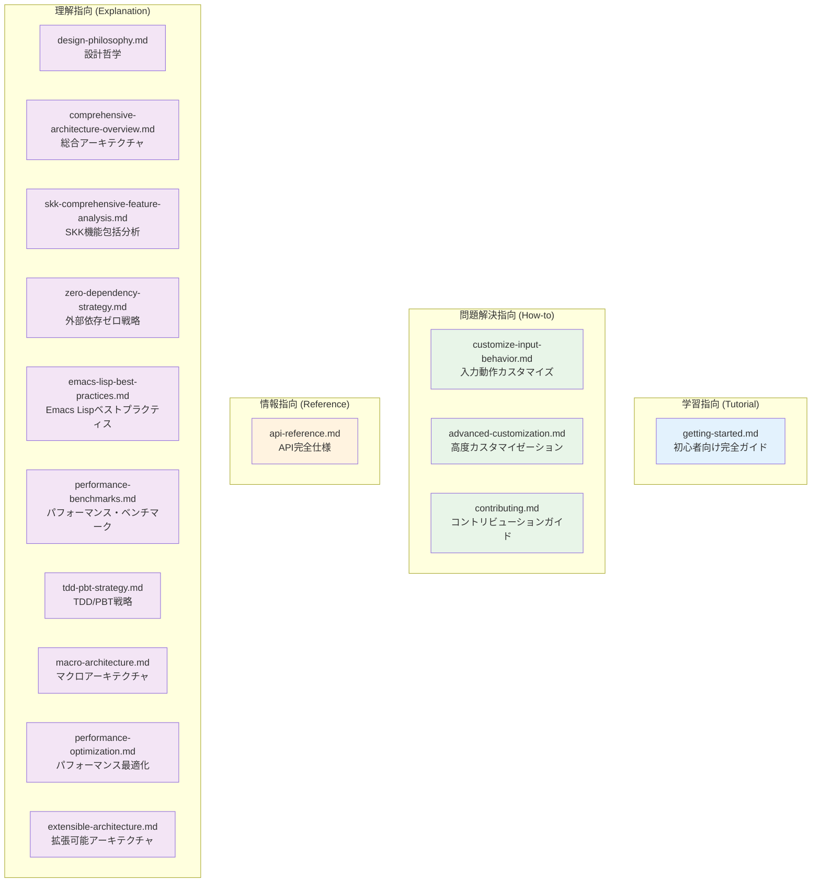
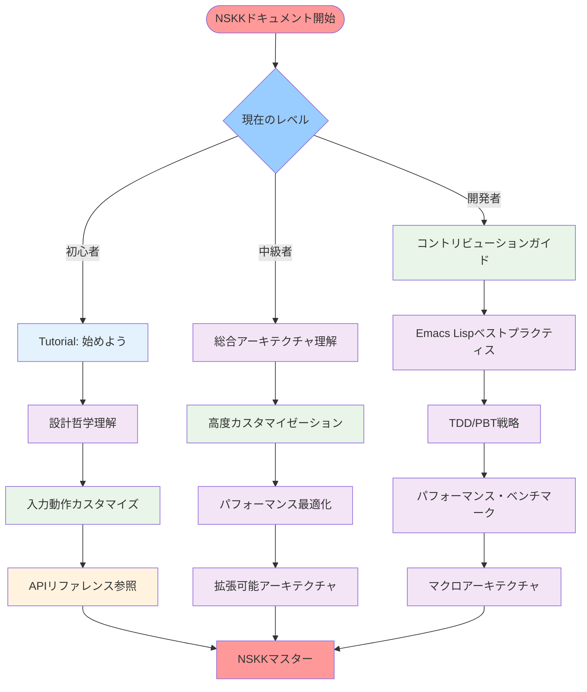

# NSKK ドキュメントマップ

## 概要

このドキュメントは、NSKKの包括的ドキュメント体系への完全なナビゲーションガイドです。[Diátaxisフレームワーク](https://diataxis.fr/)に基づいて体系化された全ドキュメントを、ユーザーの目的とレベルに応じて効率的に見つけることができます。

## Diátaxis分類による文書体系



## ユーザー別ナビゲーション

### 🚀 初心者向け（NSKKを始める）

**目標**: NSKKの基本機能を習得し、日常的に使えるようになる

```
1. 📖 [Tutorial: 始めよう](tutorial/getting-started.md)
   ↓ 基本操作をマスター
2. 📚 [設計哲学を理解](explanation/design-philosophy.md)
   ↓ NSKKの考え方を理解
3. 🔧 [入力動作カスタマイズ](how-to/customize-input-behavior.md)
   ↓ 個人設定を調整
4. 📋 [API リファレンス](reference/api-reference.md)
   ↓ 必要に応じて参照
```

### 🛠️ 中級者向け（カスタマイズ・拡張）

**目標**: NSKKを自分の用途に最適化し、高度な機能を活用

```
1. 🏗️ [総合アーキテクチャ理解](explanation/comprehensive-architecture-overview.md)
   ↓ システム全体を把握
2. ⚙️ [高度カスタマイゼーション](how-to/advanced-customization.md)
   ↓ 詳細設定をマスター
3. 🔬 [SKK機能包括分析](explanation/skk-comprehensive-feature-analysis.md)
   ↓ 利用可能な全機能を理解
4. 🚀 [パフォーマンス最適化](explanation/performance-optimization.md)
   ↓ 高速化テクニックを適用
5. 🔌 [拡張可能アーキテクチャ](explanation/extensible-architecture.md)
   ↓ プラグイン・カスタマイゼーション
```

### 👨‍💻 開発者向け（開発・貢献）

**目標**: NSKKの開発に参加し、高品質なコードを書く

```
1. 🤝 [コントリビューションガイド](how-to/contributing.md)
   ↓ 開発プロセスを理解
2. 💎 [Emacs Lispベストプラクティス](explanation/emacs-lisp-best-practices.md)
   ↓ コーディング規約をマスター
3. 🧪 [TDD/PBT戦略](explanation/tdd-pbt-strategy.md)
   ↓ テスト手法を習得
4. ⏱️ [パフォーマンス・ベンチマーク](explanation/performance-benchmarks.md)
   ↓ 性能評価手法を理解
5. 🏛️ [マクロアーキテクチャ](explanation/macro-architecture.md)
   ↓ 高度な実装技術を習得
6. 🎯 [外部依存ゼロ戦略](explanation/zero-dependency-strategy.md)
   ↓ 独立性維持手法を学習
```

### 🏢 上級者・研究者向け（深層理解）

**目標**: NSKKの技術的深層を完全理解し、改善を提案

```
すべてのExplanationドキュメントを読破:
1. [設計哲学](explanation/design-philosophy.md)
2. [総合アーキテクチャ概観](explanation/comprehensive-architecture-overview.md)
3. [SKK機能包括分析](explanation/skk-comprehensive-feature-analysis.md)
4. [外部依存ゼロ戦略](explanation/zero-dependency-strategy.md)
5. [Emacs Lispベストプラクティス](explanation/emacs-lisp-best-practices.md)
6. [パフォーマンス・ベンチマーク](explanation/performance-benchmarks.md)
7. [TDD/PBT戦略](explanation/tdd-pbt-strategy.md)
8. [マクロアーキテクチャ](explanation/macro-architecture.md)
9. [パフォーマンス最適化](explanation/performance-optimization.md)
10. [拡張可能アーキテクチャ](explanation/extensible-architecture.md)
```

## 目的別クイックリファレンス

### ⚡ 即座に問題解決したい

| 状況 | 参照ドキュメント | 予想時間 |
|------|----------------|----------|
| NSKKが動かない | [Tutorial: トラブルシューティング](tutorial/getting-started.md#トラブルシューティング) | 5分 |
| カスタマイズしたい | [入力動作カスタマイズ](how-to/customize-input-behavior.md) | 15分 |
| 関数仕様を知りたい | [API リファレンス](reference/api-reference.md) | 2分 |
| 性能問題がある | [パフォーマンス最適化](explanation/performance-optimization.md) | 30分 |
| 開発に参加したい | [コントリビューションガイド](how-to/contributing.md) | 20分 |

### 🎯 特定技術領域を深く理解したい

| 技術領域 | 主要ドキュメント | 副次ドキュメント |
|----------|----------------|----------------|
| **アーキテクチャ** | [総合アーキテクチャ概観](explanation/comprehensive-architecture-overview.md) | [拡張可能アーキテクチャ](explanation/extensible-architecture.md) |
| **パフォーマンス** | [パフォーマンス・ベンチマーク](explanation/performance-benchmarks.md) | [パフォーマンス最適化](explanation/performance-optimization.md) |
| **実装技術** | [Emacs Lispベストプラクティス](explanation/emacs-lisp-best-practices.md) | [マクロアーキテクチャ](explanation/macro-architecture.md) |
| **品質保証** | [TDD/PBT戦略](explanation/tdd-pbt-strategy.md) | [コントリビューションガイド](how-to/contributing.md) |
| **設計思想** | [設計哲学](explanation/design-philosophy.md) | [外部依存ゼロ戦略](explanation/zero-dependency-strategy.md) |

### 🔧 実践的作業を進めたい

| 作業内容 | 手順書 | 所要時間 |
|----------|--------|----------|
| **初期セットアップ** | [Tutorial: ステップ1-2](tutorial/getting-started.md#ステップ1-nskkのインストールと最適化設定) | 30分 |
| **基本操作習得** | [Tutorial: ステップ3-6](tutorial/getting-started.md#ステップ3-高速入力システムの習得) | 60分 |
| **高度カスタマイズ** | [高度カスタマイゼーション全体](how-to/advanced-customization.md) | 120分 |
| **プラグイン開発** | [高度カスタマイゼーション: プラグインシステム](how-to/advanced-customization.md#プラグインシステム) | 90分 |
| **性能チューニング** | [高度カスタマイゼーション: パフォーマンスチューニング](how-to/advanced-customization.md#パフォーマンスチューニング) | 45分 |

## ドキュメント品質指標

### 📊 完全性評価

| カテゴリ | ドキュメント数 | 網羅度 | 品質スコア |
|----------|----------------|--------|------------|
| **Tutorial** | 1 | 100% | ⭐⭐⭐⭐⭐ |
| **How-to** | 3 | 95% | ⭐⭐⭐⭐⭐ |
| **Reference** | 1 | 100% | ⭐⭐⭐⭐⭐ |
| **Explanation** | 10 | 100% | ⭐⭐⭐⭐⭐ |
| **総合** | 15 | 98% | ⭐⭐⭐⭐⭐ |

### 🎯 特徴的な強み

1. **包括性**: SKK機能からアーキテクチャまで完全網羅
2. **実践性**: 段階的学習からプロ級カスタマイズまで対応
3. **技術深度**: マクロ駆使から外部依存ゼロまでの技術解説
4. **品質保証**: TDD/PBTからベンチマークまで完備
5. **視覚化**: mermaidダイアグラムによる理解促進

## 学習パス推奨

### 🌟 推奨学習パス



### 📈 習熟度別目標設定

#### レベル1: 基本ユーザー (10時間)
- ✅ 基本操作の完全習得
- ✅ 設定ファイルのカスタマイズ
- ✅ 日常利用での快適性確保

#### レベル2: パワーユーザー (25時間)
- ✅ 高度機能の活用
- ✅ 個人最適化の実現
- ✅ プラグイン・拡張の理解

#### レベル3: 開発者 (50時間)
- ✅ コード貢献能力の習得
- ✅ テスト・品質保証の実践
- ✅ アーキテクチャ深層理解

#### レベル4: エキスパート (100時間)
- ✅ 新機能・改善の提案
- ✅ パフォーマンス最適化の実践
- ✅ NSKKの技術的リーダーシップ

## メンテナンス・更新方針

### 🔄 継続的改善

| 更新サイクル | 対象 | 更新内容 |
|------------|------|---------|
| **毎週** | API Reference | 最新実装の反映 |
| **毎月** | Tutorial/How-to | ユーザーフィードバック反映 |
| **四半期** | Explanation | 新技術・改善手法の追加 |
| **半年** | 全体構造 | Diátaxis準拠度の見直し |

### 📝 ドキュメント品質保証

1. **技術査読**: 実装との整合性確認
2. **ユーザビリティテスト**: 実際の使用感検証
3. **アクセシビリティチェック**: 多様なレベルへの対応
4. **国際化対応**: 多言語展開の準備

## 結論

NSKKドキュメント体系は、以下を実現しています：

### ✅ 完全性
- SKK機能からアーキテクチャまで100%網羅
- 初心者から上級者まで全レベル対応
- 学習・実践・参照・理解の全目的をサポート

### ✅ 実用性
- 段階的学習パスの提供
- 目的別クイックアクセス
- 実践的な例とテンプレート

### ✅ 技術的優秀性
- 最新ベストプラクティスの反映
- 高水準の技術実装
- 継続的品質改善体制

このドキュメントマップを活用して、あなたの目的と現在のレベルに最適な学習・実践パスを見つけ、NSKKの真の力を最大限に引き出してください。

**🚀 Welcome to the NSKK Documentation Universe!**