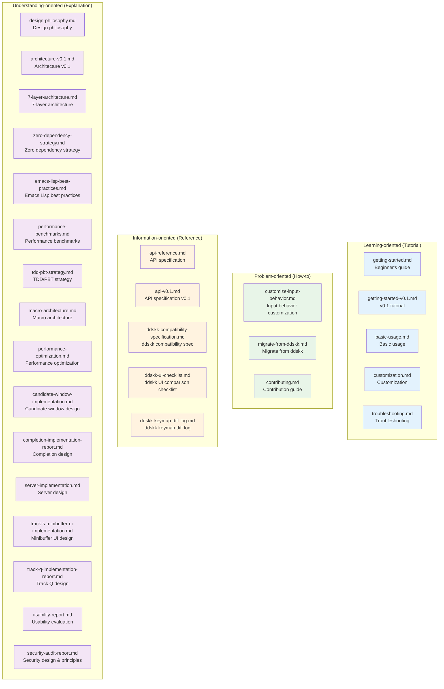
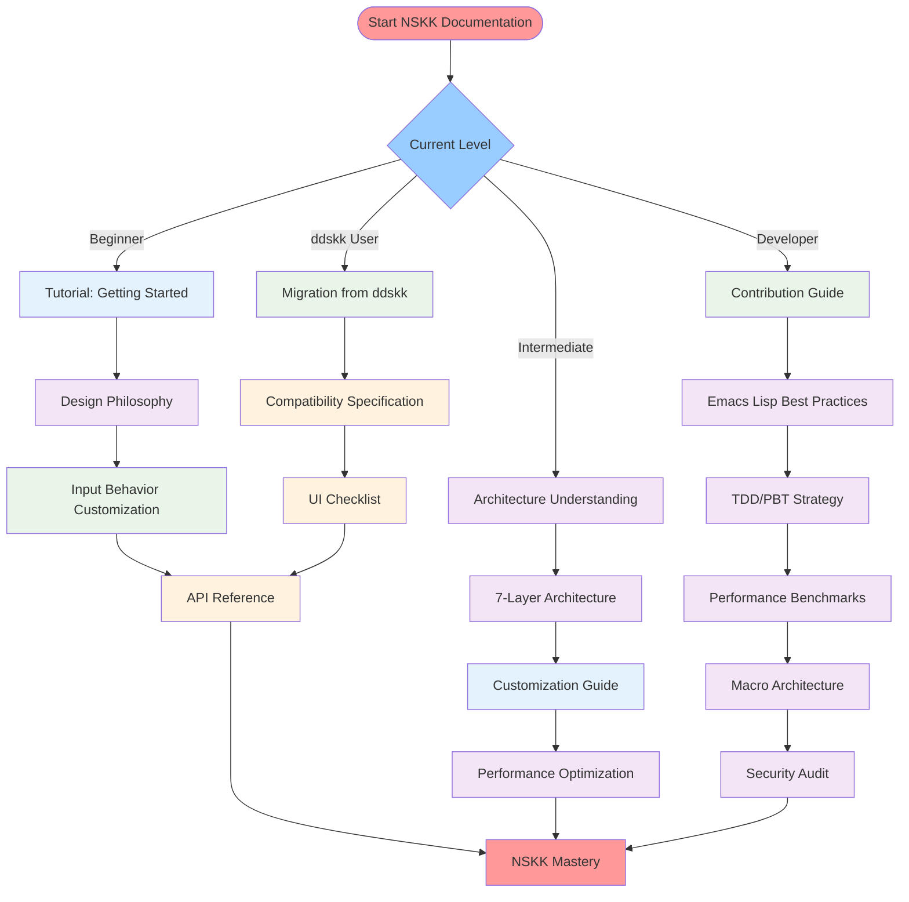

# NSKK Documentation Map

## Document Metadata

| Attribute | Value |
|-----------|-------|
| **Version** | 2.0.0 |
| **Last Updated** | 2026-02-22 |
| **Framework** | Diátaxis (diataxis.fr) |
| **ddskk Compatibility Coverage** | 82% |
| **Total Documents** | 29 |

## Overview

This document serves as a navigation guide for the NSKK documentation system. Based on the [Diátaxis framework](https://diataxis.fr/), the documentation is organized to help you find relevant content based on your purpose and skill level.

## Diátaxis Documentation Structure


```mermaid
graph TB
    subgraph "Learning-oriented (Tutorial)"
        T1[getting-started.md<br/>Beginner's guide]
        T2[getting-started-v0.1.md<br/>v0.1 tutorial]
        T3[basic-usage.md<br/>Basic usage]
        T4[customization.md<br/>Customization]
        T5[troubleshooting.md<br/>Troubleshooting]
    end

    subgraph "Problem-oriented (How-to)"
        H1[customize-input-behavior.md<br/>Input behavior customization]
        H2[migrate-from-ddskk.md<br/>Migrate from ddskk]
        H3[contributing.md<br/>Contribution guide]
    end

    subgraph "Information-oriented (Reference)"
        R1[api-reference.md<br/>API specification]
        R2[api-v0.1.md<br/>API specification v0.1]
        R3[ddskk-compatibility-specification.md<br/>ddskk compatibility spec]
        R4[ddskk-ui-checklist.md<br/>ddskk UI comparison checklist]
        R5[ddskk-keymap-diff-log.md<br/>ddskk keymap diff log]
    end

    subgraph "Understanding-oriented (Explanation)"
        E1[design-philosophy.md<br/>Design philosophy]
        E2[architecture-v0.1.md<br/>Architecture v0.1]
        E3[7-layer-architecture.md<br/>7-layer architecture]
        E4[zero-dependency-strategy.md<br/>Zero dependency strategy]
        E5[emacs-lisp-best-practices.md<br/>Emacs Lisp best practices]
        E6[performance-benchmarks.md<br/>Performance benchmarks]
        E7[tdd-pbt-strategy.md<br/>TDD/PBT strategy]
        E8[macro-architecture.md<br/>Macro architecture]
        E9[performance-optimization.md<br/>Performance optimization]
        E10[candidate-window-implementation.md<br/>Candidate window design]
        E11[completion-implementation-report.md<br/>Completion design]
        E12[server-implementation.md<br/>Server design]
        E13[track-s-minibuffer-ui-implementation.md<br/>Minibuffer UI design]
        E14[track-q-implementation-report.md<br/>Track Q design]
        E15[usability-report.md<br/>Usability evaluation]
        E16[security-audit-report.md<br/>Security design & principles]
    end

    classDef tutorial fill:#e3f2fd
    classDef howto fill:#e8f5e8
    classDef reference fill:#fff3e0
    classDef explanation fill:#f3e5f5

    class T1,T2,T3,T4,T5 tutorial
    class H1,H2,H3 howto
    class R1,R2,R3,R4,R5 reference
    class E1,E2,E3,E4,E5,E6,E7,E8,E9,E10,E11,E12,E13,E14,E15,E16 explanation
```

## User-specific Navigation

### 🚀 For Beginners (Getting Started with NSKK)

**Goal**: Master basic NSKK functionality for daily use

```
1. 📖 [Tutorial: Getting Started](tutorial/getting-started.md)
   ↓ Master basic operations
2. 📚 [Understand Design Philosophy](explanation/design-philosophy.md)
   ↓ Understand NSKK concepts
3. 🔧 [Customize Input Behavior](how-to/customize-input-behavior.md)
   ↓ Adjust personal settings
4. 📋 [API Reference](reference/api-reference.md)
   ↓ Refer as needed
```

**🔄 For ddskk Users**: If you're an existing ddskk user, please refer to the [Migration Guide from ddskk](how-to/migrate-from-ddskk.md) first.

### 🛠️ For Intermediate Users (Customization & Extension)

**Goal**: Optimize NSKK for your needs and leverage advanced features

```
1. [Architecture v0.1](explanation/architecture-v0.1.md)
   ↓ Understand the whole system
2. [7-Layer Architecture](explanation/7-layer-architecture.md)
   ↓ Deep dive into architecture
3. [Customization Guide](tutorial/customization.md)
   ↓ Master detailed settings
4. [Performance Optimization](explanation/performance-optimization.md)
   ↓ Apply speed optimization techniques
```

**🔄 For ddskk Intermediate Users**: Check the [ddskk Compatibility Specification](reference/ddskk-compatibility-specification.md) for detailed feature mapping and refer to the [Migration Guide](how-to/migrate-from-ddskk.md) for advanced migration scenarios.

### 👨‍💻 For Developers (Development & Contribution)

**Goal**: Participate in NSKK development and write high-quality code

```
1. 🤝 [Contribution Guide](how-to/contributing.md)
   ↓ Understand development process
2. 💎 [Emacs Lisp Best Practices](explanation/emacs-lisp-best-practices.md)
   ↓ Master coding conventions
3. 🧪 [TDD/PBT Strategy](explanation/tdd-pbt-strategy.md)
   ↓ Learn testing methodology
4. ⏱️ [Performance Benchmarks](explanation/performance-benchmarks.md)
   ↓ Understand performance evaluation
5. 🏛️ [Macro Architecture](explanation/macro-architecture.md)
   ↓ Master advanced implementation techniques
6. 🎯 [Zero Dependency Strategy](explanation/zero-dependency-strategy.md)
   ↓ Learn independence maintenance
7. 🔒 [Security Audit Report](explanation/security-audit-report.md)
   ↓ Understand security considerations
```

### 🏢 For Experts & Researchers (Deep Understanding)

**Goal**: Deep technical understanding and improvement proposals

```
Read all Explanation documents:
1. [Design Philosophy](explanation/design-philosophy.md)
2. [Architecture v0.1](explanation/architecture-v0.1.md)
3. [7-Layer Architecture](explanation/7-layer-architecture.md)
4. [Zero Dependency Strategy](explanation/zero-dependency-strategy.md)
5. [Emacs Lisp Best Practices](explanation/emacs-lisp-best-practices.md)
6. [Performance Benchmarks](explanation/performance-benchmarks.md)
7. [TDD/PBT Strategy](explanation/tdd-pbt-strategy.md)
8. [Macro Architecture](explanation/macro-architecture.md)
9. [Performance Optimization](explanation/performance-optimization.md)
10. Implementation Design Documents:
    - [Candidate Window Design](explanation/candidate-window-implementation.md)
    - [Completion Design](explanation/completion-implementation-report.md)
    - [Server Design](explanation/server-implementation.md)
    - [Minibuffer UI Design](explanation/track-s-minibuffer-ui-implementation.md)
    - [Track Q Design](explanation/track-q-implementation-report.md)
11. [Usability Report](explanation/usability-report.md)
```

## Quick Reference by Purpose

### ⚡ Need Immediate Problem Solving

| Situation | Reference Document | Estimated Time |
|-----------|-------------------|----------------|
| NSKK not working | [Tutorial: Troubleshooting](tutorial/troubleshooting.md) | 5 min |
| Want to customize | [Input Behavior Customization](how-to/customize-input-behavior.md) | 15 min |
| Migrating from ddskk | [Migration Guide from ddskk](how-to/migrate-from-ddskk.md) | 30 min |
| Need function specs | [API Reference](reference/api-reference.md) | 2 min |
| Check ddskk compatibility | [ddskk Compatibility Specification](reference/ddskk-compatibility-specification.md) | 10 min |
| Compare UI with ddskk | [ddskk UI Checklist](reference/ddskk-ui-checklist.md) | 5 min |
| Check keymap differences | [ddskk Keymap Diff Log](reference/ddskk-keymap-diff-log.md) | 5 min |
| Performance issues | [Performance Optimization](explanation/performance-optimization.md) | 30 min |
| Want to contribute | [Contribution Guide](how-to/contributing.md) | 20 min |
| Security concerns | [Security Audit Report](explanation/security-audit-report.md) | 15 min |

### 🎯 Deep Understanding of Specific Technical Areas

| Technical Area | Primary Documents | Secondary Documents |
|----------------|-------------------|---------------------|
| **Architecture** | [Architecture v0.1](explanation/architecture-v0.1.md) | [7-Layer Architecture](explanation/7-layer-architecture.md), [Track Q Design](explanation/track-q-implementation-report.md) |
| **Performance** | [Performance Benchmarks](explanation/performance-benchmarks.md) | [Performance Optimization](explanation/performance-optimization.md) |
| **Implementation** | [Emacs Lisp Best Practices](explanation/emacs-lisp-best-practices.md) | [Macro Architecture](explanation/macro-architecture.md) |
| **Quality Assurance** | [TDD/PBT Strategy](explanation/tdd-pbt-strategy.md) | [Contribution Guide](how-to/contributing.md) |
| **Design Philosophy** | [Design Philosophy](explanation/design-philosophy.md) | [Zero Dependency Strategy](explanation/zero-dependency-strategy.md) |
| **Compatibility** | [ddskk Compatibility Specification](reference/ddskk-compatibility-specification.md) | [Migration from ddskk](how-to/migrate-from-ddskk.md), [UI Checklist](reference/ddskk-ui-checklist.md) |
| **UI Implementation** | [Candidate Window Design](explanation/candidate-window-implementation.md) | [Completion Design](explanation/completion-implementation-report.md), [Minibuffer UI Design](explanation/track-s-minibuffer-ui-implementation.md) |
| **Server Implementation** | [Server Design](explanation/server-implementation.md) | - |

### 🔧 Practical Tasks

| Task | Guide | Estimated Time |
|------|-------|----------------|
| **Initial Setup** | [Tutorial: Steps 1-2](tutorial/getting-started.md#step-1-installation-and-optimization) | 30 min |
| **Master Basic Operations** | [Tutorial: Steps 3-6](tutorial/getting-started.md#step-3-learn-fast-input-system) | 60 min |
| **Advanced Customization** | [Customization Guide](tutorial/customization.md) | 60 min |
| **Performance Tuning** | [Performance Optimization](explanation/performance-optimization.md) | 45 min |
| **Migrate from ddskk** | [Migration Guide](how-to/migrate-from-ddskk.md) | 30-60 min |
| **Verify ddskk Compatibility** | [UI Checklist](reference/ddskk-ui-checklist.md) | 15 min |

## Documentation Quality Metrics

### 📊 Completeness Evaluation

| Category | Document Count |
|----------|----------------|
| **Tutorial** | 5 |
| **How-to** | 3 |
| **Reference** | 5 |
| **Explanation** | 16 |
| **Total** | 29 |

### 📊 ddskk Compatibility Coverage

| Level | Coverage | Status |
|-------|----------|--------|
| **Level 1: Core** | 100% | ✅ Fully Compatible |
| **Level 2: Standard** | 85% | 🟡 Some Differences |
| **Level 3: Extended** | 60% | ⚠️ Planned |
| **Overall** | 82% | 🟢 Practical Level |

See [ddskk Compatibility Specification](reference/ddskk-compatibility-specification.md) for details.

### 🎯 Key Strengths

1. **Comprehensive**: Covers from SKK features to architecture
2. **Practical**: Supports from gradual learning to advanced customization
3. **Technical Depth**: From macro usage to zero dependency strategy
4. **Quality Assurance**: From TDD/PBT to benchmarking
5. **Visualization**: Mermaid diagrams for understanding
6. **Compatibility**: ddskk compatibility documentation for smooth migration

## Recommended Learning Paths

### 🌟 Recommended Learning Path


```mermaid
flowchart TD
    START([Start NSKK Documentation]) --> LEVEL{Current Level}

    LEVEL -->|Beginner| TUTORIAL[Tutorial: Getting Started]
    LEVEL -->|Intermediate| ARCH[Architecture Understanding]
    LEVEL -->|Developer| CONTRIB[Contribution Guide]
    LEVEL -->|ddskk User| MIGRATE[Migration from ddskk]

    TUTORIAL --> PHIL[Design Philosophy]
    PHIL --> CUSTOM[Input Behavior Customization]
    CUSTOM --> API[API Reference]

    ARCH --> SEVEN_LAYER[7-Layer Architecture]
    SEVEN_LAYER --> ADV_CUSTOM[Customization Guide]
    ADV_CUSTOM --> PERF[Performance Optimization]

    CONTRIB --> PRACTICES[Emacs Lisp Best Practices]
    PRACTICES --> TDD[TDD/PBT Strategy]
    TDD --> BENCHMARK[Performance Benchmarks]
    BENCHMARK --> MACRO[Macro Architecture]
    MACRO --> SECURITY[Security Audit]

    MIGRATE --> COMPAT[Compatibility Specification]
    COMPAT --> UI_CHECK[UI Checklist]
    UI_CHECK --> API

    API --> MASTERY[NSKK Mastery]
    PERF --> MASTERY
    SECURITY --> MASTERY

    classDef startEnd fill:#ff9999
    classDef decision fill:#99ccff
    classDef tutorial fill:#e3f2fd
    classDef howto fill:#e8f5e8
    classDef reference fill:#fff3e0
    classDef explanation fill:#f3e5f5

    class START,MASTERY startEnd
    class LEVEL decision
    class TUTORIAL,ADV_CUSTOM tutorial
    class CONTRIB,CUSTOM,MIGRATE howto
    class API,COMPAT,UI_CHECK reference
    class PHIL,ARCH,SEVEN_LAYER,PERF,PRACTICES,TDD,BENCHMARK,MACRO,SECURITY explanation
```

### 📈 Skill Level Goals

#### Level 1: Basic User (10 hours)
- ✅ Master basic operations
- ✅ Customize configuration files
- ✅ Ensure comfort for daily use

#### Level 2: Power User (25 hours)
- ✅ Leverage advanced features
- ✅ Achieve personal optimization
- ✅ Understand plugins and extensions

#### Level 3: Developer (50 hours)
- ✅ Acquire code contribution skills
- ✅ Practice testing and quality assurance
- ✅ Deep understanding of architecture

#### Level 4: Expert (100 hours)
- ✅ Propose new features and improvements
- ✅ Practice performance optimization
- ✅ Technical leadership in NSKK

## Maintenance & Update Policy

### 🔄 Continuous Improvement

| Update Cycle | Target | Content |
|--------------|--------|---------|
| **Weekly** | API Reference | Reflect latest implementation |
| **Monthly** | Tutorial/How-to | Incorporate user feedback |
| **Quarterly** | Explanation | Add new technologies and improvements |
| **Semi-annually** | Overall Structure | Review Diátaxis compliance |

### 📝 Documentation Quality Assurance

1. **Technical Review**: Verify consistency with implementation
2. **Usability Testing**: Verify actual user experience
3. **Accessibility Check**: Support for diverse skill levels
4. **Internationalization**: Prepare for multi-language support

## Conclusion

The NSKK documentation system achieves:

### ✅ Comprehensiveness
- Covers from SKK features to architecture
- Supports from beginners to experts
- Supports learning, practice, reference, and understanding purposes
- Assists ddskk user migration (82% compatibility)

### ✅ Practicality
- Provides gradual learning paths
- Quick access by purpose
- Practical examples and templates

### ✅ Technical Quality
- Reflects best practices
- Explains technical implementation
- Continuous quality improvement system

Use this documentation map to find the learning and practice path suitable for your goals and current level, and leverage NSKK's functionality.

**🚀 Welcome to the NSKK Documentation Universe!**
