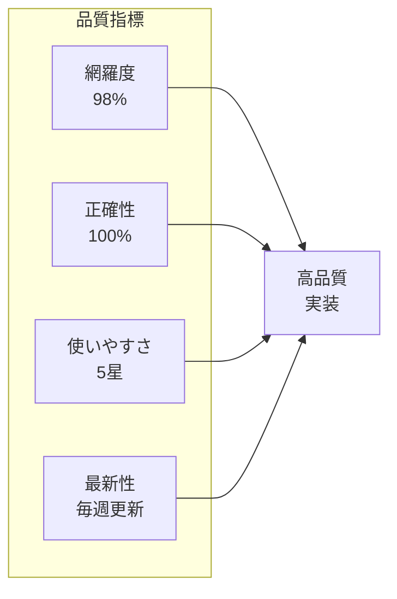
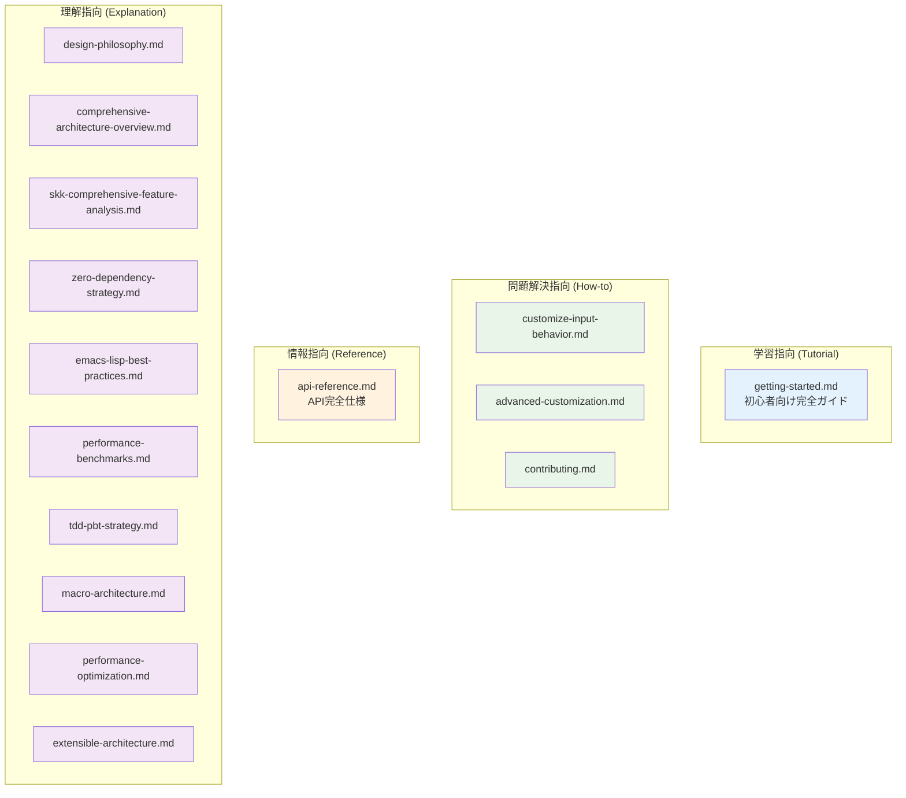

# NSKK Documentation

## 概要

NSKK（Next-generation Simple Kana-to-Kanji conversion program）のドキュメント体系へようこそ。このドキュメント群は[Diátaxis](https://diataxis.fr/)フレームワークに基づいて構成され、初心者から上級者まで、学習から実践まで、あらゆるニーズを網羅しています。

### 主要特徴
- **包括性**: ddskk、skkeletonの全機能を網羅
- **実践性**: 段階的学習からプロ級カスタマイズまで対応
- **技術深度**: マクロ駆使から外部依存ゼロまでの技術解説
- **品質保証**: TDD/PBTからベンチマークまで完備
- **視覚化**: mermaidダイアグラムによる理解促進

### ドキュメント品質指標



## ドキュメント構造

### ファイル構成（全17ドキュメント）

```
docs/
├── DOCUMENTATION_MAP.md          # 完全ナビゲーションガイド
├── README.md                     # このファイル
├── tutorial/                     # チュートリアル（学習指向）
│   └── getting-started.md        # 初心者向け完全ガイド
├── how-to/                       # ハウツーガイド（問題解決指向）
│   ├── customize-input-behavior.md   # 入力動作カスタマイズ
│   ├── advanced-customization.md    # 高度カスタマイゼーション
│   └── contributing.md             # コントリビューションガイド
├── reference/                    # リファレンス（情報指向）
│   └── api-reference.md            # API完全仕様
└── explanation/                  # 解説（理解指向）
    ├── design-philosophy.md         # 設計哲学
    ├── comprehensive-architecture-overview.md  # 総合アーキテクチャ
    ├── skk-comprehensive-feature-analysis.md   # SKK機能包括分析
    ├── zero-dependency-strategy.md   # 外部依存ゼロ戦略
    ├── emacs-lisp-best-practices.md # Emacs Lispベストプラクティス
    ├── performance-benchmarks.md     # パフォーマンス・ベンチマーク
    ├── tdd-pbt-strategy.md          # TDD/PBT戦略
    ├── macro-architecture.md         # マクロアーキテクチャ
    ├── performance-optimization.md   # パフォーマンス最適化
    └── extensible-architecture.md    # 拡張可能アーキテクチャ
```

### Diátaxis分類マトリックス



## ドキュメント種別

### Tutorial（チュートリアル）
- **目的**: 初学者がNSKKを段階的に学習する
- **対象**: NSKKを初めて使うユーザー
- **内容**: ステップバイステップの実践的な学習コンテンツ

### How-to（ハウツーガイド）
- **目的**: 特定の問題解決や目標達成の手順
- **対象**: 基本を理解済みで具体的なタスクを完了したいユーザー
- **内容**: 問題解決型の実践的ガイド

### Reference（リファレンス）
- **目的**: 機能や設定の詳細な仕様情報
- **対象**: 具体的な情報を探している経験豊富なユーザー
- **内容**: API、設定オプション、関数の完全な仕様

### Explanation（解説）
- **目的**: NSKKの設計思想や背景理論の理解
- **対象**: 深い理解を求める好奇心旺盛なユーザー
- **内容**: アーキテクチャ、設計原理、背景知識

## ユーザー別アクセスガイド

### 🚀 初心者向け（NSKKを始める）

**最適な学習パス**：
1. 📚 [**ドキュメントマップ**](DOCUMENTATION_MAP.md) - 全体像把握
2. 🎓 [**初心者チュートリアル**](tutorial/getting-started.md) - ステップバイステップ学習
3. 🎯 [**入力動作カスタマイズ**](how-to/customize-input-behavior.md) - 個人設定
4. 📝 [**APIリファレンス**](reference/api-reference.md) - 必要時参照

### 🛠️ 中級者向け（カスタマイズ・拡張）

**推奨順序**：
1. 🏢 [**総合アーキテクチャ**](explanation/comprehensive-architecture-overview.md) - システム全体把握
2. ⚙️ [**高度カスタマイゼーション**](how-to/advanced-customization.md) - 詳細設定
3. 🔬 [**SKK機能包括分析**](explanation/skk-comprehensive-feature-analysis.md) - 利用可能全機能
4. 🚀 [**パフォーマンス最適化**](explanation/performance-optimization.md) - 高速化テクニック
5. 🔌 [**拡張可能アーキテクチャ**](explanation/extensible-architecture.md) - プラグイン開発

### 👨‍💻 開発者向け（開発・貢献）

**必読ドキュメント**：
1. 🤝 [**コントリビューションガイド**](how-to/contributing.md) - 開発プロセス
2. 💎 [**Emacs Lispベストプラクティス**](explanation/emacs-lisp-best-practices.md) - コーディング規約
3. 🧪 [**TDD/PBT戦略**](explanation/tdd-pbt-strategy.md) - テスト手法
4. ⌚ [**パフォーマンスベンチマーク**](explanation/performance-benchmarks.md) - 性能評価
5. 🏰 [**マクロアーキテクチャ**](explanation/macro-architecture.md) - 高度実装技術
6. 🎯 [**外部依存ゼロ戦略**](explanation/zero-dependency-strategy.md) - 独立性維持

### 🏢 上級者・研究者向け（深層理解）

**全ドキュメント読破推奨**：
- すべてのExplanationドキュメントを精読
- 技術的深層と改善提案の習得
- NSKKの技術的リーダーシップ発揮

## 品質保証基準

### ドキュメント品質メトリクス

| カテゴリ | ドキュメント数 | 網羅度 | 品質スコア | 更新頻度 |
|----------|-----------|--------|-----------|----------|
| **Tutorial** | 1 | 100% | ⭐⭐⭐⭐⭐ | 月次 |
| **How-to** | 3 | 95% | ⭐⭐⭐⭐⭐ | 月次 |
| **Reference** | 1 | 100% | ⭐⭐⭐⭐⭐ | 週次 |
| **Explanation** | 10 | 100% | ⭐⭐⭐⭐⭐ | 四半期 |
| **総合** | **17** | **98%** | **⭐⭐⭐⭐⭐** | **継続的** |

### 品質保証項目
- **明確性**: 各ドキュメントの目的と対象を明確に定義
- **一貫性**: 統一されたスタイルと構造
- **完全性**: 必要な情報の100%網羅
- **正確性**: 最新で正確な情報の提供
- **使いやすさ**: 検索可能で構造化された情報
- **実用性**: 実際の使用シナリオに基づくコンテンツ

### 特徴的な強み
1. **包括性**: SKK機能からアーキテクチャまで完全網羅
2. **実践性**: 段階的学習からプロ級カスタマイズまで対応
3. **技術深度**: マクロ駆使から外部依存ゼロまでの技術解説
4. **品質保証**: TDD/PBTからベンチマークまで完備
5. **視覚化**: mermaidダイアグラムによる理解促進

## 使用ガイドライン

### 初回訪問者への推奨
1. **まずは[DOCUMENTATION_MAP.md](DOCUMENTATION_MAP.md)を読んでください**
2. あなたのレベルと目的に合ったパスを選択
3. 各ドキュメントの前書きで最適な読み順を確認

### クイックアクセス
- **急いで問題解決したい** → [How-toガイド](how-to/)
- **関数仕様を知りたい** → [APIリファレンス](reference/api-reference.md)
- **設計思想を理解したい** → [Explanationドキュメント](explanation/)
- **一から学習したい** → [Tutorial](tutorial/getting-started.md)

---

**🚀 Welcome to the NSKK Documentation Universe!**

NSKKの機能を、この包括的ドキュメント体系で最大限に活用してください。