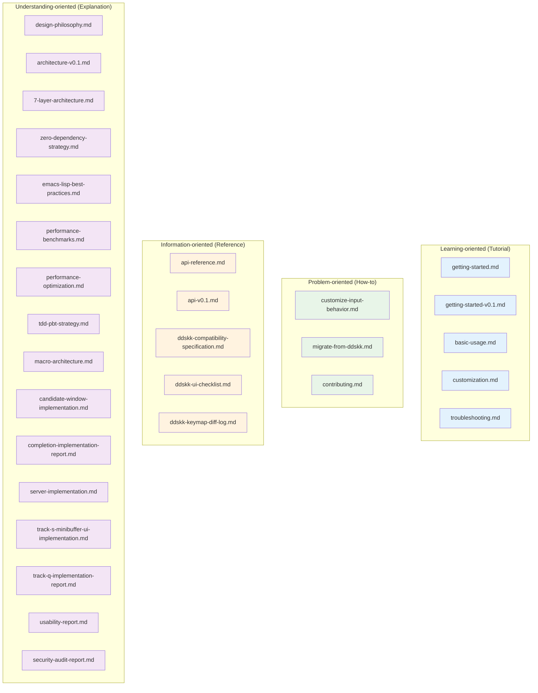

# NSKK Documentation

## Overview

Welcome to the documentation system for NSKK (Next-generation Simple Kana-to-Kanji conversion program). Based on the [Diátaxis](https://diataxis.fr/) framework, this documentation supports a wide range of needs from beginners to experts, and from learning to practice.

### Key Features
- **Comprehensive**: Covers ddskk and skkeleton features
- **Practical**: Supports from gradual learning to advanced customization
- **Technical Depth**: From macro usage to zero-dependency strategy
- **Quality Assurance**: From TDD/PBT to benchmarking
- **Visualization**: Mermaid diagrams for understanding
- **Compatibility**: ddskk compatibility documentation for smooth migration

### Documentation Quality Policy

- **Accuracy**: Consistent with latest implementation specifications
- **Consistency**: Unified style and structure
- **Practicality**: Content based on actual usage scenarios

## Documentation Structure

### File Organization

```
docs/
├── DOCUMENTATION_MAP.md          # Navigation guide
├── README.md                     # This file
├── tutorial/                     # Tutorials (Learning-oriented)
│   ├── getting-started.md        # Beginner's guide
│   ├── getting-started-v0.1.md   # v0.1 tutorial
│   ├── basic-usage.md            # Basic usage
│   ├── customization.md          # Customization guide
│   └── troubleshooting.md        # Troubleshooting
├── how-to/                       # How-to guides (Problem-oriented)
│   ├── customize-input-behavior.md   # Input behavior customization
│   ├── migrate-from-ddskk.md        # Migration guide from ddskk
│   └── contributing.md               # Contribution guide
├── reference/                    # Reference (Information-oriented)
│   ├── api-reference.md              # API specification
│   ├── api-v0.1.md                   # API specification v0.1
│   ├── ddskk-compatibility-specification.md  # ddskk compatibility spec
│   ├── ddskk-ui-checklist.md         # ddskk UI comparison checklist
│   └── ddskk-keymap-diff-log.md      # ddskk keymap diff log
└── explanation/                  # Explanations (Understanding-oriented)
    ├── architecture-v0.1.md          # Architecture v0.1
    ├── 7-layer-architecture.md       # 7-layer architecture
    ├── design-philosophy.md          # Design philosophy
    ├── zero-dependency-strategy.md   # Zero dependency strategy
    ├── emacs-lisp-best-practices.md  # Emacs Lisp best practices
    ├── performance-benchmarks.md     # Performance benchmarks
    ├── performance-optimization.md   # Performance optimization
    ├── tdd-pbt-strategy.md           # TDD/PBT strategy
    ├── macro-architecture.md         # Macro architecture
    ├── candidate-window-implementation.md      # Candidate window design
    ├── completion-implementation-report.md     # Completion design
    ├── server-implementation.md                # Server design
    ├── track-s-minibuffer-ui-implementation.md # Minibuffer UI design
    ├── track-q-implementation-report.md        # Track Q design
    ├── usability-report.md                     # Usability evaluation
    └── security-audit-report.md                # Security design & principles
```

### Diátaxis Classification Matrix


```mermaid
graph TD
    subgraph "Learning-oriented (Tutorial)"
        T1[getting-started.md]
        T2[getting-started-v0.1.md]
        T3[basic-usage.md]
        T4[customization.md]
        T5[troubleshooting.md]
    end

    subgraph "Problem-oriented (How-to)"
        H1[customize-input-behavior.md]
        H2[migrate-from-ddskk.md]
        H3[contributing.md]
    end

    subgraph "Information-oriented (Reference)"
        R1[api-reference.md]
        R2[api-v0.1.md]
        R3[ddskk-compatibility-specification.md]
        R4[ddskk-ui-checklist.md]
        R5[ddskk-keymap-diff-log.md]
    end

    subgraph "Understanding-oriented (Explanation)"
        E1[design-philosophy.md]
        E2[architecture-v0.1.md]
        E3[7-layer-architecture.md]
        E4[zero-dependency-strategy.md]
        E5[emacs-lisp-best-practices.md]
        E6[performance-benchmarks.md]
        E7[performance-optimization.md]
        E8[tdd-pbt-strategy.md]
        E9[macro-architecture.md]
        E10[candidate-window-implementation.md]
        E11[completion-implementation-report.md]
        E12[server-implementation.md]
        E13[track-s-minibuffer-ui-implementation.md]
        E14[track-q-implementation-report.md]
        E15[usability-report.md]
        E16[security-audit-report.md]
    end

    classDef tutorial fill:#e3f2fd
    classDef howto fill:#e8f5e8
    classDef reference fill:#fff3e0
    classDef explanation fill:#f3e5f5

    class T1,T2,T3,T4,T5 tutorial
    class H1,H2,H3 howto
    class R1,R2,R3,R4,R5 reference
    class E1,E2,E3,E4,E5,E6,E7,E8,E9,E10,E11,E12,E13,E14,E15,E16 explanation
```

## Document Types

### Tutorial
- **Purpose**: Beginners learn NSKK step-by-step
- **Target**: First-time NSKK users
- **Content**: Practical, step-by-step learning content

### How-to
- **Purpose**: Steps to solve specific problems or achieve goals
- **Target**: Users who understand basics and want to complete specific tasks
- **Content**: Problem-solving practical guides

### Reference
- **Purpose**: Detailed specification information for features and settings
- **Target**: Experienced users looking for specific information
- **Content**: APIs, configuration options, function specifications

### Explanation
- **Purpose**: Understanding NSKK design philosophy and background theory
- **Target**: Curious users seeking deep understanding
- **Content**: Architecture, design principles, background knowledge

## User-specific Access Guide

### 🚀 For Beginners (Getting Started with NSKK)

**Learning Path**:
1. 📚 [**Documentation Map**](DOCUMENTATION_MAP.md) - Understand the big picture
2. 🎓 [**Beginner Tutorial**](tutorial/getting-started.md) - Step-by-step learning
3. 🎯 [**Input Behavior Customization**](how-to/customize-input-behavior.md) - Personal settings
4. 📝 [**API Reference**](reference/api-reference.md) - Refer as needed

### 🔄 For ddskk Users

**Migration Path**:
1. 📖 [**Migration Guide from ddskk**](how-to/migrate-from-ddskk.md) - Step-by-step migration
2. 📋 [**ddskk Compatibility Specification**](reference/ddskk-compatibility-specification.md) - Feature mapping
3. ✅ [**ddskk UI Checklist**](reference/ddskk-ui-checklist.md) - Verify compatibility
4. 📊 [**ddskk Keymap Diff Log**](reference/ddskk-keymap-diff-log.md) - Check differences

### For Intermediate Users (Customization & Extension)

**Recommended Order**:
1. [**Architecture v0.1**](explanation/architecture-v0.1.md) - Understand the whole system
2. [**7-Layer Architecture**](explanation/7-layer-architecture.md) - Deep dive into architecture
3. [**Customization Guide**](tutorial/customization.md) - Detailed settings
4. [**Performance Optimization**](explanation/performance-optimization.md) - Speed optimization techniques

### 👨‍💻 For Developers (Development & Contribution)

**Must-read Documents**:
1. 🤝 [**Contribution Guide**](how-to/contributing.md) - Development process
2. 💎 [**Emacs Lisp Best Practices**](explanation/emacs-lisp-best-practices.md) - Coding conventions
3. 🧪 [**TDD/PBT Strategy**](explanation/tdd-pbt-strategy.md) - Testing methodology
4. ⌚ [**Performance Benchmarks**](explanation/performance-benchmarks.md) - Performance evaluation
5. 🏰 [**Macro Architecture**](explanation/macro-architecture.md) - Implementation techniques
6. 🎯 [**Zero Dependency Strategy**](explanation/zero-dependency-strategy.md) - Independence maintenance
7. 🔒 [**Security Audit Report**](explanation/security-audit-report.md) - Security considerations

### 🏢 For Experts & Researchers (Deep Understanding)

**Read All Documents**:
- Read all Explanation documents thoroughly
- Master technical depths and improvement proposals
- Exercise technical leadership in NSKK

## Quality Assurance Standards

### Documentation Quality Metrics

| Category | Document Count |
|----------|----------------|
| **Tutorial** | 5 |
| **How-to** | 3 |
| **Reference** | 5 |
| **Explanation** | 16 |
| **Total** | 28 |

### Quality Assurance Items
- **Clarity**: Clearly define purpose and target for each document
- **Consistency**: Unified style and structure
- **Completeness**: Cover necessary information
- **Accuracy**: Provide latest and accurate information
- **Usability**: Searchable and structured information
- **Practicality**: Content based on actual usage scenarios

### Key Strengths
1. **Comprehensive**: Covers from SKK features to architecture
2. **Practical**: Supports from gradual learning to customization
3. **Technical Depth**: From macro usage to zero-dependency strategy
4. **Quality Assurance**: From TDD/PBT to benchmarking
5. **Visualization**: Mermaid diagrams for understanding
6. **Compatibility**: ddskk compatibility documentation for smooth migration

## Usage Guidelines

### For First-time Visitors
1. **Read [DOCUMENTATION_MAP.md](DOCUMENTATION_MAP.md) first**
2. Choose the path suitable for your level and purpose
3. Check the reading order in each document's introduction

### Quick Access
- **Need quick problem solving** → [How-to guides](how-to/)
- **Need function specifications** → [API Reference](reference/api-reference.md)
- **Want to understand design philosophy** → [Explanation documents](explanation/)
- **Learn from scratch** → [Tutorial](tutorial/getting-started.md)
- **Migrating from ddskk** → [Migration Guide](how-to/migrate-from-ddskk.md)

---

**🚀 Welcome to the NSKK Documentation Universe!**

Leverage NSKK's functionality with this documentation system.
