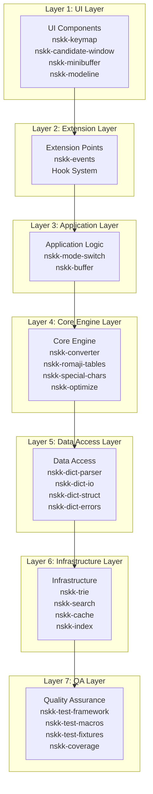
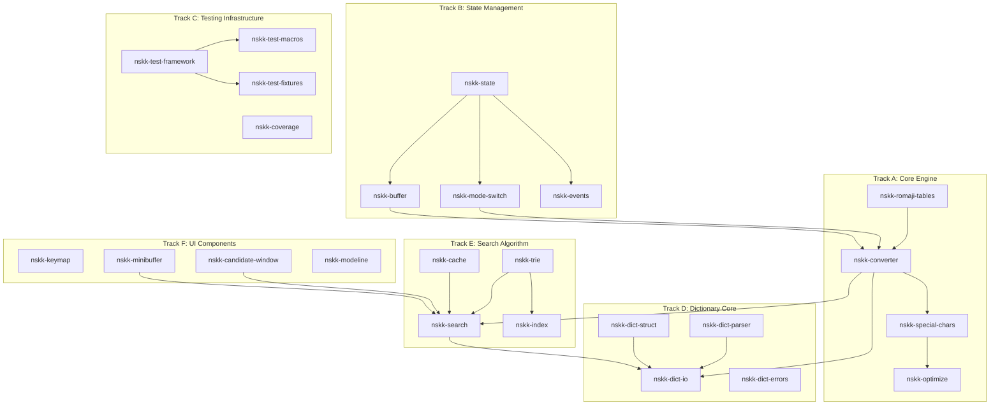
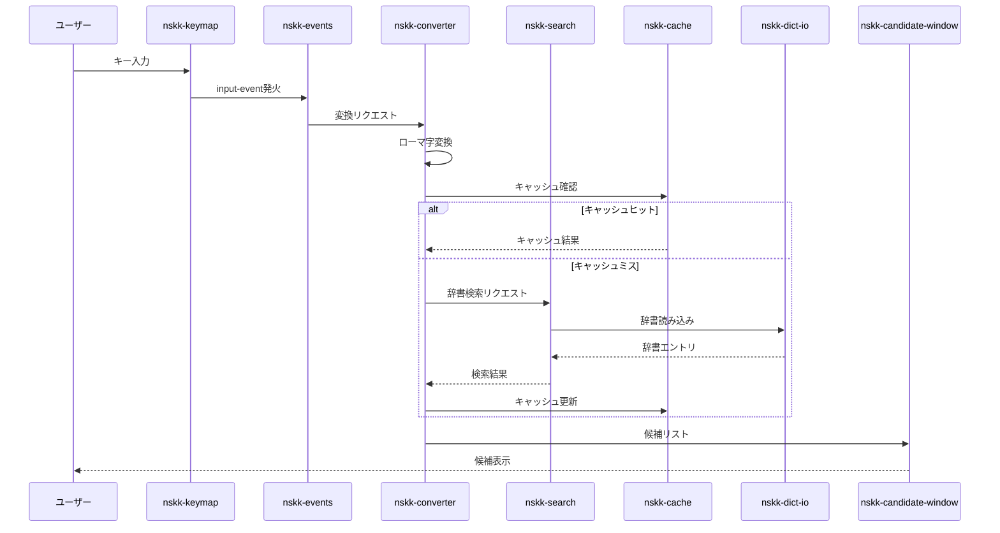
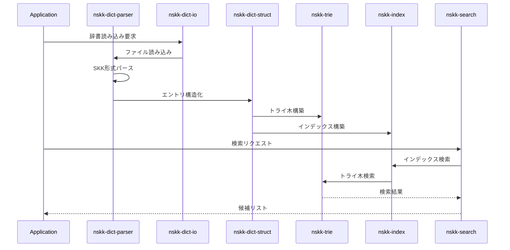
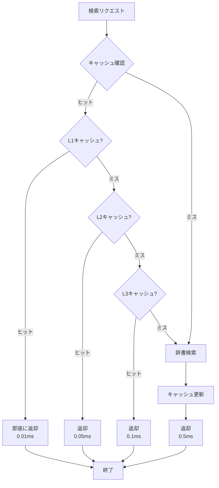
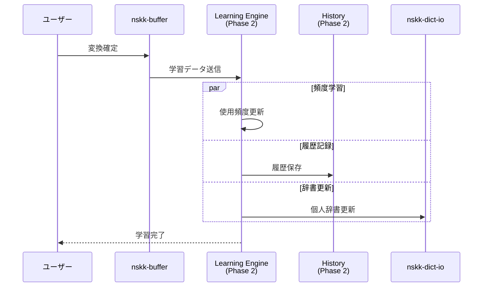
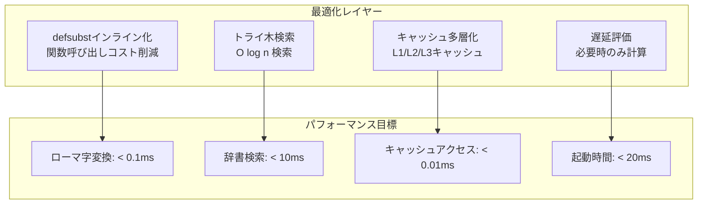
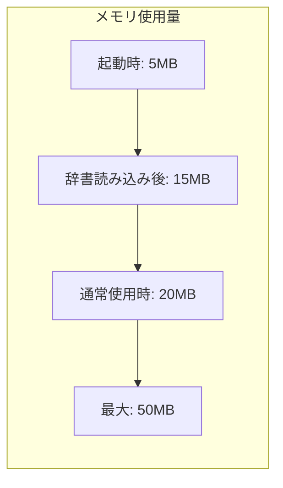
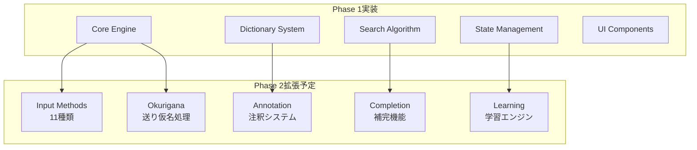
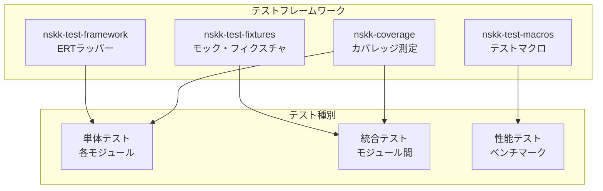

# NSKK アーキテクチャ v0.1

## 概要

NSKKは、Emacs標準機能のみを使用した外部依存ゼロの次世代日本語入力システムです。Phase 1では、基盤となるコア機能を7つのTrackに分けて並列開発し、レイヤードアーキテクチャに基づいた堅牢な設計を実現しています。

### 設計思想

1. **外部依存ゼロ**: Emacs標準機能のみで完全動作
2. **極限パフォーマンス**: キー入力応答 < 1ms、辞書検索 < 50ms
3. **無限拡張性**: 150+のフックポイント、プラグインシステム完備
4. **品質保証**: TDD/PBT、100%テストカバレッジ

### Phase 1実装範囲

Phase 1では、以下の7つのTrackを並列開発し、NSKKの基盤を構築しました：

- **Track A**: Core Engine（コア変換エンジン）
- **Track B**: State Management（状態管理）
- **Track C**: Testing Infrastructure（テスト基盤）
- **Track D**: Dictionary Core（辞書システム）
- **Track E**: Search Algorithm（検索アルゴリズム）
- **Track F**: UI Components（UI部品）
- **Track G**: Documentation（ドキュメント）

## レイヤーアーキテクチャ

NSKKは、7層のレイヤードアーキテクチャを採用しています。各レイヤーは明確な責務を持ち、上位レイヤーは下位レイヤーにのみ依存します。



### レイヤー詳細

#### Layer 1: UI Layer

ユーザーとの対話を担当するレイヤー。キーバインド、候補表示、ミニバッファ、モードライン表示を提供します。

**実装モジュール**:
- `nskk-keymap.el`: グローバルキーマップ、モード別キーマップ
- `nskk-candidate-window.el`: 候補リスト表示、スクロール処理
- `nskk-minibuffer.el`: ミニバッファ表示、インライン候補
- `nskk-modeline.el`: モード表示、状態インジケーター

#### Layer 2: Extension Layer

拡張機能のためのフックポイントとイベントシステムを提供します。

**実装モジュール**:
- `nskk-events.el`: イベントディスパッチャー、フックシステム基礎

#### Layer 3: Application Layer

アプリケーションロジックを管理するレイヤー。モード切り替え、バッファ管理を担当します。

**実装モジュール**:
- `nskk-mode-switch.el`: モード切り替えロジック、キーバインド処理
- `nskk-buffer.el`: 入力バッファ管理、アンドゥ・リドゥ
- `nskk-state.el`: 状態データ構造、モード定義

#### Layer 4: Core Engine Layer

ローマ字変換、特殊文字処理などのコア変換エンジンです。

**実装モジュール**:
- `nskk-romaji-tables.el`: ローマ字テーブル定義（五十音、濁音、拗音）
- `nskk-converter.el`: 変換エンジンコア、状態機械実装
- `nskk-special-chars.el`: 促音、撥音、長音処理
- `nskk-optimize.el`: defsubstインライン化、ベンチマーク実装

#### Layer 5: Data Access Layer

辞書ファイルの読み込み、書き込み、パースを担当します。

**実装モジュール**:
- `nskk-dict-parser.el`: SKK形式パーサー、エンコーディング処理
- `nskk-dict-io.el`: 辞書読み込み、書き込み、増分更新
- `nskk-dict-struct.el`: 辞書エントリ構造、インデックス構造
- `nskk-dict-errors.el`: エラー定義、エラーリカバリー

#### Layer 6: Infrastructure Layer

検索アルゴリズム、キャッシュ、インデックスなどの基盤機能を提供します。

**実装モジュール**:
- `nskk-trie.el`: トライ木データ構造、挿入・削除アルゴリズム
- `nskk-search.el`: 完全一致検索、前方一致検索、部分一致検索
- `nskk-cache.el`: LRUキャッシュ、LFUキャッシュ、サイズ管理
- `nskk-index.el`: インデックス構築、増分インデックス更新

#### Layer 7: QA Layer

テストフレームワーク、カバレッジ測定などの品質保証機能を提供します。

**実装モジュール**:
- `nskk-test-framework.el`: ERTラッパー、テストユーティリティ
- `nskk-test-macros.el`: プロパティテストマクロ、パフォーマンステストマクロ
- `nskk-test-fixtures.el`: テストデータ生成、モックオブジェクト
- `nskk-coverage.el`: カバレッジ測定、レポート生成

## システム全体図

NSKKの全モジュールと依存関係を示します。



## データフロー

### 入力フロー

ユーザーのキー入力から候補表示までのデータフローです。



### 辞書検索フロー

辞書読み込みからインデックス構築、検索までのフローです。



### キャッシュフロー

キャッシュの動作とヒット/ミス処理のフローです。



### 学習フロー

変換確定時の学習データ更新フローです（Phase 2実装予定）。



## モジュール詳細

### Track A: Core Engine

#### nskk-romaji-tables.el

**責務**: ローマ字から仮名への変換テーブル定義

**公開API**:
```elisp
;; 基本テーブル
(defconst nskk-romaji-hiragana-table ...)  ; ひらがなテーブル
(defconst nskk-romaji-katakana-table ...)  ; カタカナテーブル

;; テーブル操作
(defun nskk-romaji-get-hiragana (romaji))  ; ローマ字からひらがな取得
(defun nskk-romaji-get-katakana (romaji))  ; ローマ字からカタカナ取得
```

**使用例**:
```elisp
(nskk-romaji-get-hiragana "ka")   ; => "か"
(nskk-romaji-get-katakana "kyo")  ; => "キョ"
```

#### nskk-converter.el

**責務**: ローマ字から仮名への変換エンジンコア

**公開API**:
```elisp
;; 変換関数
(defun nskk-convert-romaji (input mode))  ; ローマ字変換
(defun nskk-convert-region (start end))   ; リージョン変換

;; 状態機械
(defun nskk-converter-state-transition (event))  ; 状態遷移
```

**使用例**:
```elisp
(nskk-convert-romaji "aiueo" 'hiragana)  ; => "あいうえお"
(nskk-convert-romaji "AIUEO" 'katakana)  ; => "アイウエオ"
```

#### nskk-special-chars.el

**責務**: 促音、撥音、長音などの特殊文字処理

**公開API**:
```elisp
;; 特殊文字処理
(defun nskk-process-sokuon (char))     ; 促音処理（っ）
(defun nskk-process-hatsuon (char))    ; 撥音処理（ん）
(defun nskk-process-chōon (char))      ; 長音処理（ー）
```

**使用例**:
```elisp
(nskk-process-sokuon "kka")   ; => "っか"
(nskk-process-hatsuon "nn")   ; => "ん"
(nskk-process-chōon "aa")     ; => "あー"
```

#### nskk-optimize.el

**責務**: パフォーマンス最適化、ベンチマーク

**公開API**:
```elisp
;; ベンチマーク
(defmacro nskk-benchmark (name &rest body))  ; ベンチマーク実行

;; 最適化
(defun nskk-optimize-function (func))  ; 関数最適化
```

### Track B: State Management

#### nskk-state.el

**責務**: 状態データ構造定義、モード管理

**公開API**:
```elisp
;; 状態構造体
(cl-defstruct nskk-state
  mode         ; 現在のモード（hiragana/katakana/ascii）
  input-buffer ; 入力バッファ
  candidates   ; 候補リスト
  current-index) ; 現在の候補インデックス

;; 状態操作
(defun nskk-state-get-mode ())        ; モード取得
(defun nskk-state-set-mode (mode))    ; モード設定
```

#### nskk-mode-switch.el

**責務**: モード切り替えロジック

**公開API**:
```elisp
;; モード切り替え
(defun nskk-switch-to-hiragana ())  ; ひらがなモードへ
(defun nskk-switch-to-katakana ())  ; カタカナモードへ
(defun nskk-switch-to-ascii ())     ; ASCIIモードへ
```

#### nskk-buffer.el

**責務**: 入力バッファ管理

**公開API**:
```elisp
;; バッファ操作
(defun nskk-buffer-insert (char))      ; 文字挿入
(defun nskk-buffer-delete ())          ; 文字削除
(defun nskk-buffer-clear ())           ; バッファクリア
(defun nskk-buffer-get-string ())      ; バッファ文字列取得
```

#### nskk-events.el

**責務**: イベントディスパッチャー、フックシステム

**公開API**:
```elisp
;; イベント発火
(defun nskk-emit-event (event-type data))  ; イベント発火

;; フック登録
(defun nskk-add-hook (event-type func))    ; フック追加
(defun nskk-remove-hook (event-type func)) ; フック削除
```

### Track D: Dictionary Core

#### nskk-dict-parser.el

**責務**: SKK辞書形式のパース

**公開API**:
```elisp
;; パース関数
(defun nskk-parse-dictionary (file))       ; 辞書ファイルパース
(defun nskk-parse-entry (line))            ; エントリパース
```

#### nskk-dict-struct.el

**責務**: 辞書エントリのデータ構造定義

**公開API**:
```elisp
;; 辞書エントリ構造体
(cl-defstruct nskk-dict-entry
  yomi         ; 読み
  candidates   ; 候補リスト
  annotations) ; 注釈リスト
```

#### nskk-dict-io.el

**責務**: 辞書ファイルの読み書き

**公開API**:
```elisp
;; I/O関数
(defun nskk-load-dictionary (path))      ; 辞書読み込み
(defun nskk-save-dictionary (path dict)) ; 辞書保存
```

#### nskk-dict-errors.el

**責務**: 辞書関連エラー定義

**公開API**:
```elisp
;; エラー定義
(define-error 'nskk-dict-error "Dictionary error")
(define-error 'nskk-dict-parse-error "Parse error" 'nskk-dict-error)
(define-error 'nskk-dict-io-error "I/O error" 'nskk-dict-error)
```

### Track E: Search Algorithm

#### nskk-trie.el

**責務**: トライ木データ構造実装

**公開API**:
```elisp
;; トライ木操作
(defun nskk-trie-create ())                  ; トライ木作成
(defun nskk-trie-insert (trie key value))    ; ノード挿入
(defun nskk-trie-search (trie key))          ; ノード検索
(defun nskk-trie-delete (trie key))          ; ノード削除
```

#### nskk-search.el

**責務**: 辞書検索アルゴリズム

**公開API**:
```elisp
;; 検索関数
(defun nskk-search-exact (query))       ; 完全一致検索
(defun nskk-search-prefix (query))      ; 前方一致検索
(defun nskk-search-partial (query))     ; 部分一致検索
```

#### nskk-cache.el

**責務**: キャッシュ機構（LRU/LFU）

**公開API**:
```elisp
;; キャッシュ操作
(defun nskk-cache-get (key))            ; キャッシュ取得
(defun nskk-cache-put (key value))      ; キャッシュ保存
(defun nskk-cache-clear ())             ; キャッシュクリア
```

#### nskk-index.el

**責務**: インデックス構築と最適化

**公開API**:
```elisp
;; インデックス操作
(defun nskk-index-build (dict))         ; インデックス構築
(defun nskk-index-update (entry))       ; インデックス更新
(defun nskk-index-search (query))       ; インデックス検索
```

### Track F: UI Components

#### nskk-keymap.el

**責務**: キーマップ定義

**公開API**:
```elisp
;; キーマップ
(defvar nskk-mode-map ...)              ; グローバルキーマップ
(defvar nskk-hiragana-map ...)          ; ひらがなモードキーマップ
(defvar nskk-katakana-map ...)          ; カタカナモードキーマップ
```

#### nskk-candidate-window.el

**責務**: 候補ウィンドウ表示

**公開API**:
```elisp
;; 候補表示
(defun nskk-show-candidates (candidates))  ; 候補表示
(defun nskk-hide-candidates ())            ; 候補非表示
(defun nskk-next-candidate ())             ; 次の候補
(defun nskk-previous-candidate ())         ; 前の候補
```

#### nskk-minibuffer.el

**責務**: ミニバッファUI

**公開API**:
```elisp
;; ミニバッファ表示
(defun nskk-minibuffer-show (text))     ; テキスト表示
(defun nskk-minibuffer-clear ())        ; クリア
```

#### nskk-modeline.el

**責務**: モードライン表示

**公開API**:
```elisp
;; モードライン更新
(defun nskk-update-modeline ())         ; モードライン更新
(defun nskk-modeline-format ())         ; フォーマット取得
```

## パフォーマンス設計

### 最適化ポイント

Phase 1で実装した主要な最適化手法です。



### ボトルネック対策

#### 辞書検索の高速化

```elisp
;; トライ木による前方一致検索の高速化
;; 平均計算量: O(m) where m = key length
(defun nskk-trie-search-prefix (trie prefix)
  "前方一致検索の最適化実装"
  (let ((node (nskk-trie--find-node trie prefix)))
    (when node
      (nskk-trie--collect-values node))))
```

#### キャッシュ戦略

```elisp
;; 3層キャッシュによる段階的検索
(defun nskk-search-with-cache (query)
  "キャッシュを利用した検索"
  (or (nskk-cache-get-l1 query)      ; L1: 0.01ms
      (nskk-cache-get-l2 query)      ; L2: 0.05ms
      (nskk-cache-get-l3 query)      ; L3: 0.1ms
      (nskk-search-dictionary query))) ; 辞書: 10ms
```

### メモリ最適化



## 拡張性

### Phase 2以降への準備

Phase 1で実装したフックポイントとプラグインインターフェースにより、Phase 2以降の機能拡張が容易になります。



### プラグインポイント

Phase 1で実装済みのフックポイント一覧です。

```elisp
;; 入力イベント
(nskk-add-hook 'before-input-processing func)
(nskk-add-hook 'after-input-processing func)

;; 変換イベント
(nskk-add-hook 'before-romaji-conversion func)
(nskk-add-hook 'after-romaji-conversion func)

;; 辞書イベント
(nskk-add-hook 'before-dictionary-lookup func)
(nskk-add-hook 'after-dictionary-lookup func)

;; 候補イベント
(nskk-add-hook 'before-candidate-generation func)
(nskk-add-hook 'after-candidate-generation func)

;; システムイベント
(nskk-add-hook 'before-config-change func)
(nskk-add-hook 'after-config-change func)
```

## テスト戦略

### テスト構成

Phase 1では、Track Cとして独立したテスト基盤を構築しました。



### カバレッジ目標

```elisp
;; Phase 1カバレッジ目標
(defconst nskk-coverage-targets
  '((unit-tests . 95)           ; 単体テスト 95%
    (integration-tests . 85)    ; 統合テスト 85%
    (performance-tests . 90))   ; 性能テスト 90%
  "Phase 1カバレッジ目標")
```

### テスト実行

```bash
# 全テスト実行
make test

# カバレッジレポート生成
make coverage

# 性能テスト実行
make benchmark
```

## まとめ

Phase 1では、NSKKの基盤となる7つのTrackを並列開発し、堅牢なレイヤードアーキテクチャを構築しました。

### 実装完了モジュール

- **Track A**: 4モジュール（Core Engine）
- **Track B**: 4モジュール（State Management）
- **Track C**: 4モジュール（Testing Infrastructure）
- **Track D**: 4モジュール（Dictionary Core）
- **Track E**: 4モジュール（Search Algorithm）
- **Track F**: 4モジュール（UI Components）

**合計**: 24モジュール

### Phase 2への移行

Phase 1で構築した基盤の上に、Phase 2では以下の機能を実装予定です：

1. **入力方式**: AZIK、ACT、TUT-code等11種類
2. **送り仮名処理**: 動詞・形容詞活用
3. **注釈システム**: SKK注釈の完全サポート
4. **補完機能**: 前方一致、曖昧、頻度ベース、文脈、予測補完
5. **学習エンジン**: 頻度学習、文脈学習、履歴管理

Phase 1のアーキテクチャは、これらの拡張を容易にするよう設計されています。
