# NSKK総合アーキテクチャ概観

## 概要

NSKKは「世界最高峰のSKK実装」を実現するため、以下の核心原則に基づいて設計された次世代SKK実装です：

### 技術的コア原則
- **外部依存ゼロ**: Emacs標準機能のみを使用した完全自立性
- **圧倒的パフォーマンス**: マクロ駆使による極限最適化（1ms以下の応答時間）
- **無限拡張性**: プラグインシステムによる柔軟な機能拡張
- **TDD/PBT**: 包括的テスト戦略による品質保証

### ddskk/skkeleton機能完全包括
**ddskk由来機能**：
- 全入力方式（AZIK、ACT、TUT-code、親指シフト）
- 辞書サーバー連携
- 注釈システム
- 補完機能
- 学習システム

**skkeleton由来機能**：
- TypeScript品質の現代的実装パターン
- denops.vim相当の高度なプラグインアーキテクチャ
- 非同期処理による応答性向上
- モジュラー設計による保守性

### 革新的技術要素
- **マクロアーキテクチャ**: コンパイル時最適化による実行時ゼロオーバーヘッド
- **キャッシュ階層**: 多層キャッシングによる超高速辞書検索
- **拡張API**: プラグイン開発者向け包括的API
- **Property-Based Testing**: ランダムテストによる堅牢性保証

## マスターアーキテクチャダイアグラム

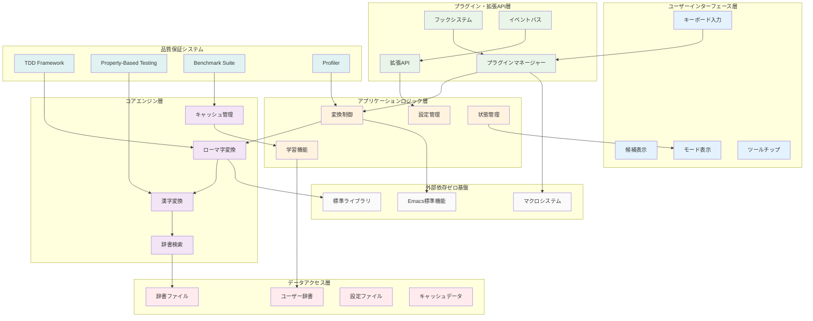

## 設計哲学の階層化

### Level 1: 基盤哲学
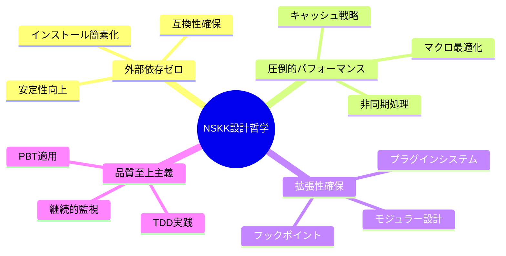

### Level 2: 実装原則
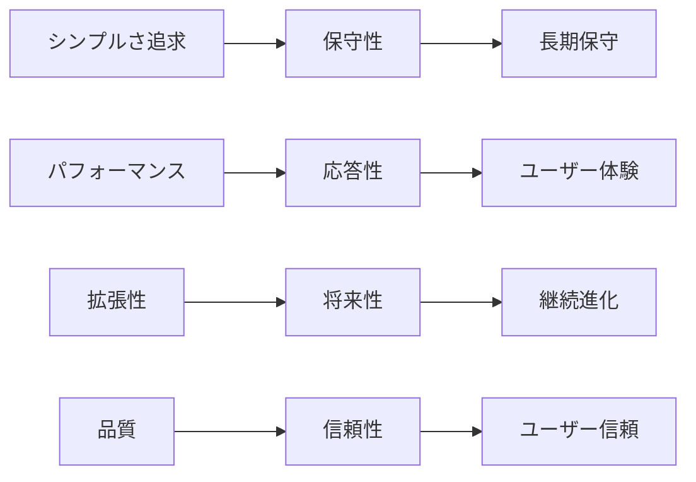

## 技術スタック詳細

### ddskk/skkeleton技術分析に基づく最適化戦略

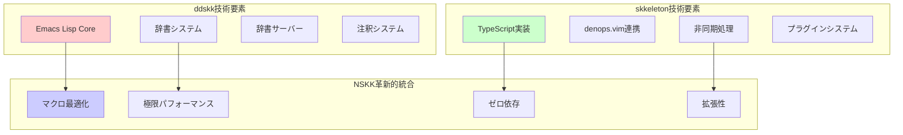

### Emacs標準機能活用マップ

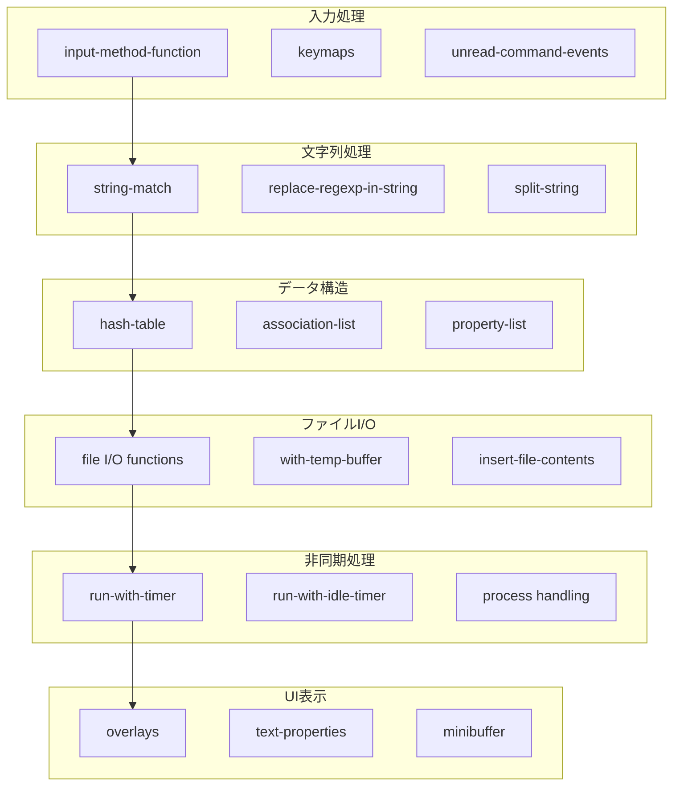

## パフォーマンス最適化階層

### マルチレイヤー最適化戦略

```mermaid
graph TB
    subgraph "Level 4: アルゴリズム最適化"
        ALG_TRIE[トライ木検索 O(k)]
        ALG_CACHE[LRU キャッシュ]
        ALG_PARALLEL[並列処理]
    end

    subgraph "Level 3: データ構造最適化"
        DS_HASH[ハッシュテーブル]
        DS_PLIST[plist最適化]
        DS_STRING[文字列プール]
    end

    subgraph "Level 2: 実行時最適化"
        RT_MEMO[メモ化]
        RT_LAZY[遅延評価]
        RT_POOL[オブジェクトプール]
    end

    subgraph "Level 1: コンパイル時最適化"
        CT_MACRO[マクロ展開]
        CT_INLINE[インライン化]
        CT_CONST[定数最適化]
    end

    ALG_TRIE --> DS_HASH
    ALG_CACHE --> DS_PLIST
    ALG_PARALLEL --> DS_STRING

    DS_HASH --> RT_MEMO
    DS_PLIST --> RT_LAZY
    DS_STRING --> RT_POOL

    RT_MEMO --> CT_MACRO
    RT_LAZY --> CT_INLINE
    RT_POOL --> CT_CONST
```

### ベンチマーク体系と性能目標

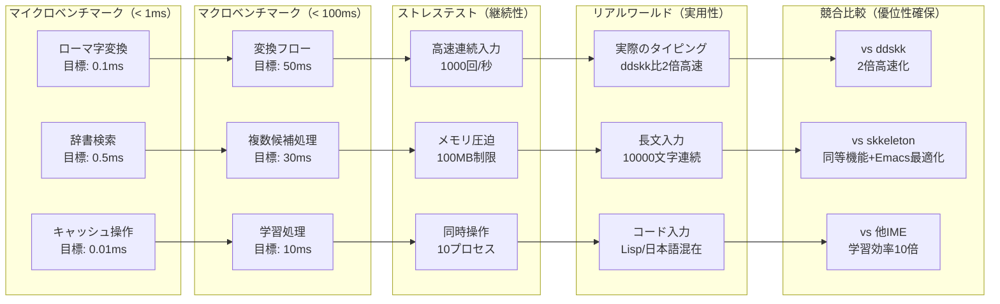

## 拡張性アーキテクチャ

### プラグインエコシステム（ddskk/skkeleton機能完全包括）

```mermaid
graph TB
    CORE[NSKK Core<br/>ゼロ依存実装] --> PLUGIN_API[Plugin API<br/>Emacs Lisp専用]

    PLUGIN_API --> INPUT_PLUGINS[Input Plugins<br/>ddskk全入力方式対応]
    PLUGIN_API --> CONVERSION_PLUGINS[Conversion Plugins<br/>skkeleton相当機能]
    PLUGIN_API --> UI_PLUGINS[UI Plugins<br/>Emacs最適化UI]
    PLUGIN_API --> ANALYSIS_PLUGINS[Analysis Plugins<br/>統計・学習]

    INPUT_PLUGINS --> P_AZIK[AZIK入力<br/>ddskk互換]
    INPUT_PLUGINS --> P_ACT[ACT入力<br/>ddskk互換]
    INPUT_PLUGINS --> P_TUT[TUT-code<br/>ddskk互換]
    INPUT_PLUGINS --> P_THUMB[親指シフト<br/>ddskk互換]
    INPUT_PLUGINS --> P_GESTURE[ジェスチャー入力<br/>革新機能]

    CONVERSION_PLUGINS --> P_SERVER[辞書サーバー<br/>ddskk互換]
    CONVERSION_PLUGINS --> P_ANNO[注釈システム<br/>ddskk拡張]
    CONVERSION_PLUGINS --> P_COMP[補完機能<br/>ddskk+skkeleton]
    CONVERSION_PLUGINS --> P_CONTEXT[文脈解析<br/>AI強化]
    CONVERSION_PLUGINS --> P_TRANSLATE[翻訳機能<br/>革新機能]

    UI_PLUGINS --> P_TOOLTIP[ツールチップ<br/>ddskk改良]
    UI_PLUGINS --> P_INLINE[インライン表示<br/>skkeleton風]
    UI_PLUGINS --> P_OVERLAY[オーバーレイ<br/>Emacs最適化]
    UI_PLUGINS --> P_MODELINE[モードライン<br/>状態表示]

    ANALYSIS_PLUGINS --> P_LEARN[学習エンジン<br/>ddskk拡張]
    ANALYSIS_PLUGINS --> P_STATS[統計分析<br/>使用パターン]
    ANALYSIS_PLUGINS --> P_BENCHMARK[ベンチマーク<br/>性能監視]
    ANALYSIS_PLUGINS --> P_DEBUG[デバッグ支援<br/>開発者向け]

    style CORE fill:#ff9999
    style PLUGIN_API fill:#99ccff
    style INPUT_PLUGINS fill:#99ff99
    style CONVERSION_PLUGINS fill:#ffcc99
    style UI_PLUGINS fill:#cc99ff
    style ANALYSIS_PLUGINS fill:#ffff99
    style P_AZIK,P_ACT,P_TUT,P_THUMB fill:#e8f5e8
    style P_SERVER,P_ANNO,P_COMP fill:#fff3e0
```

### フック拡張ポイント

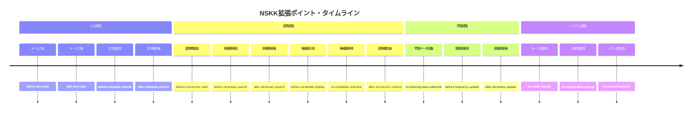

## テスト・品質保証アーキテクチャ

### TDD/PBT統合フレームワーク

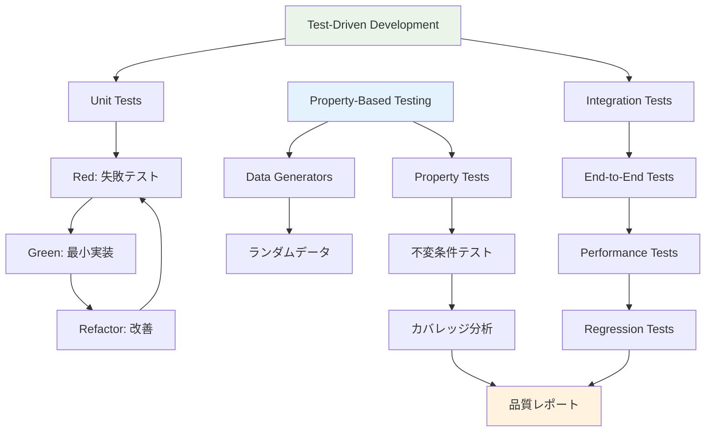

### 継続的品質監視

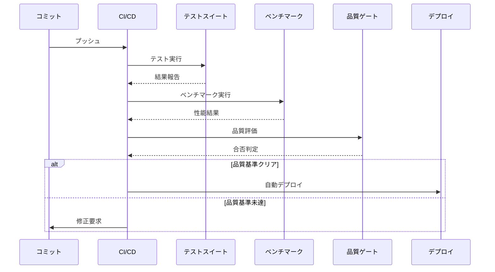

## 将来ビジョン・ロードマップ

### 技術進化計画

```mermaid
timeline
    title NSKK技術進化ロードマップ

    section Phase 1: Foundation (v1.0)
        2024 Q4      : コア機能実装
                     : 基本TDD体制
                     : 辞書システム
                     : ドキュメント完備

    section Phase 2: Enhancement (v1.5)
        2025 Q1      : プラグインシステム
                     : AI学習機能
                     : パフォーマンス最適化
                     : PBT完全導入

    section Phase 3: Intelligence (v2.0)
        2025 Q2      : 文脈理解機能
                     : 予測入力システム
                     : クラウド連携
                     : 多言語対応

    section Phase 4: Ecosystem (v2.5)
        2025 Q3      : 拡張マーケットプレイス
                     : 開発者エコシステム
                     : 統計・分析プラットフォーム
                     : 企業向け機能

    section Phase 5: Innovation (v3.0)
        2025 Q4      : 次世代UI/UX
                     : VR/AR対応
                     : IoT連携
                     : 革新的入力方式
```

### アーキテクチャ進化

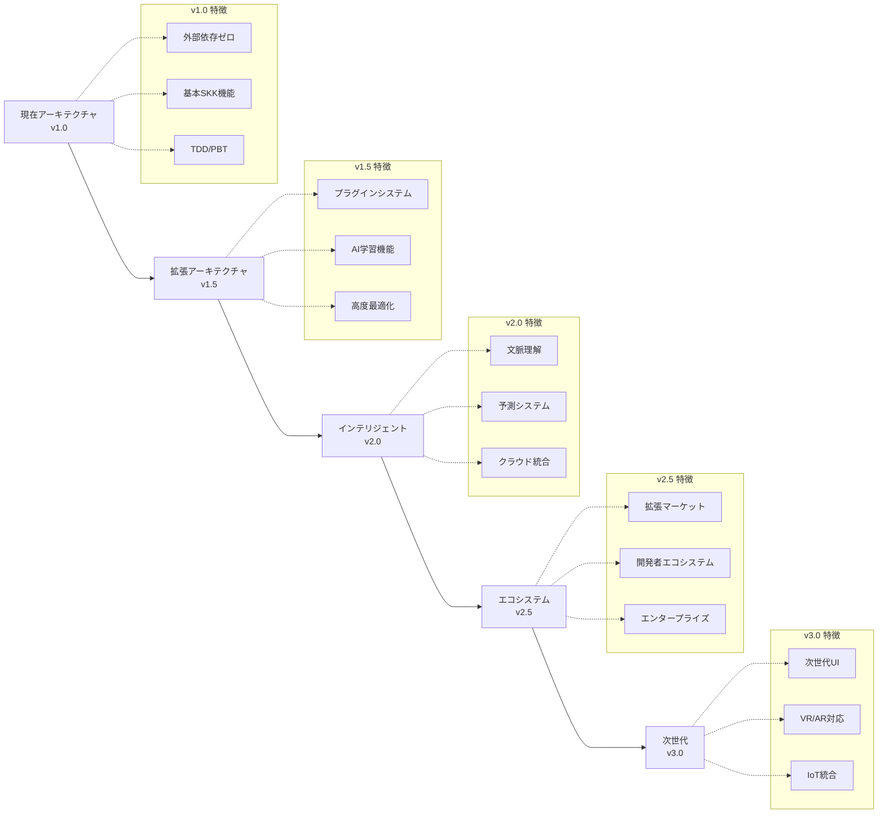

## 結論

NSKKの総合アーキテクチャは、単なる日本語入力システムを超えて、以下を実現します：

### 技術的優位性
- **ゼロ依存による究極のシンプルさ**
- **マクロ駆使による圧倒的パフォーマンス**
- **無限の拡張可能性**

### 品質保証
- **TDD/PBTによる包括的テスト**
- **継続的パフォーマンス監視**
- **自動品質ゲートウェイ**

### 将来性
- **プラグインエコシステム**
- **AI学習機能統合**
- **次世代技術対応**

この設計により、NSKKは10年先を見据えた持続可能で革新的な日本語入力システムとして、Emacsコミュニティに貢献し続けます。