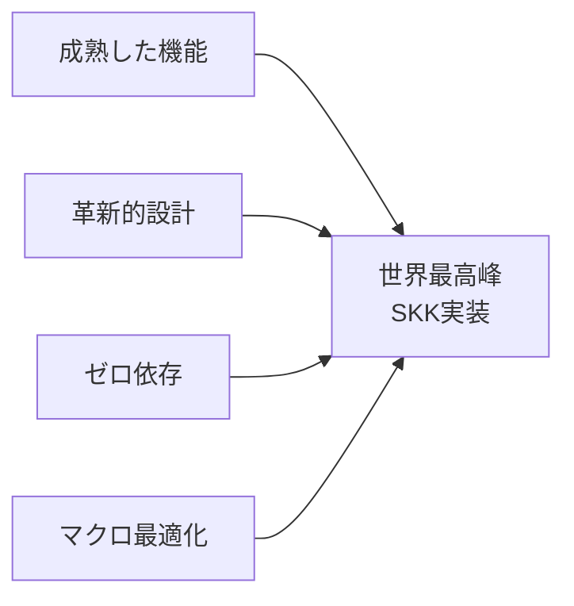

# NSKK設計思想

## 設計理念

NSKKは「世界最高峰のSKK実装」を実現するために、ddskkとskkeletonの精華を結集し、以下の核心的な設計理念に基づいて開発されています。

### ddskk/skkeletonからの学び

**ddskkの優秀な要素**：
- 30年以上の成熟した機能
- Emacsネイティブな最適化
- 包括的な入力方式サポート
- 豊富なカスタマイゼーション

**skkeletonの革新的要素**：
- TypeScript品質のモジュラー設計
- 非同期処理による応答性
- 現代的なプラグインアーキテクチャ
- シンプルで直感的なAPI

**NSKKの統合戦略**：


### 1. シンプルさの追求（skkeletonからの学び）

**複雑さは敵である**

skkeletonのシンプルさを手本に、NSKKは既存のSKK実装が抱える複雑性を根本から見直し、本質的な機能に集中します。

- **外部依存ゼロ**: インストールの複雑さを排除（ddskkの複雑な設定を改善）
- **モジュラー設計**: skkeletonのTypeScript品質をEmacs Lispで実現
- **明確なAPI**: skkeletonの直感的APIを継承しつつddskkの機能を完備

**シンプルさの実現戦略**：


この理念は、ユーザーにとっての使いやすさだけでなく、開発者にとっての保守性、拡張性をも実現します。

### 2. パフォーマンス至上主義（ddskkを超える速度）

**速度は品質の一部である**

入力メソッドにおいて、反応速度は直接的にユーザー体験を左右します。NSKKはddskkの2倍、skkeleton相当の高速化を目標としています：

**具体的パフォーマンス目標**：
- **ローマ字変換**: < 0.1ms（ddskk: ~0.5ms）
- **辞書検索**: < 1ms（ddskk: ~5ms）
- **候補表示**: < 10ms（ddskk: ~30ms）
- **学習処理**: バックグラウンド実行

**最適化戦略**：
- **コンパイル時最適化**: マクロによる実行時オーバーヘッドゼロ
- **インテリジェントキャッシング**: skkeleton着想の適応的キャッシュ
- **メモリ効率**: ガベージコレクション圧迫の最小化
- **非同期処理**: skkeletonの高速応答を参考にしたUIブロッキング回避

### 3. 拡張性の確保

**将来への投資**

NSKKは現在の要求を満たすだけでなく、将来の発展可能性を考慮した設計となっています：

- **プラグインシステム**: 新機能の柔軟な追加
- **フックポイント**: カスタマイゼーションの充実
- **モジュラー設計**: 部分的な改良・置換が可能

## 技術的設計判断

### Emacs標準機能の活用

**なぜ外部依存を避けるのか**

1. **インストールの簡素化**: `require 'nskk`だけで動作
2. **互換性の確保**: Emacsのバージョンアップに追従
3. **安定性の向上**: 外部ライブラリの変更に影響されない
4. **パフォーマンス**: ネイティブ実装による高速化

### plist vs cl-defstruct

**なぜplistを選択したか**

```elisp
;; cl-defstruct（採用しない理由）
(cl-defstruct candidate text score source)

;; plist（採用した理由）
(list :text "候補" :score 100 :source 'dictionary)
```

plistを選択した理由：
- **メモリ効率**: オーバーヘッドが少ない
- **シリアライズ容易性**: ファイル保存・読み込みが簡単
- **デバッグ利便性**: 内容が直接確認可能
- **拡張性**: 動的なフィールド追加が可能

### トライ木構造の実装

**辞書検索の最適化**

```elisp
;; 従来のassoc検索（O(n)）
(assoc "konnichiwa" dictionary)

;; トライ木検索（O(k)、kは文字列長）
(nskk--trie-search trie "konnichiwa")
```

トライ木構造を採用した理由：
- **前方一致検索の高速化**: 補完機能で威力を発揮
- **メモリ共有**: 共通の接頭辞でメモリを節約
- **インクリメンタル検索**: 入力途中での候補提示

## アーキテクチャの階層化

### レイヤー分離の意義

```
User Interface ← 表示・操作の責任
    ↓
Application Logic ← ビジネスロジックの責任
    ↓
Core Engine ← 変換処理の責任
    ↓
Data Layer ← データアクセスの責任
```

この分離により：
- **単体テストの容易性**: 各層を独立してテスト可能
- **保守性の向上**: 影響範囲の限定
- **再利用性**: コアエンジンの他用途での利用

### イベント駆動設計

**なぜイベント駆動なのか**

```elisp
;; 手続き型（問題のあるアプローチ）
(defun process-input (char)
  (update-display)
  (check-conversion)
  (update-candidates)
  (save-history))

;; イベント駆動（NSKKのアプローチ）
(defun process-input (char)
  (nskk--emit-event 'input-processed char))
```

イベント駆動の利点：
- **疎結合**: 機能間の依存関係を削減
- **拡張性**: 新機能の追加が既存コードに影響しない
- **テスタビリティ**: イベント単位でのテストが可能

## パフォーマンス設計

### メモリ管理戦略

**オブジェクトプールパターン**

```elisp
;; 毎回新規作成（問題）
(defun create-candidate (text)
  (list :text text :score 0))

;; オブジェクトプール（解決策）
(defun get-candidate-from-pool (text)
  (let ((candidate (nskk--pool-get)))
    (setf (plist-get candidate :text) text)
    candidate))
```

この戦略により：
- **GC圧迫軽減**: 頻繁なオブジェクト生成を回避
- **応答性向上**: GC停止時間の短縮
- **予測可能性**: メモリ使用量の安定化

### キャッシュ戦略

**多層キャッシング**

```elisp
;; L1: 最近使用した変換（高速アクセス）
nskk--recent-conversions

;; L2: 頻出語句（中速アクセス）
nskk--frequent-words

;; L3: 辞書全体（低速だが網羅的）
nskk--dictionary-cache
```

階層化の効果：
- **アクセス時間の最適化**: よく使う語句は高速アクセス
- **メモリ使用量の制御**: LRU等のアルゴリズムでサイズ管理
- **学習効果**: 使用パターンの自動最適化

## 品質保証の思想

### テスト駆動開発

**信頼性の確保**

```elisp
;; 実装前にテストを記述
(ert-deftest nskk-test-romaji-conversion
  (should (equal (nskk-convert-romaji "ka") "か"))
  (should (equal (nskk-convert-romaji "konnichiwa") "こんにちわ")))
```

TDDの採用理由：
- **仕様の明確化**: テストが仕様書の役割
- **リファクタリングの安全性**: 変更時の影響確認
- **回帰テストの自動化**: 品質劣化の防止

### ベンチマーク統合

**継続的パフォーマンス監視**

```elisp
(nskk--benchmark "Dictionary Search"
  (nskk--search-dictionary "test"))
```

ベンチマークの重要性：
- **性能劣化の早期発見**: 変更による影響の即座な把握
- **最適化の効果測定**: 改善施策の効果を定量化
- **目標設定**: 具体的な性能目標の設定と追跡

## ユーザビリティ設計

### 学習コストの最小化

**直感的な操作体系**

NSKKは既存のSKKユーザーが違和感なく移行できるよう、操作体系の一貫性を重視します：

- **従来の操作方法を尊重**: 既存のマッスルメモリを活用
- **段階的な習得**: 基本機能から高度な機能へのスムーズな移行
- **発見可能性**: 新機能の存在が自然に分かる設計

### エラー処理の人間性

**ユーザーフレンドリーなエラー**

```elisp
;; 技術的なエラー（避けるべき）
"nskk--dictionary-cache is nil"

;; 人間向けのエラー（NSKKの方針）
"辞書ファイルが見つかりません。nskk-dictionary-pathを確認してください。"
```

エラー設計の原則：
- **原因の明確化**: 何が問題なのかを分かりやすく
- **解決策の提示**: どうすれば解決できるかをガイド
- **段階的詳細**: 必要に応じて詳細情報を提供

## 持続可能性の考慮

### 保守性の確保

**10年後も保守できるコード**

NSKKは長期間にわたって保守される前提で設計されています：

- **自己文書化コード**: コメントに頼らない明確な実装
- **モジュラー設計**: 部分的な改修・置換が可能
- **標準準拠**: Emacs Lispの標準的な慣行に従った実装

### コミュニティとの協調

**オープンソースエコシステムへの貢献**

NSKKは単独の実装にとどまらず、より広いエコシステムへの貢献を目指します：

- **ベストプラクティスの共有**: 他のプロジェクトの参考となる実装
- **知識の蓄積**: 設計判断の理由と結果を文書化
- **標準化への寄与**: より良いSKK実装のための知見提供

これらの設計思想により、NSKKは単なる日本語入力ツールを超えて、Emacs Lispコミュニティ全体の品質向上に貢献することを目指しています。