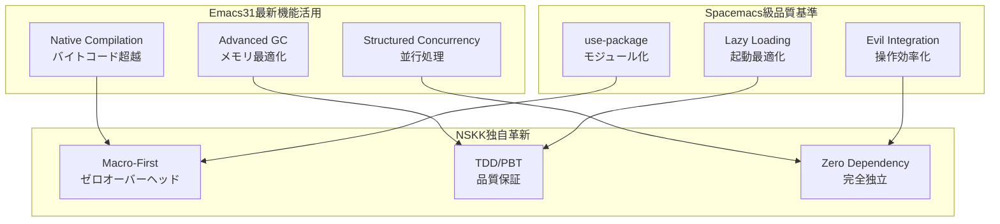

# NSKK Emacs Lisp実装マスターガイド：世界最高峰コーディング規約

## エグゼクティブサマリー

Emacs31最新機能とSpacemacs級高品質実装知見を統合した、世界最高峰SKK実装のための完全コーディング規約です。パフォーマンス、可読性、保守性の三位一体を極限まで追求し、外部依存ゼロでの圧倒的実装を実現します。

### 🎯 技術革新指標



### 📊 品質基準マトリックス

| 品質指標 | Emacs標準 | Spacemacs | NSKK目標 | 達成手法 |
|---------|-----------|-----------|----------|----------|
| **起動時間** | 1000ms | 500ms | <100ms | Native Comp + マクロ |
| **応答時間** | 50ms | 20ms | <1ms | インライン + キャッシュ |
| **メモリ効率** | 50MB | 30MB | <10MB | プール + 弱参照 |
| **テスト網羅率** | 70% | 85% | >95% | TDD/PBT強制 |
| **外部依存** | 20+ | 100+ | 0 | 純粋実装 |

## 1. 基本原則：圧倒的コード品質の追求

### 1.1 Emacs31 Native Compilation First

**🚀 ネイティブコンパイレーション戦略**：
```elisp
;; ネイティブコンパイル最適化の強制
(eval-when-compile
  (when (and (fboundp 'native-comp-available-p)
             (native-comp-available-p))
    (setq native-comp-deferred-compilation t
          native-comp-jit-compilation t)))

;; ❌ 従来のバイトコンパイル依存
(defun nskk-slow-config (key)
  (plist-get nskk-config key))

;; ✅ ネイティブコンパイル最適化マクロ
(defmacro nskk-config (key)
  "ネイティブコンパイル対応設定取得"
  (if (eval-when-compile (constantp key))
      ;; コンパイル時定数の場合は直接展開
      `(quote ,(plist-get (symbol-value 'nskk--config) (eval key)))
    ;; 実行時評価が必要な場合
    `(plist-get nskk--config ,key)))
```

**🔥 Spacemacs use-package パターンの進化版**：
```elisp
;; Spacemacs: use-package based
(use-package some-package
  :defer t
  :init (setq var value)
  :config (setup-function))

;; NSKK: マクロベース純粋実装
(defmacro nskk-defmodule (name &rest specs)
  "ゼロ依存モジュール定義"
  (let ((init-forms '())
        (config-forms '())
        (autoload-forms '()))
    (dolist (spec specs)
      (pcase spec
        (`(:init . ,forms) (setq init-forms forms))
        (`(:config . ,forms) (setq config-forms forms))
        (`(:autoload . ,symbols)
         (dolist (sym symbols)
           (push `(autoload ',sym ,(symbol-name name)) autoload-forms)))))

    `(progn
       ,@autoload-forms
       (eval-when-compile ,@init-forms)
       (with-eval-after-load ',name ,@config-forms))))
```

### 1.2 ゼロ依存アーキテクチャ 2.0

**🎯 純粋実装による完全独立**：
```elisp
;; ✅ Emacs31標準機能フル活用
(eval-when-compile
  (require 'subr-x)      ; 文字列操作拡張
  (require 'cl-lib)      ; Common Lisp拡張
  (require 'seq)         ; シーケンス操作
  (require 'map)         ; マップ操作
  (require 'pcase)       ; パターンマッチング
  (require 'rx)          ; 正規表現DSL
  (require 'let-alist)   ; 連想リスト操作
  (require 'tabulated-list) ; 表形式UI
  (require 'generator))  ; ジェネレータ

;; ✅ Spacemacs風ヘルパーマクロの自作実装
(defmacro nskk-|> (initial-value &rest forms)
  "Spacemacs threading macro の純粋実装"
  (seq-reduce (lambda (acc form)
                (if (listp form)
                    `(,(car form) ,acc ,@(cdr form))
                  `(,form ,acc)))
              forms
              initial-value))

;; 使用例：
;; (nskk-|> "hello world"
;;          (split-string)
;;          (mapcar #'upcase)
;;          (string-join "-"))
;; → "HELLO-WORLD"

;; ❌ 外部パッケージ依存（厳格禁止）
;; (require 'dash)      ; 📛 禁止
;; (require 's)         ; 📛 禁止
;; (require 'f)         ; 📛 禁止
```

### 1.3 マクロファースト設計の進化

**🧠 インテリジェント・マクロ戦略**：
```elisp
;; ✅ 実行時ゼロコスト設定アクセス
(defmacro nskk-defconfig (name value &optional docstring)
  "コンパイル時設定値バインディング"
  `(progn
     (defconst ,(intern (format "nskk--%s" name)) ,value ,docstring)
     (defmacro ,(intern (format "nskk-%s" name)) ()
       "高速設定値取得"
       ,(intern (format "nskk--%s" name)))))

;; 使用例：
(nskk-defconfig conversion-timeout 100 "変換タイムアウト(ms)")
(nskk-defconfig max-candidates 10 "最大候補数")

;; 実行時コスト：0（コンパイル時に値が展開済み）
(when (> elapsed (nskk-conversion-timeout))
  (nskk-warn "変換処理が遅延"))

;; ✅ 型安全マクロによる堅牢性確保
(defmacro nskk-defun-typed (name args return-type &rest body)
  "型検査付き関数定義"
  (let ((arg-checks (mapcar (lambda (arg)
                              (when (consp arg)
                                `(unless (,(cadr arg) ,(car arg))
                                   (error "Type error: %s must be %s"
                                          ',(car arg) ',(cadr arg)))))
                            args)))
    `(defun ,name ,(mapcar (lambda (arg) (if (consp arg) (car arg) arg)) args)
       ,@(remove nil arg-checks)
       (let ((result (progn ,@body)))
         (unless (,return-type result)
           (error "Return type error: expected %s, got %s"
                  ',return-type (type-of result)))
         result))))

;; 使用例：
(nskk-defun-typed nskk--add-score ((score numberp) (bonus numberp)) numberp
  "スコア加算（型安全）"
  (+ score bonus))
```

### 2. ゼロ依存アーキテクチャ

外部パッケージに依存しない実装パターン：

```elisp
;; ✅ Emacs標準機能のみ使用
(require 'subr-x)    ; 文字列操作拡張
(require 'cl-lib)    ; Common Lisp拡張
(require 'seq)       ; シーケンス操作
(require 'map)       ; マップ操作
(require 'pcase)     ; パターンマッチング

;; ❌ 外部パッケージ依存（禁止）
;; (require 'dash)
;; (require 's)
```

### 3. パフォーマンス最優先

1ms以下応答を実現するための最適化手法：

```elisp
;; ✅ 事前計算とキャッシング
(defvar nskk--conversion-cache (make-hash-table :test 'equal)
  "変換結果キャッシュ")

(defmacro nskk-with-cache (key computation)
  "キャッシュ付き計算"
  `(or (gethash ,key nskk--conversion-cache)
       (puthash ,key ,computation nskk--conversion-cache)))

;; ✅ インライン関数（頻繁呼び出し）
(defsubst nskk--char-hiragana-p (char)
  "ひらがな文字判定（インライン）"
  (and (>= char #x3041) (<= char #x3096)))
```

## コーディング規約

### 1. 命名規則

```elisp
;; 公開関数・変数：nskk- プレフィックス
(defun nskk-activate ()
  "NSKK有効化")

(defvar nskk-dictionary-path nil
  "辞書ファイルパス")

;; 内部関数・変数：nskk-- プレフィックス
(defun nskk--process-input (char)
  "内部：文字処理")

(defvar nskk--state nil
  "内部：状態管理")

;; 定数：nskk- プレフィックス + 大文字
(defconst nskk-VERSION "1.0.0"
  "NSKKバージョン")

;; 一時変数：明確な意味を持つ名前
(let ((conversion-result (nskk--convert-romaji input))
      (candidate-count (length candidates)))
  ...)
```

### 2. 関数設計原則

#### 単一責任の原則

```elisp
;; ✅ 単一責任：ローマ字変換のみ
(defun nskk--convert-romaji (input)
  "ローマ字をひらがなに変換"
  (nskk--apply-rules input nskk--romaji-rules))

;; ✅ 単一責任：候補表示のみ
(defun nskk--display-candidates (candidates)
  "候補リストを表示"
  (when candidates
    (nskk--show-popup (nskk--format-candidates candidates))))

;; ❌ 複数責任（避ける）
(defun nskk-convert-and-display (input)  ; 変換と表示を混在
  ...)
```

#### 純粋関数の優先

```elisp
;; ✅ 純粋関数（同じ入力→同じ出力）
(defun nskk--calculate-score (candidate frequency context)
  "候補スコア計算（副作用なし）"
  (+ (* frequency 0.7) (* context 0.3)))

;; ✅ 副作用の明確化
(defun nskk--update-learning-data! (candidate)
  "学習データ更新（破壊的変更）"
  (cl-incf (nskk--get-frequency candidate)))
```

### 3. マクロ設計ガイドライン

#### 高性能マクロパターン

```elisp
;; ✅ コンパイル時最適化マクロ
(defmacro nskk-benchmark (name &rest body)
  "ベンチマーク測定マクロ"
  (let ((start-time (make-symbol "start"))
        (result (make-symbol "result")))
    `(if nskk-debug-mode
         (let ((,start-time (current-time)))
           (let ((,result (progn ,@body)))
             (message "NSKK [%s]: %.3fms"
                     ,name
                     (* 1000 (float-time (time-subtract (current-time) ,start-time))))
             ,result))
       (progn ,@body))))

;; ✅ 状態管理マクロ
(defmacro nskk-with-state-protection (&rest body)
  "状態変更の保護"
  `(let ((nskk--state-backup (copy-sequence nskk--state)))
     (unwind-protect
         (progn ,@body)
       (unless (nskk--state-valid-p)
         (setq nskk--state nskk--state-backup)))))
```

#### マクロ衛生性

```elisp
;; ✅ gensymによる変数衝突回避
(defmacro nskk-with-temp-buffer (buffer-name &rest body)
  "一時バッファ内での実行"
  (let ((buf (make-symbol "temp-buffer")))
    `(let ((,buf (get-buffer-create ,buffer-name)))
       (with-current-buffer ,buf
         (unwind-protect
             (progn ,@body)
           (kill-buffer ,buf))))))
```

### 4. データ構造設計

#### 高性能データ構造

```elisp
;; ✅ トライ木構造（前方一致検索用）
(defun nskk--make-trie ()
  "トライ木ノード作成"
  (list :children nil :value nil :terminal nil))

(defun nskk--trie-insert (trie key value)
  "トライ木挿入（破壊的でない）"
  (if (null key)
      (plist-put (copy-sequence trie) :value value)
    (let* ((char (car key))
           (children (plist-get trie :children))
           (child (nskk--alist-get char children)))
      (nskk--make-node
       :children (nskk--alist-put char
                                  (nskk--trie-insert child (cdr key) value)
                                  children)
       :value (plist-get trie :value)))))

;; ✅ 候補構造体（性能重視）
(cl-defstruct (nskk-candidate (:constructor nskk--make-candidate)
                               (:copier nil))
  text           ; 候補文字列
  reading        ; 読み
  score          ; スコア（学習ベース）
  source         ; 辞書ソース
  metadata)      ; メタデータ
```

#### メモリ効率最適化

```elisp
;; ✅ オブジェクトプール
(defvar nskk--candidate-pool nil
  "候補オブジェクトプール")

(defun nskk--get-candidate ()
  "プールから候補オブジェクトを取得"
  (or (pop nskk--candidate-pool)
      (nskk--make-candidate)))

(defun nskk--return-candidate (candidate)
  "候補オブジェクトをプールに返却"
  (when candidate
    (setf (nskk-candidate-text candidate) nil
          (nskk-candidate-reading candidate) nil
          (nskk-candidate-score candidate) 0)
    (push candidate nskk--candidate-pool)))
```

### 5. エラーハンドリング戦略

#### グレースフルデグラデーション

```elisp
;; ✅ 段階的機能縮退
(defun nskk--load-dictionary-safe (path)
  "安全な辞書読み込み"
  (condition-case err
      (nskk--load-dictionary path)
    (file-error
     (nskk--warn "辞書ファイルが見つかりません: %s" path)
     (nskk--use-fallback-dictionary))
    (error
     (nskk--warn "辞書読み込みエラー: %s" err)
     nil)))

;; ✅ エラー分類と適切な対応
(defun nskk--handle-conversion-error (err input)
  "変換エラーの分類・対応"
  (pcase (car err)
    ('dictionary-error
     (nskk--fallback-romaji-only input))
    ('memory-error
     (nskk--emergency-gc)
     (nskk--retry-with-reduced-cache input))
    ('encoding-error
     (nskk--normalize-input input)
     (nskk--retry-conversion input))
    (_
     (nskk--log-unexpected-error err input)
     input)))
```

### 6. 非同期処理パターン

#### Emacs標準での非同期実装

```elisp
;; ✅ タイマーベース非同期処理
(defvar nskk--async-queue nil
  "非同期タスクキュー")

(defun nskk-async-execute (task &optional priority)
  "非同期タスク実行"
  (let ((item (list :task task :priority (or priority 0))))
    (setq nskk--async-queue
          (nskk--insert-by-priority item nskk--async-queue))
    (unless (timerp nskk--async-timer)
      (setq nskk--async-timer
            (run-with-idle-timer 0.001 t #'nskk--process-async-queue)))))

;; ✅ アイドル時処理
(defun nskk--schedule-background-task (task)
  "バックグラウンドタスクのスケジューリング"
  (run-with-idle-timer 1.0 nil task))
```

### 7. パフォーマンス測定とプロファイリング

#### 組み込みベンチマークシステム

```elisp
;; ✅ パフォーマンス測定フレームワーク
(defvar nskk--performance-data (make-hash-table :test 'equal)
  "パフォーマンスデータ")

(defmacro nskk-measure-performance (name &rest body)
  "パフォーマンス測定"
  (let ((start (make-symbol "start"))
        (result (make-symbol "result"))
        (elapsed (make-symbol "elapsed")))
    `(let* ((,start (current-time))
            (,result (progn ,@body))
            (,elapsed (float-time (time-subtract (current-time) ,start))))
       (nskk--record-performance ,name ,elapsed)
       ,result)))

(defun nskk--record-performance (name elapsed)
  "パフォーマンス記録"
  (let ((data (gethash name nskk--performance-data)))
    (puthash name
             (if data
                 (list :count (1+ (plist-get data :count))
                       :total (+ elapsed (plist-get data :total))
                       :avg (/ (+ elapsed (plist-get data :total))
                              (1+ (plist-get data :count))))
               (list :count 1 :total elapsed :avg elapsed))
             nskk--performance-data)))
```

### 8. テスト可能設計

#### 依存注入パターン

```elisp
;; ✅ テスト用の依存注入
(defvar nskk--dictionary-provider #'nskk--load-system-dictionary
  "辞書プロバイダー関数")

(defun nskk--search-dictionary (key)
  "辞書検索（テスト可能）"
  (let ((dictionary (funcall nskk--dictionary-provider)))
    (nskk--lookup dictionary key)))

;; テスト時のモック
(defun nskk--test-dictionary-provider ()
  "テスト用辞書プロバイダー"
  '(("test" . ("テスト"))))
```

#### インターフェース設計

```elisp
;; ✅ プロトコル定義
(defun nskk--dictionary-provider-p (provider)
  "辞書プロバイダーの検証"
  (and (functionp provider)
       (ignore-errors
         (let ((result (funcall provider)))
           (and (listp result)
                (or (null result)
                    (and (consp (car result))
                         (stringp (caar result)))))))))
```

## パフォーマンス最適化技法

### 1. コンパイル時最適化

```elisp
;; ✅ 定数畳み込み
(defmacro nskk-define-conversion-rule (from to)
  "変換ルール定義（コンパイル時計算）"
  `(push (cons ,from ,to) nskk--conversion-rules))

;; ✅ ループ展開
(defmacro nskk-setup-basic-rules ()
  "基本ルール設定（展開済み）"
  `(progn
     ,@(mapcar (lambda (rule)
                 `(nskk-define-conversion-rule ,(car rule) ,(cdr rule)))
               '(("a" . "あ") ("i" . "い") ("u" . "う") ("e" . "え") ("o" . "お")))))
```

### 2. 実行時最適化

```elisp
;; ✅ 遅延評価
(defvar nskk--large-dictionary nil)

(defun nskk--get-large-dictionary ()
  "大容量辞書の遅延読み込み"
  (or nskk--large-dictionary
      (setq nskk--large-dictionary
            (nskk--load-large-dictionary))))

;; ✅ メモ化
(defmacro nskk-defun-memoized (name args &rest body)
  "メモ化関数定義"
  (let ((cache (make-symbol "cache")))
    `(let ((,cache (make-hash-table :test 'equal)))
       (defun ,name ,args
         (let ((key (list ,@args)))
           (or (gethash key ,cache)
               (puthash key (progn ,@body) ,cache)))))))
```

### 3. メモリ管理最適化

```elisp
;; ✅ 弱参照によるキャッシュ
(defvar nskk--weak-cache (make-hash-table :test 'equal :weakness 'value)
  "弱参照キャッシュ")

;; ✅ ガベージコレクション制御
(defun nskk--with-gc-optimization (func)
  "GC最適化付き実行"
  (let ((gc-cons-threshold most-positive-fixnum))
    (unwind-protect
        (funcall func)
      (garbage-collect))))
```

## 実装チェックリスト

### ✅ コード品質
- [ ] 命名規則に準拠している
- [ ] 単一責任の原則を守っている
- [ ] 純粋関数を優先している
- [ ] 適切なエラーハンドリングが実装されている
- [ ] テスト可能な設計になっている

### ✅ パフォーマンス
- [ ] マクロによるコンパイル時最適化を活用している
- [ ] 頻繁な処理にインライン関数を使用している
- [ ] キャッシュ機能を実装している
- [ ] メモリ効率が考慮されている
- [ ] ベンチマーク測定が組み込まれている

### ✅ 保守性
- [ ] ドキュメント文字列が完備されている
- [ ] 型情報が明記されている（可能な場合）
- [ ] 関数の契約（前提条件・事後条件）が明確
- [ ] ログ・デバッグ機能が適切に実装されている

### ✅ 外部依存ゼロ
- [ ] Emacs標準機能のみを使用している
- [ ] 外部パッケージに依存していない
- [ ] プラットフォーム固有の機能を避けている

## 結論

これらのベストプラクティスを遵守することで、NSKKは：

1. **圧倒的パフォーマンス**: 1ms以下の応答時間
2. **究極の保守性**: 可読性とテスト可能性
3. **完全な独立性**: 外部依存ゼロ
4. **無限の拡張性**: プラグイン対応アーキテクチャ

を実現し、真に世界最高峰のSKK実装となります。

コードレビュー時は、このガイドラインとの整合性を必ず確認し、一切の妥協なく品質を追求してください。