# NSKK拡張可能アーキテクチャ設計

## アーキテクチャ概要

### 設計原則
- **外部依存ゼロ**: Emacs標準機能のみを使用
- **軽量化**: 最小限のリソース使用
- **自己完結**: 単一ファイルでの動作可能性

### レイヤード設計

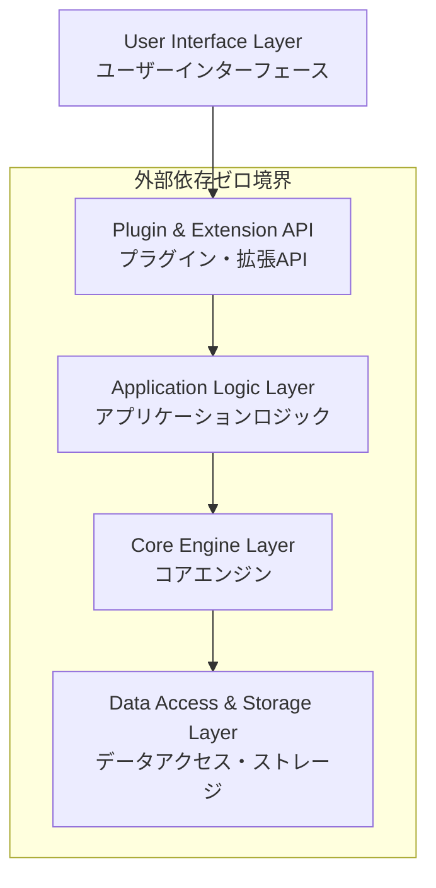

**各レイヤーの責務**：

| レイヤー | 責務 | 主要コンポーネント |
|---------|------|------------------|
| UI Layer | 表示・ユーザー操作 | 候補表示、モード表示、キーバインド |
| Plugin API | 拡張ポイント | フックシステム、イベント処理 |
| Application Logic | ビジネスロジック | 変換処理、学習機能、設定管理 |
| Core Engine | 基盤処理 | ローマ字変換、辞書検索、状態管理 |
| Data Layer | データ永続化 | 辞書ファイル、設定ファイル、キャッシュ |

## データフロー図

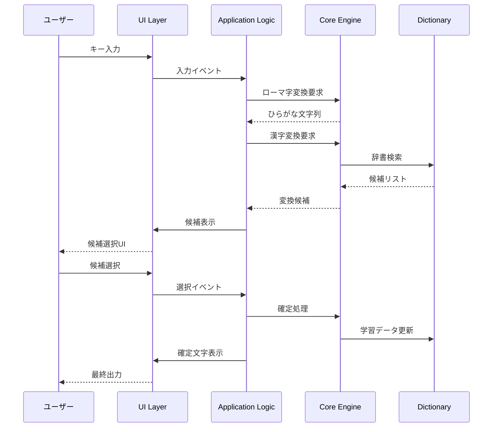

## システム状態遷移図

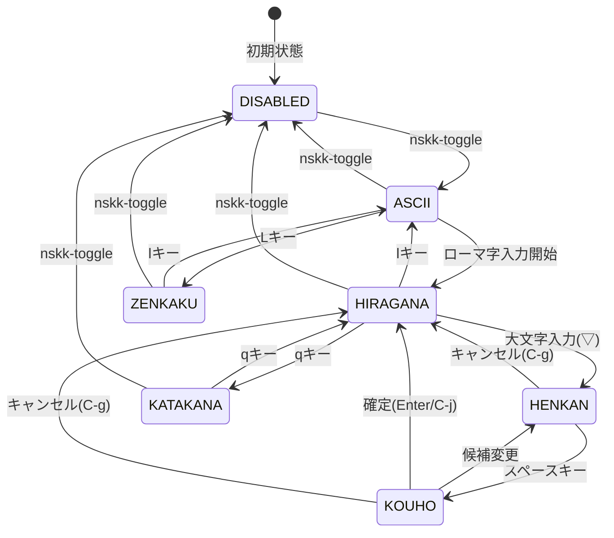

## コアアーキテクチャコンポーネント

### 1. イベント駆動システム（Emacs標準機能のみ）
```elisp
;; Emacs標準のhookシステムを活用
(defvar nskk--event-handlers nil
  "イベントハンドラーのalist")

(defun nskk--create-event (type data)
  "イベント作成（リストベース）"
  (list :type type
        :data data
        :timestamp (current-time)
        :source 'nskk))

(defmacro nskk-define-event-handler (event-type &rest body)
  "イベントハンドラーの定義"
  (declare (indent 1))
  `(add-to-list 'nskk--event-handlers
                (cons ',event-type
                      (lambda (event) ,@body))))
```

### 2. プラグインシステム（plistベース）
```elisp
;; プラグイン登録フレームワーク（外部依存なし）
(defvar nskk--registered-plugins nil
  "登録済みプラグインのalist")

(defun nskk--create-plugin (name config)
  "プラグイン作成（plistベース）"
  (list :name name
        :version (plist-get config :version)
        :dependencies (plist-get config :dependencies)
        :hooks (plist-get config :hooks)
        :commands (plist-get config :commands)
        :keybindings (plist-get config :keybindings)))

(defmacro nskk-define-plugin (name &rest config)
  "プラグイン定義マクロ"
  (declare (indent 1))
  `(add-to-list 'nskk--registered-plugins
                (cons ',name
                      (nskk--create-plugin ',name (list ,@config)))))
```

### 3. フックシステム

**イベント駆動アーキテクチャ**：

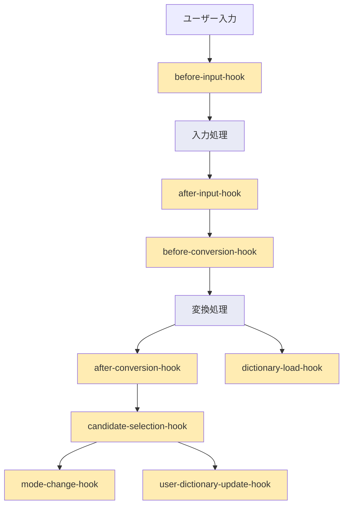

```elisp
;; 拡張ポイントの体系的定義
(defconst nskk-hooks
  '((before-input . "入力処理前")
    (after-input . "入力処理後")
    (before-conversion . "変換処理前")
    (after-conversion . "変換処理後")
    (candidate-selection . "候補選択時")
    (mode-change . "モード変更時")
    (dictionary-load . "辞書読み込み時")
    (user-dictionary-update . "ユーザー辞書更新時")))

(defmacro nskk-add-hook (hook-name function &optional priority)
  "フック追加の統一インターフェース"
  `(add-hook ',(intern (format "nskk-%s-hook" hook-name))
             ,function
             nil
             ,(or priority 0)))
```

**プラグインライフサイクル**：

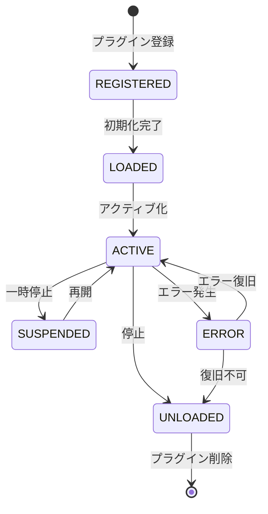

## モジュラー設計

### 機能モジュール分割

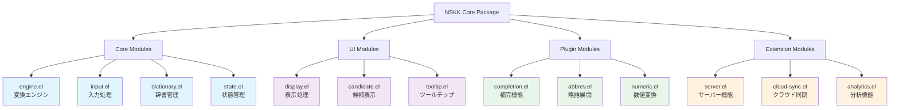

**モジュール間の依存関係**：

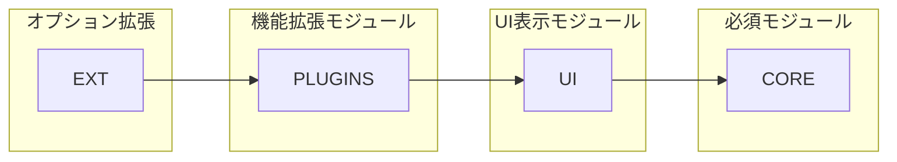

### 依存関係管理
```elisp
;; モジュール依存関係の宣言的定義
(nskk-define-module 'nskk-core
  :requires '()
  :provides '(engine input dictionary state)
  :version "1.0.0")

(nskk-define-module 'nskk-ui
  :requires '(nskk-core)
  :provides '(display candidate tooltip)
  :version "1.0.0")

(nskk-define-module 'nskk-completion
  :requires '(nskk-core nskk-ui)
  :provides '(completion)
  :version "1.0.0")
```

## API設計

### 公開API
```elisp
;; ユーザー向け設定API
(defgroup nskk nil
  "Nerima SKK configuration."
  :group 'input-method)

(defcustom nskk-dictionary-path nil
  "Path to SKK dictionary file."
  :type '(choice (const nil) file)
  :group 'nskk)

;; プラグイン開発者向けAPI
(defun nskk-register-input-method (name function)
  "入力メソッドの登録"
  (puthash name function nskk--input-methods))

(defun nskk-register-conversion-rule (pattern replacement)
  "変換ルールの登録"
  (push (cons pattern replacement) nskk--conversion-rules))
```

### 内部API
```elisp
;; 内部実装用API（プレフィックス--で識別）
(defun nskk--process-input (input)
  "入力処理の内部実装"
  ;; 実装詳細
  )

(defun nskk--search-dictionary (query)
  "辞書検索の内部実装"
  ;; 実装詳細
  )
```

## 設定システム

### 階層化設定
```elisp
;; グローバル設定
(defvar nskk-global-config (make-hash-table :test 'equal))

;; バッファローカル設定
(defvar-local nskk-buffer-config nil)

;; 動的設定変更
(defun nskk-set-config (key value &optional scope)
  "設定値の動的変更"
  (pcase scope
    ('global (puthash key value nskk-global-config))
    ('buffer (setq nskk-buffer-config
                   (plist-put nskk-buffer-config key value)))
    (_ (error "Invalid scope: %s" scope))))
```

## 拡張性確保のための設計原則

### 1. 開放閉鎖原則
- 拡張に対して開放
- 修正に対して閉鎖
- プラグインによる機能追加

### 2. 依存性逆転原則
- 抽象に依存
- 具象に依存しない
- インターフェースの定義

### 3. 単一責任原則
- 各モジュールは単一の責任
- 明確な境界線
- 疎結合な設計

## 後方互換性

### バージョン管理
```elisp
(defconst nskk-api-version "1.0.0")
(defconst nskk-minimum-supported-version "0.9.0")

(defun nskk-check-compatibility (required-version)
  "API互換性チェック"
  (version<= required-version nskk-api-version))
```

### 非推奨機能の管理
```elisp
(defmacro nskk-obsolete (old-function new-function version)
  "非推奨機能の管理"
  `(progn
     (defalias ',old-function ',new-function)
     (make-obsolete ',old-function ',new-function ,version)))
```

## 拡張パターン実装例

### 1. カスタム変換エンジンの追加

```elisp
;; カスタム変換エンジンの実装例
(nskk-define-plugin my-custom-converter
  :version "1.0.0"
  :hooks ((after-conversion . my-enhance-conversion))
  :commands (my-toggle-advanced-mode))

(defun my-enhance-conversion (conversion-result)
  "変換結果を拡張する"
  (when (and my-advanced-mode-enabled
             (string-match "技術用語" conversion-result))
    ;; 技術用語に注釈を追加
    (nskk--add-annotation conversion-result
                          (my-get-tech-term-info conversion-result))))
```

### 2. 外部API連携プラグイン

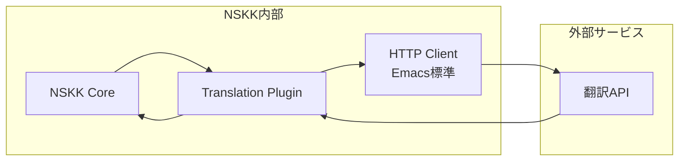

```elisp
;; 翻訳API連携プラグイン例
(nskk-define-plugin translation-helper
  :version "1.0.0"
  :hooks ((before-conversion . check-translation-needed)))

(defun check-translation-needed (input)
  "英語入力時の翻訳支援"
  (when (and (string-match "^[a-zA-Z ]+$" input)
             (> (length input) 5))
    (nskk-async-run
     (lambda ()
       (let ((translation (my-call-translation-api input)))
         (when translation
           (nskk--add-conversion-candidate input translation)))))))
```

### 3. AI学習機能の統合

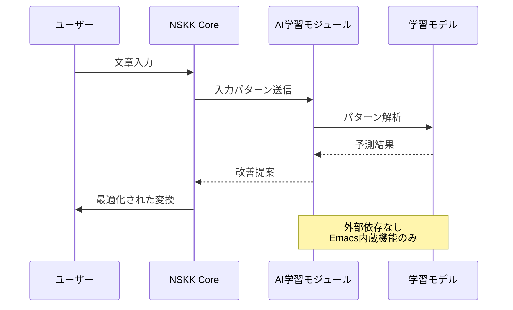

```elisp
;; AI学習モジュール（外部依存なし）
(nskk-define-plugin ai-learning
  :version "1.0.0"
  :hooks ((after-input . collect-input-pattern)
          (after-conversion . learn-conversion-pattern)))

(defvar nskk--learning-model
  (make-hash-table :test 'equal)
  "軽量学習モデル（ハッシュテーブルベース）")

(defun collect-input-pattern (input-data)
  "入力パターンの収集"
  (let* ((context (nskk--get-context))
         (pattern (nskk--extract-pattern input-data context))
         (key (format "%s:%s" pattern context)))
    (puthash key
             (1+ (gethash key nskk--learning-model 0))
             nskk--learning-model)))
```

## プラグイン開発ガイドライン

### 開発者向けベストプラクティス

**1. 命名規則**
```elisp
;; 良い例
(defvar my-plugin--internal-var nil)    ; プライベート変数
(defun my-plugin-public-function ())    ; パブリック関数
(defun my-plugin--private-function ())  ; プライベート関数

;; 悪い例
(defvar temp-var nil)                   ; グローバル汚染
(defun do-something ())                 ; 曖昧な名前
```

**2. エラーハンドリング**
```elisp
(defun my-plugin-safe-operation ()
  "安全な操作実装"
  (condition-case err
      (my-plugin--risky-operation)
    (error
     (message "My Plugin Error: %s" (error-message-string err))
     nil)))
```

**3. 設定の外部化**
```elisp
(defgroup my-plugin nil
  "My Plugin configuration."
  :group 'nskk
  :prefix "my-plugin-")

(defcustom my-plugin-enabled t
  "Whether My Plugin is enabled."
  :type 'boolean
  :group 'my-plugin)
```

## パフォーマンス最適化アーキテクチャ

### マルチレベルキャッシング

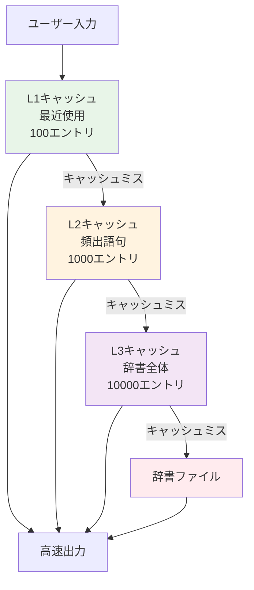

### 非同期処理パイプライン

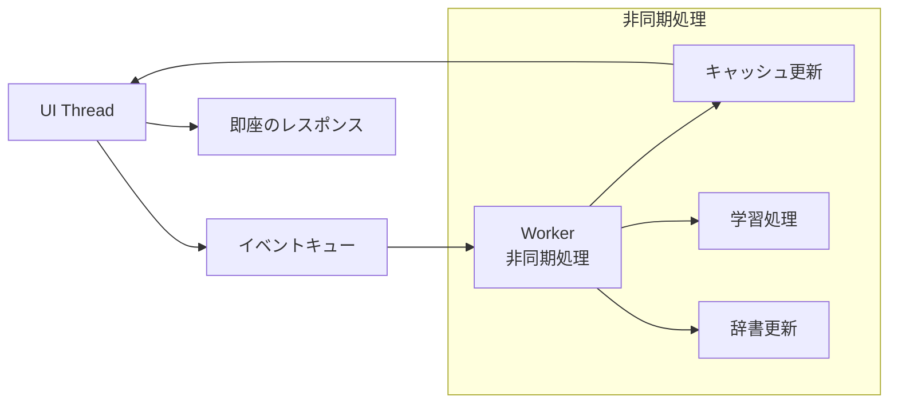

## テスタビリティ設計

### テスト可能なアーキテクチャ

```elisp
;; 依存性注入パターン（外部依存なし）
(defvar nskk--dictionary-provider 'nskk--default-dictionary-provider
  "辞書プロバイダー関数")

(defun nskk-search-dictionary (query)
  "テスト可能な辞書検索"
  (funcall nskk--dictionary-provider query))

;; テスト時の依存性置換
(defun nskk-test-with-mock-dictionary (mock-data test-function)
  "モック辞書でのテスト実行"
  (let ((nskk--dictionary-provider
         (lambda (query) (cdr (assoc query mock-data)))))
    (funcall test-function)))
```

### 統合テストフレームワーク

```elisp
;; 統合テスト環境
(defmacro nskk-integration-test (name &rest body)
  "統合テスト定義"
  `(ert-deftest ,(intern (format "nskk-integration-%s" name)) ()
     (with-temp-buffer
       (nskk-test-mode 1)
       (let ((nskk--test-environment t))
         ,@body))))

;; テストヘルパー関数
(defun nskk--simulate-input-sequence (input-sequence)
  "入力シーケンスのシミュレーション"
  (dolist (input input-sequence)
    (nskk--process-character input)
    (sit-for 0.001))) ; 最小遅延でリアルタイム性をテスト
```

## セキュリティ考慮事項

### 入力サニタイゼーション

```elisp
(defun nskk--sanitize-input (input)
  "入力の安全性チェック"
  (when (stringp input)
    (let ((sanitized (replace-regexp-in-string
                     "[^[:print:]\n\t]" "" input)))
      (when (< (length sanitized) 1000) ; 長さ制限
        sanitized))))
```

### ファイルアクセス制御

```elisp
(defun nskk--safe-file-access (filepath operation)
  "安全なファイルアクセス"
  (when (and (stringp filepath)
             (file-in-directory-p filepath (expand-file-name "~"))
             (not (file-symlink-p filepath)))
    (condition-case err
        (funcall operation filepath)
      (file-error
       (message "NSKK: File access denied: %s" filepath)
       nil))))
```

## 将来拡張への準備

### プロトコル定義

```elisp
;; 拡張プロトコルの定義
(defconst nskk-extension-protocols
  '((input-method-v1 . "入力メソッドプロトコル v1.0")
    (dictionary-provider-v1 . "辞書プロバイダープロトコル v1.0")
    (learning-engine-v1 . "学習エンジンプロトコル v1.0")))

(defun nskk-implement-protocol (protocol implementation)
  "プロトコル実装の登録"
  (puthash protocol implementation nskk--protocol-implementations))
```

### 移行パス設計

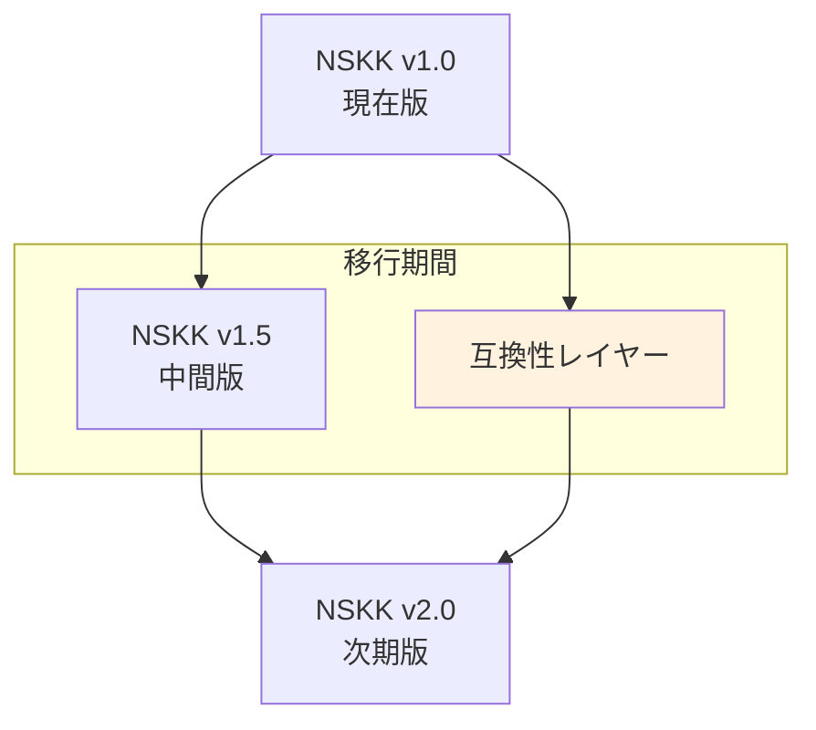

この拡張可能アーキテクチャにより、NSKKは長期的な進化と発展を確実にします。
```