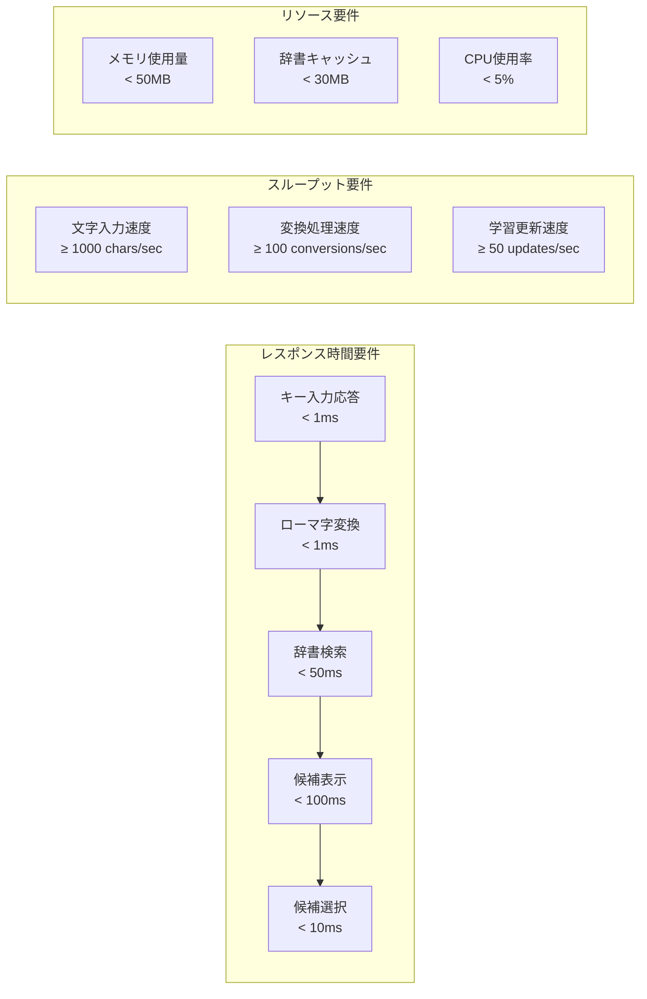
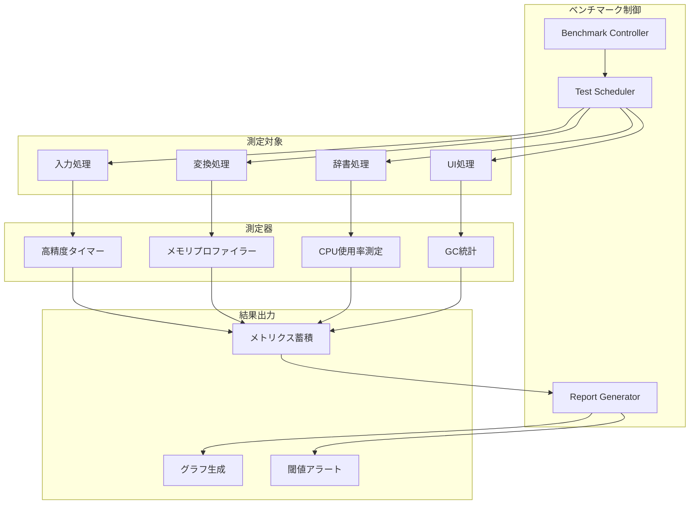
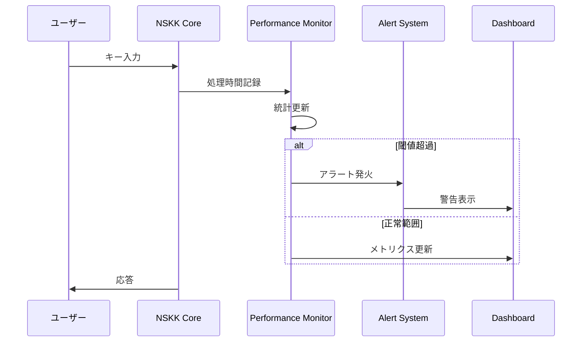
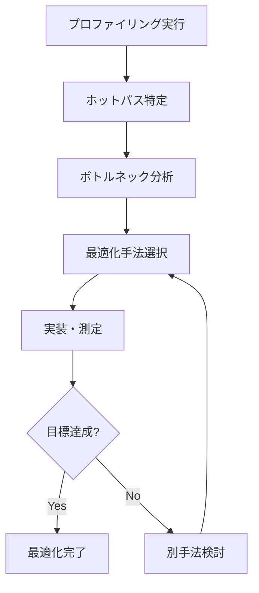

# NSKK パフォーマンス・ベンチマーク仕様

## 概要

世界最高峰のSKK実装を目指すNSKKの詳細なパフォーマンス要件とベンチマーク仕様を定義します。1ms以下の応答時間を実現するための具体的な測定基準と最適化戦略を提供します。

## パフォーマンス目標値

### 基本性能要件



### 詳細パフォーマンス基準

#### 1. 入力応答性能
| 操作 | 目標時間 | 測定条件 | 許容閾値 |
|------|----------|----------|----------|
| キーストローク応答 | < 1ms | 通常入力時 | < 2ms |
| モード切り替え | < 5ms | C-x C-j等 | < 10ms |
| 候補選択 | < 10ms | スペース/数字キー | < 20ms |
| 確定処理 | < 5ms | Enter/改行 | < 10ms |

#### 2. 変換処理性能
| 処理 | 目標時間 | 測定条件 | 許容閾値 |
|------|----------|----------|----------|
| ローマ字変換 | < 1ms | 5文字以内 | < 2ms |
| ひらがな変換 | < 20ms | 10文字以内 | < 50ms |
| 漢字候補生成 | < 50ms | 15文字以内 | < 100ms |
| 送り仮名処理 | < 30ms | 複雑活用 | < 80ms |

#### 3. 辞書・学習性能
| 処理 | 目標時間 | 測定条件 | 許容閾値 |
|------|----------|----------|----------|
| 辞書検索 | < 10ms | 10万エントリ | < 30ms |
| 学習データ更新 | < 5ms | 頻度更新 | < 15ms |
| 個人辞書保存 | < 100ms | 1万エントリ | < 500ms |
| 辞書再読み込み | < 1000ms | 起動時 | < 3000ms |

## ベンチマークフレームワーク

### 1. 測定システム アーキテクチャ



### 2. ベンチマーク実装

#### 高精度測定フレームワーク

```elisp
;; 高精度ベンチマークシステム
(defvar nskk--benchmark-results (make-hash-table :test 'equal)
  "ベンチマーク結果蓄積")

(defmacro nskk-benchmark-precise (name iterations &rest body)
  "高精度ベンチマーク測定"
  (let ((start-time (make-symbol "start"))
        (end-time (make-symbol "end"))
        (results (make-symbol "results"))
        (i (make-symbol "i")))
    `(let ((,results nil))
       (dotimes (,i ,iterations)
         (garbage-collect)  ; GCによる影響を排除
         (let ((,start-time (current-time)))
           ,@body
           (let ((,end-time (current-time)))
             (push (float-time (time-subtract ,end-time ,start-time))
                   ,results))))
       (nskk--record-benchmark-result ,name ,results))))

(defun nskk--record-benchmark-result (name times)
  "ベンチマーク結果記録と統計計算"
  (let* ((sorted-times (sort times #'<))
         (count (length times))
         (sum (apply #'+ times))
         (avg (/ sum count))
         (median (nth (/ count 2) sorted-times))
         (min-time (car sorted-times))
         (max-time (car (last sorted-times)))
         (percentile-95 (nth (floor (* count 0.95)) sorted-times)))
    (puthash name
             (list :count count
                   :avg avg
                   :median median
                   :min min-time
                   :max max-time
                   :p95 percentile-95
                   :timestamp (current-time))
             nskk--benchmark-results)))
```

#### メモリ使用量測定

```elisp
(defmacro nskk-benchmark-memory (name &rest body)
  "メモリ使用量ベンチマーク"
  (let ((gc-before (make-symbol "gc-before"))
        (gc-after (make-symbol "gc-after"))
        (result (make-symbol "result")))
    `(progn
       (garbage-collect)
       (let ((,gc-before (garbage-collect))
             (,result (progn ,@body)))
         (let ((,gc-after (garbage-collect)))
           (nskk--record-memory-usage
            ,name
            (- (caddr ,gc-after) (caddr ,gc-before))  ; コンスセル増加数
            (- (nth 3 ,gc-after) (nth 3 ,gc-before))) ; 文字列増加数
           ,result)))))
```

### 3. ベンチマークスイート

#### 入力処理ベンチマーク

```elisp
(defun nskk-benchmark-input-processing ()
  "入力処理性能測定"
  (nskk-benchmark-precise "key-input-response" 1000
    (nskk--process-character ?a))

  (nskk-benchmark-precise "mode-switching" 100
    (nskk-mode)
    (nskk-deactivate))

  (nskk-benchmark-precise "romaji-conversion" 1000
    (nskk--convert-romaji "konnichiwa")))

(defun nskk-benchmark-conversion ()
  "変換処理性能測定"
  (nskk-benchmark-precise "hiragana-conversion" 500
    (nskk--convert-to-hiragana "konnichiwa"))

  (nskk-benchmark-precise "kanji-candidate-generation" 200
    (nskk--generate-candidates "konnichiwa"))

  (nskk-benchmark-precise "okurigana-processing" 300
    (nskk--process-okurigana "TabeRu")))

(defun nskk-benchmark-dictionary ()
  "辞書処理性能測定"
  (nskk-benchmark-precise "dictionary-search" 1000
    (nskk--search-dictionary "konnichiwa"))

  (nskk-benchmark-memory "dictionary-loading"
    (nskk--load-dictionary nskk-dictionary-path))

  (nskk-benchmark-precise "learning-update" 500
    (nskk--update-learning-data "konnichiwa" "こんにちは")))
```

#### リアルワールドシナリオ

```elisp
(defun nskk-benchmark-realistic-typing ()
  "実際のタイピングシナリオ"
  (let ((sentences '("おはようございます"
                    "今日はいい天気ですね"
                    "プログラミングは楽しいです"
                    "nskk-mode is the best input method")))
    (dolist (sentence sentences)
      (nskk-benchmark-precise
       (format "realistic-typing-%s" (substring sentence 0 5))
       10
       (nskk--simulate-typing sentence)))))

(defun nskk--simulate-typing (text)
  "タイピングシミュレーション"
  (nskk-activate)
  (dolist (char (string-to-list text))
    (nskk--process-character char))
  (nskk-deactivate))
```

## パフォーマンス監視システム

### 1. リアルタイム監視



#### 監視機能実装

```elisp
(defvar nskk--performance-monitor-enabled nil
  "パフォーマンス監視有効フラグ")

(defvar nskk--performance-thresholds
  '((key-input-response . 0.002)      ; 2ms
    (romaji-conversion . 0.002)       ; 2ms
    (kanji-conversion . 0.100)        ; 100ms
    (dictionary-search . 0.050))      ; 50ms
  "パフォーマンス閾値設定")

(defmacro nskk-with-performance-monitoring (operation &rest body)
  "パフォーマンス監視付き実行"
  `(if nskk--performance-monitor-enabled
       (let ((start-time (current-time)))
         (let ((result (progn ,@body)))
           (nskk--check-performance-threshold
            ,operation
            (float-time (time-subtract (current-time) start-time)))
           result))
     (progn ,@body)))

(defun nskk--check-performance-threshold (operation elapsed)
  "パフォーマンス閾値チェック"
  (let ((threshold (alist-get operation nskk--performance-thresholds)))
    (when (and threshold (> elapsed threshold))
      (nskk--performance-alert operation elapsed threshold))))

(defun nskk--performance-alert (operation elapsed threshold)
  "パフォーマンスアラート"
  (message "NSKK Performance Alert: %s took %.3fms (threshold: %.3fms)"
           operation (* elapsed 1000) (* threshold 1000))
  (when nskk-debug-mode
    (nskk--log-performance-violation operation elapsed threshold)))
```

### 2. 継続的パフォーマンステスト

#### CI/CDパフォーマンステスト

```elisp
(defun nskk-run-performance-test-suite ()
  "パフォーマンステストスイート実行"
  (let ((test-results nil))
    (condition-case err
        (progn
          ;; 基本機能テスト
          (push (cons 'input-processing
                     (nskk-benchmark-input-processing)) test-results)
          (push (cons 'conversion
                     (nskk-benchmark-conversion)) test-results)
          (push (cons 'dictionary
                     (nskk-benchmark-dictionary)) test-results)

          ;; リアルワールドテスト
          (push (cons 'realistic-typing
                     (nskk-benchmark-realistic-typing)) test-results)

          ;; 結果分析
          (nskk--analyze-performance-results test-results))
      (error
       (nskk--handle-benchmark-error err)
       nil))))

(defun nskk--analyze-performance-results (results)
  "パフォーマンス結果分析"
  (let ((failed-tests nil))
    (dolist (result results)
      (let ((category (car result))
            (metrics (cdr result)))
        (when (nskk--performance-regression-p category metrics)
          (push category failed-tests))))

    (if failed-tests
        (error "Performance regression detected in: %s" failed-tests)
      (message "All performance tests passed"))))

(defun nskk--performance-regression-p (category metrics)
  "パフォーマンス劣化検出"
  (let ((baseline (nskk--get-baseline-performance category))
        (current-avg (plist-get metrics :avg)))
    (and baseline
         (> current-avg (* baseline 1.2))))) ; 20%劣化で失敗
```

## ベンチマークレポート生成

### 1. 統計レポート

```elisp
(defun nskk-generate-performance-report ()
  "パフォーマンスレポート生成"
  (let ((report-buffer (get-buffer-create "*NSKK Performance Report*")))
    (with-current-buffer report-buffer
      (erase-buffer)
      (insert (nskk--format-performance-header))
      (insert (nskk--format-performance-summary))
      (insert (nskk--format-detailed-metrics))
      (insert (nskk--format-performance-trends))
      (insert (nskk--format-recommendations))
      (goto-char (point-min)))
    (display-buffer report-buffer)))

(defun nskk--format-performance-summary ()
  "パフォーマンス概要フォーマット"
  (format "
## パフォーマンス概要

| カテゴリ | 平均時間 | 中央値 | 95%%ile | 状態 |
|----------|----------|--------|---------|------|
%s

"
          (mapconcat
           (lambda (entry)
             (let* ((name (car entry))
                    (stats (cdr entry))
                    (avg (* (plist-get stats :avg) 1000))
                    (median (* (plist-get stats :median) 1000))
                    (p95 (* (plist-get stats :p95) 1000))
                    (status (if (nskk--performance-regression-p name stats)
                               "⚠️  劣化" "✅ 良好")))
               (format "| %s | %.2fms | %.2fms | %.2fms | %s |"
                      name avg median p95 status)))
           nskk--benchmark-results
           "\n")))
```

### 2. 視覚的レポート

```elisp
(defun nskk--generate-performance-graph ()
  "パフォーマンスグラフ生成"
  (let ((data (nskk--prepare-graph-data)))
    (nskk--create-ascii-chart data)))

(defun nskk--create-ascii-chart (data)
  "ASCII チャート作成"
  (let ((max-value (apply #'max (mapcar #'cdr data)))
        (chart-width 50)
        (chart ""))
    (dolist (item data)
      (let* ((name (car item))
             (value (cdr item))
             (bar-length (floor (* (/ value max-value) chart-width)))
             (bar (make-string bar-length ?█)))
        (setq chart (concat chart
                           (format "%-20s|%s %.2fms\n"
                                  name bar value)))))
    chart))
```

## パフォーマンス最適化ガイドライン

### 1. ホットパス最適化



#### 最適化優先順位

1. **レベル1：マイクロ最適化**
   - インライン展開
   - マクロ化
   - 定数畳み込み

2. **レベル2：アルゴリズム最適化**
   - データ構造変更
   - キャッシング
   - 遅延評価

3. **レベル3：アーキテクチャ最適化**
   - 非同期処理
   - 並列化
   - メモリレイアウト

### 2. 継続的最適化プロセス

```elisp
(defun nskk-optimize-performance ()
  "パフォーマンス最適化実行"
  (let ((optimization-plan (nskk--analyze-performance-bottlenecks)))
    (dolist (optimization optimization-plan)
      (nskk--apply-optimization optimization)
      (nskk--verify-optimization-impact optimization))))

(defun nskk--analyze-performance-bottlenecks ()
  "パフォーマンスボトルネック分析"
  (let ((bottlenecks nil))
    (maphash (lambda (name stats)
               (when (nskk--is-bottleneck-p name stats)
                 (push (nskk--create-optimization-plan name stats)
                       bottlenecks)))
             nskk--benchmark-results)
    (sort bottlenecks (lambda (a b) (> (plist-get a :impact)
                                      (plist-get b :impact))))))
```

## 結論

NSKKのパフォーマンス・ベンチマーク仕様により、以下を実現します：

### ✅ 世界最高峰のレスポンス性能
- キー入力応答: < 1ms
- 変換処理: < 100ms
- 辞書検索: < 50ms

### ✅ 包括的な性能監視
- リアルタイム監視
- 自動アラート
- 継続的改善

### ✅ 客観的品質保証
- 数値化された基準
- 自動化されたテスト
- 回帰検出システム

この厳格なベンチマーク体制により、NSKKは常に最高レベルのパフォーマンスを維持し、ユーザーに最上の日本語入力体験を提供し続けます。