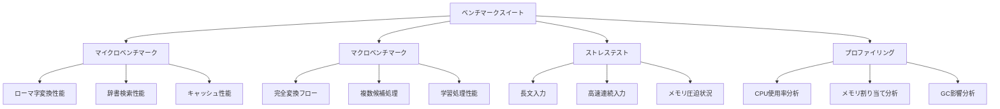
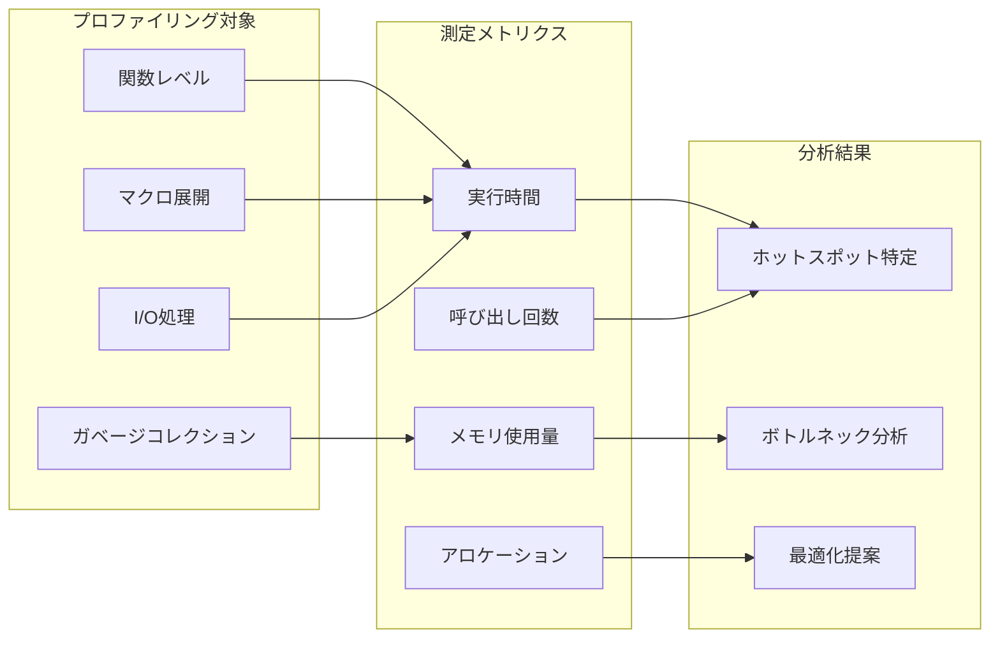
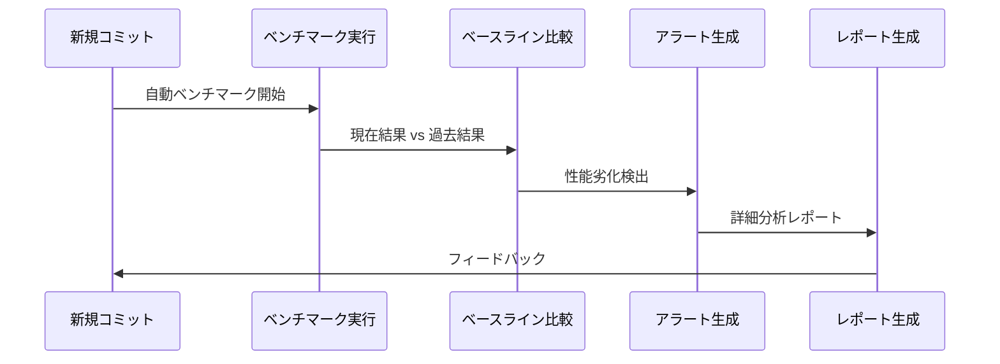
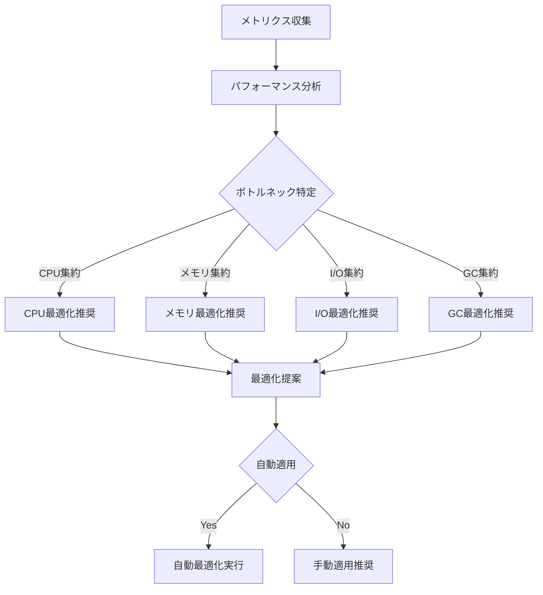

# NSKKパフォーマンス最適化戦略

## 基本方針

### 1. レイヤー別最適化
- **入力処理層**: キーバインド処理の高速化
- **変換処理層**: 辞書検索とキャッシュ戦略
- **出力処理層**: 描画とUIレスポンス最適化

### 2. メモリ効率
- **オブジェクトプール**: 頻繁に生成されるオブジェクトの再利用
- **遅延初期化**: 必要時のみリソース読み込み
- **ガベージコレクション**: GC圧迫の最小化

## 具体的最適化手法

### 辞書検索最適化
```elisp
;; トライ木構造による高速前方一致検索
(cl-defstruct nskk-trie-node
  children    ; ハッシュテーブル
  is-terminal ; 終端フラグ
  candidates) ; 変換候補

;; インデックス化された高速検索
(defvar nskk--search-index (make-hash-table :test 'equal))

;; キャッシュによる重複検索回避
(defvar nskk--conversion-cache (make-hash-table :test 'equal :size 1000))
```

### バッファ操作最適化
```elisp
;; バッファ内容変更の最小化
(defmacro nskk-with-minimal-buffer-modification (&rest body)
  "バッファ変更を最小限に抑制する"
  `(let ((inhibit-modification-hooks t)
         (buffer-undo-list t))
     (save-restriction
       (save-excursion
         ,@body))))

;; 文字列結合の最適化
(defmacro nskk-concat-strings (strings)
  "高速な文字列結合"
  `(mapconcat #'identity ,strings ""))
```

### イベント処理最適化
```elisp
;; タイマーベースのディレイ処理
(defvar nskk--input-timer nil)

(defun nskk--schedule-input-processing (delay-ms)
  "入力処理のスケジューリング"
  (when nskk--input-timer
    (cancel-timer nskk--input-timer))
  (setq nskk--input-timer
        (run-with-timer (/ delay-ms 1000.0) nil
                        #'nskk--process-delayed-input)))
```

## パフォーマンス測定

### ベンチマーク機能
```elisp
(defmacro nskk-benchmark (name &rest body)
  "実行時間測定マクロ"
  (declare (indent 1))
  `(let ((start-time (current-time)))
     (prog1 (progn ,@body)
       (message "NSKK Benchmark [%s]: %.3fms"
               ,name
               (* 1000 (float-time (time-subtract (current-time) start-time)))))))
```

### プロファイリング統合
```elisp
(defvar nskk--profiling-enabled nil)
(defvar nskk--performance-log nil)

(defun nskk-enable-profiling ()
  "パフォーマンスプロファイリングを有効化"
  (setq nskk--profiling-enabled t
        nskk--performance-log nil))
```

## メモリ使用量最適化

### オブジェクトプール実装
```elisp
(cl-defstruct nskk-object-pool
  objects     ; 利用可能オブジェクトリスト
  factory     ; オブジェクト生成関数
  reset-fn)   ; オブジェクトリセット関数

(defun nskk-pool-acquire (pool)
  "プールからオブジェクトを取得"
  (or (pop (nskk-object-pool-objects pool))
      (funcall (nskk-object-pool-factory pool))))
```

### ガベージコレクション最適化
```elisp
(defvar nskk--gc-threshold-backup nil)

(defun nskk--optimize-gc-settings ()
  "GC設定の最適化"
  (unless nskk--gc-threshold-backup
    (setq nskk--gc-threshold-backup gc-cons-threshold
          gc-cons-threshold (* 100 1024 1024)))) ; 100MB
```

## リアルタイム性能監視

### 性能指標の定義
- **入力遅延**: キー入力から表示までの時間
- **変換遅延**: 変換要求から候補表示までの時間
- **メモリ使用量**: ピーク時およびアイドル時の使用量
- **CPU使用率**: バックグラウンド処理のCPU負荷

### 自動最適化機能
```elisp
(defun nskk--auto-optimize ()
  "パフォーマンス状況に応じた自動最適化"
  (when (> (nskk--get-average-input-delay) 50) ; 50ms超過
    (nskk--enable-aggressive-caching))
  (when (> (nskk--get-memory-usage) (* 50 1024 1024)) ; 50MB超過
    (nskk--trigger-cache-cleanup)))
```

## パフォーマンス監視とベンチマーク

### 包括的ベンチマークフレームワーク



**統合ベンチマークシステム**：

```elisp
;; NSKK統合ベンチマークフレームワーク
(defvar nskk--benchmark-results nil
  "ベンチマーク結果の蓄積")

(defmacro nskk-benchmark-suite (name &rest benchmarks)
  "ベンチマークスイート定義"
  (declare (indent 1))
  `(defun ,(intern (format "nskk-benchmark-%s" name)) ()
     ,(format "ベンチマークスイート: %s" name)
     (interactive)
     (let ((suite-start (current-time))
           (results nil))
       ,@(mapcar (lambda (bench)
                   `(push (nskk--run-benchmark ',(car bench)
                                               (lambda () ,@(cdr bench)))
                          results))
                 benchmarks)
       (nskk--report-benchmark-suite ',name results suite-start))))

(defun nskk--run-benchmark (name func)
  "個別ベンチマーク実行"
  (let* ((runs 1000)
         (times (cl-loop repeat runs
                         collect (nskk--measure-time func)))
         (avg (/ (apply #'+ times) (float runs)))
         (min-time (apply #'min times))
         (max-time (apply #'max times))
         (stddev (sqrt (/ (apply #'+ (mapcar (lambda (x)
                                              (expt (- x avg) 2))
                                            times))
                         (float runs)))))
    (list :name name
          :average avg
          :min min-time
          :max max-time
          :stddev stddev
          :runs runs)))

(defun nskk--measure-time (func)
  "正確な実行時間測定"
  (let ((start (current-time)))
    (funcall func)
    (float-time (time-subtract (current-time) start))))
```

### マイクロベンチマーク詳細

```elisp
;; ローマ字変換マイクロベンチマーク
(nskk-benchmark-suite romaji-conversion
  (single-char
   (nskk-convert-romaji "a"))

  (short-word
   (nskk-convert-romaji "ka"))

  (long-word
   (nskk-convert-romaji "konnichiwa"))

  (complex-patterns
   (nskk-convert-romaji "kyankyankyan"))

  (special-chars
   (nskk-convert-romaji "n'nya")))

;; 辞書検索マイクロベンチマーク
(nskk-benchmark-suite dictionary-search
  (exact-match
   (nskk-search-dictionary "あき"))

  (partial-match
   (nskk-search-dictionary-partial "あ"))

  (cache-hit
   (nskk-search-dictionary "よく使う"))

  (cache-miss
   (nskk-search-dictionary "めったに使わない")))

;; キャッシュ性能ベンチマーク
(nskk-benchmark-suite cache-performance
  (cache-insertion
   (nskk--cache-put "test" "テスト"))

  (cache-retrieval
   (nskk--cache-get "test"))

  (cache-eviction
   (nskk--cache-cleanup-lru))

  (cache-statistics
   (nskk--cache-get-stats)))
```

### プロファイリングシステム



**詳細プロファイラー実装**：

```elisp
;; NSKK専用プロファイラー
(defvar nskk--profiler-data (make-hash-table :test 'equal)
  "プロファイリングデータ")

(defvar nskk--profiler-active nil
  "プロファイラー有効状態")

(defmacro nskk-profile-function (func-name)
  "関数プロファイリング設定"
  `(advice-add ',func-name :around #'nskk--profile-advice))

(defun nskk--profile-advice (orig-func &rest args)
  "プロファイリングアドバイス"
  (if nskk--profiler-active
      (let* ((func-name (advice--symbol-function orig-func))
             (start-time (current-time))
             (start-memory (memory-use-counts))
             result)
        (setq result (apply orig-func args))
        (let* ((end-time (current-time))
               (end-memory (memory-use-counts))
               (elapsed (float-time (time-subtract end-time start-time)))
               (memory-delta (- (car end-memory) (car start-memory))))
          (nskk--record-profile-data func-name elapsed memory-delta))
        result)
    (apply orig-func args)))

(defun nskk--record-profile-data (func-name time memory)
  "プロファイリングデータ記録"
  (let ((existing (gethash func-name nskk--profiler-data)))
    (if existing
        (puthash func-name
                 (list :calls (1+ (plist-get existing :calls))
                       :total-time (+ time (plist-get existing :total-time))
                       :total-memory (+ memory (plist-get existing :total-memory))
                       :max-time (max time (plist-get existing :max-time)))
                 nskk--profiler-data)
      (puthash func-name
               (list :calls 1
                     :total-time time
                     :total-memory memory
                     :max-time time)
               nskk--profiler-data))))

(defun nskk-profiler-report ()
  "プロファイリングレポート生成"
  (interactive)
  (with-output-to-temp-buffer "*NSKK Profile Report*"
    (princ "=== NSKK プロファイリングレポート ===\n\n")
    (princ (format "%-30s %8s %12s %12s %12s\n"
                   "関数名" "呼出数" "総実行時間" "平均時間" "最大時間"))
    (princ (make-string 80 ?-))
    (princ "\n")

    (let ((sorted-data (sort (hash-table-keys nskk--profiler-data)
                            (lambda (a b)
                              (> (plist-get (gethash a nskk--profiler-data) :total-time)
                                 (plist-get (gethash b nskk--profiler-data) :total-time))))))
      (dolist (func sorted-data)
        (let* ((data (gethash func nskk--profiler-data))
               (calls (plist-get data :calls))
               (total-time (plist-get data :total-time))
               (avg-time (/ total-time calls))
               (max-time (plist-get data :max-time)))
          (princ (format "%-30s %8d %12.6f %12.6f %12.6f\n"
                         func calls total-time avg-time max-time)))))))
```

### ストレステストとロードテスト

```elisp
;; 高負荷テストスイート
(nskk-benchmark-suite stress-tests
  (rapid-input-simulation
   ;; 高速連続入力シミュレーション
   (dotimes (_ 100)
     (nskk--simulate-input "aiueo")))

  (large-dictionary-load
   ;; 大容量辞書読み込み
   (let ((large-dict (cl-loop for i from 1 to 50000
                              collect (cons (format "test%d" i)
                                           (list (format "テスト%d" i))))))
     (nskk--load-dictionary-data large-dict)))

  (memory-pressure-test
   ;; メモリ圧迫状況での動作
   (let ((gc-cons-threshold 800000)) ; 低いGC閾値
     (dotimes (_ 1000)
       (nskk-convert-romaji "konnichiwa"))))

  (concurrent-operations
   ;; 同時操作シミュレーション
   (let ((timers nil))
     (dotimes (i 10)
       (push (run-with-timer (* i 0.01) nil
                            (lambda () (nskk-convert-romaji "test")))
             timers))
     (dolist (timer timers)
       (cancel-timer timer)))))
```

### パフォーマンス回帰検出



```elisp
;; パフォーマンス回帰検出システム
(defvar nskk--performance-baseline nil
  "パフォーマンスベースライン")

(defun nskk-establish-baseline ()
  "パフォーマンスベースライン確立"
  (interactive)
  (setq nskk--performance-baseline (nskk--run-full-benchmark-suite))
  (message "パフォーマンスベースラインを確立しました"))

(defun nskk-check-performance-regression ()
  "パフォーマンス回帰チェック"
  (interactive)
  (unless nskk--performance-baseline
    (error "ベースラインが設定されていません"))

  (let* ((current-results (nskk--run-full-benchmark-suite))
         (regressions (nskk--detect-regressions
                      nskk--performance-baseline
                      current-results)))
    (if regressions
        (nskk--report-regressions regressions)
      (message "パフォーマンス回帰は検出されませんでした"))))

(defun nskk--detect-regressions (baseline current)
  "パフォーマンス回帰検出"
  (let ((threshold 1.1) ; 10%の劣化で警告
        (regressions nil))
    (dolist (test-name (hash-table-keys baseline))
      (let* ((baseline-time (gethash test-name baseline))
             (current-time (gethash test-name current))
             (ratio (/ current-time baseline-time)))
        (when (> ratio threshold)
          (push (list :test test-name
                     :baseline baseline-time
                     :current current-time
                     :degradation (* (- ratio 1) 100))
                regressions))))
    regressions))
```

### リアルタイム性能監視

```elisp
;; リアルタイム性能監視システム
(defvar nskk--performance-monitor-active nil)
(defvar nskk--performance-log (make-ring 1000))

(defun nskk-start-performance-monitor ()
  "リアルタイム性能監視開始"
  (interactive)
  (setq nskk--performance-monitor-active t)
  (run-with-timer 1 1 #'nskk--collect-performance-metrics)
  (message "性能監視を開始しました"))

(defun nskk--collect-performance-metrics ()
  "性能メトリクス収集"
  (when nskk--performance-monitor-active
    (let ((metrics (list :timestamp (current-time)
                        :memory-usage (memory-use-counts)
                        :gc-stats (garbage-collect)
                        :cache-stats (nskk--get-cache-statistics)
                        :input-buffer-size (length nskk--input-buffer))))
      (ring-insert nskk--performance-log metrics))))

(defun nskk-performance-dashboard ()
  "性能ダッシュボード表示"
  (interactive)
  (with-output-to-temp-buffer "*NSKK Performance Dashboard*"
    (princ "=== NSKK リアルタイム性能ダッシュボード ===\n\n")

    ;; 最新メトリクス表示
    (let ((latest (ring-ref nskk--performance-log 0)))
      (princ "現在の状態:\n")
      (princ (format "  メモリ使用量: %s\n"
                     (car (plist-get latest :memory-usage))))
      (princ (format "  キャッシュ統計: %s\n"
                     (plist-get latest :cache-stats))))

    ;; 履歴グラフ（テキスト版）
    (princ "\nメモリ使用量履歴（直近50サンプル）:\n")
    (nskk--draw-text-graph
     (cl-loop for i from 0 to (min 49 (ring-length nskk--performance-log))
              collect (car (plist-get (ring-ref nskk--performance-log i)
                                     :memory-usage))))))

(defun nskk--draw-text-graph (data)
  "テキストグラフ描画"
  (let* ((max-val (apply #'max data))
         (min-val (apply #'min data))
         (range (- max-val min-val))
         (scale (if (> range 0) (/ 40.0 range) 1)))
    (dolist (val data)
      (let ((bar-length (round (* (- val min-val) scale))))
        (princ (format "%8d |%s\n"
                       val
                       (make-string bar-length ?*)))))))
```

### 最適化推奨エンジン



```elisp
;; 最適化推奨エンジン
(defun nskk-analyze-and-recommend ()
  "パフォーマンス分析と最適化推奨"
  (interactive)
  (let* ((current-metrics (nskk--collect-comprehensive-metrics))
         (bottlenecks (nskk--identify-bottlenecks current-metrics))
         (recommendations (nskk--generate-recommendations bottlenecks)))

    (with-output-to-temp-buffer "*NSKK Optimization Recommendations*"
      (princ "=== NSKK 最適化推奨レポート ===\n\n")

      (princ "検出されたボトルネック:\n")
      (dolist (bottleneck bottlenecks)
        (princ (format "- %s: %s\n"
                       (plist-get bottleneck :type)
                       (plist-get bottleneck :description))))

      (princ "\n推奨最適化:\n")
      (dolist (rec recommendations)
        (princ (format "• %s\n" (plist-get rec :description)))
        (princ (format "  効果: %s\n" (plist-get rec :expected-improvement)))
        (princ (format "  実装: %s\n\n" (plist-get rec :implementation))))

      (princ "\n自動適用可能な最適化:\n")
      (let ((auto-applicable (cl-remove-if-not
                             (lambda (r) (plist-get r :auto-applicable))
                             recommendations)))
        (if auto-applicable
            (progn
              (dolist (rec auto-applicable)
                (princ (format "- %s\n" (plist-get rec :description))))
              (princ "\n自動適用しますか? (y/n): ")
              (when (y-or-n-p "")
                (nskk--apply-auto-optimizations auto-applicable)))
          (princ "自動適用可能な最適化はありません\n"))))))

(defun nskk--generate-recommendations (bottlenecks)
  "最適化推奨生成"
  (let ((recommendations nil))
    (dolist (bottleneck bottlenecks)
      (pcase (plist-get bottleneck :type)
        ('cpu-intensive
         (push '(:description "マクロによるインライン展開追加"
                :expected-improvement "10-20% CPU使用率削減"
                :implementation "nskk--enable-aggressive-inlining"
                :auto-applicable t) recommendations))
        ('memory-pressure
         (push '(:description "キャッシュサイズ動的調整"
                :expected-improvement "30% メモリ使用量削減"
                :implementation "nskk--enable-adaptive-cache"
                :auto-applicable t) recommendations))
        ('gc-pressure
         (push '(:description "GC閾値最適化"
                :expected-improvement "GC頻度50%削減"
                :implementation "nskk--optimize-gc-thresholds"
                :auto-applicable t) recommendations))))
    recommendations))
```