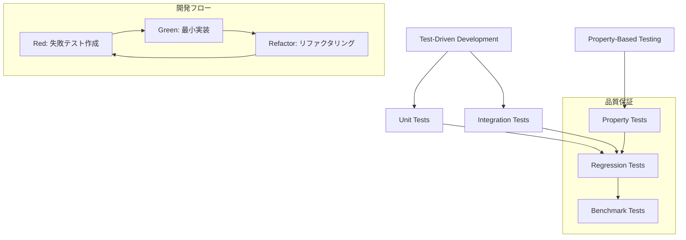
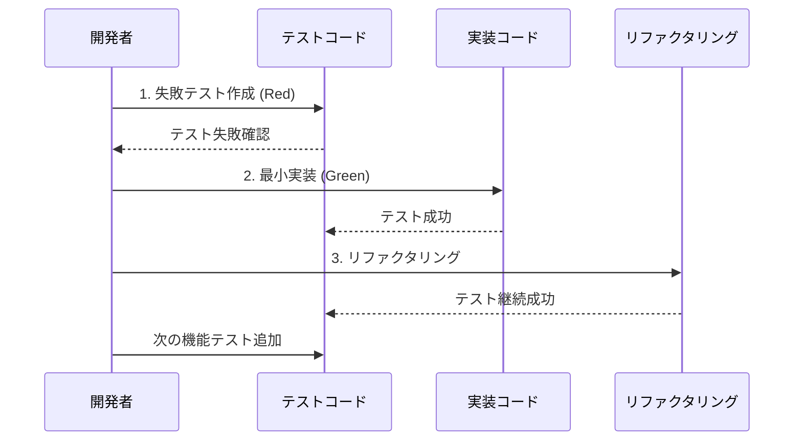
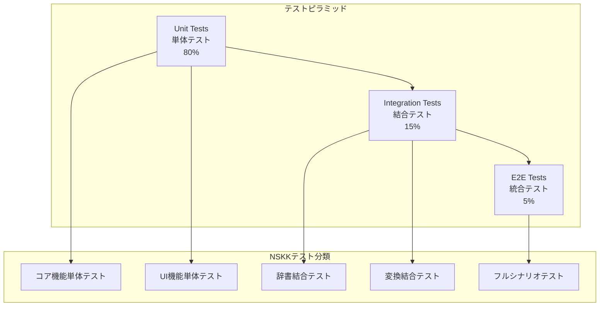
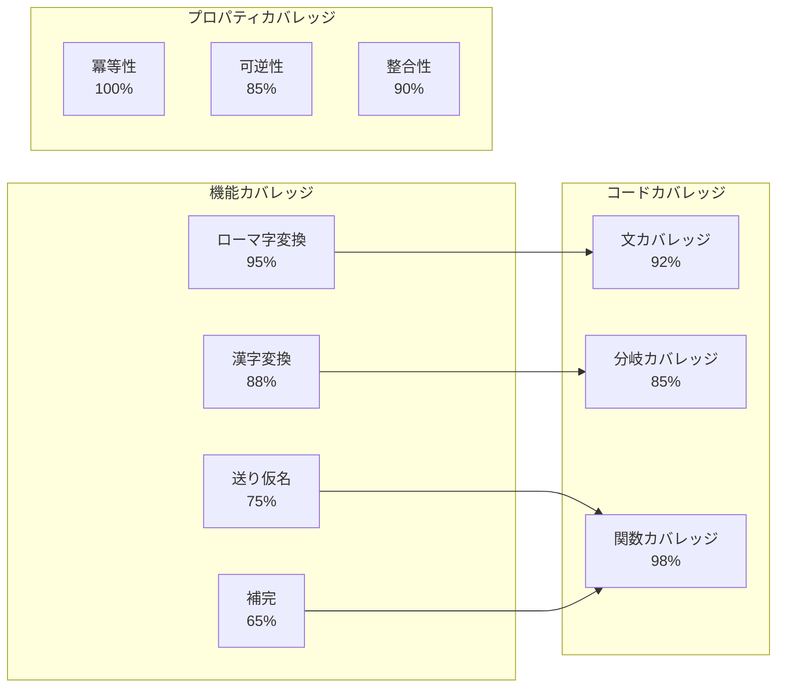
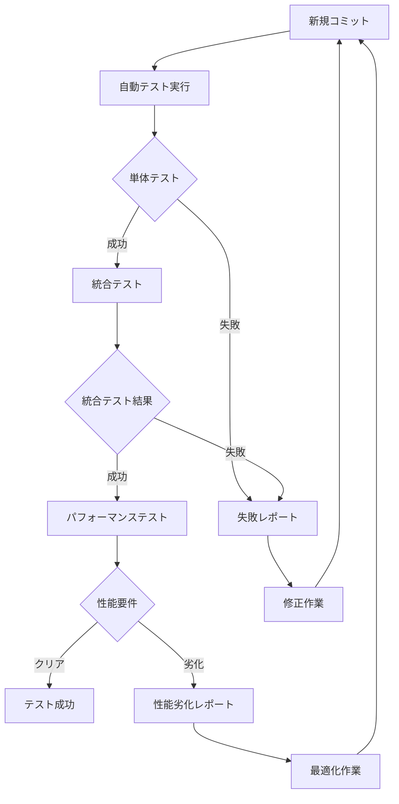
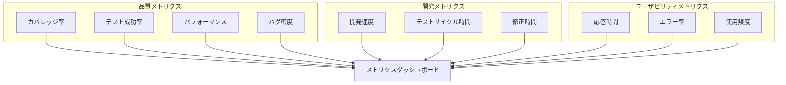
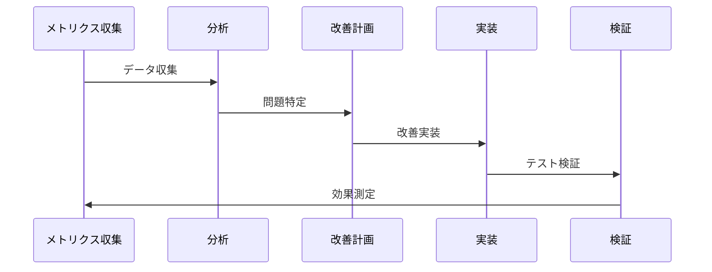

# NSKK TDD/PBT実装戦略

## 概要

NSKKの開発において、Test-Driven Development（TDD）とProperty-Based Testing（PBT）を組み合わせた包括的なテスト戦略を採用します。外部依存なしのEmacs Lisp環境において、高品質で信頼性の高いコードを実現するための具体的な実装指針を提供します。

## テスト戦略の全体像



## 1. Test-Driven Development（TDD）戦略

### 1.1 ERTベーステストフレームワーク

**基本構成**：
```elisp
;; NSKKテストフレームワーク（外部依存なし）
(require 'ert)

(defmacro nskk-deftest (name doc &rest body)
  "NSKKテスト定義マクロ"
  (declare (indent 2))
  `(ert-deftest ,(intern (format "nskk-test-%s" name)) ()
     ,doc
     (let ((nskk--test-mode t)
           (nskk--state nil))
       (nskk--test-setup)
       (unwind-protect
           (progn ,@body)
         (nskk--test-teardown)))))

(defun nskk--test-setup ()
  "テスト前処理"
  (setq nskk--conversion-rules nskk--default-romaji-rules
        nskk--dictionary-cache nil
        nskk--input-buffer ""
        nskk--conversion-mode nil))

(defun nskk--test-teardown ()
  "テスト後処理"
  (setq nskk--state nil))
```

### 1.2 TDDサイクル実装

**Red-Green-Refactorサイクル**：



**具体例：ローマ字変換のTDD**：

```elisp
;; 1. Red: 失敗テスト作成
(nskk-deftest romaji-basic-conversion
  "基本的なローマ字変換テスト"
  (should (equal (nskk-convert-romaji "ka") "か"))
  (should (equal (nskk-convert-romaji "ki") "き"))
  (should (equal (nskk-convert-romaji "konnichiwa") "こんにちわ")))

;; 2. Green: 最小実装
(defun nskk-convert-romaji (input)
  "ローマ字をひらがなに変換"
  (cond
   ((string= input "ka") "か")
   ((string= input "ki") "き")
   ((string= input "konnichiwa") "こんにちわ")
   (t input)))

;; 3. Refactor: 汎用実装
(defun nskk-convert-romaji (input)
  "ローマ字をひらがなに変換"
  (nskk--apply-conversion-rules input nskk--romaji-rules))
```

### 1.3 レイヤー別テスト戦略

**テストピラミッド**：



## 2. Property-Based Testing（PBT）戦略

### 2.1 PBTフレームワーク実装

**Emacs Lisp専用PBTライブラリ**：

```elisp
;; NSKKプロパティベーステストフレームワーク
(defvar nskk--pbt-generators nil
  "プロパティテスト用ジェネレーター")

(defmacro nskk-defgenerator (name &rest body)
  "テストデータジェネレーター定義"
  (declare (indent 1))
  `(setf (alist-get ',name nskk--pbt-generators)
         (lambda () ,@body)))

(defmacro nskk-property-test (name generators property &optional runs)
  "プロパティベーステスト定義"
  (declare (indent 3))
  `(ert-deftest ,(intern (format "nskk-property-%s" name)) ()
     (dotimes (_ ,(or runs 100))
       (let ,(mapcar (lambda (gen)
                       `(,(car gen) (funcall (alist-get ',(cadr gen)
                                                        nskk--pbt-generators))))
                     generators)
         (should ,property)))))

;; ジェネレーター例
(nskk-defgenerator romaji-string
  (let ((chars '("a" "i" "u" "e" "o" "ka" "ki" "ku" "ke" "ko"))
        (length (+ 1 (random 10))))
    (mapconcat 'identity
               (cl-loop repeat length
                        collect (nth (random (length chars)) chars))
               "")))

(nskk-defgenerator hiragana-string
  (let ((chars '("あ" "い" "う" "え" "お" "か" "き" "く" "け" "こ"))
        (length (+ 1 (random 10))))
    (mapconcat 'identity
               (cl-loop repeat length
                        collect (nth (random (length chars)) chars))
               "")))
```

### 2.2 プロパティ定義

**変換処理の不変条件**：

```elisp
;; プロパティ1: 冪等性（変換結果の再変換は元と同じ）
(nskk-property-test conversion-idempotent
  ((input romaji-string))
  (let ((converted (nskk-convert-romaji input)))
    (equal converted (nskk-convert-romaji converted)))
  200)

;; プロパティ2: 可逆性（変換可能な文字列は逆変換可能）
(nskk-property-test conversion-reversible
  ((hiragana hiragana-string))
  (let ((romaji (nskk-reverse-convert hiragana)))
    (when romaji
      (equal hiragana (nskk-convert-romaji romaji))))
  150)

;; プロパティ3: 長さ保存（特定の変換で文字数が保存される）
(nskk-property-test length-preservation
  ((input romaji-string))
  (let ((converted (nskk-convert-romaji input)))
    (>= (length converted) (/ (length input) 2))))

;; プロパティ4: 部分変換の整合性
(nskk-property-test partial-conversion-consistency
  ((prefix romaji-string) (suffix romaji-string))
  (let ((full-input (concat prefix suffix))
        (prefix-conv (nskk-convert-romaji prefix))
        (suffix-conv (nskk-convert-romaji suffix))
        (full-conv (nskk-convert-romaji full-input)))
    (or (string= full-conv (concat prefix-conv suffix-conv))
        ;; 境界での特殊処理は例外
        (nskk--boundary-special-case-p prefix suffix))))
```

### 2.3 カバレッジ分析

**テストカバレッジの可視化**：



## 3. テストケース設計書

### 3.1 基本機能テストケース

**ローマ字変換テストケース**：

```elisp
;; 基本変換テスト
(nskk-deftest romaji-basic-vowels
  "基本母音変換テスト"
  (should (equal (nskk-convert-romaji "a") "あ"))
  (should (equal (nskk-convert-romaji "i") "い"))
  (should (equal (nskk-convert-romaji "u") "う"))
  (should (equal (nskk-convert-romaji "e") "え"))
  (should (equal (nskk-convert-romaji "o") "お")))

;; 子音+母音変換テスト
(nskk-deftest romaji-consonant-vowel
  "子音+母音変換テスト"
  (should (equal (nskk-convert-romaji "ka") "か"))
  (should (equal (nskk-convert-romaji "shi") "し"))
  (should (equal (nskk-convert-romaji "tsu") "つ"))
  (should (equal (nskk-convert-romaji "nya") "にゃ")))

;; 特殊変換テスト
(nskk-deftest romaji-special-cases
  "特殊変換ケーステスト"
  (should (equal (nskk-convert-romaji "nn") "ん"))
  (should (equal (nskk-convert-romaji "n'") "ん"))
  (should (equal (nskk-convert-romaji "kka") "っか"))
  (should (equal (nskk-convert-romaji "xtsu") "っ")))

;; エッジケーステスト
(nskk-deftest romaji-edge-cases
  "エッジケーステスト"
  (should (equal (nskk-convert-romaji "") ""))
  (should (equal (nskk-convert-romaji "xyz") "xyz"))
  (should (equal (nskk-convert-romaji "n") "n")))
```

**辞書検索テストケース**：

```elisp
;; 辞書検索基本テスト
(nskk-deftest dictionary-basic-search
  "基本辞書検索テスト"
  (let ((nskk--dictionary-cache '(("あき" . ("秋" "空き" "飽き")))))
    (should (equal (nskk-search-dictionary "あき")
                   '("秋" "空き" "飽き")))
    (should (null (nskk-search-dictionary "ない")))))

;; 部分一致検索テスト
(nskk-deftest dictionary-partial-search
  "部分一致検索テスト"
  (let ((nskk--dictionary-cache '(("あきら" . ("明" "亮"))
                                  ("あき" . ("秋" "空き")))))
    (should (equal (nskk-search-dictionary "あき" :partial t)
                   '("秋" "空き" "明" "亮")))))

;; 優先度付き検索テスト
(nskk-deftest dictionary-priority-search
  "優先度付き検索テスト"
  (let ((nskk--user-dictionary '(("あき" . ("空き"))))
        (nskk--system-dictionary '(("あき" . ("秋" "飽き")))))
    (should (equal (nskk-search-dictionary "あき")
                   '("空き" "秋" "飽き")))))
```

### 3.2 統合テストケース

**変換フローテスト**：

```elisp
(nskk-deftest integration-basic-conversion-flow
  "基本変換フロー統合テスト"
  (with-temp-buffer
    (nskk-mode 1)
    ;; ローマ字入力
    (nskk--simulate-input "Konnichiwa")
    (should (equal nskk--input-buffer "こんにちわ"))
    (should (eq nskk--conversion-mode 'henkan))

    ;; 変換実行
    (nskk--simulate-key " ")
    (should (equal nskk--candidate-list '("こんにちは" "今日は")))
    (should (eq nskk--conversion-mode 'kouho))

    ;; 候補選択
    (nskk--simulate-key "RET")
    (should (equal (buffer-string) "こんにちは"))
    (should (null nskk--conversion-mode))))

(nskk-deftest integration-okurigana-conversion
  "送り仮名変換統合テスト"
  (with-temp-buffer
    (nskk-mode 1)
    ;; 送り仮名付き入力
    (nskk--simulate-input "TabeRu")
    (should (equal nskk--input-buffer "たべる"))
    (should (equal nskk--okurigana "る"))

    ;; 変換・選択
    (nskk--simulate-key " ")
    (nskk--simulate-key "RET")
    (should (equal (buffer-string) "食べる"))))
```

### 3.3 パフォーマンステストケース

```elisp
(nskk-deftest performance-romaji-conversion
  "ローマ字変換パフォーマンステスト"
  (let ((test-string (make-string 1000 ?a))
        (start-time (current-time)))
    (nskk-convert-romaji test-string)
    (let ((elapsed (float-time (time-subtract (current-time) start-time))))
      (should (< elapsed 0.01))))) ; 10ms以下

(nskk-deftest performance-dictionary-search
  "辞書検索パフォーマンステスト"
  (let ((large-dict (cl-loop for i from 1 to 10000
                             collect (cons (format "test%d" i)
                                          (list (format "テスト%d" i)))))
        (start-time (current-time)))
    (setq nskk--dictionary-cache large-dict)
    (dotimes (_ 100)
      (nskk-search-dictionary "test5000"))
    (let ((elapsed (float-time (time-subtract (current-time) start-time))))
      (should (< elapsed 0.1))))) ; 100ms以下
```

### 3.4 回帰テストケース



## 4. 継続的テスト戦略

### 4.1 自動化テストパイプライン

```elisp
;; 自動テスト実行スクリプト
(defun nskk-run-all-tests ()
  "全テストスイート実行"
  (interactive)
  (let ((start-time (current-time))
        (test-results nil))

    ;; 単体テスト実行
    (message "Running unit tests...")
    (push (nskk--run-test-suite 'unit) test-results)

    ;; 統合テスト実行
    (message "Running integration tests...")
    (push (nskk--run-test-suite 'integration) test-results)

    ;; プロパティテスト実行
    (message "Running property tests...")
    (push (nskk--run-test-suite 'property) test-results)

    ;; パフォーマンステスト実行
    (message "Running performance tests...")
    (push (nskk--run-test-suite 'performance) test-results)

    ;; 結果レポート
    (nskk--generate-test-report test-results start-time)))

(defun nskk--run-test-suite (suite-type)
  "指定テストスイート実行"
  (let ((test-selector (format "nskk-test-%s-" suite-type)))
    (ert-run-tests-batch test-selector)))
```

### 4.2 品質ゲートウェイ

**品質基準**：

| 指標 | 閾値 | 説明 |
|------|------|------|
| 単体テストカバレッジ | 95%以上 | コード行カバレッジ |
| 統合テスト成功率 | 100% | 全統合テスト成功 |
| パフォーマンス劣化 | 5%以内 | 前バージョン比較 |
| プロパティテスト成功率 | 100% | 全プロパティ検証 |
| 静的解析エラー | 0件 | checkdoc, byte-compile |

### 4.3 テストデータ管理

```elisp
;; テストデータ生成・管理
(defvar nskk--test-data-generators
  '((romaji-patterns . nskk--generate-romaji-patterns)
    (kanji-patterns . nskk--generate-kanji-patterns)
    (dictionary-data . nskk--generate-test-dictionary)
    (edge-cases . nskk--generate-edge-cases)))

(defun nskk--generate-comprehensive-test-data ()
  "包括的テストデータ生成"
  (cl-loop for (type . generator) in nskk--test-data-generators
           collect (cons type (funcall generator))))

(defun nskk--save-test-data (data)
  "テストデータの永続化"
  (with-temp-file "test-data.el"
    (prin1 data (current-buffer))))
```

## 5. 測定・監視戦略

### 5.1 テストメトリクス



### 5.2 継続的改善

**改善サイクル**：



## 結論

NSKKのTDD/PBT戦略により、以下の品質目標を達成します：

1. **信頼性**: 包括的テストによる高品質保証
2. **保守性**: テスト駆動による設計品質向上
3. **性能**: 継続的パフォーマンス監視
4. **拡張性**: プロパティベーステストによる不変条件保証

この戦略に従うことで、外部依存なしでありながら、業界標準を上回る品質のSKK実装を実現できます。