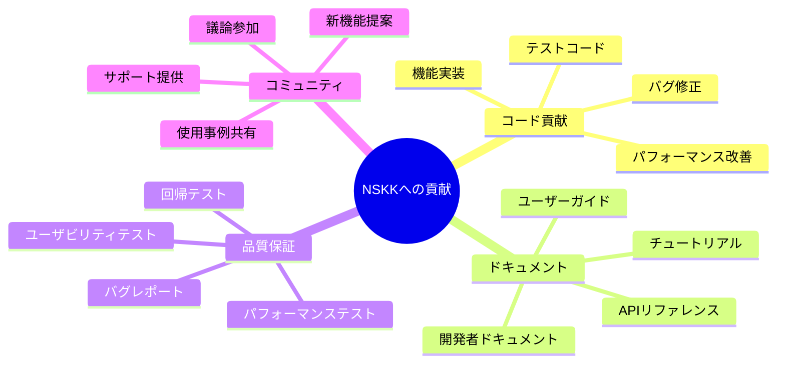
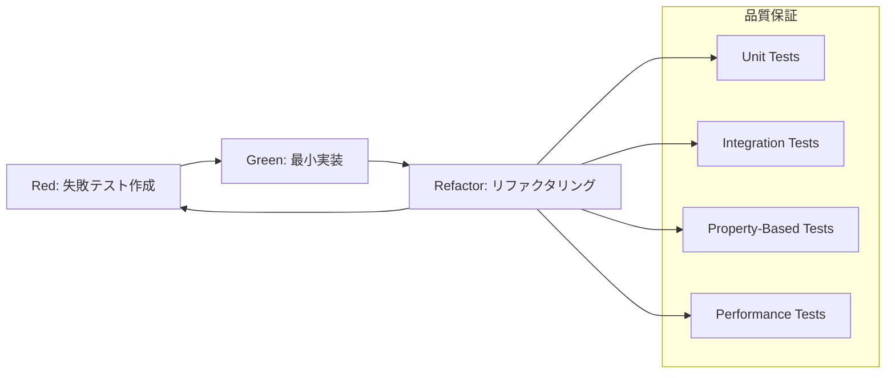
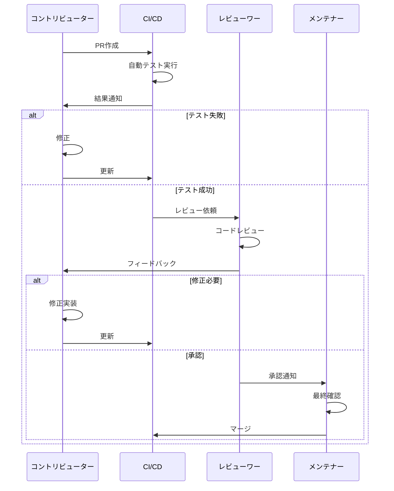
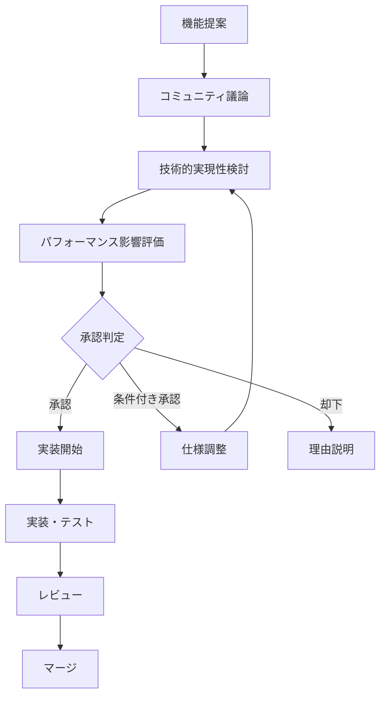
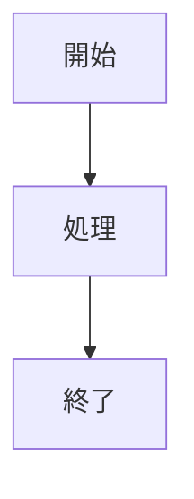
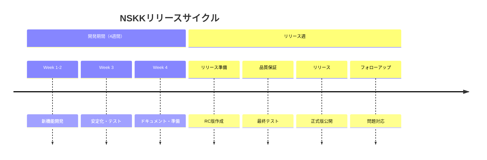

# NSKKコントリビューションガイド

## 概要

NSKKプロジェクトへの貢献を歓迎します！このガイドでは、NSKKの実装に貢献するための詳細な手順とガイドラインを提供します。コード品質、テスト、ドキュメント、パフォーマンスの全ての面で高水準を維持するため、明確な基準を設けています。

## 貢献の種類

NSKKでは以下の貢献を受け付けています：



## 事前準備

### 開発環境セットアップ

1. **必要な環境**：
   ```bash
   # Emacs 27.1以降（推奨：29.1以降）
   emacs --version

   # Git（最新版推奨）
   git --version

   # 開発用ツール
   make --version
   ```

2. **リポジトリのクローン**：
   ```bash
   git clone https://github.com/takeokunn/nskk.el.git
   cd nskk.el

   # 開発ブランチ作成
   git checkout -b feature/your-feature-name
   ```

3. **開発環境初期化**：
   ```bash
   # 依存関係チェック
   make check-deps

   # 開発用設定適用
   make dev-setup

   # 全テスト実行（初期確認）
   make test-all
   ```

### 開発者設定

```elisp
;; 開発者向けNSKK設定（~/.emacs.d/init.el）
(when (file-directory-p "~/path/to/nskk.el")
  (add-to-list 'load-path "~/path/to/nskk.el")
  (require 'nskk)

  ;; 開発モード有効化
  (setq nskk-debug-mode t
        nskk-performance-monitoring t
        nskk-log-level 'debug)

  ;; 自動リロード設定
  (global-auto-revert-mode 1)
  (setq auto-revert-interval 1))
```

## コーディング規約

### 基本原則

NSKKのコーディング規約は[Emacs Lispベストプラクティス](./explanation/emacs-lisp-best-practices.md)に基づきます：

#### 1. 命名規則

```elisp
;; ✅ 公開API
(defun nskk-activate ()
  "NSKK有効化")

(defvar nskk-dictionary-path nil
  "辞書ファイルパス")

;; ✅ 内部実装
(defun nskk--process-input (char)
  "内部：文字処理")

(defvar nskk--state nil
  "内部：状態管理")

;; ✅ 定数
(defconst nskk-VERSION "1.0.0"
  "NSKKバージョン")

;; ❌ 避けるべき命名
(defun process-char (c)  ; プレフィックスなし
  ...)
(defvar dict-path nil)   ; 略語使用
```

#### 2. 関数設計

```elisp
;; ✅ 推奨：単一責任、純粋関数
(defun nskk--calculate-candidate-score (candidate frequency context)
  "候補スコア計算（副作用なし）"
  (+ (* frequency 0.7) (* context 0.3)))

;; ✅ 副作用の明示
(defun nskk--update-learning-data! (candidate)
  "学習データ更新（破壊的変更）"
  (cl-incf (nskk--get-frequency candidate)))

;; ❌ 避けるべき：複数責任
(defun nskk-convert-and-display-and-learn (input)
  ...)
```

#### 3. エラーハンドリング

```elisp
;; ✅ 適切なエラーハンドリング
(defun nskk--load-dictionary-safe (path)
  "安全な辞書読み込み"
  (condition-case err
      (nskk--load-dictionary path)
    (file-error
     (nskk--warn "辞書ファイルが見つかりません: %s" path)
     (nskk--use-fallback-dictionary))
    (error
     (nskk--log-error "辞書読み込みエラー: %s" err)
     nil)))
```

### パフォーマンス要件

#### 応答時間基準

| 操作 | 目標時間 | 必須 |
|------|----------|------|
| キー入力応答 | < 1ms | ✅ |
| ローマ字変換 | < 1ms | ✅ |
| 漢字変換 | < 100ms | ✅ |
| 辞書検索 | < 50ms | ✅ |

#### パフォーマンステスト

```elisp
;; 新機能にはベンチマーク必須
(defun nskk-test-new-feature-performance ()
  "新機能パフォーマンステスト"
  (nskk-benchmark-precise "new-feature" 1000
    (nskk-your-new-function)))

;; PRに含めるパフォーマンス確認
(ert-deftest nskk-test-performance-regression ()
  "パフォーマンス回帰テスト"
  (should (< (nskk--measure-function-time #'nskk-convert-romaji "test")
             0.001))) ; 1ms以下必須
```

## テスト戦略

### TDDアプローチ

NSKKではTest-Driven Development (TDD)を採用します：



#### 1. 単体テスト

```elisp
;; テスト例：ローマ字変換
(ert-deftest nskk-test-romaji-basic-conversion ()
  "基本ローマ字変換テスト"
  (should (equal (nskk-convert-romaji "ka") "か"))
  (should (equal (nskk-convert-romaji "ki") "き"))
  (should (equal (nskk-convert-romaji "konnichiwa") "こんにちわ")))

;; エラーケースも必須
(ert-deftest nskk-test-romaji-error-cases ()
  "ローマ字変換エラーケース"
  (should (equal (nskk-convert-romaji "") ""))
  (should (equal (nskk-convert-romaji nil) ""))
  (should-error (nskk-convert-romaji 123)))
```

#### 2. プロパティベーステスト

```elisp
;; PBT例：変換の可逆性
(nskk-property-test conversion-reversibility
  ((input romaji-string))
  (let ((hiragana (nskk-convert-romaji input)))
    (when (nskk--valid-hiragana-p hiragana)
      (should (string= input
                      (nskk-convert-hiragana-to-romaji hiragana))))))
```

#### 3. 統合テスト

```elisp
;; 統合テスト例：完全な変換フロー
(ert-deftest nskk-test-full-conversion-flow ()
  "完全変換フローテスト"
  (nskk-test-with-clean-state
    (nskk-activate)
    (nskk--simulate-input "Konnichiwa")
    (should (equal nskk--current-candidates
                   '("こんにちは" "今日は")))
    (nskk--select-candidate 0)
    (should (equal (buffer-substring-no-properties
                   (point-min) (point-max))
                   "こんにちは"))))
```

### テスト実行

```bash
# 全テスト実行
make test

# 特定カテゴリのテスト
make test-unit
make test-integration
make test-performance

# カバレッジ測定
make coverage

# テスト結果レポート
make test-report
```

## プルリクエストプロセス

### 1. 事前チェック

プルリクエスト作成前の必須項目：

```bash
# コードスタイルチェック
make lint

# 全テスト実行
make test-all

# パフォーマンステスト
make benchmark

# ドキュメント更新確認
make doc-check
```

### 2. プルリクエストテンプレート

```markdown
## 概要
[変更内容の簡潔な説明]

## 変更の種類
- [ ] 新機能
- [ ] バグ修正
- [ ] パフォーマンス改善
- [ ] ドキュメント更新
- [ ] リファクタリング

## 詳細
### 実装内容
[詳細な実装内容]

### パフォーマンス影響
[パフォーマンスへの影響を数値で示す]

### 後方互換性
[既存APIへの影響]

## テスト
- [ ] 単体テスト追加
- [ ] 統合テスト追加
- [ ] パフォーマンステスト実行
- [ ] 手動テスト実行

## チェックリスト
- [ ] コーディング規約準拠
- [ ] ドキュメント更新
- [ ] パフォーマンス要件達成
- [ ] 後方互換性維持
- [ ] テストカバレッジ維持

## 関連Issue
Closes #[issue番号]
```

### 3. レビュープロセス



## コードレビューガイドライン

### レビューワー向け

#### チェックポイント

1. **機能性**：
   ```
   ✅ 仕様どおりに動作するか
   ✅ エラーケースが適切に処理されているか
   ✅ 既存機能に影響がないか
   ```

2. **パフォーマンス**：
   ```
   ✅ 応答時間要件を満たしているか
   ✅ メモリ使用量が適切か
   ✅ 最適化の余地はないか
   ```

3. **保守性**：
   ```
   ✅ コードが読みやすいか
   ✅ 適切にドキュメント化されているか
   ✅ テストが十分にあるか
   ```

4. **設計**：
   ```
   ✅ アーキテクチャに沿っているか
   ✅ 単一責任原則に従っているか
   ✅ 拡張性があるか
   ```

#### レビューコメント例

```
# ✅ 良いレビューコメント
「この部分でO(n²)の計算量になっていますが、ハッシュテーブルを使うことでO(n)に改善できそうです。パフォーマンステストで影響を確認してください。」

# ❌ 避けるべきコメント
「ここが悪い」（具体的でない）
```

### コントリビューター向け

#### レビュー対応

1. **建設的フィードバックの受け入れ**：
   - 全てのコメントに誠実に対応
   - 不明な点は質問で明確化
   - 代替案があれば提案

2. **迅速な対応**：
   - 24時間以内にレスポンス
   - 修正が困難な場合は理由を説明
   - 進捗を定期的に報告

## バグレポートガイドライン

### 効果的なバグレポート

```markdown
## バグレポートテンプレート

### 概要
[バグの簡潔な説明]

### 環境
- NSKK バージョン:
- Emacs バージョン:
- OS:
- 辞書:

### 再現手順
1.
2.
3.

### 期待する動作
[期待していた結果]

### 実際の動作
[実際に起こったこと]

### ログ
```
[エラーメッセージやログがあれば]
```

### 追加情報
[その他の関連情報]
```

### バグレポートの優先度

| 優先度 | 基準 | 対応時間 |
|--------|------|----------|
| Critical | システムクラッシュ、データ損失 | 24時間以内 |
| High | 主要機能停止 | 3日以内 |
| Medium | 機能不具合 | 1週間以内 |
| Low | 軽微な問題 | 2週間以内 |

## 機能提案プロセス

### 1. 事前議論

新機能提案前に：

1. **既存機能の確認**：
   - 類似機能が存在しないか調査
   - 既存機能の拡張で対応できないか検討

2. **コミュニティでの議論**：
   - Discussionsで提案
   - ユーザーからのフィードバック収集
   - 実装コストと効果の検討

### 2. 提案テンプレート

```markdown
## 機能提案テンプレート

### 機能概要
[提案する機能の説明]

### 動機・目的
[なぜこの機能が必要か]

### 詳細仕様
[具体的な仕様]

### ユーザー体験
[ユーザーがどう使うか]

### 実装アプローチ
[技術的実装方針]

### パフォーマンス影響
[性能への影響評価]

### 代替案
[検討した他の解決策]

### 参考資料
[関連する情報]
```

### 3. 承認プロセス



## ドキュメント貢献

### ドキュメント種別

NSKKではDiátaxisフレームワークに基づくドキュメント構造を採用：

1. **Tutorial**: 学習指向
2. **How-to**: 問題解決指向
3. **Reference**: 情報指向
4. **Explanation**: 理解指向

### ドキュメント作成ガイドライン

#### 1. 構造とスタイル

```markdown
# タイトル（簡潔で説明的）

## 概要
[2-3行で内容を要約]

## 目次（必要に応じて）

## 本文
### セクション
内容...

### 具体例
```elisp
;; コード例は必ずテスト済みのものを使用
(nskk-function-example)
```

## まとめ
[key takeaways]
```

#### 2. 図表の使用

```markdown
# mermaidダイアグラム使用


# 表の使用
| 項目 | 説明 | 例 |
|------|------|-----|
| ... | ... | ... |
```

#### 3. 品質基準

- **正確性**: 最新の実装と一致
- **完全性**: 必要な情報を網羅
- **明確性**: 技術レベルに応じた説明
- **例の充実**: 実践的なサンプル
- **保守性**: 更新しやすい構造

## リリースプロセス

### バージョニング

NSKKは[Semantic Versioning](https://semver.org/)に従います：

```
MAJOR.MINOR.PATCH

MAJOR: 非互換な変更
MINOR: 後方互換な機能追加
PATCH: 後方互換なバグ修正
```

### リリースサイクル



### リリース手順

1. **準備フェーズ**：
   ```bash
   # バージョン更新
   make update-version VERSION=1.2.0

   # 全テスト実行
   make test-all

   # ドキュメント更新
   make doc-update
   ```

2. **リリース候補版**：
   ```bash
   # RC版作成
   make release-candidate VERSION=1.2.0-rc1

   # コミュニティテスト期間（1週間）
   ```

3. **正式リリース**：
   ```bash
   # 正式版リリース
   make release VERSION=1.2.0

   # パッケージ公開
   make publish
   ```

## コミュニティガイドライン

### 行動規範

NSKKコミュニティでは以下の価値観を大切にします：

1. **尊重**: 多様な意見と背景を尊重
2. **協力**: 建設的な議論と協力
3. **学習**: 共に学び成長する姿勢
4. **品質**: 高品質への共通追求
5. **包容**: すべてのレベルの貢献者を歓迎

### コミュニケーション

#### 推奨事項

- **明確で具体的な質問**
- **コードサンプルの提供**
- **環境情報の記載**
- **建設的なフィードバック**
- **感謝の表現**

#### 避けるべき行為

- **無関係な議論**
- **個人攻撃**
- **曖昧な質問**
- **スパム行為**
- **機密情報の共有**

## 認識と報奨

### コントリビューター認識

貢献に対する認識制度：

1. **Contributors リスト**: README.mdでの名前掲載
2. **特別な貢献**: リリースノートでの言及
3. **コミットアクセス**: 継続的貢献者への権限付与
4. **スペシャルサンクス**: 重要な貢献への特別認識

### メンテナーシップ

長期的な貢献者に対するメンテナー招待：

#### 条件
- 6ヶ月以上の継続的貢献
- 高品質なコード提供
- コミュニティへの建設的参加
- NSKKの価値観への理解

#### 責任
- プルリクエストレビュー
- イシュー管理
- リリース作業支援
- 新規貢献者サポート

## トラブルシューティング

### よくある問題

#### 1. 開発環境の問題

```bash
# 依存関係の問題
make clean && make setup

# テスト失敗
make test-debug

# パフォーマンス問題
make profile
```

#### 2. プルリクエストの問題

- **CI失敗**: ログを確認し、該当箇所を修正
- **マージコンフリクト**: ベースブランチを更新してリベース
- **レビュー時間**: 複雑なPRは小さく分割

#### 3. コミュニケーションの問題

- **返答がない**: @メンションを使用
- **議論が平行線**: 具体例やコードで説明
- **技術的質問**: 再現可能な最小例を提供

## 参考資料

### 開発関連

- [Emacs Lispベストプラクティス](./explanation/emacs-lisp-best-practices.md)
- [パフォーマンス・ベンチマーク仕様](./explanation/performance-benchmarks.md)
- [TDD/PBT戦略](./explanation/tdd-pbt-strategy.md)
- [アーキテクチャ概観](./explanation/comprehensive-architecture-overview.md)

### 外部リソース

- [Emacs Lisp Reference Manual](https://www.gnu.org/software/emacs/manual/html_node/elisp/)
- [SKK公式サイト](http://openlab.jp/skk/)
- [Semantic Versioning](https://semver.org/)
- [Diátaxis Documentation Framework](https://diataxis.fr/)

## まとめ

NSKKへの貢献により、以下に参加できます：

### ✅ 高水準の技術追求
- 1ms以下の応答時間実現
- 外部依存ゼロアーキテクチャ
- マクロ駆使による極限最適化

### ✅ オープンソースコミュニティ
- 技術的成長とスキルアップ
- グローバルな開発者ネットワーク
- 日本語入力技術の発展への貢献

### ✅ 継続的品質改善
- TDD/PBTによる堅牢性
- 包括的テストとベンチマーク
- ユーザー中心の設計

あなたの貢献で、NSKKがさらに多くのユーザーにとってより良い日本語入力環境となることを期待しています。

**Welcome to the NSKK Community! 🚀**