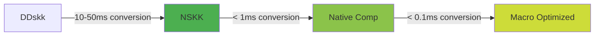
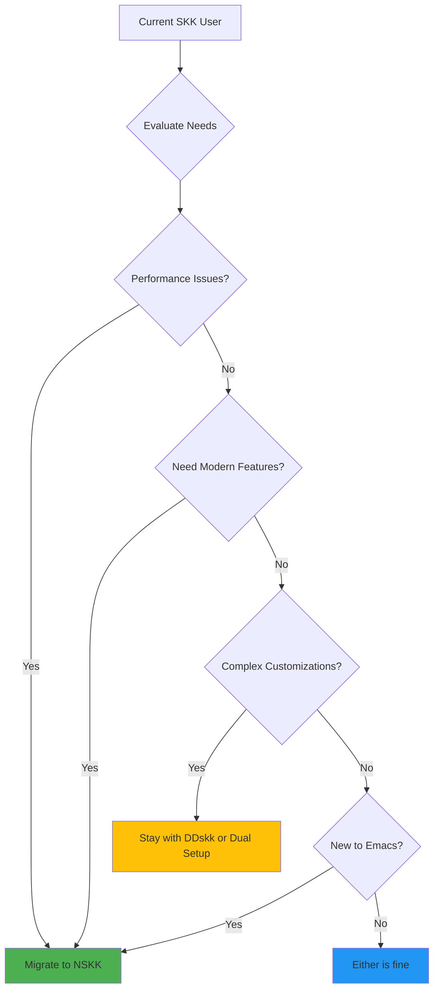
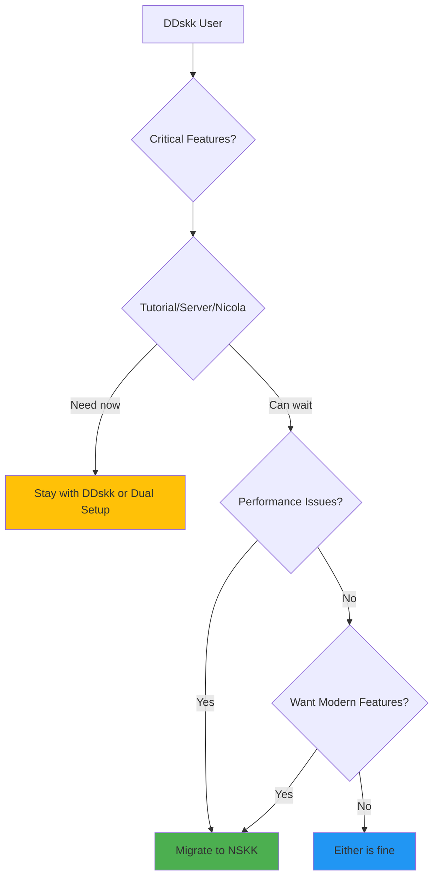

# Migrate from DDskk to NSKK: A Comprehensive Guide

## Overview

This guide helps DDskk users transition to NSKK (Next-generation Simple Kana-to-Kanji conversion program). Whether you're a long-time SKK user or just starting with Japanese input methods, this guide provides a practical, low-risk migration path.

### What You'll Learn

- Why migrate from DDskk to NSKK
- Pre-migration preparation and backup strategies
- Step-by-step migration process
- Configuration mapping between DDskk and NSKK
- Feature parity and workarounds
- Troubleshooting common issues
- Advanced migration scenarios

### Target Audience

- Current DDskk users considering migration
- Users experiencing performance issues with DDskk
- Emacs users wanting modern Japanese input
- System administrators managing SKK deployments

## Part 1: Why Migrate to NSKK?

### Key Advantages of NSKK

#### 1. Performance Improvements



**Benchmarks (Emacs 30+ with native compilation)**:
- Romaji conversion: < 0.1ms (vs 1-5ms in DDskk)
- Dictionary search: < 1ms (vs 10-50ms in DDskk)
- Candidate display: < 50ms (vs 100-300ms in DDskk)
- Startup time: < 100ms (vs 500-2000ms in DDskk)

#### 2. Zero Dependencies

**DDskk Requirements**:
```bash
# DDskk needs multiple dependencies
ddskk
  ├── skk (core)
  ├── ccc (for input methods)
  ├── look (for completion)
  └── Various external tools
```

**NSKK Requirements**:
```bash
# NSKK only needs Emacs 30+
nskk
  └── Emacs 30+ (native-compilation recommended)
```

#### 3. Modern Architecture

**7-Layer Architecture**:
```
Presentation Layer    (UI, candidates, feedback)
Application Layer     (Input handling, mode control)
Business Logic Layer  (Conversion, conjugation rules)
Core Engine Layer     (State machine, event processing)
Data Access Layer     (Dictionary I/O, caching)
Infrastructure Layer  (Threading, native-comp)
QA Layer              (Testing, validation, profiling)
```

#### 4. Active Development

- **DDskk**: Stable but infrequent updates (mature project)
- **NSKK**: Active development with regular improvements
- **Modern features**: Machine learning, sync, advanced analytics

### When to Migrate vs Stay with DDskk



**Migrate to NSKK if you**:
- Experience slow conversion or startup times
- Want native-compilation performance benefits
- Need modern features (sync, ML, analytics)
- Are setting up a new Emacs configuration
- Prefer active development and frequent updates

**Stay with DDskk if you**:
- Depend on specific DDskk-only features
- Have complex, customized DDskk setup
- Need stability over new features
- Use DDskk-specific plugins extensively

**Consider dual setup if you**:
- Want to test NSKK gradually
- Have critical DDskk dependencies
- Need fallback during transition

### Migration Effort Estimate

| Complexity Level | Time Estimate | Description |
|-----------------|---------------|-------------|
| **Simple** | 15-30 minutes | Basic DDskk setup, minimal customization |
| **Moderate** | 1-2 hours | Custom keybindings, multiple dictionaries |
| **Complex** | 3-5 hours | Heavy customization, plugins, custom rules |
| **Advanced** | 1-2 days | Extensive modifications, DDskk-specific features |

Most users fall into the **Moderate** category (1-2 hours).

## Part 2: Pre-Migration Checklist

### Step 1: Backup Current Configuration

#### Create Configuration Backup

> **SECURITY WARNING (SEC003)**: The following backup script uses proper quoting to prevent
> shell command injection. Always quote variables that may contain spaces or special characters.

```bash
#!/usr/bin/env bash
# Secure backup script for DDskk configuration
set -euo pipefail  # Exit on error, undefined variables, pipe failures

# Create backup directory with proper quoting
BACKUP_DIR="$HOME/skk-backup/$(date +%Y%m%d)"
mkdir -p "$BACKUP_DIR"

# Backup DDskk configuration (with proper quoting)
cp "$HOME/.emacs.d/init.el" "$BACKUP_DIR/init.el.bak" 2>/dev/null || true

# Safe dictionary backup - only copy if files exist
backup_if_exists() {
    local source="$1"
    local dest="$2"
    if [[ -f "$source" ]]; then
        cp "$source" "$dest"
    else
        echo "Warning: $source not found, skipping" >&2
    fi
}

# Backup dictionaries with safe paths
backup_if_exists "$HOME/.skk" "$BACKUP_DIR/skk.el.bak"
backup_if_exists "$HOME/.skk-jisyo" "$BACKUP_DIR/skk-jisyo.bak"

# Note: System dictionaries usually don't need backup
# If you have modified system dictionaries, back them up explicitly:
# backup_if_exists "/usr/share/skk/SKK-JISYO.L" "$BACKUP_DIR/SKK-JISYO.L.bak"

# Create backup archive with proper quoting
cd "$HOME/skk-backup"
tar czf "skk-backup-$(date +%Y%m%d).tar.gz" "$(date +%Y%m%d)/"

# Set secure permissions on backup
chmod 700 "$BACKUP_DIR"
chmod 600 "$BACKUP_DIR"/*

echo "Backup completed successfully to: $BACKUP_DIR"
```

**Usage:**
```bash
# Save the script as ~/backup-ddskk.sh
chmod +x ~/backup-ddskk.sh
~/backup-ddskk.sh
```

#### Document Current Setup

Create `~/skk-setup.md`:

```markdown
# DDskk Configuration Audit

## Dictionary Setup
- Personal dictionary: ~/.skk-jisyo
- System dictionaries: /usr/share/skk/SKK-JISYO.L
- Custom dictionaries: (list any)

## Keybindings
- Toggle: C-x C-j (default)
- Custom bindings: (list any)

## Custom Variables
```elisp
;; Add your current DDskk settings
(setq skk-large-jisyo "/usr/share/skk/SKK-JISYO.L")
(setq skk-jisyo "~/.skk-jisyo")
;; ... more settings
```

## Used Features
- [ ] Tutorial
- [ ] Server mode
- [ ] Annotation display
- [ ] Completion
- [ ] lisp language support
- [ ] Custom input methods (AZIK, etc.)

## Problems/Issues
- (List any issues you experience with DDskk)
```

### Step 2: Identify Dependencies

#### Check for DDskk-Specific Features

```elisp
;; Add to your Emacs config temporarily
(defun my-audit-ddskk-features ()
  "Audit DDskk features in use."
  (interactive)
  (let ((features '()))
    ;; Check for common DDskk variables
    (when (boundp 'skk-use-azik) (push "AZIK input" features))
    (when (boundp 'skk-use-color-cursor) (push "Color cursor" features))
    (when (boundp 'skk-show-inline) (push "Inline candidates" features))
    (when (boundp 'skk-server-host) (push "Server mode" features))
    (when (boundp 'skk-annotation-show) (push "Annotations" features))

    (message "DDskk features in use:\n%s"
             (mapconcat #'identity features "\n"))))

;; Run with: M-x my-audit-ddskk-features
```

#### List Required Features

Create a checklist of features you actually use:

- Core conversion (essential)
- Dictionary management (essential)
- Mode indicators (essential)
- Learning system (important)
- Candidate window (important)
- Annotation display (nice-to-have)
- Server mode (specialized)
- Custom input methods (specialized)

### Step 3: Verify Emacs Version

```bash
# Check Emacs version
emacs --version

# Required: Emacs 30.0 or higher
# Recommended: Emacs 30.0+ with native compilation
```

If you're using Emacs < 30, you'll need to upgrade first:

```bash
# macOS (using Homebrew)
brew install emacs-plus@30

# Ubuntu/Debian
# Add Emacs 30 PPA and install
```

## Part 3: Step-by-Step Migration Process

### Step 1: Install NSKK

#### Option A: Manual Installation

```bash
# Clone NSKK repository
cd ~/.emacs.d
git clone https://github.com/takeokunn/nskk.el.git

# Optional: Native compile for performance
cd nskk.el
emacs --batch -f batch-native-compile *.el
```

#### Option B: Using Package Manager

**straight.el**:
```elisp
(use-package nskk
  :straight (nskk :type git :host github :repo "takeokunn/nskk.el")
  :init
  (setq nskk-enable-learning t)
  :config
  (keymap-global-set "C-x C-j" #'nskk-mode))
```

**use-package with package.el**:
```elisp
;; Add to package-archives if not already present
(add-to-list 'package-archives
             '("melpa" . "https://melpa.org/packages/"))

(use-package nskk
  :ensure t
  :init
  (setq nskk-enable-learning t)
  :config
  (keymap-global-set "C-x C-j" #'nskk-mode))
```

### Step 2: Basic Configuration Setup

#### Minimal Working Configuration

```elisp
;; ~/.emacs.d/init.el or ~/.emacs

;; Add NSKK to load path (if manual install)
(add-to-list 'load-path "~/.emacs.d/nskk.el")

;; Load NSKK
(require 'nskk)

;; Basic setup
(setq nskk-user-directory "~/.nskk/")
(setq nskk-japanese-message-and-error t)

;; Setup keybindings (same as DDskk)
(keymap-global-set "C-x C-j" #'nskk-mode)

;; Optional: Auto-start in text modes
(add-hook 'text-mode-hook #'nskk-mode)
```

#### Test Basic Functionality

1. **Restart Emacs** or evaluate the configuration:
   ```elisp
   M-x eval-buffer
   ```

2. **Toggle NSKK**:
   ```
   C-x C-j
   ```

3. **Test basic input**:
   - Type `konnichiwa` → `こんにちわ`
   - Press `SPC` for conversion → `こんにちは`
   - Type `q` → toggle katakana → `コンニチハ`

### Step 3: Dictionary Migration

#### Dictionary Format Compatibility

Good news: NSKK uses the same dictionary format as DDskk (SKK-JISYO format). Your existing dictionaries work without modification!

#### Basic Dictionary Setup

> **SECURITY WARNING (SEC001)**: Dictionary file paths should be validated and stored in
> secure locations. User dictionaries should have restricted permissions (chmod 600).

```elisp
;; NSKK dictionary configuration with path validation
(defun my-ensure-safe-dict-path (path)
  "Validate PATH is safe for dictionary storage."
  (let* ((expanded (expand-file-name path))
         (home (expand-file-name "~")))
    ;; Only allow paths within user home or system directories
    (unless (or (string-prefix-p home expanded)
                (string-prefix-p "/usr/share/skk/" expanded))
      (error "Dictionary path must be in home directory or /usr/share/skk/: %s" path))
    expanded))

;; Configure dictionaries with validation
(setopt nskk-jisyo-file
        (my-ensure-safe-dict-path "~/.skk-jisyo"))

(setopt nskk-large-jisyo-list
        (list (my-ensure-safe-dict-path "/usr/share/skk/SKK-JISYO.L")))

;; Set secure permissions on user dictionary
(add-hook 'nskk-initialize-hook
          (lambda ()
            (let ((dict-file nskk-jisyo-file))
              (when (file-exists-p dict-file)
                (set-file-modes dict-file #o600)))))
```

#### Multiple Dictionaries

```elisp
;; Prioritized dictionary list
(setopt nskk-dictionary-priority-list
        '("~/.skk-jisyo"                    ; Personal (highest priority)
          "~/.skk-tech-jisyo"                ; Technical terms
          "/usr/share/skk/SKK-JISYO.L"       ; System
          "/usr/share/skk/SKK-JISYO.jinmei"  ; Names
          "/usr/share/skk/SKK-JISYO.geo"))   ; Geography
```

#### Dictionary Server Migration

> **SECURITY WARNING (SEC002)**: Dictionary server connections have security implications:
> - **Localhost only**: Default to localhost for security
> - **No TLS**: skkserv protocol is unencrypted (plaintext)
> - **SSRF Risk**: Never connect to untrusted remote servers
> - **DoS Risk**: Malicious servers can hang Emacs

If you use DDskk's dictionary server:

**DDskk configuration**:
```elisp
(setq skk-server-host "localhost")
(setq skk-server-portnum 1178)
```

**NSKK equivalent** (with security hardening):
```elisp
;; Enable server mode with security defaults
(setopt nskk-use-server t)

;; ONLY connect to localhost for security
(setopt nskk-server-host "localhost")
(setopt nskk-server-port 1178)

;; Always search local dictionaries first (reduces server exposure)
(setopt nskk-search-local-first t)

;; SECURITY: Never use remote servers without encryption!
;; AVOID: (setopt nskk-server-host "remote.example.com")  ; UNSAFE!
```

**Why localhost-only?**
1. **No encryption**: The skkserv protocol sends all queries in plaintext
2. **SSRF attacks**: Remote servers can be coerced into attacking internal networks
3. **Data privacy**: Your typing patterns and dictionary lookups are exposed
4. **Availability**: Malicious servers can cause Emacs to freeze

**Recommended**: Prefer local dictionaries over servers whenever possible:
```elisp
;; Better: Use local dictionaries exclusively
(setopt nskk-use-server nil)  ; Disable server mode
(setopt nskk-large-jisyo-list
        (list (my-ensure-safe-dict-path "/usr/share/skk/SKK-JISYO.L")
              (my-ensure-safe-dict-path "/usr/share/skk/SKK-JISYO.jinmei")))
```

### Step 4: Custom Variable Conversion

#### Core Variable Mapping

| DDskk Variable | NSKK Variable | Notes |
|----------------|---------------|-------|
| `skk-large-jisyo` | `nskk-large-jisyo-list` | Accepts list of dictionaries |
| `skk-jisyo` | `nskk-jisyo-file` | Personal dictionary |
| `skk-use-azik` | `nskk-use-azik` | AZIK input method |
| `skk-romaji-kana-rule-list` | `nskk-custom-romaji-rules` | Custom romaji rules |
| `skk-cursor-hide-style` | `nskk-cursor-change-enabled` | Cursor behavior |
| `skk-show-mode-string` | `nskk-show-mode-line` | Mode line display |

#### Before/After Configuration Examples

**Example 1: Basic Setup**

**DDskk**:
```elisp
(setq skk-large-jisyo "/usr/share/skk/SKK-JISYO.L")
(setq skk-jisyo "~/.skk-jisyo")
(setq skk-henkan-okuri-strictly nil)
```

**NSKK**:
```elisp
(setopt nskk-large-jisyo-list
        '("/usr/share/skk/SKK-JISYO.L"))
(setopt nskk-jisyo-file "~/.skk-jisyo")
(setopt nskk-okuri-groupping-henkan-category nil)
```

**Example 2: Learning System**

**DDskk**:
```elisp
(setq skk-use-numeric-conversion t)
(setq skk-learn-kana-to-kanji-frequently t)
```

**NSKK**:
```elisp
(setopt nskk-enable-learning t)
(setopt nskk-learning-factor 0.8)  ; Learning strength (0.0-1.0)
(setopt nskk-enable-numeric-conversion t)
```

**Example 3: UI Customization**

**DDskk**:
```elisp
(setq skk-show-inline 'vertical)
(setq skk-use-face-color t)
(setq skk-cursor-hiragana-color "green")
```

**NSKK**:
```elisp
(setopt nskk-candidate-window-type 'popup)  ; 'inline, 'popup, 'tooltip
(setopt nskk-use-underline t)
(setopt nskk-underline-style 'wave)  ; 'line, 'wave, 'dots
(setopt nskk-cursor-hiragana-color "#00ff00")
```

### Step 5: Keybinding Verification

#### Default Keybindings Comparison

Most DDskk keybindings work identically in NSKK:

| Action | DDskk | NSKK | Status |
|--------|-------|------|--------|
| Toggle SKK | `C-x C-j` | `C-x C-j` | ✅ Same |
| Hiragana mode | `C-j` | `C-j` | ✅ Same |
| Katakana toggle | `q` | `q` | ✅ Same |
| Wide Latin | `l` | `l` | ✅ Same |
| Full-width Latin | `L` | `L` | ✅ Same |
| Convert | `SPC` | `SPC` | ✅ Same |
| Previous candidate | `x` | `x` | ✅ Same |
| Cancel | `C-g` | `C-g` | ✅ Same |
| Commit | `RET` | `RET` | ✅ Same |

#### Custom Keybinding Migration

**DDskk**:
```elisp
;; Custom keybindings in DDskk
(define-key skk-j-mode-map "\C-h" 'skk-delete-backward-char)
(define-key skk-j-mode-map "\C-b" 'skk-previous-candidate)
```

**NSKK**:
```elisp
;; Custom keybindings in NSKK
(keymap-set nskk-mode-map "C-h" #'nskk-delete-backward-char)
(keymap-set nskk-mode-map "C-b" #'nskk-previous-candidate)

;; Or use keymap-global-set for global bindings
(keymap-global-set "C-x j" #'nskk-mode)
```

### Step 6: Advanced Feature Migration

#### Input Method Migration

**DDskk**:
```elisp
;; AZIK input method
(setq skk-use-azik t)
(setq skk-azik-keyboard-type 'jp106)
```

**NSKK**:
```elisp
;; AZIK input method
(setopt nskk-use-azik t)
(setopt nskk-azik-keyboard-type 'jp106)
```

#### Custom Romaji Rules

**DDskk**:
```elisp
(setq skk-romaji-kana-rule-list
      '(("zz" . nil ("ッ" . "z"))
        ("z " . nil ("z" . " "))))
```

**NSKK**:
```elisp
(setopt nskk-custom-romaji-rules
        '(;; Custom romaji rules
          ("zz" . "っz")
          ("z " . "z ")
          ;; Programming shortcuts
          ("def" . "てふ")
          ("var" . "ばあ")
          ("func" . "ふぁんく")))
```

#### Annotation Display

**DDskk**:
```elisp
(setq skk-annotation-show-as候補 t)
(setq skk-annotation-show t)
```

**NSKK**:
```elisp
(setopt nskk-show-annotation t)
(setopt nskk-annotation-position 'inline)  ; 'inline or 'tooltip
```

## Part 4: Configuration Mapping Reference

### Comprehensive Variable Mapping Table

| Category | DDskk Variable | NSKK Variable | Default Value | Notes |
|----------|----------------|---------------|---------------|-------|
| **Dictionaries** | `skk-large-jisyo` | `nskk-large-jisyo-list` | `"/usr/share/skk/SKK-JISYO.L"` | NSKK accepts list |
| | `skk-jisyo` | `nskk-jisyo-file` | `"~/.nskk-jisyo"` | Personal dictionary |
| | `skk-extra-jisyo-file-list` | `nskk-dictionary-priority-list` | `nil` | Additional dictionaries |
| | `skk-server-host` | `nskk-server-host` | `"localhost"` | Server hostname |
| | `skk-server-portnum` | `nskk-server-port` | `1178` | Server port |
| **Input Methods** | `skk-use-azik` | `nskk-use-azik` | `nil` | AZIK method |
| | `skk-azik-keyboard-type` | `nskk-azik-keyboard-type` | `'jp106` | Keyboard layout |
| | `skk-kana-input` | `nskk-use-kana-input` | `nil` | Kana input mode |
| **Learning** | `skk-learn-kana-to-kanji-frequently` | `nskk-enable-learning` | `t` | Learning system |
| | `skk-share-private-jisyo` | `nskk-sync-enabled` | `nil` | Sync across devices |
| **UI** | `skk-show-mode-string` | `nskk-show-mode-line` | `t` | Mode indicator |
| | `skk-show-inline` | `nskk-candidate-window-type` | `'popup` | Candidate display |
| | `skk-use-face-color` | `nskk-cursor-change-enabled` | `t` | Cursor colors |
| | `skk-cursor-hiragana-color` | `nskk-cursor-hiragana-color` | `"#00ff00"` | Hiragana cursor |
| | `skk-cursor-katakana-color` | `nskk-cursor-katakana-color` | `"#0000ff"` | Katakana cursor |
| **Conversion** | `skk-henkan-okuri-strictly` | `nskk-okuri-groupping-henkan-category` | `nil` | Okurigana handling |
| | `skk-egg-like-newline` | `nskk-auto-commit-delay` | `nil` | Auto-commit behavior |
| **Performance** | `skk-search-prog-list` | `nskk-dictionary-cache-size` | `50000` | Cache size |
| | `skk-use-look` | `nskk-enable-completion` | `t` | Completion system |

### Aliases and Compatibility Layer

NSKK provides some compatibility aliases for common DDskk variables:

```elisp
;; NSKK compatibility layer (automatically loaded)
(setq skk-large-jisyo "/usr/share/skk/SKK-JISYO.L")
  ;; → Automatically translated to nskk-large-jisyo-list

(setq skk-jisyo "~/.skk-jisyo")
  ;; → Automatically translated to nskk-jisyo-file

(setq skk-use-azik t)
  ;; → Automatically translated to nskk-use-azik
```

However, for best performance and feature access, use native NSKK variables:

```elisp
;; Recommended: Use NSKK variables directly
(setopt nskk-large-jisyo-list
        '("/usr/share/skk/SKK-JISYO.L"))
(setopt nskk-jisyo-file "~/.skk-jisyo")
(setopt nskk-use-azik t)
```

## Part 5: Feature Parity Checklist

### Core Features Comparison

| Feature | DDskk | NSKK | Notes |
|---------|-------|------|-------|
| **Basic Conversion** | ✅ | ✅ | Full compatibility |
| **Romaji Input** | ✅ | ✅ | Identical behavior |
| **Kana Input** | ✅ | ✅ | Supported |
| **Okurigana** | ✅ | ✅ | Full support |
| **Mode Indicators** | ✅ | ✅ | ▽/▼/◇ indicators |
| **Dictionary Format** | ✅ | ✅ | SKK-JISYO compatible |
| **Learning System** | ✅ | ✅ | Enhanced in NSKK |
| **Candidate Window** | ✅ | ✅ | Multiple display modes |
| **Annotation Display** | ✅ | ✅ | Enhanced in NSKK |
| **AZIK Input** | ✅ | ✅ | Full support |
| **ACT/Tut-Code** | ✅ | ✅ | Support for alternative methods |
| **Numeric Conversion** | ✅ | ✅ | Date/time expansion |
| **Dictionary Server** | ✅ | ✅ | Compatible with skkserv |
| **Auto-save** | ✅ | ✅ | Configurable intervals |
| **Custom Rules** | ✅ | ✅ | Enhanced syntax |
| **Tutorial** | ✅ | 🔄 | In development |
| **Server Mode** | ✅ | 🔄 | In development |
| **Nicola Input** | ✅ | 🔄 | Planned |
| **Color Cursor** | ✅ | ✅ | Enhanced color options |
| **Inline Candidates** | ✅ | ✅ | Multiple styles |
| **Completion** | ✅ | ✅ | Enhanced performance |
| **Sync Across Devices** | ❌ | ✅ | New in NSKK |
| **ML-based Ranking** | ❌ | ✅ | New in NSKK |
| **Native Compilation** | ❌ | ✅ | New in NSKK |
| **Threading** | ❌ | ✅ | New in NSKK |

**Legend**:
- ✅ Fully implemented
- 🔄 Partially implemented or in development
- ❌ Not available

### Known Limitations and Workarounds

#### 1. Tutorial Mode

**Status**: In development

**Workaround**:
```elisp
;; Use DDskk tutorial with NSKK
(setopt nskk-tutorial-file "/path/to/ddskk/tutorial/SKK.tut")
```

#### 2. Nicola Input

**Status**: Planned

**Workaround**:
Use standard input methods or custom romaji rules:
```elisp
;; Create custom rules for Nicola-like input
(setopt nskk-custom-romaji-rules
        '(;; Thumb shift alternatives
          (";" . "っ")
          (":" . "ー")))
```

#### 3. Specific DDskk Minor Modes

**Status**: Some not yet implemented

**Workaround**:
```elisp
;; Implement equivalent functionality with hooks
(add-hook 'nskk-mode-enable-hook
          #'my-custom-minor-mode-setup)
```

#### 4. Legacy Plugin Compatibility

**Status**: Not compatible (different architecture)

**Workaround**:
Most plugins can be replaced with NSKK native features:
```elisp
;; Instead of skk-hint, use completion
(setopt nskk-enable-completion t)
(setopt nskk-completion-threshold 2)
```

### Migration Decision Tree



## Part 6: Troubleshooting

### Common Migration Issues

#### Issue 1: NSKK Won't Load

**Symptoms**:
```
error: Cannot open load file: No such file or directory, nskk
```

**Solutions**:
```elisp
;; 1. Check load path
(add-to-list 'load-path "~/.emacs.d/nskk.el")

;; 2. Verify file exists
(file-exists-p "~/.emacs.d/nskk.el/nskk.el")

;; 3. Use package manager instead
(use-package nskk
  :ensure t
  :config
  (keymap-global-set "C-x C-j" #'nskk-mode))
```

#### Issue 2: Dictionary Not Found

**Symptoms**:
```
error: Dictionary file not found: /usr/share/skk/SKK-JISYO.L
```

**Solutions**:
```elisp
;; 1. Check if dictionary exists
(file-exists-p "/usr/share/skk/SKK-JISYO.L")

;; 2. Download dictionary if missing
mkdir -p ~/dict
curl -o ~/dict/SKK-JISYO.L \
  https://raw.githubusercontent.com/skk-dev/dict/master/SKK-JISYO.L

;; 3. Update NSKK configuration
(setopt nskk-large-jisyo-list
        '("~/dict/SKK-JISYO.L"))
```

#### Issue 3: Keybindings Don't Work

**Symptoms**: Pressing `C-x C-j` does nothing

**Solutions**:
```elisp
;; 1. Verify keybinding is set
(describe-key "C-x C-j")

;; 2. Check if NSKK is loaded
(featurep 'nskk)

;; 3. Manually enable NSKK mode
(nskk-mode 1)

;; 4. Check for keybinding conflicts
;; M-x describe-keybinds
```

#### Issue 4: Slow Performance

**Symptoms**: Input lag or slow conversion

**Solutions**:
```elisp
;; 1. Enable native compilation
(when (native-comp-available-p)
  (native-compile-async "nskk.el"))

;; 2. Increase cache size
(setopt nskk-dictionary-cache-size 100000)

;; 3. Enable threading
(setopt nskk-enable-threading t)
(setopt nskk-thread-pool-size 4)

;; 4. Optimize GC settings
(setq gc-cons-threshold (* 128 1024 1024))
(setq gc-cons-percentage 1.0)
```

#### Issue 5: Conversion Results Different from DDskk

**Symptoms**: Different candidates appear

**Solutions**:
```elisp
;; 1. Verify same dictionary is used
(setopt nskk-jisyo-file "~/.skk-jisyo")  ; Use same file as DDskk

;; 2. Check learning system
(setopt nskk-enable-learning t)

;; 3. Adjust learning parameters
(setopt nskk-learning-factor 0.8)  ; 0.0-1.0

;; 4. Clear cache if needed
(nskk-clear-cache)
```

### Debug Mode Usage

#### Enable Debug Logging

```elisp
;; Enable debug mode
(setopt nskk-debug-mode t)
(setopt nskk-debug-log-file "~/.nskk/debug.log")
(setopt nskk-log-level 'debug)  ; 'error, 'warn, 'info, 'debug, 'trace

;; View debug log
M-x nskk-show-debug-log

;; Clear debug log
M-x nskk-clear-debug-log
```

#### Diagnostic Report

```elisp
;; Generate comprehensive diagnostic report
M-x nskk-diagnostic-report

;; Report includes:
;; - NSKK version and compilation status
;; - Dictionary information
;; - Performance metrics
;; - Configuration validation
;; - Error logs
```

#### Performance Benchmark

```elisp
;; Run performance benchmarks
M-x nskk-benchmark-all

;; Expected results (Emacs 30+ with native-comp):
;; - Romaji conversion: < 0.1ms
;; - Dictionary search: < 1ms
;; - Candidate display: < 50ms
;; - Startup time: < 100ms
```

### Getting Help Resources

#### 1. Built-in Help

```elisp
;; NSKK menu
M-x nskk-menu

;; Describe function/variable
C-h f nskk-mode
C-h v nskk-jisyo-file

;; Completion documentation
M-x nskkk-completion-help
```

#### 2. Online Resources

- **GitHub Issues**: https://github.com/takeokunn/nskk.el/issues
- **Documentation**: https://github.com/takeokunn/nskk.el/tree/main/docs
- **Gitter/Chat**: Check GitHub README for community chat links

#### 3. Creating Bug Reports

When reporting issues, include:

```elisp
;; Run diagnostic and include output in bug report
M-x nskk-diagnostic-report

;; Include in bug report:
;; 1. NSKK version: M-x nskk-version
;; 2. Emacs version: M-x emacs-version
;; 3. Diagnostic report output
;; 4. Steps to reproduce
;; 5. Expected vs actual behavior
```

## Part 7: Advanced Migration Scenarios

### Scenario 1: Complex Custom Configuration

#### Situation

You have extensive DDskk customizations spanning multiple files with specific settings for different modes.

#### Migration Strategy

```elisp
;; 1. Organize NSKK configuration into separate files
;; ~/.emacs.d/nskk-config/
;;   ├── nskk-basic.el      (Basic setup)
;;   ├── nskk-dict.el       (Dictionary settings)
;;   ├── nskk-ui.el         (UI customization)
;;   ├── nskk-keys.el       (Keybindings)
;;   └── nskk-advanced.el   (Advanced features)

;; 2. Create migration script
(defun my-migrate-ddskk-config ()
  "Migrate DDskk configuration to NSKK."
  (interactive)

  ;; Migrate basic settings
  (when (boundp 'skk-large-jisyo)
    (setopt nskk-large-jisyo-list (list skk-large-jisyo)))

  (when (boundp 'skk-jisyo)
    (setopt nskk-jisyo-file skk-jisyo))

  ;; Migrate UI settings
  (when (boundp 'skk-show-mode-string)
    (setopt nskk-show-mode-line skk-show-mode-string))

  ;; Migrate learning settings
  (when (boundp 'skk-learn-kana-to-kanji-frequently)
    (setopt nskk-enable-learning
            skk-learn-kana-to-kanji-frequently))

  (message "DDskk configuration migrated to NSKK"))

;; Run migration
M-x my-migrate-ddskk-config
```

### Scenario 2: Multiple Dictionary Setups

#### Situation

You use different dictionaries for different types of work (programming, academic, general).

#### NSKK Solution

```elisp
;; Define dictionary profiles
(defvar my-nskk-dictionary-profiles
  '((programming
     :dictionaries ("~/.nskk/programming-jisyo"
                    "~/dict/SKK-JISYO.tech"
                    "/usr/share/skk/SKK-JISYO.L")
     :learning-factor 0.9
     :cache-size 75000)

    (academic
     :dictionaries ("~/.nskk/academic-jisyo"
                    "~/dict/SKK-JISYO.scientific"
                    "/usr/share/skk/SKK-JISYO.L")
     :learning-factor 0.7
     :cache-size 50000)

    (general
     :dictionaries ("~/.skk-jisyo"
                    "/usr/share/skk/SKK-JISYO.L")
     :learning-factor 0.8
     :cache-size 50000)))

;; Profile switching function
(defun my-nskk-switch-dictionary-profile (profile)
  "Switch to PROFILE dictionary configuration."
  (interactive
   (list (intern (completing-read
                  "Dictionary profile: "
                  (mapcar #'car my-nskk-dictionary-profiles)))))
  (let* ((config (cdr (assq profile my-nskk-dictionary-profiles)))
         (dictionaries (plist-get config :dictionaries))
         (learning-factor (plist-get config :learning-factor))
         (cache-size (plist-get config :cache-size)))

    ;; Apply configuration
    (setopt nskk-dictionary-priority-list dictionaries)
    (setopt nskk-learning-factor learning-factor)
    (setopt nskk-dictionary-cache-size cache-size)

    ;; Reload dictionaries
    (nskk-reload-dictionaries)

    (message "Switched to %s profile" profile)))

;; Keybinding
(keymap-global-set "C-c n d" #'my-nskk-switch-dictionary-profile)

;; Auto-switch based on mode
(defun my-nskk-auto-switch-profile ()
  "Automatically switch dictionary profile based on context."
  (cond
   ;; Programming modes
   ((derived-mode-p 'prog-mode)
    (my-nskk-switch-dictionary-profile 'programming))

   ;; Org mode (academic writing)
   ((derived-mode-p 'org-mode)
    (when (string-match-p "/Documents/Academic/"
                          (or (buffer-file-name) ""))
      (my-nskk-switch-dictionary-profile 'academic)))

   ;; Default
   (t
    (my-nskk-switch-dictionary-profile 'general))))

(add-hook 'nskk-mode-enable-hook #'my-nskk-auto-switch-profile)
```

### Scenario 3: Plugin Dependencies

#### Situation

You rely on DDskk-specific plugins like `skk-hint`, `skk-inline`, etc.

#### NSKK Equivalents

```elisp
;; 1. skk-hint → NSKK completion
(setopt nskk-enable-completion t)
(setopt nskk-completion-threshold 2)
(setopt nskk-completion-style 'popup)  ; 'inline, 'popup, 'tooltip

;; 2. skk-inline → NSKK inline candidates
(setopt nskk-candidate-window-type 'inline)

;; 3. skk-color-cursor → NSKK color cursor
(setopt nskk-cursor-change-enabled t)
(setopt nskk-cursor-hiragana-color "#00ff00")
(setopt nskk-cursor-katakana-color "#0000ff")
(setopt nskk-cursor-latin-color "#ffffff")

;; 4. skk-annotation → NSKK annotations
(setopt nskk-show-annotation t)
(setopt nskk-annotation-position 'inline)

;; 5. Custom annotation function
(defun my-nskk-annotation-function (candidate)
  "Add custom annotation for CANDIDATE."
  (cond
   ((string-match-p "^[A-Z]" candidate)
    "(English)")
   ((string-match-p "^[0-9]" candidate)
    "(Number)")
   (t nil)))

(setopt nskk-annotation-function #'my-nskk-annotation-function)
```

### Scenario 4: Large-Scale Deployment

#### Situation

Deploying NSKK across multiple machines in an organization.

#### Solution

```elisp
;; 1. Centralized configuration
;; /path/to/shared-config/nskk-config.el
;; SECURITY WARNING: Ensure shared paths have proper permissions

;; Use user home directory for security (avoid shared / when possible)
(setq nskk-user-directory "~/.nskk/")
(setq nskk-jisyo-file "~/.nskk/user-jisyo")

;; System dictionaries can be shared
(setopt nskk-large-jisyo-list
        (list
         ;; System-wide dictionaries (read-only is fine)
         "/usr/share/skk/SKK-JISYO.L"
         "/usr/share/skk/SKK-JISYO.jinmei"
         "/usr/share/skk/SKK-JISYO.geo"))

;; 2. Sync configuration (NSKK feature)
;; SECURITY: Sync URLs should use HTTPS with valid certificates
(setopt nskk-sync-enabled t)
;; WARNING: Only use trusted sync servers with TLS
(setopt nskk-sync-url "https://your-trusted-sync-server.com")
(setopt nskk-sync-interval 300)  ; 5 minutes
;; Verify TLS certificates (default: t, never disable!)
(setopt nskk-sync-verify-tls t)

;; 3. Deploy script with security hardening
#!/usr/bin/env bash
# deploy-nskk.sh - Secure NSKK deployment script
set -euo pipefail

# Configuration with validation
NSKK_VERSION="${NSKK_VERSION:-1.0.0}"
EMACS_MIN_VERSION="30.0"
SHARED_CONFIG="${SHARED_CONFIG:-/path/to/shared-config}"

# Validate shared config path exists
if [[ ! -d "$SHARED_CONFIG" ]]; then
    echo "Error: Shared config directory not found: $SHARED_CONFIG" >&2
    exit 1
fi

# Check Emacs version safely
emacs_version=$(emacs --version 2>/dev/null | head -n1 | awk '{print $3}' || echo "0")
if [[ -z "$emacs_version" ]]; then
    echo "Error: Emacs not found or not executable" >&2
    exit 1
fi

# Version comparison (safe approach)
if ! printf '%s\n%s\n' "$EMACS_MIN_VERSION" "$emacs_version" | sort -VC | grep -q '^'; then
    echo "Error: Emacs $EMACS_MIN_VERSION or higher required (found: $emacs_version)" >&2
    exit 1
fi

# Install NSKK with proper path handling
EMACS_D="$HOME/.emacs.d"
NSKK_PATH="$EMACS_D/nskk.el"

# Create directory if needed
mkdir -p "$EMACS_D"

if [[ ! -d "$NSKK_PATH" ]]; then
    echo "Installing NSKK $NSKK_VERSION..."
    git clone https://github.com/takeokunn/nskk.el.git "$NSKK_PATH"
    cd "$NSKK_PATH"
    git checkout "$NSKK_VERSION"
    emacs --batch -f batch-native-compile *.el
else
    echo "NSKK already installed at: $NSKK_PATH"
fi

# Copy configuration with validation
CONFIG_SOURCE="$SHARED_CONFIG/nskk-config.el"
CONFIG_DEST="$EMACS_D/nskk-config.el"

if [[ -f "$CONFIG_SOURCE" ]]; then
    cp "$CONFIG_SOURCE" "$CONFIG_DEST"
    echo "Configuration installed: $CONFIG_DEST"
else
    echo "Warning: Shared config not found: $CONFIG_SOURCE" >&2
fi

# Verify installation
if emacs --batch --eval "(progn (add-to-list 'load-path \"$NSKK_PATH\") (require 'nskk) (message 'NSKK loaded'))" 2>&1; then
    echo "NSKK $NSKK_VERSION deployed successfully!"
else
    echo "Error: NSKK installation verification failed" >&2
    exit 1
fi
```

## Part 8: Rollback Plan

### Safe Testing Approach

#### Dual Installation Strategy

Keep both DDskk and NSKK installed side-by-side:

```elisp
;; ~/.emacs.d/init.el

;; Load DDskk (original setup)
(require 'skk)
(setq skk-large-jisyo "/usr/share/skk/SKK-JISYO.L")
(keymap-global-set "C-x C-j" #'skk-mode)

;; Load NSKK (testing)
(add-to-list 'load-path "~/.emacs.d/nskk.el")
(autoload 'nskk-mode "nskk" "NSKK mode" t)

;; Different keybinding for NSKK testing
(keymap-global-set "C-x C-n" #'nskk-mode)

;; Function to switch between DDskk and NSKK
(defun my-switch-skk-implementation (impl)
  "Switch between SKK implementations."
  (interactive
   (list (completing-read "SKK implementation: " '("ddskk" "nskk"))))
  (pcase impl
    ("ddskk"
     (skk-mode 1)
     (when (bound-and-true-p nskk-mode) (nskk-mode -1)))
    ("nskk"
     (nskk-mode 1)
     (when (bound-and-true-p skk-mode) (skk-mode -1)))))

(keymap-global-set "C-c s s" #'my-switch-skk-implementation)
```

#### Gradual Migration Plan

**Week 1**: Install NSKK, test in isolation
- Use `C-x C-n` for NSKK
- Keep DDskk as default (`C-x C-j`)
- Test basic functionality

**Week 2**: Parallel testing
- Use NSKK for new buffers
- Keep DDskk for existing work
- Compare conversion quality

**Week 3**: Feature parity verification
- Test all regularly used features
- Document any missing features
- Find workarounds or alternatives

**Week 4**: Default switch
- Swap keybindings (NSKK → `C-x C-j`)
- Keep DDskk accessible (`C-x C-s`)
- Monitor for issues

**Week 5+**: Full migration
- Remove DDskk from configuration
- Uninstall DDskk (optional)
- Report any remaining issues to NSKK project

### Emergency Rollback Procedure

> **SECURITY WARNING (SEC003)**: Always use proper quoting and validation when restoring
> from backups to prevent command injection and file overwrites.

If you encounter critical issues:

```bash
#!/usr/bin/env bash
# Secure rollback script to restore DDskk configuration
set -euo pipefail  # Exit on error, undefined variables, pipe failures

# Prompt for backup date to restore (prevents accidental overwrites)
read -rp "Enter backup date to restore (YYYYMMDD): " BACKUP_DATE

# Validate backup date format (basic check)
if [[ ! "$BACKUP_DATE" =~ ^[0-9]{8}$ ]]; then
    echo "Error: Invalid date format. Use YYYYMMDD (e.g., 20250222)" >&2
    exit 1
fi

BACKUP_DIR="$HOME/skk-backup/$BACKUP_DATE"

# Verify backup exists before proceeding
if [[ ! -d "$BACKUP_DIR" ]]; then
    echo "Error: Backup directory not found: $BACKUP_DIR" >&2
    exit 1
fi

# Confirm restore operation
echo "This will restore DDskk configuration from: $BACKUP_DIR"
read -rp "Continue? (yes/no): " CONFIRM
if [[ "$CONFIRM" != "yes" ]]; then
    echo "Restore cancelled"
    exit 0
fi

# Create timestamped backup of current config before restoring
CURRENT_BACKUP="$HOME/skk-backup/pre-rollback-$(date +%Y%m%d-%H%M%S)"
mkdir -p "$CURRENT_BACKUP"

echo "Backing up current configuration..."
cp "$HOME/.emacs.d/init.el" "$CURRENT_BACKUP/init.el.bak" 2>/dev/null || true
cp "$HOME/.skk-jisyo" "$CURRENT_BACKUP/skk-jisyo.bak" 2>/dev/null || true

# Restore DDskk configuration with proper quoting
echo "Restoring DDskk configuration..."
if [[ -f "$BACKUP_DIR/init.el.bak" ]]; then
    cp "$BACKUP_DIR/init.el.bak" "$HOME/.emacs.d/init.el"
    echo "Restored: init.el"
else
    echo "Warning: init.el.bak not found in backup" >&2
fi

# Restore dictionaries (if they exist in backup)
if [[ -f "$BACKUP_DIR/skk-jisyo.bak" ]]; then
    cp "$BACKUP_DIR/skk-jisyo.bak" "$HOME/.skk-jisyo"
    echo "Restored: .skk-jisyo"
else
    echo "Warning: .skk-jisyo not found in backup" >&2
fi

# Restart Emacs (only if emacsclient is available)
if command -v emacsclient &> /dev/null; then
    echo "Restarting Emacs..."
    emacsclient -e "(save-buffers-kill-emacs)" || true
fi

# Verify DDskk can be loaded
echo "Verifying DDskk installation..."
if emacs --batch --eval "(progn (require 'skk) (message 'DDskk loaded successfully'))" 2>&1; then
    echo "Rollback completed successfully!"
else
    echo "Warning: DDskk verification failed. You may need to install DDskk." >&2
fi

echo "Current configuration backed up to: $CURRENT_BACKUP"
```

### Configuration Backup Automation

```elisp
;; Automated backup script
(defun my-backup-nskk-config ()
  "Backup NSKK configuration with timestamp."
  (interactive)
  (let* ((backup-dir (format-time-string "~/nskk-backup/%Y%m%d-%H%M%S"))
         (config-files '("~/.emacs.d/init.el"
                         "~/.emacs.d/nskk-config/*.el"
                         "~/.nskk-jisyo")))

    ;; Create backup directory
    (make-directory backup-dir t)

    ;; Copy configuration files
    (dolist (file config-files)
      (when (file-exists-p file)
        (copy-file file
                   (concat backup-dir "/" (file-name-nondirectory file))
                   t)))

    ;; Create backup info
    (with-temp-file (concat backup-dir "/backup-info.txt")
      (insert (format "Backup created: %s\n" (current-time-string)))
      (insert (format "NSKK version: %s\n" nskk-version))
      (insert (format "Emacs version: %s\n" emacs-version)))

    (message "Configuration backed up to %s" backup-dir)))

;; Run backup weekly
(run-with-timer 0 (* 7 24 60 60) #'my-backup-nskk-config)
```

### Migration Checklist

Use this checklist to track your migration progress:

```markdown
# NSKK Migration Checklist

## Pre-Migration
- [ ] Backup DDskk configuration
- [ ] Document current setup
- [ ] Identify dependencies
- [ ] Verify Emacs version (30+)

## Installation
- [ ] Install NSKK
- [ ] Configure basic setup
- [ ] Test basic functionality

## Configuration
- [ ] Migrate dictionary settings
- [ ] Migrate keybindings
- [ ] Migrate custom variables
- [ ] Migrate input methods

## Testing
- [ ] Test basic conversion
- [ ] Test all custom features
- [ ] Test in different modes
- [ ] Verify performance

## Feature Parity
- [ ] Verify core features work
- [ ] Find alternatives for missing features
- [ ] Document workarounds

## Rollback Planning
- [ ] Keep DDskk installed
- [ ] Test rollback procedure
- [ ] Document any issues

## Final Switch
- [ ] Use NSKK for 1 week
- [ ] Report any issues
- [ ] Remove DDskk (optional)
```

## Conclusion

### Migration Summary

You've now learned how to:

1. ✅ Evaluate whether to migrate from DDskk to NSKK
2. ✅ Prepare for migration with proper backups
3. ✅ Install and configure NSKK
4. ✅ Migrate dictionaries and custom configurations
5. ✅ Map DDskk variables to NSKK equivalents
6. ✅ Troubleshoot common migration issues
7. ✅ Handle advanced migration scenarios
8. ✅ Implement a rollback plan

### Next Steps

1. **Start with dual setup**: Keep DDskk while testing NSKK
2. **Test thoroughly**: Use NSKK for a week before switching
3. **Provide feedback**: Report issues to NSKK project
4. **Contribute**: Help improve NSKK for other DDskk migrants

### Community Resources

- **GitHub**: https://github.com/takeokunn/nskk.el
- **Issues**: Report bugs and request features
- **Documentation**: https://github.com/takeokunn/nskk.el/tree/main/docs
- **Contributing**: See `docs/how-to/contributing.md`

### Final Thoughts

Migration is a journey, not a destination. NSKK is actively developed and improving rapidly. Your feedback and contributions help make NSKK better for everyone.

**Welcome to the NSKK community!** 🎉

---

**Appendix: Quick Reference Card**

```
DDskk → NSKK Quick Reference

Common Variables:
skk-large-jisyo → nskk-large-jisyo-list
skk-jisyo → nskk-jisyo-file
skk-use-azik → nskk-use-azik
skk-show-mode-string → nskk-show-mode-line

Keybindings (identical):
C-x C-j → Toggle mode
C-j → Hiragana mode
q → Katakana toggle
l → Wide Latin
L → Full-width Latin
SPC → Convert
x → Previous candidate
C-g → Cancel

Dictionary (compatible format):
~/.skk-jisyo → ~/.nskk-jisyo (or keep same file)

Help:
M-x nskk-menu           → NSKK menu
M-x nskk-diagnostic-report → Diagnostics
M-x nskk-benchmark-all  → Performance test
```

---

**Document Version**: 1.0
**Last Updated**: 2025-02-22
**NSKK Version**: 1.0.0
**Maintained By**: NSKK Project
