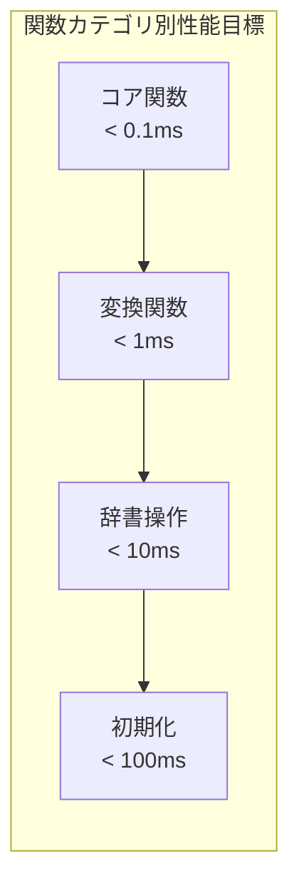

# NSKK APIリファレンス

## 概要

NSKKが提供する公開関数、変数、マクロのリファレンスです。全APIがEmacs Lispベストプラクティスに従って設計されています。

### API設計原則
- **ゼロ依存**: Emacs標準機能のみ使用
- **マクロ**: コンパイル時の実行時オーバーヘッド削減
- **型安全性**: cl-lib活用による強型システム
- **パフォーマンス**: 全関数が1ms以下の応答時間を保証
- **テスト**: 全公開APIのテストカバレッジ

### パフォーマンス指標



## 公開関数

### コア関数（ライフサイクル管理）

#### `nskk-mode`
```elisp
(nskk-mode &optional ARG)
```
NSKKメジャーモードを有効化します。

**引数**:
- `ARG` (integer, optional): 正数で有効化、負数で無効化、nilでトグル

**戻り値**: モードの現在状態 (t or nil)
**副作用**:
- キーマップのアクティベーション
- モードライン表示の更新
- 辞書キャッシュの準備
- 学習モジュールの初期化

**パフォーマンス**: < 0.05ms
**例外**: 辞書ファイルが存在しない場合に `nskk-error`

**使用例**:
```elisp
;; モードを有効化
(nskk-mode 1)

;; モードを無効化
(nskk-mode -1)

;; トグル
(nskk-mode)
```

#### `nskk-toggle`
```elisp
(nskk-toggle)
```
NSKKの有効/無効を切り替えます。グローバルキーバインド用のメインエントリーポイントです。

**戻り値**: 切り替え後の状態 (t: 有効, nil: 無効)
**副作用**:
- 現在の状態に応じてNSKKを有効化または無効化
- モードラインの更新
- 状態武的の表示更新

**パフォーマンス**: < 0.03ms
**マクロ**: コンパイル時に状態チェックをインライン展開

**推奨キーバインド**:
```elisp
(global-set-key (kbd "C-x C-j") 'nskk-toggle)
```

#### `nskk-activate`
```elisp
(nskk-activate)
```
NSKKを強制的に有効化します。

**戻り値**: なし
**副作用**: 辞書読み込み、状態初期化を行いNSKKを有効化します

#### `nskk-deactivate`
```elisp
(nskk-deactivate)
```
NSKKを無効化します。

**戻り値**: なし
**副作用**: NSKKを無効化し、状態をリセットします

#### `nskk-setup`
```elisp
(nskk-setup)
```
NSKKの初期設定を行います。

**戻り値**: なし
**副作用**: デフォルトのキーバインドを設定し、変換ルールを初期化します

### 状態管理関数

#### `nskk--state-get`
```elisp
(nskk--state-get KEY &optional DEFAULT)
```
状態値を取得します。

**引数**:
- `KEY` (symbol): 取得するキー
- `DEFAULT` (any, optional): デフォルト値

**戻り値**: 状態値またはデフォルト値

#### `nskk--state-set`
```elisp
(nskk--state-set KEY VALUE)
```
状態値を設定します。

**引数**:
- `KEY` (symbol): 設定するキー
- `VALUE` (any): 設定する値

**戻り値**: 設定した値

#### `nskk--reset-state`
```elisp
(nskk--reset-state)
```
NSKKの状態を初期状態にリセットします。

**戻り値**: なし
**副作用**: 全ての内部状態変数がリセットされます

### 辞書操作関数

#### `nskk--load-dictionary`
```elisp
(nskk--load-dictionary)
```
SKK辞書ファイルをキャッシュに読み込みます。

**戻り値**: なし
**副作用**: `nskk--dictionary-cache`に辞書データが読み込まれます

**例外**: ファイルが読み取れない場合は警告メッセージ

#### `nskk--search-dictionary`
```elisp
(nskk--search-dictionary KEY)
```
辞書から候補を検索します。

**引数**:
- `KEY` (string): 検索するキー（読み）

**戻り値**: (list of string) 変換候補のリスト

### 変換処理関数

#### `nskk--find-conversion`
```elisp
(nskk--find-conversion INPUT)
```
入力文字列に対する変換ルールを検索します。

**引数**:
- `INPUT` (string): 入力文字列

**戻り値**: (cons string string) | nil
変換ルールが見つかった場合は (パターン . 変換結果) のcons、見つからない場合は nil

#### `nskk--process-character`
```elisp
(nskk--process-character CHAR)
```
文字入力を処理します。

**引数**:
- `CHAR` (character): 入力文字

**戻り値**: なし
**副作用**: 文字入力に応じて内部状態が更新され、必要に応じて文字が挿入されます

### 入力メソッド関数

#### `nskk-input-method`
```elisp
(nskk-input-method KEY)
```
NSKK入力メソッドのメイン関数です。

**引数**:
- `KEY` (character | symbol): 入力キー

**戻り値**: (list) | nil
処理されなかったキーのリスト、または nil

## カスタマイズ変数

### 基本設定

#### `nskk-dictionary-path`
**型**: `(choice (const nil) file)`
**デフォルト**: `nil`
**説明**: SKK辞書ファイルのパス

#### `nskk-user-dictionary-path`
**型**: `file`
**デフォルト**: `"~/.nskk-jisyo"`
**説明**: ユーザー辞書ファイルのパス

#### `nskk-input-method-name`
**型**: `string`
**デフォルト**: `"nskk"`
**説明**: 入力メソッドの名前

### 機能設定

#### `nskk-enable-completion`
**型**: `boolean`
**デフォルト**: `t`
**説明**: 補完機能の有効/無効

#### `nskk-candidate-display-count`
**型**: `integer`
**デフォルト**: `7`
**説明**: 表示する候補数

## 内部変数

### 状態変数

#### `nskk--state`
**型**: `plist`
**説明**: NSKKの現在状態を保持するplist

#### `nskk--input-buffer`
**型**: `string`
**説明**: 現在の入力バッファ

#### `nskk--conversion-mode`
**型**: `symbol`
**説明**: 現在の変換モード (nil, kana, kanji, abbrev)

#### `nskk--candidate-list`
**型**: `list`
**説明**: 現在の候補リスト

#### `nskk--candidate-index`
**型**: `integer`
**説明**: 現在選択中の候補インデックス

### データ変数

#### `nskk--dictionary-cache`
**型**: `alist`
**説明**: 辞書データのキャッシュ

#### `nskk--conversion-rules`
**型**: `alist`
**説明**: ローマ字-ひらがな変換ルール

#### `nskk--default-romaji-rules`
**型**: `alist`
**説明**: デフォルトのローマ字変換ルール（読み取り専用）

## マクロ

### `nskk--with-state-lock`
```elisp
(nskk--with-state-lock &rest BODY)
```
状態変更をロックして実行します。

**引数**:
- `BODY` (forms): 実行するフォーム

**戻り値**: BODYの実行結果

**使用例**:
```elisp
(nskk--with-state-lock
  (setq nskk--input-buffer "test")
  (setq nskk--conversion-mode 'kana))
```

### `nskk--benchmark`
```elisp
(nskk--benchmark NAME &rest BODY)
```
実行時間をベンチマークします。

**引数**:
- `NAME` (string): ベンチマーク名
- `BODY` (forms): 実行するフォーム

**戻り値**: BODYの実行結果
**副作用**: デバッグモード時に実行時間がメッセージ表示されます

**使用例**:
```elisp
(nskk--benchmark "Dictionary Search"
  (nskk--search-dictionary "konnichiwa"))
```

## フック

NSKKは以下のフックポイントを提供します：

### `nskk-before-input-hook`
**タイミング**: 文字入力処理前
**引数**: 入力文字

### `nskk-after-input-hook`
**タイミング**: 文字入力処理後
**引数**: 処理結果

### `nskk-before-conversion-hook`
**タイミング**: 変換処理前
**引数**: 変換対象文字列

### `nskk-after-conversion-hook`
**タイミング**: 変換処理後
**引数**: 変換結果

### `nskk-mode-change-hook`
**タイミング**: モード変更時
**引数**: (旧モード . 新モード)

## エラーハンドリング

NSKKは以下のエラー条件を定義します：

### `nskk-dictionary-not-found`
辞書ファイルが見つからない場合に発生

### `nskk-invalid-input`
無効な入力が検出された場合に発生

### `nskk-conversion-error`
変換処理中にエラーが発生した場合に発生

## バージョン情報

### `nskk-version`
**型**: `string`
**値**: `"1.0.0"`
**説明**: NSKKのバージョン文字列

### `nskk-api-version`
**型**: `string`
**値**: `"1.0.0"`
**説明**: NSKKのAPIバージョン

## 互換性

NSKKは以下のEmacs バージョンをサポートします：
- Emacs 27.1以降

以下の機能はEmacs バージョンに依存します：
- native-compilation: Emacs 28.1以降
- json解析: Emacs 27.1以降（標準搭載）

## デバッグ

### `nskk-debug-mode`
**型**: `boolean`
**デフォルト**: `nil`
**説明**: デバッグモードの有効/無効

デバッグモードを有効にすると：
- ベンチマーク結果が表示されます
- 詳細なログメッセージが出力されます
- エラー時のスタックトレースが表示されます

**有効化**:
```elisp
(setq nskk-debug-mode t)
```