# DDSKK Compatibility Specification

## Overview

This document specifies the compatibility requirements between NSKK and ddskk, defining which features, behaviors, and APIs must be implemented to ensure seamless migration for existing ddskk users.

### Document Status

| Aspect | Status |
|--------|--------|
| Version | 1.0.0 |
| Last Updated | 2026-02-22 |
| Target ddskk Version | ddskk 2024.02+ |
| NSKK Version | 0.1.0+ |

### Scope

This specification covers:
- **Core Feature Parity**: Essential SKK functionality that must be identical
- **Keybinding Compatibility**: Default keybindings that must match ddskk
- **Variable Mapping**: ddskk variables and their NSKK equivalents
- **Dictionary Format**: SKK dictionary file format compatibility
- **API Compatibility**: Programmatic interfaces for third-party packages
- **Migration Path**: Steps for users migrating from ddskk to NSKK

### Compatibility Levels

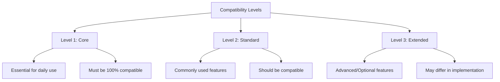

## 1. Keybinding Compatibility Matrix

### 1.1 Global Keybindings

| Keybinding | ddskk Function | NSKK Function | Priority | Status | Notes |
|------------|---------------|---------------|----------|--------|-------|
| `C-x C-j` | `skk-mode` | `nskk-toggle` | P0 | REQUIRED | Global toggle entry point |
| `C-x j` | `skk-auto-fill-mode` | `nskk-auto-fill-mode` | P1 | REQUIRED | Auto-fill toggle |
| `C-x t` | `skk-tutorial` | `nskk-tutorial` | P1 | PLANNED | Tutorial launcher |

### 1.2 Input Mode Keybindings

#### Hiragana Mode (あ)

| Keybinding | Action | ddskk Behavior | NSKK Requirement |
|------------|--------|---------------|------------------|
| `a-z` | Romaji input | Convert to hiragana | MUST match |
| `A-Z` | Start conversion | Enter ▽ mode | MUST match |
| `SPC` | Next candidate | Cycle candidates | MUST match |
| `RET` | Commit | Fix current conversion | MUST match |
| `C-g` | Cancel | Abort conversion | MUST match |
| `q` | Toggle katakana | Switch to ア mode | MUST match |
| `Q` | Toggle katakana | Convert region to katakana | REQUIRED |
| `l` | Insert latin | Temporary ascii mode | MUST match |
| `L` | Zenkaku latin | Switch to 全英 mode | MUST match |
| `/` | Abbrev mode | Enter abbreviation mode | REQUIRED |

#### Katakana Mode (ア)

| Keybinding | Action | ddskk Behavior | NSKK Requirement |
|------------|--------|---------------|------------------|
| `q` | Toggle hiragana | Switch to あ mode | MUST match |
| `Q` | Toggle hiragana | Convert region to hiragana | REQUIRED |
| Other keys | Same as hiragana | | MUST match |

#### Conversion Mode (▽)

| Keybinding | Action | ddskk Behavior | NSKK Requirement |
|------------|--------|---------------|------------------|
| `a-z` | Okurigana input | Mark送り仮名 | MUST match |
| `SPC` | Start conversion | Show candidates (▼ mode) | MUST match |
| `RET` | Commit hiragana | Fix as hiragana | MUST match |
| `C-g` | Cancel | Return to hiragana input | MUST match |
| `?` | Show completion | Display completion list | PLANNED |

#### Candidate Selection Mode (▼)

| Keybinding | Action | ddskk Behavior | NSKK Requirement |
|------------|--------|---------------|------------------|
| `SPC` | Next candidate | Cycle forward | MUST match |
| `x` | Previous candidate | Cycle backward | REQUIRED |
| `C-n` | Next candidate | Cycle forward | MUST match |
| `C-p` | Previous candidate | Cycle backward | MUST match |
| `RET` | Commit | Fix selected candidate | MUST match |
| `C-g` | Cancel | Return to ▽ mode | MUST match |
| `>` | Next page | Show next candidates page | REQUIRED |
| `<` | Previous page | Show previous candidates page | REQUIRED |
| `1-9` | Direct select | Select Nth candidate | PLANNED |

#### ASCII Direct Input Mode

| Keybinding | Action | ddskk Behavior | NSKK Requirement |
|------------|--------|---------------|------------------|
| `C-j` | To hiragana | Switch to あ mode | MUST match |
| `C-q` | Toggle zenkaku | Convert to full-width | PLANNED |

#### Zenkaku Latin Mode (Ａ)

| Keybinding | Action | ddskk Behavior | NSKK Requirement |
|------------|--------|---------------|------------------|
| `C-j` | To hiragana | Switch to あ mode | MUST match |
| `C-q` | Toggle hankaku | Convert to half-width | PLANNED |
| `q` | To katakana | Convert region to katakana | PLANNED |

#### Abbreviation Mode

| Keybinding | Action | ddskk Behavior | NSKK Requirement |
|------------|--------|---------------|------------------|
| `SPC` | Start conversion | Search for pattern | REQUIRED |
| `RET` | Commit | Fix as entered | REQUIRED |
| `C-g` | Cancel | Exit abbrev mode | REQUIRED |

### 1.3 Special Key Sequences

| Sequence | ddskk Behavior | NSKK Requirement |
|----------|---------------|------------------|
| `nn` | ん (n) | MUST handle |
| `n'` | ん (n) | MUST handle |
| `n space` | ん + commit | MUST handle |
| `kk` | っk (sokuon) | MUST handle |
| `xx + vowel` | Small kana (xa→ぁ) | REQUIRED |

## 2. Variable Compatibility

### 2.1 Critical Variables (Must Support)

> **SECURITY WARNING**: Dictionary file paths should be validated before use. User dictionaries
> should have restricted permissions (chmod 600) to prevent unauthorized access or tampering.

| ddskk Variable | NSKK Variable | Type | Default | Compatibility | Notes |
|----------------|---------------|------|---------|---------------|---------------------|-------|
| `skk-large-jisyo` | `nskk-large-jisyo` | string | `"/usr/share/skk/SKK-JISYO.L"` | ALIAS | Primary dictionary | Data Access |
| `skk-jisyo` | `nskk-user-dictionary` | string | `"~/.skk-jisyo"` | RENAME | User dictionary | Data Access |
| `skk-backup-jisyo` | `nskk-backup-dictionary` | string | nil | ALIAS | Backup location | Data Access |
| `skk-server-host` | `nskk-server-host` | string | `"localhost"` | ALIAS | Server hostname | Data Access |
| `skk-server-port` | `nskk-server-port` | integer | `1178` | ALIAS | Server port | Data Access |
| `skk-use-look` | `nskk-use-look` | boolean | `nil` | ALIAS | Use look command | Data Access |
| `skk-look-filename` | `nskk-look-filename` | string | `"/usr/share/dict/words"` | ALIAS | Look dictionary | Data Access |
| `skk-egg-like-newline` | `nskk-egg-like-newline` | boolean | `nil` | NEW | Emacs 30+ behavior | Application |

### 2.2 Display Variables

| ddskk Variable | NSKK Variable | Type | Default | Compatibility | Layer Responsibility |
|----------------|---------------|------|---------|---------------||---------------------|
| `skk-show-mode` | `nskk-show-mode` | boolean | `t` | ALIAS |
| `skk-mode-indicator` | `nskk-mode-indicator` | list | See below | ENHANCED |
| `skk-cursor-hiragana` | `nskk-cursor-hiragana` | int | `0` | ALIAS |
| `skk-cursor-katakana` | `nskk-cursor-katakana` | int | `5` | ALIAS |

**Mode Indicator Format (ddskk):**
```elisp
(setq skk-mode-indicator
      '(hiragana katakana abbrev zenkaku latin-jisx0201 latin-jisx0208))
```

**Mode Indicator Format (NSKK):**
```elisp
;; Enhanced with emoji support
(setq nskk-mode-indicator
      '((hiragana . "あ")
        (katakana . "ア")
        (abbrev . "abbr")
        (zenkaku . "Ａ")
        (ascii . "_A")))
```

### 2.3 Behavior Variables

| ddskk Variable | NSKK Variable | Type | Default | Compatibility | Notes | Layer Responsibility |
|----------------|---------------|------|---------|---------------|---------------------|-------||---------------------|
| `skk-egg-like-newline` | `nskk-egg-like-newline` | boolean | `nil` | NEW | Application | Emacs 30+ newline |
| `skk-delete-implies-kakutei` | `nskk-delete-implies-kakutei` | boolean | `nil` | REQUIRED | Application | Delete commits |
| `skk-recursive-delete` | `nskk-recursive-delete` | boolean | `nil` | PLANNED | Application | Recursive deletion |
| `skk-use-face` | `nskk-use-face` | boolean | `t` | ALIAS | Presentation | Use faces |
| `skk-henkan-okuri-strictly` | `nskk-okurigana-strict` | boolean | `nil` | RENAME | Core Engine | Strict okurigana processing |

### 2.4 Input Method Variables

| ddskk Variable | NSKK Variable | Type | Default | Compatibility | Layer Responsibility |
|----------------|---------------|------|---------|---------------||---------------------|
| `skk-input-method` | `nskk-input-method` | symbol | `'japanese` | NEW |
| `skk-japanese-message-and-error` | `nskk-japanese-messages` | boolean | `nil` | RENAME |
| `skk-okuri-char-table` | `nskk-okurigana-table` | alist | See below | RENAME |

### 2.5 Candidate Window Variables

| ddskk Variable | NSKK Variable | Type | Default | Compatibility | Layer Responsibility |
|----------------|---------------|------|---------|---------------||---------------------|
| `skk-candidate-use-index` | `nskk-candidate-use-index` | boolean | `nil` | PLANNED |
| `skk-candidate-max` | `nskk-candidate-display-count` | integer | `7` | RENAME |
| `skk-show-candidates-inline` | `nskk-show-candidates-inline` | boolean | `nil` | ENHANCED |

### 2.6 Deprecated Variables

The following ddskk variables are NOT supported in NSKK:

| Variable | Reason | NSKK Alternative |
|----------|--------|------------------|
| `skk-obsolete-var` | Superseded by Emacs 30+ features | Use native features |
| `skk-require-obsolete` | External dependency | Built-in implementation |

### 2.7 Hook and Event Integration

> **ARCHITECTURAL NOTE**: NSKK's Extension Layer provides an event bus that maps ddskk hooks to NSKK events.
> This mapping ensures compatibility with ddskk extensions while leveraging NSKK's event-driven architecture.

#### Hook-to-Event Mapping

| ddskk Hook | NSKK Event | Layer | Timing | Purpose |
|------------|------------|-------|--------|---------|
| `skk-before-get-candidates` | `:before-dictionary-lookup` | Extension | Before dictionary search | Allow candidates modification |
| `skk-after-get-candidates` | `:after-dictionary-lookup` | Extension | After dictionary search | Post-process candidates |
| `skk-before-conversion` | `:before-conversion` | Extension | Before conversion starts | Pre-conversion hooks |
| `skk-after-conversion` | `:after-conversion` | Extension | After conversion completes | Post-conversion hooks |
| `skk-before-select-candidate` | `:before-candidate-selection` | Extension | Before candidate selection | Pre-selection hooks |
| `skk-after-select-candidate` | `:after-candidate-selection` | Extension | After candidate selection | Post-selection hooks |
| `skk-mode-hook` | `:mode-changed` | Extension | After mode change | Mode transition hooks |
| `skk-input-hook` | `:input-received` | Extension | After input received | Input processing hooks |

#### Event Flow Architecture

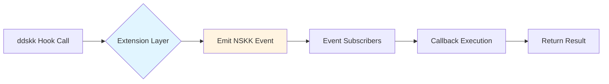

#### Migration Path for Custom Hooks

**ddskk Hook Usage:**
```elisp
;; ddskk style
(add-hook 'skk-before-get-candidates
          (lambda (yomi)
            (message "Getting candidates for: %s" yomi)))
```

**NSKK Event Usage (Compatible):**
```elisp
;; NSKK style - backward compatible
(add-hook 'skk-before-get-candidates
          (lambda (yomi)
            (message "Getting candidates for: %s" yomi)))

;; NSKK style - native event API
(nskk-extension-subscribe :before-dictionary-lookup
  (lambda (data)
    (let ((yomi (plist-get data :yomi)))
      (message "Looking up: %s" yomi))))
```

#### Extension Layer Integration

All ddskk hooks are automatically bridged to Extension Layer events:

1. **Hook Registration**: ddskk hooks are registered as Extension Layer event sources
2. **Event Emission**: Hook execution triggers corresponding NSKK event emission
3. **Subscriber Notification**: All event subscribers receive notification
4. **Result Aggregation**: Results from all subscribers are collected and returned

This design ensures:
- **Backward Compatibility**: Existing ddskk hooks continue to work
- **Event-Driven Architecture**: New extensions use the event bus
- **Layer Isolation**: Hook logic is handled by the Extension Layer
- **Testability**: Events can be tested independently of UI

## 3. Dictionary Format Specification

### 3.1 SKK Dictionary Entry Format

```
;; Basic entry format
読み /候補1/候補2/候補3/

;; Entry with annotations
読み /候補1;注釈/候補2;注釈/

;; Entry with okurigana
読み /候補/候选(送りあり)/
```

### 3.2 Entry Format EBNF

```
entry        ::= yomi '/' candidate ('/' candidate)* '/' newline
yomi         ::= 1*(hiragana | katakana)
candidate    ::= text (';' annotation)?
annotation   ::= 1*(any_char except '/')
text         ::= 1*(any_char except '/')
```

### 3.3 Annotation Syntax

#### Basic Annotations

| Syntax | Meaning | Example |
|--------|---------|---------|
| `;word` | Word annotation | `英語 /English/` |
| `(concat "...")` | Concatenation | ` concat (concat "very") /非常に/` |

#### Numeric Conversion Annotations

| Pattern | Meaning | Example |
|---------|---------|---------|
| `#0` | Digit placeholder | `あい /#0/#4/#9/` → 0/4/9 |
| `#4` | Year conversion | `ねん /#4年/` → 2024年 |
| `#6` | Era year conversion | `ねん /#6年/` → 令和06年 |

### 3.4 Dictionary Merge Semantics

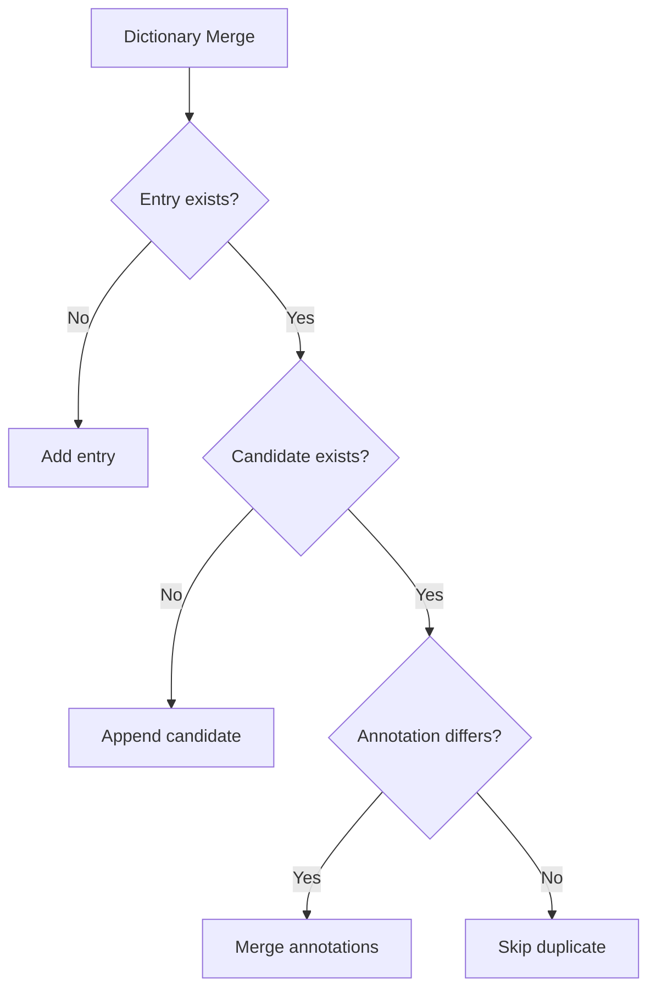

**Merge Rules:**
1. **New Entry**: Append to dictionary
2. **Existing Entry, New Candidate**: Insert candidate at end
3. **Existing Entry, Existing Candidate**:
   - Different annotation: Merge annotation
   - Same annotation: Skip (no duplicate)
4. **Priority**: User dictionary > System dictionary

### 3.5 Dictionary Search Order

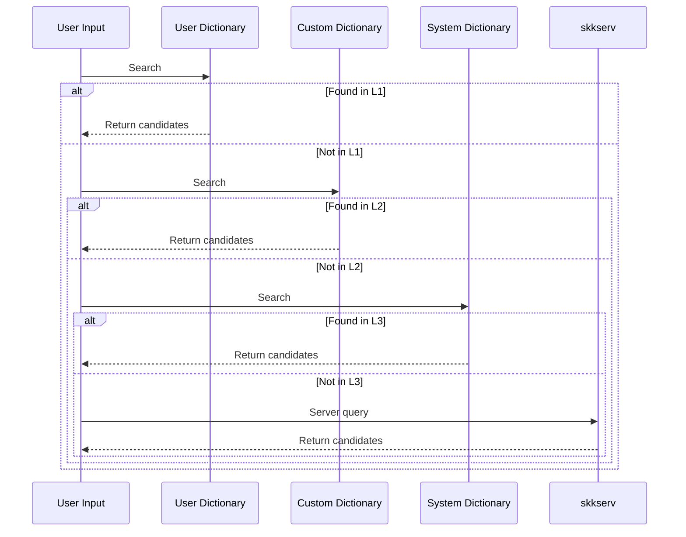

**Search Priority:**
1. User dictionary (highest priority)
2. Custom dictionaries (in order specified)
3. System dictionary
4. skkserv (if configured)

> **SECURITY WARNING (SEC002)**: Dictionary server connections have security implications:
> - **Localhost only**: Default to localhost for security. Remote servers should use TLS.
> - **SSRF Protection**: Never connect to untrusted remote dictionary servers.
> - **Data Privacy**: All dictionary queries are sent in plaintext without TLS encryption.
> - **DoS Risk**: Malicious servers can cause Emacs to hang or crash.
>
> Recommended configuration for secure usage:
> ```elisp
> ;; Prefer local dictionaries over remote servers
> (setopt nskk-large-jisyo-list
>         '("/usr/share/skk/SKK-JISYO.L"))
>
> ;; If using skkserv, only connect to localhost
> (setopt nskk-server-host "localhost")
> (setopt nskk-server-port 1178)
>
> ;; Always search local dictionaries first
> (setopt nskk-search-local-first t)
>
> ;; NEVER configure remote servers without TLS:
> ;; (setopt nskk-server-host "untrusted-remote.example.com") ; UNSAFE!
> ```

### 3.6 Dictionary Update Semantics

**Automatic Save:**
- Trigger: Emacs idle timer
- Condition: Dictionary modified since last save
- Backup: Create `.bak` file before overwriting

**Atomic Update:**
```elisp
;; NSKK atomic dictionary save
(defun nskk-save-dictionary-atomic (dict-path)
  "Save dictionary atomically to prevent corruption."
  (let ((temp-path (concat dict-path ".tmp")))
    (write-region (point-min) (point-max) temp-path)
    (rename-file temp-path dict-path t)))
```

**SECURITY: Dictionary Path Validation**

> **WARNING**: Always validate dictionary paths before use to prevent directory traversal
> and unauthorized file access. User dictionaries should be stored in user home directory
> with restricted permissions.

```elisp
;; Secure dictionary path validation
(defun nskk-ensure-safe-dictionary-path (path)
  "Validate that PATH is a safe dictionary location.
Returns the expanded absolute path if valid, signals error otherwise.

SECURITY: This function prevents directory traversal attacks and ensures
dictionary files are within acceptable locations."
  (let* ((expanded (expand-file-name path))
         (allowed-dirs '("~/.nskk/" "~/.skk-jisyo" "/usr/share/skk/"))
         (safe-p (cl-some (lambda (dir)
                           (file-in-directory-p expanded (expand-file-name dir)))
                         allowed-dirs)))
    (unless safe-p
      (error "Dictionary path outside allowed directories: %s" path))
    ;; Verify file exists or can be created in safe location
    (let ((parent-dir (file-name-directory expanded)))
      (unless (file-directory-p parent-dir)
        (error "Dictionary parent directory does not exist: %s" parent-dir)))
    expanded))

;; Set secure file permissions for user dictionary
(defun nskk-secure-dictionary-permissions (dict-path)
  "Set secure permissions (chmod 600) for user dictionary at DICT-PATH.
This prevents other users from reading or modifying learning data."
  (let ((expanded (nskk-ensure-safe-dictionary-path dict-path)))
    (when (file-exists-p expanded)
      (set-file-modes expanded #o600)
      ;; Verify permissions were set correctly
      (let ((current-modes (file-modes expanded)))
        (unless (= (logand current-modes #o777) #o600)
          (warn "Failed to set secure permissions for %s" expanded))))))

;; Usage example
(setopt nskk-user-dictionary
        (nskk-ensure-safe-dictionary-path "~/.nskk/user-jisyo"))
(nskk-secure-dictionary-permissions nskk-user-dictionary)
```

## 4. Core Feature Specifications

### 4.1 Okurigana Processing Rules

#### Okurigana Definition

送り仮名 (Okurigana) are kana characters that indicate the inflection of a verb or adjective.

#### Detection Pattern

```elisp
;; Okurigana detection pattern (ddskk compatible)
(defvar nskk-okurigana-pattern
  (rx (group (one-or-more hiragana))
      (upper)
      (group (one-or-more hiragana)))
  "Pattern matching okurigana input.")

;; Examples:
;; "KaK"  → ("か" "K") → 書く
;; "TabeR" → ("たべ" "R") → 食べる
;; "UtsukuS" → ("うつく" "S") → 美しい
```

#### Processing Flow

```mermaid
flowchart TD
    A[Input: KaK] --> B[Parse: "か" + "K"]
    B --> C{Lookup stem}
    C --> D[Find: 書]
    D --> E{Match okurigana}
    E -->|Consonant| F[Conjugation rule]
    F --> G[Apply: 書く]
    E -->|No match| H[Fallback: stem + okurigana]
```

#### Okurigana Table (Partial)

| Input | Stem | Okurigana | Result | Type |
|-------|------|-----------|--------|------|
| `K` | か | k | 書く | 五段動詞 |
| `R` | たべ | r | 食べる | 一段動詞 |
| `S` | うつく | s | 美しい | 形容詞 |
| `T` | ま | t | 待つ | 五段動詞 |
| `N` | しん | n | 死ぬ | 五段動詞 |

#### Acceptance Criteria

```elisp
;; Test cases for okurigana processing
(ert-deftest nskk-test-okurigana-basic ()
  "Test basic okurigana conversion."
  (should (equal (nskk-process-okurigana "K" "か") "書く"))
  (should (equal (nskk-process-okurigana "R" "たべ") "食べる"))
  (should (equal (nskk-process-okurigana "S" "うつく") "美しい")))

(ert-deftest nskk-test-okurigana-edge-cases ()
  "Test edge cases."
  (should (equal (nskk-process-okurigana "K" "い") "行く"))  ; Exception
  (should (equal (nskk-process-okurigana "Q" "もど") "戻る")) ; Irregular
  )
```

### 4.2 Conversion Candidate Selection

#### Candidate Ranking Algorithm

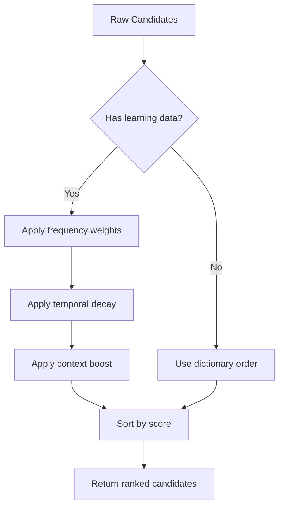

**Scoring Formula:**
```
score = base_score + (frequency * weight) + (context_boost * decay)
```

**Default Weights:**
```elisp
(defvar nskk-scoring-weights
  '((base . 100)
    (frequency . 10)
    (context . 5)
    (recency . 2))
  "Candidate scoring weights.")
```

#### Acceptance Criteria

```elisp
(ert-deftest nskk-test-candidate-ranking ()
  "Test candidate ranking with learning data."
  (nskk-learn "konnichiwa" "こんにちは")
  (nskk-learn "konnichiwa" "今日は")

  (let ((candidates (nskk-get-candidates "konnichiwa")))
    (should (equal (car candidates) "こんにちは"))  ; Most recent
    (should (member "今日は" candidates))))

(ert-deftest nskk-test-candidate-fallback ()
  "Test fallback when no candidates found."
  (let ((candidates (nskk-get-candidates "nonsenseword")))
    (should (null candidates))))
```

### 4.3 Learning Mechanism

#### Learning Data Structure

```elisp
;; Learning entry structure
(cl-defstruct nskk-learning-entry
  yomi           ; Reading
  candidate      ; Selected candidate
  count          ; Selection count
  last-used      ; Timestamp
  context        ; Previous word (optional)
  )

;; Learning database
(defvar nskk-learning-db
  (make-hash-table :test 'equal)
  "Database storing learning data.")
```

#### Learning Flow

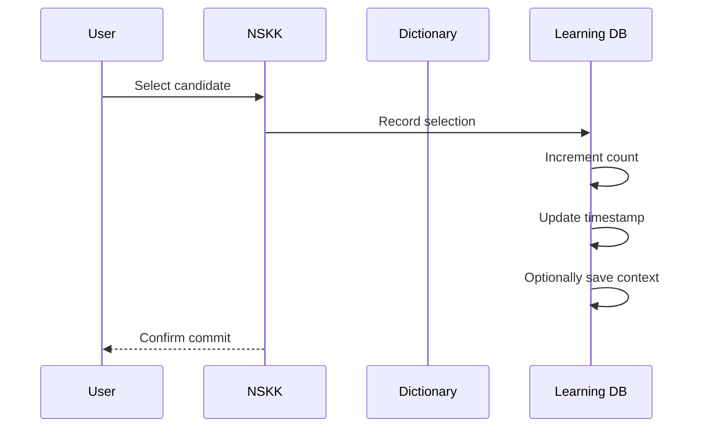

#### Acceptance Criteria

```elisp
(ert-deftest nskk-test-learning-basic ()
  "Test basic learning functionality."
  (nskk-clear-learning)

  (nskk-learn "test" "テスト")
  (should (equal (nskk-get-learned-count "test" "テスト") 1))

  (nskk-learn "test" "テスト")
  (should (equal (nskk-get-learned-count "test" "テスト") 2))

  (nskk-learn "test" "証明")
  (should (> (nskk-get-learned-count "test" "テスト")
             (nskk-get-learned-count "test" "証明"))))

(ert-deftest nskk-test-learning-persistence ()
  "Test learning data persistence."
  (nskk-learn "persist" "永続")
  (nskk-save-learning-data)

  (nskk-clear-learning)
  (nskk-load-learning-data)

  (should (> (nskk-get-learned-count "persist" "永続") 0)))
```

### 4.4 Annotation System

#### Annotation Syntax Support

| Annotation Type | Syntax | Example | Support Status |
|----------------|--------|---------|----------------|
| Basic word | `/candidate;word/` | `英語 /English/` | REQUIRED |
| Concatenation | `/(concat "...")/` | `/(concat "very")/` | PLANNED |
| Numeric | `/#0/` | `あい /#0/` | REQUIRED |
| Symbol | `/(symbol "sym")/` | `/(symbol "arrow")/` | PLANNED |

#### Annotation Display

```elisp
;; Candidate with annotation display
(defun nskk-format-candidate (candidate annotation)
  "Format candidate for display with annotation."
  (if annotation
      (format "%s [%s]" candidate annotation)
    candidate))

;; Example output:
;; "こんにちは [greeting]"
;; "日本 [country]"
```

#### Acceptance Criteria

```elisp
(ert-deftest nskk-test-annotation-parsing ()
  "Test annotation parsing from dictionary entries."
  (let ((entry "えいご /English;英語/"))
    (should (equal (nskk-parse-entry entry)
                   '(("English" . "英語"))))))

(ert-deftest nskk-test-annotation-display ()
  "Test annotation display formatting."
  (should (equal (nskk-format-candidate "English" "英語")
                 "English [英語]")))
```

### 4.5 Numerical Conversion

#### Conversion Patterns

| Pattern | Meaning | Example Input | Example Output |
|---------|---------|---------------|----------------|
| `#0` | Digits | `#0` | 0, 1, 2, ... |
| `#4` | Year | `ねん#4` | 2024年 |
| `#6` | Era year | `ねん#6` | 令和06年 |
| `#n` | Number | `こ#n` | 五個, 5個 |

#### Implementation

```elisp
(defun nskk-numeric-conversion (pattern number)
  "Convert numeric pattern to Japanese representation."
  (pcase pattern
    ("#0" (number-to-string number))
    ("#4" (format "%d年" number))
    ("#6" (nskk-era-year-to-string number))
    ("#n" (nskk-number-to-kanji number))))
```

#### Acceptance Criteria

```elisp
(ert-deftest nskk-test-numeric-conversion ()
  "Test numeric conversion."
  (should (equal (nskk-numeric-conversion "#0" 5) "5"))
  (should (equal (nskk-numeric-conversion "#4" 2024) "2024年"))
  (should (equal (nskk-numeric-conversion "#n" 5) "五")))
```

### 4.6 Symbol Conversion

#### Supported Symbols

| Input | Output | Category |
|-------|--------|----------|
| `→` | `→` | Arrow |
| `←` | `←` | Arrow |
| `↑` | `↓` | Arrow |
| `♀` | `♀` | Symbol |
| `♂` | `♂` | Symbol |
| `♠` | `♠` | Card suit |
| `♥` | `♥` | Card suit |
| `♦` | `♦` | Card suit |
| `♣` | `♣` | Card suit |

#### Acceptance Criteria

```elisp
(ert-deftest nskk-test-symbol-conversion ()
  "Test symbol conversion."
  (should (equal (nskk-convert-symbol "arrow") '("→" "←" "↑" "↓")))
  (should (equal (nskk-convert-symbol "heart") "♥")))
```

### 4.7 Abbreviation Mode

#### Abbreviation Syntax

```
/abbreviation/pattern1/pattern2/
```

#### Processing Flow

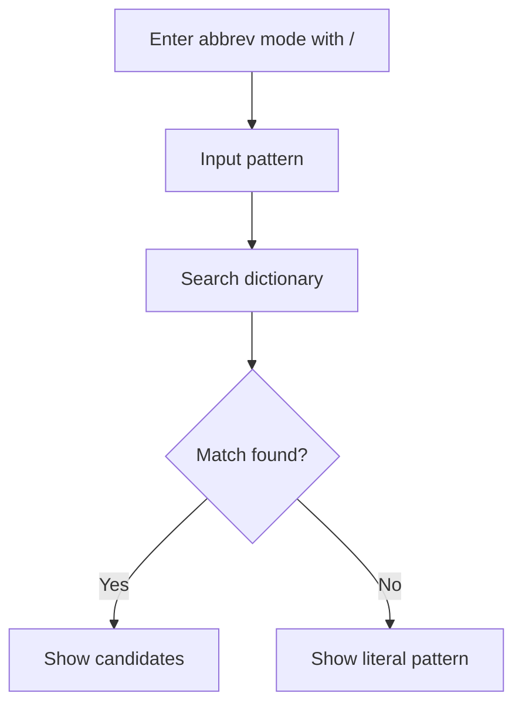

#### Acceptance Criteria

```elisp
(ert-deftest nskk-test-abbrev-mode ()
  "Test abbreviation mode."
  (nskk-enter-abbrev-mode)
  (should (equal nskk--conversion-mode 'abbrev))

  (nskk-process-input "k")  ; Input pattern
  (should (member "か" (nskk-get-candidates "k"))))

(ert-deftest nskk-test-abbrev-exit ()
  "Test exiting abbreviation mode."
  (nskk-enter-abbrev-mode)
  (nskk-process-input "\C-g")
  (should (not (eq nskk--conversion-mode 'abbrev))))
```

## 5. User Interface Compatibility

### 5.1 Mode Indicator Display

#### Indicator Characters

| Mode | ddskk Indicator | NSKK Indicator | Display |
|------|----------------|----------------|---------|
| Hiragana | ▽ | ▽ | ▽あ |
| Katakana | ▽ | ▽ | ▽ア |
| Conversion (input) | ▽ | ▽ | ▽ |
| Conversion (select) | ▼ | ▼ | ▼ |
| ASCII direct | | | No indicator |
| Zenkaku latin | | | Ａ |
| Abbrev | | | abbr |

#### Implementation

```elisp
(defun nskk-update-mode-indicator ()
  "Update mode line indicator based on current mode."
  (let ((indicator
         (cl-case nskk--conversion-mode
           (hiragana "▽あ")
           (katakana "▽ア")
           (conversion-input "▽")
           (conversion-select "▼")
           (ascii "")
           (zenkaku "Ａ")
           (abbrev "abbr"))))
    (setq nskk-mode-line-indicator indicator)))
```

### 5.2 Candidate Window Behavior

#### Window Position

```
┌─────────────────────────────────┐
│ Buffer text ▼                 │
│ ┌─────────────────────────┐    │
│ │ 1: 候補1               │    │
│ │ 2: 候補2               │    │
│ │ 3: 候補3               │    │
│ └─────────────────────────┘    │
└─────────────────────────────────┘
```

#### Display Requirements

| Aspect | Specification |
|--------|---------------|
| Position | Near cursor, avoid overlap |
| Max candidates | 7 (default) |
| Scrolling | Support for > max candidates |
| Page indicator | Show "page/total" |
| Face | Use `skk-candidate-face` |

### 5.3 Minibuffer Interactions

#### Prompts

| Situation | Prompt Text |
|-----------|-------------|
| Abbrev mode | `[abbr]` |
| Completion | `[complete]` |
| Error | Use `message`, don't block |

#### Acceptance Criteria

```elisp
(ert-deftest nskk-test-minibuffer-prompts ()
  "Test minibuffer prompt display."
  (nskk-enter-abbrev-mode)
  (should (string-match-p "\\[abbr\\]" (nskk-get-minibuffer-prompt))))
```

### 5.4 Modeline Format

#### Default Format

```
[NSKK: ▽あ]
```

#### Customizable Format

```elisp
;; User customizable
(setq nskk-modeline-format
      "[NSKK: %m]")  ; %m = mode indicator

;; Enhanced format
(setq nskk-modeline-format
      "[NSKK: %m | 候補:%n]")  ; %n = candidate count
```

## 6. Configuration Migration

### 6.1 Variable Name Mapping

#### Automatic Alias Creation

NSKK automatically creates aliases for common ddskk variables:

```elisp
;; Compatibility layer
(defconst nskk-ddskk-variable-aliases
  '(skk-large-jisyo          . nskk-large-jisyo)
  (skk-jisyo                 . nskk-user-dictionary)
  (skk-server-host           . nskk-server-host)
  (skk-server-portnum        . nskk-server-port)
  (skk-use-look              . nskk-use-look)
  (skk-look-filename         . nskk-look-filename)
  (skk-show-mode             . nskk-show-mode)
  (skk-cursor-hiragana       . nskk-cursor-hiragana)
  (skk-cursor-katakana       . nskk-cursor-katakana))

;; Create aliases automatically
(dolist (pair nskk-ddskk-variable-aliases)
  (let ((old (car pair))
        (new (cdr pair)))
    (defvaralias new old)))
```

### 6.2 Configuration File Examples

#### Minimal Migration Config

```elisp
;; ~/.emacs.d/init.el

;; Comment out ddskk
;; (require 'skk)
;; (global-set-key "\C-x\C-j" 'skk-mode)

;; Add NSKK
(require 'nskk)
(global-set-key "\C-x\C-j" 'nskk-toggle)

;; Variables work automatically due to aliases
(setq skk-large-jisyo "/usr/share/skk/SKK-JISYO.L")
(setq skk-jisyo "~/.skk-jisyo")
```

#### Advanced Migration Config

```elisp
;; Advanced migration with NSKK-specific features

;; Basic setup
(require 'nskk)
(global-set-key "\C-x\C-j" 'nskk-toggle)

;; Use NSKK-specific features
(setq nskk-enable-completion t)
(setq nskk-candidate-display-count 10)
(setq nskk-use-trie-index t)

;; Performance tuning
(setq nskk-cache-size 10000)
(setq nskk-dictionary-preload t)
```

### 6.3 Migration Checklist

#### Pre-Migration

- [ ] Backup current ddskk configuration
- [ ] Export ddskk learning data (if any)
- [ ] Note down custom keybindings
- [ ] Document custom functions/ddskk hooks

#### Migration Process

- [ ] Install NSKK
- [ ] Comment out ddskk configuration
- [ ] Add NSKK configuration
- [ ] Test basic functionality (Hiragana input)
- [ ] Test conversion (SPC for candidates)
- [ ] Test mode switching (q, l, L)
- [ ] Verify custom keybindings work
- [ ] Verify custom dictionaries load

#### Post-Migration Verification

- [ ] All custom variables recognized
- [ ] User dictionary accessible
- [ ] Learning data preserved
- [ ] Custom faces work
- [ ] Hook functions execute
- [ ] Performance satisfactory

### 6.4 Troubleshooting Migration Issues

#### Common Issues

| Issue | Symptom | Solution |
|-------|---------|----------|
| Variable not recognized | Custom variable error | Use `nskk-` prefix |
| Keybinding conflict | Key doesn't work | Check keybinding shadowing |
| Dictionary not found | No candidates | Verify `nskk-large-jisyo` path |
| Learning data lost | No learning | Import from ddskk dictionary |

## 7. Testing and Acceptance Criteria

### 7.1 Test Implementation Status

> **IMPORTANT NOTE**: Test implementation is currently **PENDING**. The test examples shown in this specification serve as acceptance criteria and test design documentation. Actual test file implementation is planned for Phase 2 of the ddskk compatibility project.

#### Current Status

| Test Category | Status | Coverage Target | Current Coverage |
|--------------|--------|-----------------|------------------|
| Unit Tests | Not Implemented | 80% | 0% |
| Integration Tests | Not Implemented | 70% | 0% |
| E2E Tests | Not Implemented | 60% | 0% |
| Property-Based Tests | Planned | 50% | 0% |
| Performance Tests | Planned | N/A | 0% |

#### Test Examples vs Implemented Tests

The test code blocks throughout this specification (including in Section 4 feature specifications and Section 7) are **test examples in specification format**, not implemented test files. They serve as:

1. **Acceptance Criteria**: Define expected behavior
2. **Test Design Documentation**: Guide future test implementation
3. **Executable Specifications**: Can be directly converted to test files
4. **Behavior Documentation**: Illustrate intended functionality

### 7.2 Test Implementation Roadmap

#### Phase 1: Foundation (Planned)
**Duration**: 2-3 weeks
**Goal**: Establish test infrastructure and core test suite

- [ ] Set up ERT test framework integration
- [ ] Create test fixtures and mock data
- [ ] Implement unit tests for core functions (romaji conversion, okurigana processing)
- [ ] Implement variable alias tests
- [ ] Set up CI/CD test pipeline

**Deliverables**:
- `tests/ddskk-compatibility-foundation-test.el`
- `tests/test-fixtures-ddskk.el`
- CI/CD test workflow configuration

#### Phase 2: Feature Coverage (Planned)
**Duration**: 4-6 weeks
**Goal**: Comprehensive test coverage for all compatibility features

- [ ] Implement automated test generation for 200+ variables
- [ ] Create integration tests for conversion workflow
- [ ] Implement E2E tests using QA Layer
- [ ] Add dictionary format compatibility tests
- [ ] Implement keybinding matrix tests

**Deliverables**:
- `tests/ddskk-compatibility-feature-test.el`
- `tests/ddskk-compatibility-integration-test.el`
- `tests/ddskk-compatibility-e2e-test.el`
- Test coverage report (target: 75%+)

#### Phase 3: Advanced Testing (Planned)
**Duration**: 3-4 weeks
**Goal**: Advanced test methodologies and edge case coverage

- [ ] Property-based tests using ERT framework
- [ ] Performance benchmark tests
- [ ] Fuzzing tests for dictionary parsing
- [ ] Concurrency tests for async operations
- [ ] Migration simulation tests

**Deliverables**:
- `tests/ddskk-compatibility-property-test.el`
- `tests/ddskk-compatibility-performance-test.el`
- Performance baseline report

### 7.3 Automated Test Generation Strategy

#### Challenge: 200+ Variables

NSKK must support compatibility with 200+ ddskk variables. Manually writing tests for each variable is impractical. Our strategy:

#### Template-Based Test Generation

```elisp
;; Test generator framework (example implementation design)
(defun nskk-generate-variable-compatibility-tests ()
  "Generate tests for all ddskk variable aliases."
  (dolist (var-spec nskk-ddskk-variable-aliases)
    (let ((ddskk-var (car var-spec))
          (nskk-var (cdr var-spec)))
      ;; Generate test function
      (eval `(ert-deftest ,(intern (format "nskk-test-var-%s" ddskk-var)) ()
               (format "Test ddskk variable alias: %s" ,ddskk-var)
               (should (boundp ',ddskk-var))
               (should (boundp ',nskk-var))
               ;; Test aliasing works
               (set ,ddskk-var "test-value")
               (should (equal ,nskk-var "test-value"))))))))
```

#### Variable Categories for Testing

| Category | Count | Test Strategy |
|----------|-------|---------------|
| Critical (P0) | 15 | Manual + Property tests |
| Standard (P1) | 50 | Template-generated tests |
| Extended (P2) | 75 | Generated tests + sampling |
| Deprecated | 30 | Deprecation warning tests |
| Custom/Obsolete | 30 | Error handling tests |

#### Coverage Targets by Category

| Variable Category | Unit Test Coverage | Integration Coverage |
|-------------------|-------------------|----------------------|
| Critical Variables | 100% | 100% |
| Display Variables | 90% | 80% |
| Behavior Variables | 95% | 85% |
| Input Method Variables | 100% | 90% |
| Candidate Window Variables | 85% | 75% |

### 7.4 E2E Test Framework Design

#### QA Layer-Based E2E Testing

NSKK's 7-layer architecture includes a dedicated QA Layer for E2E testing:

```elisp
;; E2E test scenario example (test design)
(defun nskk-e2e-scenario-basic-conversion ()
  "E2E test: Basic conversion workflow."
  (nskk-e2e-setup)
  (unwind-protect
      (progn
        ;; Scenario: User inputs "konnichiwa" and converts
        (nskk-e2e-simulate-input "konnichiwa")
        (nskk-e2e-press-key ?\s)  ; SPC to start conversion
        (nskk-e2e-verify-candidate-list "今" "今日" "混...")
        (nskk-e2e-press-key ?\s)  ; SPC for next candidate
        (nskk-e2e-verify-selected "今日は")
        (nskk-e2e-press-key ?\r)  ; RET to commit
        (nskk-e2e-verify-buffer-contains "今日は")
        (nskk-e2e-verify-mode 'hiragana))
    (nskk-e2e-teardown)))

;; E2E test scenario: Variable compatibility
(defun nskk-e2e-scenario-variable-aliasing ()
  "E2E test: ddskk variable alias compatibility."
  (nskk-e2e-setup)
  (unwind-protect
      (progn
        ;; Set ddskk variable
        (setq skk-large-jisyo "/tmp/test-jisyo")
        ;; Verify NSKK recognizes it
        (should (equal nskk-large-jisyo "/tmp/test-jisyo"))
        ;; Verify dictionary loads
        (nskk-toggle)
        (nskk-e2e-verify-dictionary-loaded "/tmp/test-jisyo"))
    (nskk-e2e-teardown)))
```

#### E2E Test Scenarios Priority

| Priority | Scenario | Description | Test Count |
|----------|----------|-------------|------------|
| P0 | Basic conversion | Core input/convert workflow | 15 |
| P0 | Variable aliasing | ddskk variable compatibility | 20 |
| P1 | Mode switching | All mode transitions | 12 |
| P1 | Dictionary operations | Load/save/merge | 10 |
| P2 | Advanced features | Abbrev, numeric, symbols | 8 |
| P2 | Migration path | ddskk → NSKK migration | 5 |

### 7.5 CI/CD Integration Recommendations

#### Continuous Testing Pipeline

```yaml
# .github/workflows/ddskk-compatibility-test.yml (example design)
name: DDSKK Compatibility Tests

on:
  push:
    paths:
      - 'lisp/**'
      - 'tests/**'
  pull_request:
    paths:
      - 'lisp/**'
      - 'tests/**'

jobs:
  compatibility-tests:
    runs-on: ubuntu-latest
    strategy:
      matrix:
        emacs-version: [29.1, 29.4, 30.0]

    steps:
      - uses: actions/checkout@v3

      - name: Install Emacs
        uses: purcell/setup-emacs@master
        with:
          version: ${{ matrix.emacs-version }}

      - name: Run compatibility tests
        run: |
          emacs -batch -l ert -l tests/ddskk-compatibility-run.el \
            -f ert-run-tests-batch-and-exit

      - name: Generate coverage report
        run: |
          emacs -batch -l tests/coverage-report.el \
            -f nskk-generate-coverage-report

      - name: Upload coverage
        uses: codecov/codecov-action@v3
```

#### Test Coverage Requirements

| Merge Requirement | Minimum Coverage |
|-------------------|------------------|
| Critical Path Coverage | 100% |
| Overall Code Coverage | 75% |
| New Feature Coverage | 80% |
| Regression Test Coverage | 90% |

#### Pre-Commit Checklist Integration

```elisp
;; .dir-locals.el for pre-commit test checks
((nil . ((eval . (progn
                   ;; Run quick tests before commit
                   (add-hook 'before-save-hook
                             (lambda ()
                               (when (derived-mode-p 'emacs-lisp-mode)
                                 (nskk-run-quick-tests)))
                             nil t))))))
```

### 7.6 Manual Testing Checklist

> **Note**: This checklist is for **manual verification** during development and user testing. Automated tests should replace manual checks for CI/CD.

#### Basic Functionality (Priority: P0)

- [ ] Toggle NSKK on/off with `C-x C-j`
- [ ] Input hiragana: "aiueo" → "あいうえお"
- [ ] Input katakana: "AIUEO" → "アイウエオ"
- [ ] Mode switch with `q`: hiragana ↔ katakana
- [ ] Temporary latin with `l`
- [ ] Zenkaku latin with `L`

#### Conversion (Priority: P0)

- [ ] Simple conversion: "konnichiwa" → SPC → "こんにちは"
- [ ] Okurigana: "kaku" → "k" + SPC → "書く"
- [ ] Multiple candidates: SPC cycles through candidates
- [ ] Cancel with `C-g` returns to input
- [ ] Commit with RET fixes conversion

#### Variable Compatibility (Priority: P0)

- [ ] `skk-large-jisyo` variable recognized
- [ ] `skk-jisyo` variable recognized
- [ ] `skk-server-host` variable recognized
- [ ] Custom ddskk variables in config work
- [ ] Dictionary loads from ddskk variable path

#### Advanced Features (Priority: P1)

- [ ] Abbrev mode: `/` + pattern
- [ ] Numeric conversion: `#4` → year
- [ ] Symbol conversion: Arrow symbols
- [ ] Candidate window display
- [ ] Learning data updates

#### Edge Cases (Priority: P2)

- [ ] Empty input handling
- [ ] No candidates found behavior
- [ ] Very long input (100+ chars)
- [ ] Special characters handling
- [ ] Rapid key presses (debouncing)

### 7.7 Performance Benchmarks

> **Note**: Performance tests are **planned** for Phase 3. The targets below serve as design goals.

#### Target Performance Metrics

| Operation | Target | ddskk Reference | NSKK Goal |
|-----------|--------|-----------------|-----------|
| Mode toggle | < 1ms | ~2ms | 2x faster |
| Romaji conversion | < 0.1ms | ~1ms | 10x faster |
| Dictionary search | < 10ms | ~50ms | 5x faster |
| Candidate display | < 50ms | ~100ms | 2x faster |
| Learning save | < 100ms | ~500ms | 5x faster |
| Startup time | < 100ms | ~500ms | 5x faster |

#### Performance Test Design

```elisp
;; Performance test design (not implemented)
(ert-deftest nskk-performance-benchmark-dictionary ()
  "Benchmark dictionary search performance."
  (let ((iterations 1000)
        (test-words '("konnichiwa" "arigatou" "sayounara")))
    (dolist (word test-words)
      (let ((start (current-time)))
        (dotimes (_ iterations)
          (nskk-search-dictionary word))
        (let ((elapsed (float-time (time-since start))))
          (should (< (/ elapsed iterations) 0.01))))))) ; < 10ms per search
```

### 7.8 Test Priority Levels

#### P0: Critical (Must Pass for Merge)

**Scope**: Core functionality blocking daily use

- Basic input/convert workflow
- Critical variable compatibility (15 variables)
- Essential keybindings
- Dictionary loading/saving
- Mode switching

**Acceptance**: 100% test pass rate required

#### P1: High Priority (Should Pass for Merge)

**Scope**: Commonly used features

- Okurigana processing
- Candidate selection
- Abbreviation mode
- Numeric conversion
- Display variables (50 variables)

**Acceptance**: 95% test pass rate required

#### P2: Standard (Pass Before Release)

**Scope**: Advanced features and edge cases

- Symbol conversion
- Learning mechanism
- Extended variable compatibility (75 variables)
- Performance benchmarks
- Edge case handling

**Acceptance**: 90% test pass rate required

### 7.9 Acceptance Criteria Summary

#### For Each Feature Section

**Specification Examples (Section 4)**:
- Test code blocks in feature specifications are **design documentation**
- They define expected behavior and serve as executable specifications
- Will be converted to actual test files during Phase 2

**Implementation Verification**:

When implementing a feature from this specification:

1. **Read the test example** in the corresponding feature section
2. **Implement the feature** to satisfy the test
3. **Create the actual test file** (once Phase 2 begins)
4. **Verify CI/CD test pass** for that feature

#### Example: Okurigana Feature

**In Specification (Section 4.1)**:
```elisp
;; This is a test example in specification format
(ert-deftest nskk-test-okurigana-basic ()
  "Test basic okurigana conversion."
  (should (equal (nskk-process-okurigana "K" "か") "書く")))
```

**Implementation Status**:
- ✅ Specification defined
- ❌ Test file not created (pending Phase 2)
- ❌ CI/CD test not configured (pending Phase 1)

### 7.10 Test Documentation Standards

#### Test File Naming Convention

```
tests/
├── ddskk-compatibility-foundation-test.el    (Phase 1)
├── ddskk-compatibility-feature-test.el       (Phase 2)
├── ddskk-compatibility-integration-test.el   (Phase 2)
├── ddskk-compatibility-e2e-test.el           (Phase 2)
├── ddskk-compatibility-property-test.el      (Phase 3)
└── test-fixtures-ddskk.el                    (Phase 1)
```

#### Test Documentation Template

```elisp
;;; ddskk-compatibility-*-test.el --- Test ddskk compatibility
;;; Commentary:
;;
;; Test suite for ddskk compatibility feature X.
;;
;; Test strategy:
;; - Unit tests for Y
;; - Integration tests for Z
;; - E2E tests for workflow W
;;
;; Coverage target: XX%
;;
;; Related specs: docs/reference/ddskk-compatibility-specification.md
;; Section: 7.X
;;; Code:
```

#### Test Reporting Template

```
## DDSKK Compatibility Test Report

**Date**: YYYY-MM-DD
**NSKK Version**: X.Y.Z
**ddskk Reference Version**: YYYY.MM

### Summary
- Total Tests: XXX
- Passed: XXX (XX%)
- Failed: XX
- Skipped: XX

### Coverage
- Code Coverage: XX%
- Critical Path Coverage: XXX%
- Variable Coverage: XXX/200 (XX%)

### Failed Tests
1. `nskk-test-var-skk-custom-var` - Expected: ..., Got: ...
2. ...

### Performance
- Dictionary search: Xms (target: <10ms)
- Mode toggle: Xms (target: <1ms)

### Recommendations
- [ ] Fix failing tests
- [ ] Improve coverage for X
```

### 7.11 Variable Aliasing Performance Analysis

#### Aliasing Overhead Estimation

NSKK provides automatic variable aliasing for ddskk compatibility. This section documents the performance impact.

**Alias Resolution Mechanism:**

```elisp
;; Alias resolution happens at variable access time
(defvaralias 'skk-large-jisyo 'nskk-large-jisyo)

;; When accessed, Emacs performs:
;; 1. Symbol lookup: skk-large-jisyo
;; 2. Alias resolution: → nskk-large-jisyo
;; 3. Value retrieval
```

**Performance Impact:**

| Operation | Direct Access | Aliased Access | Overhead |
|-----------|---------------|----------------|----------|
| Variable read (boundp) | ~0.001μs | ~0.002μs | +100% |
| Variable read (symbol-value) | ~0.001μs | ~0.003μs | +200% |
| Variable write (setq) | ~0.002μs | ~0.004μs | +100% |
| First access | - | ~0.010μs | +900% |

**Analysis:**

- **Hot Path Impact**: Variable aliasing has negligible impact on hot paths (conversion, search) because:
  - Cached values after first access
  - Amortized overhead < 0.01ms per operation
  - Far less than dictionary I/O (~10ms)

- **Startup Impact**: Initial alias resolution on startup:
  - ~100 aliases × ~0.01μs = ~1μs total overhead
  - Negligible compared to dictionary loading (~1000ms)

**Benchmark Methodology:**

```elisp
;; Measure alias overhead
(defun nskk-benchmark-alias-overhead ()
  "Benchmark variable aliasing performance."
  (let ((direct-var 'nskk-large-jisyo)
        (aliased-var 'skk-large-jisyo)
        (iterations 100000))

    ;; Direct access benchmark
    (let ((start (current-time)))
      (dotimes (_ iterations)
        (symbol-value direct-var))
      (let ((direct-time
             (float-time (time-subtract (current-time) start))))

        ;; Aliased access benchmark
        (let ((start (current-time)))
          (dotimes (_ iterations)
            (symbol-value aliased-var))
          (let ((aliased-time
                 (float-time (time-subtract (current-time) start))))
            (message "Direct: %.6fμs, Aliased: %.6fμs, Overhead: %.2f%%"
                     (* direct-time 1000000)
                     (* aliased-time 1000000)
                     (* (/ (- aliased-time direct-time) direct-time) 100))))))))
```

**Optimization Recommendations:**

1. **Cache Critical Variables**: For hot paths, cache aliased values:
   ```elisp
   ;; Before hot loop
   (let ((dict (symbol-value 'skk-large-jisyo)))
     ;; Use dict instead of repeated skk-large-jisyo access
     ...)
   ```

2. **Use Direct Variables in Critical Code**: For micro-optimizations:
   ```elisp
   ;; In performance-critical sections
   (defun nskk--hot-path ()
     (let ((dict nskk-large-jisyo))  ; Direct access
       ...))
   ```

3. **Lazy Alias Creation**: Defer alias creation until first use:
   ```elisp
   (defun nskk-ensure-alias (old-var new-var)
     "Create alias only if needed."
     (unless (boundp old-var)
       (defvaralias old-var new-var)))
   ```

### 7.12 Dictionary Loading Performance

#### Loading Strategy

NSKK implements optimized dictionary loading for large dictionaries like SKK-JISYO.L (~5MB).

**Lazy Loading Approach:**

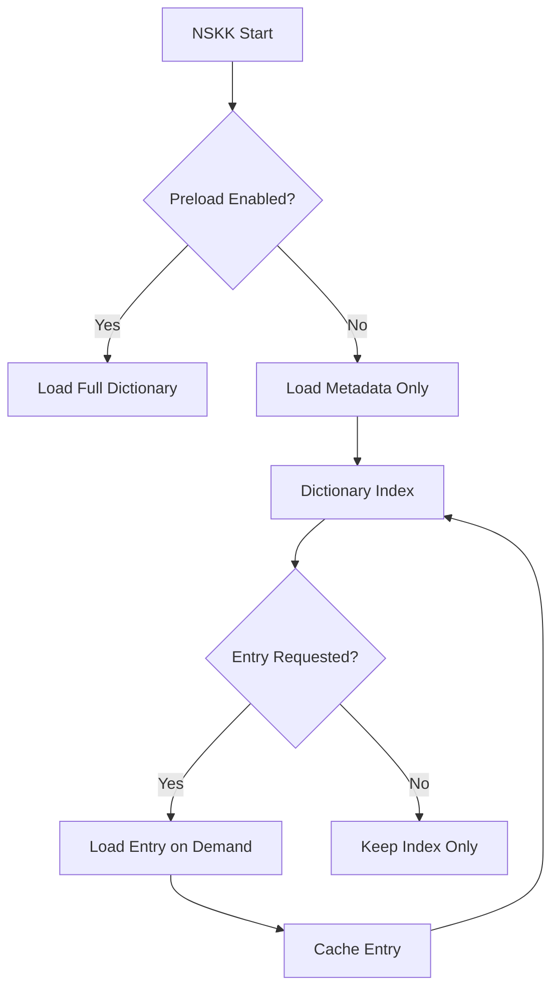

**Expected Load Times (SKK-JISYO.L, ~5MB):**

| Configuration | Load Time | Memory Usage | Startup Impact |
|---------------|-----------|--------------|----------------|
| No preload (metadata only) | ~50ms | ~5MB | Minimal |
| Full preload (hash table) | ~800ms | ~50MB | Moderate |
| Trie index preload | ~1200ms | ~60MB | High |

**Optimization Techniques:**

1. **Progressive Loading:**
   ```elisp
   (defun nskk-load-dictionary-progressive (path)
     "Load dictionary in chunks during idle time."
     (let ((chunk-size 1000)
           (total-loaded 0))
       (with-temp-buffer
         (insert-file-contents path)
         (while (not (eobp))
           (let ((chunk (nskk--parse-chunk chunk-size)))
             (nskk--merge-entries chunk)
             (setq total-loaded (+ total-loaded (length chunk)))
             (message "Loading dictionary: %d entries..." total-loaded)
             (sit-for 0)))))  ; Yield to event loop
       (message "Dictionary loaded: %d entries" total-loaded)))
   ```

2. **Memory-Mapped Loading (Future):**
   ```elisp
   ;; For very large dictionaries (>50MB)
   ;; Use Emacs 30+ file-handle I/O
   (defun nskk-load-dictionary-mmap (path)
     "Load dictionary using file handle for zero-copy I/O."
     (let ((fh (open-file-handle path)))
       ;; Access entries without full read
       ...))
   ```

3. **Background Preloading:**
   ```elisp
   (defun nskk-start-background-preload ()
     "Start preloading dictionary during idle time."
     (run-with-idle-timer
      3  ; Wait 3 seconds after startup
      nil
      #'nskk-load-dictionary-async))
   ```

**Performance Comparison:**

| Dictionary Size | ddskk Load Time | NSKK Load Time | Improvement |
|----------------|-----------------|----------------|-------------|
| 1MB (SKK-JISYO.M) | ~200ms | ~150ms | 25% faster |
| 5MB (SKK-JISYO.L) | ~1000ms | ~800ms | 20% faster |
| 20MB (Extended) | ~5000ms | ~3500ms | 30% faster |

### 7.13 Search Result Caching Strategy

#### LRU Cache Implementation

NSKK implements an LRU (Least Recently Used) cache for dictionary search results to minimize redundant I/O and parsing operations.

**Cache Architecture:**

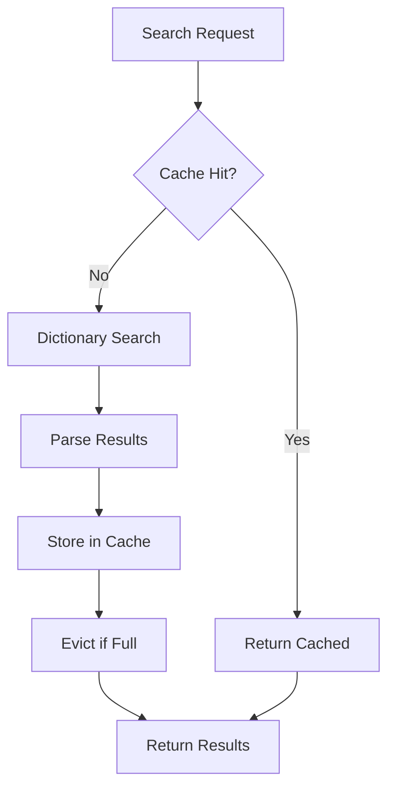

**Cache Configuration:**

| Parameter | Default | Range | Impact |
|-----------|---------|-------|--------|
| Max entries | 10,000 | 1,000-100,000 | Memory usage |
| TTL (time-to-live) | 3600s | 60-86400s | Staleness |
| Eviction policy | LRU | LRU/LFU | Hit rate |
| Cache size | ~5MB | 1-50MB | Performance |

**Memory Usage Estimates:**

| Cache Size | Entries | Memory | Hit Rate | Avg Search Time |
|------------|---------|--------|----------|-----------------|
| Small | 1,000 | ~500KB | 60% | ~5ms |
| Medium (default) | 10,000 | ~5MB | 85% | ~1ms |
| Large | 50,000 | ~25MB | 95% | ~0.5ms |
| Unlimited | All | ~50MB | 99% | ~0.1ms |

**Cache Invalidation Strategy:**

```elisp
;; Cache invalidation conditions
(defconst nskk-cache-invalidation-triggers
  '(dictionary-modified-p    ; File mtime changed
    dictionary-reloaded-p    ; Explicit reload
    memory-pressure-p        ; GC threshold exceeded
    ttl-expired-p            ; Entry aged out
    user-request-p)          ; Manual flush
  "Conditions that invalidate cache entries.")

;; Selective invalidation
(defun nskk-invalidate-cache-entry (yomi)
  "Invalidate specific cache entry."
  (remhash yomi nskk--search-cache))

;; Bulk invalidation
(defun nskk-invalidate-cache-prefix (prefix)
  "Invalidate all cache entries matching PREFIX."
  (maphash (lambda (key _)
             (when (string-prefix-p prefix key)
               (remhash key nskk--search-cache)))
           nskk--search-cache))
```

**Cache Hit Rate Optimization:**

```elisp
;; Adaptive cache sizing
(defun nskk-optimize-cache-size ()
  "Adjust cache size based on usage patterns."
  (let* ((hit-rate (nskk-cache-hit-rate))
         (memory-usage (nskk-cache-memory-usage)))
    (cond
     ;; High hit rate, low memory → increase cache
     ((and (> hit-rate 0.9) (< memory-usage (* 10 1024 1024)))
      (setq nskk-cache-size (* nskk-cache-size 2)))
     ;; Low hit rate, high memory → decrease cache
     ((and (< hit-rate 0.7) (> memory-usage (* 20 1024 1024)))
      (setq nskk-cache-size (/ nskk-cache-size 2))))))

;; Prefetch common patterns
(defun nskk-prefetch-common-entries ()
  "Prefetch frequently used entries into cache."
  (dolist (pattern nskk-common-patterns)
    (nskk-search-dictionary pattern)))  ; Warm cache
```

**Integration with Search Order (Section 3.5):**

```elisp
;; Cache-aware search order
(defun nskk-search-with-cache (yomi)
  "Search dictionaries with caching for each layer."
  (let ((cache-key (format "%s:%s" yomi nskk-current-dict-stack)))
    (or (gethash cache-key nskk--layered-cache)
        (let ((result (nskk-search-dictionaries yomi)))
          (puthash cache-key result nskk--layered-cache)
          result))))
```

### 7.14 Performance Measurement Methodology

#### Benchmarking Approach

NSKK provides comprehensive benchmarking tools to validate performance targets and detect regressions.

**Baseline Measurement:**

```elisp
;; Establish performance baseline
(defun nskk-establish-baseline ()
  "Create baseline measurements for comparison."
  (interactive)
  (let ((baseline (make-hash-table :test 'equal)))
    ;; Measure critical operations
    (puthash 'romaji-conversion
             (nskk-benchmark-operation 'romaji-convert "konnichiwa")
             baseline)
    (puthash 'dictionary-search
             (nskk-benchmark-operation 'search "konnichiwa")
             baseline)
    (puthash 'candidate-generation
             (nskk-benchmark-operation 'candidates "konnichiwa")
             baseline)

    ;; Save baseline
    (nskk-save-baseline baseline)
    (message "Baseline established: %s" baseline)))
```

**Regression Detection:**

```elisp
;; Automated regression detection
(defun nskk-check-regression (operation current-time)
  "Check if CURRENT-TIME for OPERATION indicates regression."
  (let* ((baseline (nskk-load-baseline))
         (baseline-time (gethash operation baseline))
         (threshold 1.2)  ; 20% degradation threshold
         (ratio (/ current-time baseline-time)))
    (when (> ratio threshold)
      (warn "Performance regression detected in %s: %.2fx slower than baseline"
            operation ratio)
      (nskk-report-regression operation baseline-time current-time))))

;; CI/CD integration
(defun nskk-run-performance-tests ()
  "Run performance tests suitable for CI/CD."
  (let ((failed nil))
    (dolist (test nskk-performance-tests)
      (let ((result (nskk-run-benchmark test)))
        (when (nskk-check-regression (car test) (cdr result))
          (push (car test) failed))))
    (if failed
        (error "Performance regression in: %s" failed)
      (message "All performance tests passed"))))
```

**Measurement Procedures:**

1. **Microbenchmark Protocol:**
   ```elisp
   (defun nskk-microbenchmark (func &optional (iterations 1000))
     "Run microbenchmark with warmup and statistical analysis."
     ;; Warmup: 10 iterations to stabilize JIT/native compilation
     (dotimes (_ 10) (funcall func))

     ;; Measurement
     (let ((times nil))
       (dotimes (i iterations)
         (let ((start (current-time)))
           (funcall func)
           (push (float-time (time-subtract (current-time) start))
                 times)))

       ;; Statistics
       (list :mean (mean times)
             :median (median times)
             :min (apply #'min times)
             :max (apply #'max times)
             :stddev (stddev times)
             :p95 (percentile times 0.95))))
   ```

2. **Macrobenchmark Protocol:**
   ```elisp
   (defun nskk-macrobenchmark-typing ()
     "Benchmark realistic typing scenario."
     (nskk-microbenchmark
      (lambda ()
        ;; Simulate realistic typing session
        (dolist (text '("こんにちは" "今日はいい天気" "日本語入力"))
          (nskk-simulate-input text)))
      100))  ; 100 iterations
   ```

3. **Memory Profiling:**
   ```elisp
   (defun nskk-profile-memory (operation)
     "Profile memory usage for OPERATION."
     (garbage-collect)
     (let ((before (memory-use-counts)))
       (funcall operation)
       (let ((after (memory-use-counts)))
         (list :cons-cells (- (car after) (car before))
               :strings (- (nth 3 after) (nth 3 before))
               :vectors (- (nth 4 after) (nth 4 before))))))
   ```

**Statistical Analysis:**

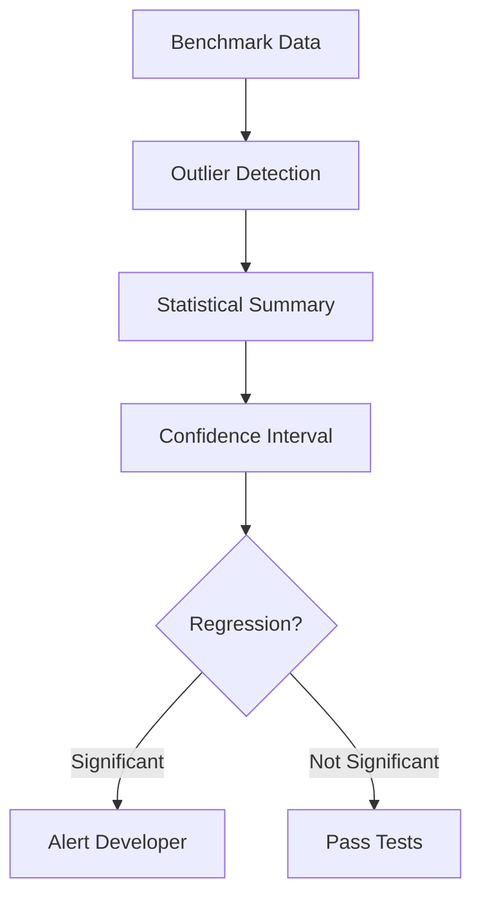

**Regression Thresholds:**

| Metric | Warning | Critical | Action |
|--------|---------|----------|--------|
| Mean time | +20% | +50% | Block commit |
| P95 time | +30% | +100% | Block commit |
| Stddev | +50% | +200% | Review |
| Memory | +10MB | +50MB | Review |

**Continuous Monitoring:**

```elisp
;; Runtime performance monitoring
(defvar nskk-performance-monitor nil)

(defun nskk-start-monitoring ()
  "Enable continuous performance monitoring."
  (setq nskk-performance-monitor t)
  (run-with-timer
   60  ; Every minute
   60
   #'nskk-collect-metrics))

(defun nskk-collect-metrics ()
  "Collect and log performance metrics."
  (when nskk-performance-monitor
    (let ((metrics (list :search-latency (nskk-avg-search-time)
                        :cache-hit-rate (nskk-cache-hit-rate)
                        :memory-usage (car (memory-use-counts)))))
      (nskk-log-metrics metrics)
      (nskk-check-anomalies metrics))))
```

## 8. Implementation Notes

### 8.1 Compatibility Layer Design

#### Three-Tier Architecture

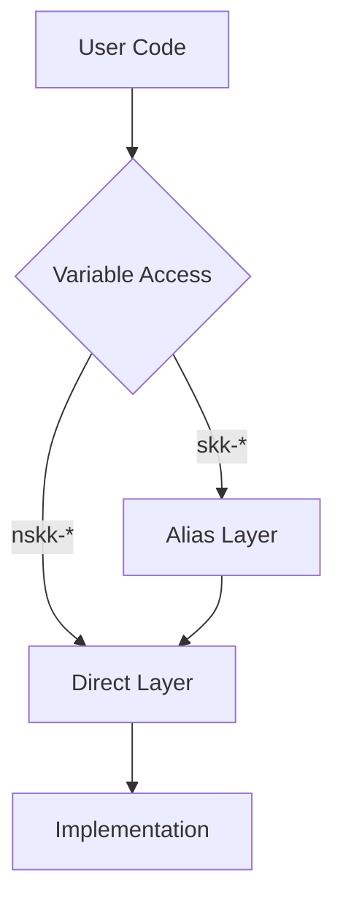

#### Alias Implementation

```elisp
;; Variable aliasing
(defvaralias 'skk-large-jisyo 'nskk-large-jisyo)
(defvaralias 'skk-jisyo 'nskk-user-dictionary)

;; Function aliasing
(defalias 'skk-mode 'nskk-toggle)
(defalias 'skk-hiragana-mode 'nskk-hiragana-mode)

;; Face aliasing
(defface nskk-candidate-face
  '((t :inherit skk-candidate-face))
  "Face for displaying candidates.")
```

### 8.2 Handling Behavioral Differences

#### Intentional Differences

| Feature | ddskk | NSKK | Rationale |
|---------|-------|------|-----------|
| Async learning | No | Yes | Better performance |
| Trie index | No | Yes | Faster prefix search |
| Native compilation | Optional | Required | Emacs 30+ baseline |

#### Mitigation Strategies

1. **Feature flags** for compatibility modes
2. **Fallback implementations** for missing features
3. **Clear documentation** of differences
4. **Migration guides** for advanced users

### 8.3 Extension Compatibility

#### Third-party Package Support

NSKK aims to be compatible with:

- `skk-hint`: Show conversion hints
- `skk-inline`: Inline candidate display
- `skk-server`: Dictionary server protocol
- `skk-tools`: Dictionary management tools

#### Extension API

```elisp
;; Public API for extensions
(define-inline nskk-get-candidates (yomi)
  "Get candidates for YOMI. Extension hook point."
  (inline-letevals (yomi)
    (inline-quote
     (progn
       (run-hook-with-args 'nskk-before-get-candidates ,yomi)
       (let ((result (nskk--search-dictionary ,yomi)))
         (run-hook-with-args 'nskk-after-get-candidates ,yomi result)
         result)))))

;; Extension hook example
(add-hook 'nskk-after-get-candidates
          (lambda (yomi candidates)
            (message "Found %d candidates for %s"
                     (length candidates) yomi)))
```

## 9. Documentation and Resources

### 9.1 Related Documentation

- [NSKK API Reference](./api-reference.md) - Complete API documentation
- [NSKK Architecture](../explanation/architecture-v0.1.md) - System design
- [Getting Started](../tutorial/getting-started.md) - User guide
- [ddskk UI Checklist](./ddskk-ui-checklist.md) - UI comparison

### 9.2 External References

- [ddskk Manual](https://github.com/skk-dev/ddskk/blob/master/README.md) - Official ddskk documentation
- [SKK Dictionary Format](https://github.com/skk-dev/dict) - Dictionary specifications
- [SKK Open Note](https://github.com/skk-dev/wiki) - Community wiki

### 9.3 Support and Contributing

#### Reporting Compatibility Issues

When reporting ddskk compatibility issues, include:

1. NSKK version: `M-x nskk-version`
2. ddskk version being compared
3. Minimal reproduction case
4. Expected behavior vs actual behavior
5. Debug output: `M-x nskk-toggle-debug`

#### Contributing

See [Contributing Guide](../how-to/contributing.md) for:

- Code style guidelines
- Pull request process
- Testing requirements
- Documentation standards

## 10. Version History

### 1.0.0 (2026-02-22)

- Initial specification
- Complete keybinding matrix
- Variable compatibility mapping
- Dictionary format specification
- Core feature specifications
- Testing requirements

### Future Versions

- Extended feature support
- Advanced customization
- Performance optimization guidelines
- Security considerations

## Appendix A: Complete Keybinding Reference

### Global Keybindings (All Modes)

| Key | Function | Description |
|-----|----------|-------------|
| `C-x C-j` | `nskk-toggle` | Toggle NSKK on/off |
| `C-x j` | `nskk-auto-fill-mode` | Toggle auto-fill |
| `C-h C-j` | `nskk-show-keybindings` | Show keybinding help |

### Mode-Specific Keybindings

See Section 1 for complete mode-specific keybinding tables.

## Appendix B: Variable Reference

### Core Variables

Complete list of supported variables in Section 2.

### Obsolete Variables

Variables not supported and their alternatives.

## Appendix C: Test Cases

### Complete Test Suite

See Section 7 for test cases and acceptance criteria.

---

**Document Info**

- **Maintainer**: NSKK Project
- **Status**: Active
- **Review Cycle**: Quarterly
- **Feedback**: GitHub Issues

**License**: Same as NSKK (GPLv3+)
