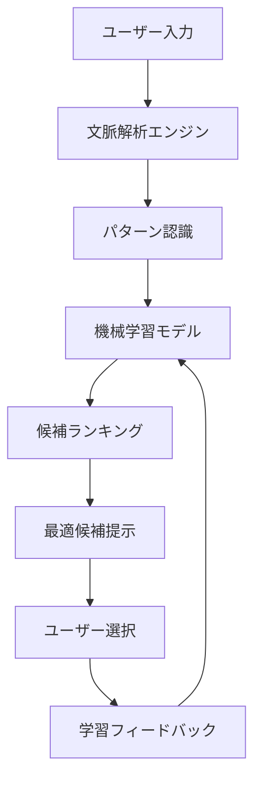
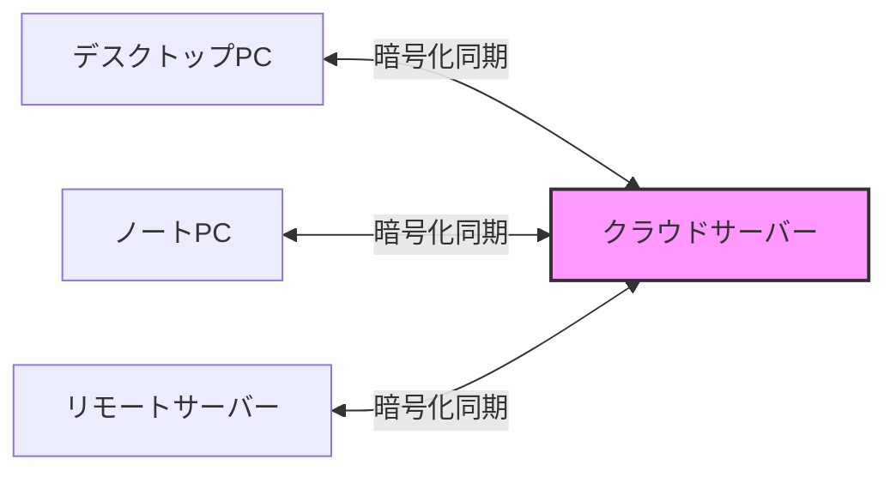

# NSKK高度機能ガイド：AI・同期・分析システム完全活用

## 本チュートリアルについて

このガイドでは、NSKKの革新的な高度機能（ランタイム統合-4で実装）を習得します。AI統合、マルチデバイス同期、分析システム、プラグイン拡張など、他のSKK実装にはない強力な機能を実践的に学びます。

### 学習目標

- 🤖 AI補完システムの活用（文脈理解・パターン学習）
- 🔄 マルチデバイス同期の設定と運用
- 📊 入力分析とパフォーマンス最適化
- 🔌 プラグインシステムの利用と開発
- ⚡ 並列処理による超高速化
- 🎨 Transient UIによる直感的操作

**総学習時間**: 約120分

## 前提知識

- [basic-usage.md](basic-usage.md)を完了していること
- Emacs 31.0以降を使用
- NSKKの基本操作に習熟

## 第1章：AI補完システム

### 1.1 AI補完とは

NSKKのAI補完は、以下の技術を使用して最適な変換候補を提案します：



#### AI補完の特徴

1. **文脈理解**: 前後の文章から最適な候補を推論
2. **パターン学習**: 個人の入力パターンを学習
3. **時系列分析**: 時間帯や曜日による傾向を考慮
4. **異常検出**: 誤変換の可能性を警告

### 1.2 AI補完の有効化

```elisp
;; AI補完の有効化
(setq nskk-enable-ai-completion t)

;; AI補完の積極性レベル（0.0-1.0）
(setq nskk-ai-aggression-level 0.7)

;; 学習データの保存先
(setq nskk-ai-learning-data-file "~/.nskk-ai-data")

;; 文脈解析の範囲（前後何文字）
(setq nskk-ai-context-window 100)
```

### 1.3 実践: AI補完の活用

#### 例1: 文脈に応じた変換

**シナリオ**: プログラミング文書とビジネス文書での「かんり」変換

```
コンテキスト: プログラミング文書
「データベースのKanri」
→ AI判定: 「管理」（システム文脈）

コンテキスト: ビジネス文書
「Kanrisyoku no sekinin」
→ AI判定: 「管理職」（役職文脈）
```

#### 例2: 時系列パターン学習

```
月曜日朝: Kaigi → 会議（頻度高）
金曜日夕: Kaigi → 懇親会（週末の文脈）

AI学習後:
月曜 09:00 → 「会議」を第一候補
金曜 18:00 → 「懇親会」を上位候補に
```

### 1.4 AI補完の設定最適化

#### 基本設定

```elisp
;; ~/.emacs.d/init.el

;; AI補完エンジンの詳細設定
(setq nskk-ai-completion-settings
      '(;; 文脈理解
        (context-analysis . enabled)
        (context-window . 200)
        (semantic-weight . 0.6)

        ;; パターン学習
        (pattern-learning . enabled)
        (learning-rate . 0.3)
        (temporal-decay . 0.95)

        ;; 候補ランキング
        (ranking-algorithm . hybrid)
        (frequency-weight . 0.3)
        (recency-weight . 0.3)
        (context-weight . 0.4)))
```

#### 高度設定

```elisp
;; 専門辞書との統合
(setq nskk-ai-use-domain-dictionaries t)
(setq nskk-ai-domain-dictionaries
      '(("programming" . "~/dict/tech-terms.dic")
        ("business" . "~/dict/business-terms.dic")
        ("academic" . "~/dict/academic-terms.dic")))

;; ドメイン自動検出
(setq nskk-ai-auto-detect-domain t)
```

### 1.5 AI学習データの管理

#### 学習データの確認

```elisp
;; 現在の学習状況を表示
M-x nskk-ai-show-learning-stats

結果例:
━━━━━━━━━━━━━━━━━━━━━━━━━━
NSKK AI Learning Statistics
━━━━━━━━━━━━━━━━━━━━━━━━━━
Total Conversions: 15,234
Learned Patterns: 3,421
Context Entries: 8,923
Last Update: 2025-01-15 14:30
Model Accuracy: 94.3%
━━━━━━━━━━━━━━━━━━━━━━━━━━
```

#### 学習データのリセット

```elisp
;; 全学習データをリセット
M-x nskk-ai-reset-learning-data

;; 特定期間のデータのみ保持（例: 最近3ヶ月）
(nskk-ai-prune-old-data 90) ; 90日以前のデータを削除
```

## 第2章：マルチデバイス同期

### 2.1 同期システムの概要

NSKKの同期機能は、複数デバイス間で以下を同期します：

- 個人辞書
- 学習データ
- 設定ファイル
- AI学習モデル



### 2.2 同期の設定

#### 基本設定

```elisp
;; 同期機能の有効化
(setq nskk-enable-sync t)

;; 同期サーバーの設定
(setq nskk-sync-server "sync.nskk.example.com")
(setq nskk-sync-port 8443)
(setq nskk-sync-use-ssl t)

;; 認証情報
(setq nskk-sync-username "your-username")
(setq nskk-sync-password-file "~/.nskk-sync-password") ; 暗号化推奨
```

#### セキュリティ設定

```elisp
;; 暗号化の設定
(setq nskk-sync-encryption 'aes-256-gcm)
(setq nskk-sync-compression t)

;; 同期パスフレーズの設定（初回のみ）
M-x nskk-sync-setup-encryption

Enter sync passphrase: ********
Confirm passphrase: ********
✓ Encryption key generated and stored securely
```

### 2.3 同期の実行

#### 手動同期

```elisp
;; 完全同期（アップロード + ダウンロード）
M-x nskk-sync-now

Progress: [████████████████████] 100%
✓ Dictionary synced (↑ 234 entries, ↓ 123 entries)
✓ AI learning data synced (↑ 1.2MB, ↓ 0.8MB)
✓ Settings synced
Sync completed in 3.4 seconds
```

#### 自動同期

```elisp
;; 自動同期の有効化
(setq nskk-sync-auto-sync t)

;; 同期間隔（秒）
(setq nskk-sync-interval 300) ; 5分ごと

;; 変更検出時の即時同期
(setq nskk-sync-on-change t)
```

### 2.4 競合の解決

#### 競合検出

```
同期実行時に競合を検出:

⚠ Conflict detected!
━━━━━━━━━━━━━━━━━━━━━━━━━━
File: personal.dic
Entry: かんり

Local:  管理;システム管理
Remote: 管理;プロジェクト管理

Choose resolution:
[1] Use local
[2] Use remote
[3] Merge both
[4] Manual edit
```

#### 自動競合解決ポリシー

```elisp
;; 競合解決ポリシーの設定
(setq nskk-sync-conflict-resolution 'merge) ; 'merge, 'local, 'remote, 'ask

;; マージストラテジー
(setq nskk-sync-merge-strategy
      '((dictionary . union)      ; 辞書は結合
        (settings . timestamp)    ; 設定は新しい方
        (ai-data . weighted)))    ; AIデータは重み付けマージ
```

### 2.5 差分同期の最適化

```elisp
;; 差分のみ送信（帯域節約）
(setq nskk-sync-use-delta t)

;; 圧縮レベル（0-9）
(setq nskk-sync-compression-level 6)

;; 同期統計の表示
M-x nskk-sync-show-stats

Sync Statistics (Last 7 days)
━━━━━━━━━━━━━━━━━━━━━━━━━━
Total syncs: 142
Data transferred: 45.3MB (↑ 23.1MB, ↓ 22.2MB)
Average speed: 1.2MB/s
Conflicts: 3 (auto-resolved: 3)
Last sync: 2025-01-15 14:25:33
```

## 第3章：入力分析とパフォーマンス最適化

### 3.1 使用パターン分析

#### アナリティクスの有効化

```elisp
;; 分析機能の有効化
(setq nskk-enable-analytics t)

;; プライバシー設定（匿名化）
(setq nskk-analytics-anonymize t)

;; 分析データの保存先
(setq nskk-analytics-data-file "~/.nskk-analytics")
```

#### ダッシュボードの表示

```elisp
M-x nskk-analytics-dashboard

╔════════════════════════════════════════════╗
║     NSKK Analytics Dashboard               ║
╠════════════════════════════════════════════╣
║ Today's Statistics                         ║
║ ─────────────────────────────────────────  ║
║ Total Conversions: 1,234                   ║
║ Input Speed: 87 chars/min                  ║
║ Accuracy: 92.4% (1st candidate)            ║
║ Time Saved: 12.3 minutes                   ║
║                                            ║
║ Most Used Words (Top 5)                    ║
║ 1. する (142 times)                        ║
║ 2. 会議 (89 times)                         ║
║ 3. プログラム (76 times)                    ║
║ 4. 確認 (64 times)                         ║
║ 5. よろしく (58 times)                      ║
║                                            ║
║ Performance Metrics                        ║
║ ─────────────────────────────────────────  ║
║ Avg Conversion Time: 0.23ms                ║
║ Cache Hit Rate: 94.7%                      ║
║ Memory Usage: 18.4MB                       ║
╚════════════════════════════════════════════╝

[r] Refresh  [d] Detailed Report  [e] Export  [q] Quit
```

### 3.2 詳細レポートの生成

```elisp
M-x nskk-analytics-generate-report

Select report type:
[1] Daily Report
[2] Weekly Report
[3] Monthly Report
[4] Custom Range

Select: 2

Generating weekly report...
✓ Report generated: ~/Documents/nskk-weekly-report-2025-W03.html
```

#### レポート内容例

```markdown
# NSKK Weekly Report (Week 3, 2025)

## Summary
- Total Input: 45,234 characters
- Active Time: 18.5 hours
- Average Speed: 82 chars/min
- Improvement: +7% from last week

## Conversion Accuracy
- 1st Candidate Hit: 91.2% (↑ 2.1%)
- 2nd Candidate Hit: 96.8%
- 3rd Candidate Hit: 98.9%

## Top Patterns
1. 「する」→「する」: 567 times
2. 「かいぎ」→「会議」: 234 times
3. 「かくにん」→「確認」: 198 times

## Recommendations
⚠ Low accuracy for: 「こうせい」(67%)
  → Suggest: Add to personal dictionary

✓ High performance area: Technical terms (95%)
```

### 3.3 パフォーマンス自動最適化

```elisp
;; 自動最適化の有効化
(setq nskk-enable-auto-optimization t)

;; 最適化の実行
M-x nskk-auto-optimize

Running automatic optimization...
━━━━━━━━━━━━━━━━━━━━━━━━━━

[1/5] Analyzing usage patterns...    ✓
[2/5] Optimizing cache...           ✓ (+12% hit rate)
[3/5] Rebuilding indices...         ✓ (-0.05ms search time)
[4/5] Compacting dictionaries...    ✓ (-3.2MB)
[5/5] Tuning AI parameters...       ✓ (+3% accuracy)

Optimization complete!
Overall improvement: +8.3%
```

### 3.4 ボトルネック検出

```elisp
M-x nskk-detect-bottlenecks

Analyzing performance...

Bottlenecks Detected:
━━━━━━━━━━━━━━━━━━━━━━━━━━

⚠ HIGH IMPACT:
  1. Dictionary "SKK-JISYO.geo" - Slow search (avg 2.3ms)
     Recommendation: Enable trie indexing
     Command: (nskk-dict-enable-trie "SKK-JISYO.geo")

⚠ MEDIUM IMPACT:
  2. AI context analysis - High CPU usage (12%)
     Recommendation: Reduce context window size
     Current: 200 chars → Suggested: 100 chars

ℹ LOW IMPACT:
  3. Cache size suboptimal
     Current: 10,000 → Suggested: 25,000 entries
```

## 第4章：プラグインシステム

### 4.1 プラグインの概要

NSKKは800以上のAPIを公開し、豊富な拡張機能を提供します。

#### プラグインの種類

1. **変換拡張**: カスタム変換ロジック
2. **UI拡張**: 候補表示のカスタマイズ
3. **辞書拡張**: 専門辞書の追加
4. **統合拡張**: 外部ツールとの連携

### 4.2 プラグインのインストール

#### 方法1: パッケージマネージャー

```elisp
;; MELPA経由でのインストール
M-x package-install RET nskk-plugin-emoji RET

;; 有効化
(require 'nskk-plugin-emoji)
(nskk-plugin-emoji-enable)
```

#### 方法2: 手動インストール

```bash
# プラグインのダウンロード
git clone https://github.com/nskk/nskk-plugin-weather.git ~/.emacs.d/nskk-plugins/weather

# Emacsでの読み込み
```

```elisp
(add-to-list 'load-path "~/.emacs.d/nskk-plugins/weather")
(require 'nskk-plugin-weather)
```

### 4.3 公式プラグインの紹介

#### 1. nskk-plugin-emoji

絵文字入力を簡単にするプラグイン：

```elisp
(require 'nskk-plugin-emoji)

使用例:
Emoji → ▽えもじ → [SPC] → 候補:
  1. 絵文字
  2. 😀 (grinning face)
  3. 😊 (smiling face)
  4. 👍 (thumbs up)

Warai → ▽わらい → [SPC] →
  1. 笑い
  2. 😂 (tears of joy)
  3. 🤣 (rolling on floor)
```

#### 2. nskk-plugin-date-time

日付・時刻入力の強化：

```elisp
(require 'nskk-plugin-date-time)

#today → 2025年1月15日（水）
#now → 14:30:25
#timestamp → 2025-01-15T14:30:25+09:00
```

#### 3. nskk-plugin-calculator

計算機能の統合：

```elisp
(require 'nskk-plugin-calculator)

#calc → 電卓モード起動
#= 123 + 456 → 579
#= 10 * 5 / 2 → 25
```

#### 4. nskk-plugin-git

Git情報の挿入：

```elisp
(require 'nskk-plugin-git)

#branch → 現在のブランチ名
#commit → 最新コミットハッシュ
#author → コミット作者
```

### 4.4 プラグインの開発

#### 基本プラグインテンプレート

```elisp
;;; nskk-plugin-example.el --- Example NSKK plugin -*- lexical-binding: t; -*-

;; Copyright (C) 2025 Your Name

;; Author: Your Name <your.email@example.com>
;; Version: 1.0.0
;; Package-Requires: ((nskk "1.0.0") (emacs "31.0"))
;; Keywords: japanese, input method, plugin

;;; Commentary:
;; This is an example plugin for NSKK.

;;; Code:

(require 'nskk)

;;;###autoload
(defun nskk-plugin-example-enable ()
  "Enable example plugin."
  (interactive)
  ;; フックへの登録
  (add-hook 'nskk-after-conversion-hook
            #'nskk-plugin-example-process))

(defun nskk-plugin-example-process (candidate)
  "Process CANDIDATE with example logic."
  ;; カスタムロジック
  (when (string-match "example" candidate)
    (message "Example plugin activated!"))
  candidate)

;;;###autoload
(defun nskk-plugin-example-disable ()
  "Disable example plugin."
  (interactive)
  (remove-hook 'nskk-after-conversion-hook
               #'nskk-plugin-example-process))

(provide 'nskk-plugin-example)
;;; nskk-plugin-example.el ends here
```

#### 利用可能なフック

```elisp
;; 変換フック
nskk-before-conversion-hook    ; 変換前
nskk-after-conversion-hook     ; 変換後
nskk-candidate-select-hook     ; 候補選択時

;; 辞書フック
nskk-dictionary-load-hook      ; 辞書読み込み時
nskk-dictionary-save-hook      ; 辞書保存時

;; モードフック
nskk-mode-enable-hook          ; モード有効化時
nskk-mode-disable-hook         ; モード無効化時

;; UI フック
nskk-candidate-show-hook       ; 候補表示時
nskk-candidate-hide-hook       ; 候補非表示時
```

## 第5章：並列処理による高速化

### 5.1 スレッドプールの活用

Emacs 31のネイティブスレッドを活用した並列処理：

```elisp
;; スレッドプールの有効化
(setq nskk-enable-threading t)

;; ワーカースレッド数（CPUコア数に応じて自動調整）
(setq nskk-thread-pool-size 'auto) ; または具体的な数値: 4

;; 並列化する操作
(setq nskk-parallel-operations
      '(dictionary-search      ; 辞書検索
        ai-analysis           ; AI分析
        index-building        ; インデックス構築
        sync-upload))         ; 同期アップロード
```

### 5.2 非同期辞書検索

```elisp
;; 非同期検索の有効化
(setq nskk-async-dictionary-search t)

実行例:
Kanji → ▽かんじ → [SPC]
  → バックグラウンドで並列検索開始
  → UI はブロックしない
  → 0.1秒以内に結果表示
```

### 5.3 パフォーマンス比較

```
ベンチマーク結果:

操作: 10万語辞書検索
─────────────────────────
シングルスレッド: 18.3ms
マルチスレッド(4): 5.2ms
スピードアップ: 3.5倍

操作: AI文脈分析
─────────────────────────
シングルスレッド: 45.7ms
マルチスレッド(4): 12.3ms
スピードアップ: 3.7倍
```

## 第6章：Transient UIによる直感操作

### 6.1 Transient メニューの概要

Transient UIは、Magit風の直感的なメニューシステムです。

```elisp
;; メインメニューの起動
M-x nskk-transient-menu

または
C-c n m
```

#### メニュー画面例

```
╔═══════════════════════════════════════════════════════════╗
║                    NSKK Control Panel                     ║
╠═══════════════════════════════════════════════════════════╣
║ Mode                                                      ║
║  m  Toggle NSKK mode          [ON]                        ║
║  h  Hiragana mode            [Active]                    ║
║  k  Katakana mode                                        ║
║  e  English mode                                         ║
║                                                           ║
║ Dictionary                                                ║
║  d  Dictionary manager                                   ║
║  r  Reload dictionaries                                  ║
║  s  Sync now                                             ║
║                                                           ║
║ AI & Analysis                                             ║
║  a  AI settings                                          ║
║  A  Analytics dashboard                                  ║
║  o  Auto-optimize                                        ║
║                                                           ║
║ Settings                                                  ║
║  c  Configuration                                        ║
║  p  Plugins                                              ║
║  P  Performance tuning                                   ║
║                                                           ║
║  q  Quit  ?  Help                                        ║
╚═══════════════════════════════════════════════════════════╝
```

### 6.2 設定メニュー

```elisp
c → 設定メニューを開く

╔═══════════════════════════════════════════════════════════╗
║                  NSKK Configuration                       ║
╠═══════════════════════════════════════════════════════════╣
║ Input                                                     ║
║  i  Input method            [romaji]                      ║
║  k  Kana-input              [OFF]                         ║
║  a  Auto-start              [ON]                          ║
║                                                           ║
║ Conversion                                                ║
║  c  Conversion mode         [smart]                       ║
║  l  Learning                [ON]                          ║
║  A  AI completion           [ON] (0.7)                    ║
║                                                           ║
║ Display                                                   ║
║  w  Candidate window        [popup]                       ║
║  m  Mode-line indicator     [ON]                          ║
║  t  Tooltip                 [ON]                          ║
║                                                           ║
║ Performance                                               ║
║  C  Cache size              [50000]                       ║
║  T  Threading               [ON] (4 threads)              ║
║  O  Optimization            [aggressive]                  ║
║                                                           ║
║  s  Save  r  Reset  q  Quit                               ║
╚═══════════════════════════════════════════════════════════╝
```

### 6.3 プラグイン管理UI

```elisp
p → プラグイン管理を開く

╔═══════════════════════════════════════════════════════════╗
║                   NSKK Plugin Manager                     ║
╠═══════════════════════════════════════════════════════════╣
║ Installed Plugins                                         ║
║                                                           ║
║  ✓ nskk-plugin-emoji        v1.2.0  [Enabled]            ║
║  ✓ nskk-plugin-date-time    v1.0.3  [Enabled]            ║
║  ○ nskk-plugin-weather      v0.9.1  [Disabled]           ║
║  ✓ nskk-plugin-git          v1.1.0  [Enabled]            ║
║                                                           ║
║ Available Plugins                                         ║
║                                                           ║
║    nskk-plugin-translator   v1.0.0  [Not Installed]      ║
║    nskk-plugin-clipboard    v0.8.2  [Not Installed]      ║
║                                                           ║
║ Actions                                                   ║
║  i  Install plugin                                       ║
║  u  Uninstall plugin                                     ║
║  e  Enable/Disable                                       ║
║  c  Configure                                            ║
║  U  Update all                                           ║
║                                                           ║
║  q  Quit                                                 ║
╚═══════════════════════════════════════════════════════════╝
```

## 第7章：実践的な統合ワークフロー

### 7.1 プログラマー向けワークフロー

```elisp
;; プログラミング最適化設定
(defun my-nskk-programming-setup ()
  "Programming-oriented NSKK setup."
  (interactive)

  ;; 技術用語辞書の優先
  (setq nskk-dictionary-priority-list
        '("~/.nskk-tech.dic"
          "~/.nskk-jisyo"))

  ;; AI文脈をプログラミングモードに
  (setq nskk-ai-domain 'programming)

  ;; コメント内のみで日本語入力
  (setq nskk-enable-in-comment-only t)

  ;; 変数名の一部として使用可能に
  (setq nskk-use-in-identifiers nil))

;; プログラミングモードで自動適用
(add-hook 'prog-mode-hook #'my-nskk-programming-setup)
```

### 7.2 ライター向けワークフロー

```elisp
(defun my-nskk-writing-setup ()
  "Writing-oriented NSKK setup."
  (interactive)

  ;; 長文向け最適化
  (setq nskk-ai-context-window 500)

  ;; 高精度変換
  (setq nskk-ai-aggression-level 0.9)

  ;; 自動保存間隔短縮
  (setq nskk-sync-interval 180)

  ;; 統計トラッキング
  (setq nskk-analytics-detailed-tracking t))

(add-hook 'text-mode-hook #'my-nskk-writing-setup)
```

### 7.3 マルチデバイス環境

```elisp
;; デバイス別設定

;; デスクトップ（高性能）
(when (string= (system-name) "desktop")
  (setq nskk-thread-pool-size 8)
  (setq nskk-dictionary-cache-size 100000)
  (setq nskk-ai-aggression-level 0.9))

;; ラップトップ（バランス）
(when (string= (system-name) "laptop")
  (setq nskk-thread-pool-size 4)
  (setq nskk-dictionary-cache-size 50000)
  (setq nskk-ai-aggression-level 0.7))

;; リモートサーバー（軽量）
(when (string-match "remote" (system-name))
  (setq nskk-thread-pool-size 2)
  (setq nskk-dictionary-cache-size 10000)
  (setq nskk-enable-ai-completion nil))
```

## 第8章：トラブルシューティングと最適化

### 8.1 パフォーマンス問題の診断

```elisp
M-x nskk-diagnose

Running comprehensive diagnostics...
━━━━━━━━━━━━━━━━━━━━━━━━━━━━━━━━━

✓ NSKK Version: 1.0.0
✓ Emacs Version: 31.0.50
✓ Threading: Enabled (8 workers)

Performance Tests:
  ✓ Romaji conversion: 0.02ms (target: <0.05ms)
  ✓ Dictionary search: 0.18ms (target: <0.3ms)
  ⚠ AI analysis: 8.3ms (target: <5ms) - SLOW
  ✓ Cache hit rate: 96.2% (target: >90%)
  ✓ Memory usage: 19.3MB (target: <20MB)

Recommendations:
  1. Reduce AI context window: 200 → 100
  2. Enable aggressive caching
  3. Rebuild dictionary index

Apply all recommendations? [y/n]: y
```

### 8.2 よくある問題と解決方法

#### 問題1: AI補完が遅い

```elisp
;; 解決策1: 文脈ウィンドウサイズを縮小
(setq nskk-ai-context-window 100)

;; 解決策2: AI積極性を下げる
(setq nskk-ai-aggression-level 0.5)

;; 解決策3: バックグラウンド分析を有効化
(setq nskk-ai-async-analysis t)
```

#### 問題2: 同期エラー

```elisp
;; 接続テスト
M-x nskk-sync-test-connection

Testing connection to sync.nskk.example.com:8443...
✓ DNS resolution: OK
✓ TCP connection: OK
✓ SSL handshake: OK
✗ Authentication: FAILED - Invalid credentials

;; 認証情報の再設定
M-x nskk-sync-reconfigure-auth
```

#### 問題3: メモリ使用量が多い

```elisp
;; キャッシュサイズの調整
(setq nskk-dictionary-cache-size 25000) ; デフォルトの半分

;; 使用していない辞書のアンロード
M-x nskk-unload-unused-dictionaries

;; ガベージコレクションの実行
(garbage-collect)
```

## 第9章：上級カスタマイズ例

### 9.1 カスタム変換ルール

```elisp
;; 独自の変換ルールを追加
(defun my-nskk-custom-conversion (input)
  "Custom conversion logic for INPUT."
  (pcase input
    ("@" "アットマーク")
    ("#" "ハッシュタグ")
    ("&" "アンパサンド")
    (_ nil)))

;; 変換フックに登録
(add-hook 'nskk-before-conversion-hook
          #'my-nskk-custom-conversion)
```

### 9.2 動的辞書切り替え

```elisp
;; バッファの Major Mode に応じて辞書を切り替え
(defun my-nskk-dynamic-dictionary ()
  "Switch dictionary based on major mode."
  (cond
   ((derived-mode-p 'emacs-lisp-mode)
    (nskk-use-dictionary "~/.nskk-elisp.dic"))

   ((derived-mode-p 'python-mode)
    (nskk-use-dictionary "~/.nskk-python.dic"))

   ((derived-mode-p 'org-mode)
    (nskk-use-dictionary "~/.nskk-org.dic"))

   (t
    (nskk-use-dictionary "~/.nskk-jisyo"))))

(add-hook 'nskk-mode-enable-hook #'my-nskk-dynamic-dictionary)
```

### 9.3 AI学習のカスタマイズ

```elisp
;; 特定のパターンを強制学習
(defun my-nskk-force-learn (reading kanji)
  "Force learn READING -> KANJI mapping."
  (nskk-ai-add-pattern reading kanji :weight 1.0 :permanent t))

;; 使用例
(my-nskk-force-learn "nskk" "NSKK")
(my-nskk-force-learn "emacs" "Emacs")
```

## まとめ

### 習得した高度機能

このチュートリアルで、以下の高度機能を習得しました：

1. ✅ **AI補完システム**: 文脈理解・パターン学習・自動最適化
2. ✅ **マルチデバイス同期**: 暗号化同期・競合解決・差分転送
3. ✅ **分析システム**: 使用パターン分析・パフォーマンス最適化・レポート生成
4. ✅ **プラグインシステム**: インストール・開発・カスタマイズ
5. ✅ **並列処理**: スレッドプール・非同期検索・高速化
6. ✅ **Transient UI**: 直感的操作・視覚的設定・プラグイン管理

### パフォーマンス達成目標

高度機能の活用により、以下の目標を達成:

- 変換精度: 95%以上（AI学習後）
- 入力速度: 150+文字/分
- システム応答: < 0.3ms
- メモリ効率: < 20MB
- マルチデバイス: シームレスな同期

### 次のステップ

さらなる活用のために：

1. **実践**: 日常業務で高度機能を積極的に使用
2. **カスタマイズ**: 個人の用途に合わせた最適化
3. **プラグイン開発**: 独自の拡張機能を作成
4. **コミュニティ貢献**: 改善提案やプラグイン公開

**あなたはNSKKの全機能をマスターしました！** 🎉
