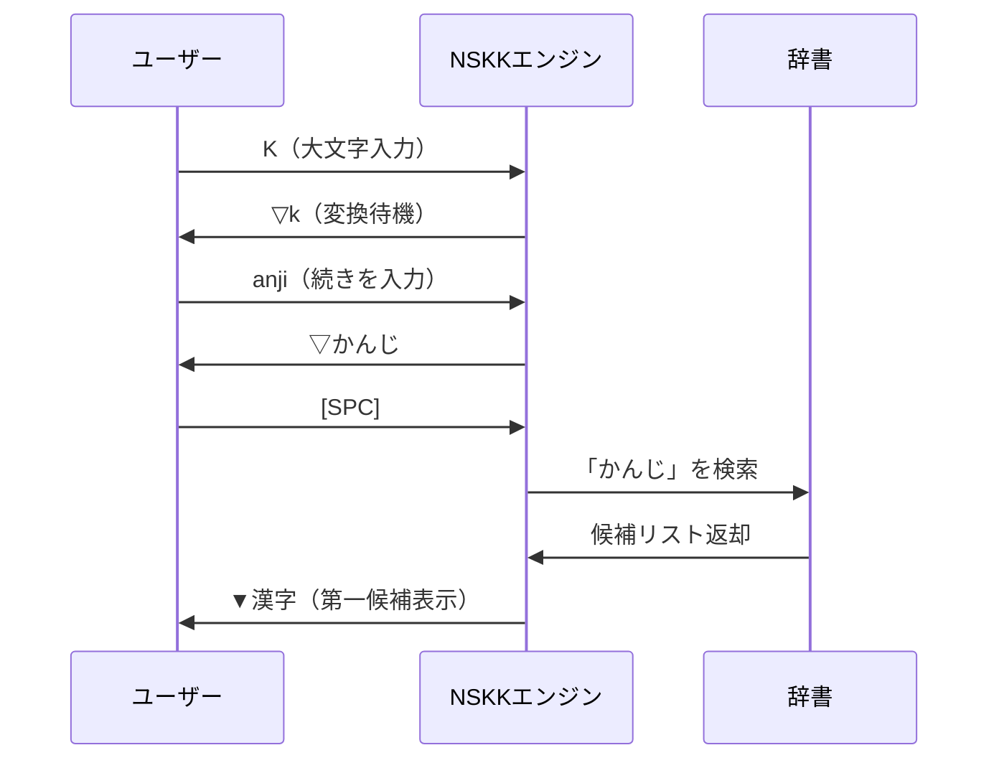

# NSKK基本使用法：実践的日本語入力ガイド

## 本チュートリアルで学べること

このガイドでは、NSKKを使った実践的な日本語入力の方法を詳しく学びます。実際の文章作成シーンを想定した豊富な例題と演習で、確実にスキルを習得できます。

### 学習目標

- ✅ 基本的なひらがな・カタカナ入力（10分でマスター）
- ✅ 漢字変換と候補選択（20分で習熟）
- ✅ 送り仮名処理と活用形（15分で理解）
- ✅ 記号・数字入力の効率化（10分で習得）
- ✅ 実践的な文章作成（30分で実践）

**総学習時間**: 約85分

## 前提知識

- Emacsの基本操作（バッファ、ウィンドウ操作）
- キーボードのホームポジション
- [getting-started.md](getting-started.md)を完了していること

## 第1章：ひらがな入力の基礎

### 1.1 五十音図の入力

NSKKのローマ字変換は、標準的なローマ字入力方式に準拠しています。

#### 清音の入力

**あ行**:
```
a → あ    i → い    u → う    e → え    o → お
```

**か行**:
```
ka → か   ki → き   ku → く   ke → け   ko → こ
```

**さ行**:
```
sa → さ   si → し   su → す   se → せ   so → そ
shi → し  (推奨: 'si'と同じ結果)
```

**た行**:
```
ta → た   ti → ち   tu → つ   te → て   to → と
chi → ち  (推奨: 'ti'と同じ結果)
tsu → つ  (推奨: 'tu'と同じ結果)
```

**な行**:
```
na → な   ni → に   nu → ぬ   ne → ね   no → の
```

**は行**:
```
ha → は   hi → ひ   hu → ふ   he → へ   ho → ほ
fu → ふ   (推奨: 'hu'と同じ結果)
```

**ま行**:
```
ma → ま   mi → み   mu → む   me → め   mo → も
```

**や行**:
```
ya → や   yu → ゆ   yo → よ
```

**ら行**:
```
ra → ら   ri → り   ru → る   re → れ   ro → ろ
```

**わ行**:
```
wa → わ   wo → を   nn → ん
```

#### 演習1.1: 基本五十音の入力

以下の単語を入力してみましょう：

```
1. sakura → さくら（桜）
2. hana → はな（花）
3. umi → うみ（海）
4. yama → やま（山）
5. kawa → かわ（川）
```

**期待時間**: 2分以内

### 1.2 濁音・半濁音の入力

#### 濁音

**が行**:
```
ga → が   gi → ぎ   gu → ぐ   ge → げ   go → ご
```

**ざ行**:
```
za → ざ   zi → じ   zu → ず   ze → ぜ   zo → ぞ
ji → じ   (推奨: 'zi'と同じ結果)
```

**だ行**:
```
da → だ   di → ぢ   du → づ   de → で   do → ど
```

**ば行**:
```
ba → ば   bi → び   bu → ぶ   be → べ   bo → ぼ
```

#### 半濁音

**ぱ行**:
```
pa → ぱ   pi → ぴ   pu → ぷ   pe → ぺ   po → ぽ
```

#### 演習1.2: 濁音・半濁音の入力

```
1. gakkou → がっこう（学校）
2. zubon → ずぼん（ズボン）
3. denwa → でんわ（電話）
4. buta → ぶた（豚）
5. pan → ぱん（パン）
```

**期待時間**: 2分以内

### 1.3 拗音（小さい「ゃ」「ゅ」「ょ」）

拗音は子音+yの組み合わせで入力します：

```
kya → きゃ   kyu → きゅ   kyo → きょ
sha → しゃ   shu → しゅ   sho → しょ
cha → ちゃ   chu → ちゅ   cho → ちょ
nya → にゃ   nyu → にゅ   nyo → にょ
hya → ひゃ   hyu → ひゅ   hyo → ひょ
mya → みゃ   myu → みゅ   myo → みょ
rya → りゃ   ryu → りゅ   ryo → りょ
gya → ぎゃ   gyu → ぎゅ   gyo → ぎょ
ja → じゃ    ju → じゅ    jo → じょ
bya → びゃ   byu → びゅ   byo → びょ
pya → ぴゃ   pyu → ぴゅ   pyo → ぴょ
```

#### 演習1.3: 拗音の入力

```
1. kyouto → きょうと（京都）
2. syasin → しゃしん（写真）
3. tyuui → ちゅうい（注意）
4. nyuusu → にゅーす（ニュース）
5. ryokou → りょこう（旅行）
```

**期待時間**: 3分以内

### 1.4 特殊な入力

#### 促音（小さい「っ」）

子音を2回続けて入力します：

```
kk → っk（次の文字と結合）
ss → っs
tt → っt
pp → っp

例:
kitte → きって（切手）
zasshi → ざっし（雑誌）
```

#### 撥音（「ん」）

以下の方法で入力できます：

```
nn → ん（確実な入力）
n' → ん（次が母音のときに使用）

例:
kannji → かんじ（感じ）
kon'ya → こんや（今夜）
```

#### 長音（「ー」）

```
- キー → ー

例:
ko-hi- → こーひー（コーヒー）
```

#### 小書き文字

xまたはlを使います：

```
xa → ぁ   xi → ぃ   xu → ぅ   xe → ぇ   xo → ぉ
la → ぁ   li → ぃ   lu → ぅ   le → ぇ   lo → ぉ
xya → ゃ  xyu → ゅ  xyo → ょ
xtu → っ  xtsu → っ
xwa → ゎ
```

#### 演習1.4: 特殊入力の練習

```
1. gakkou → がっこう（学校）
2. konnnitiwa → こんにちわ（こんにちは）
3. ko-hi- → こーひー（コーヒー）
4. wakkusu → わっくす（ワックス）
5. pittari → ぴったり（ぴったり）
```

**期待時間**: 3分以内

## 第2章：カタカナ入力

### 2.1 カタカナモードへの切り替え

カタカナモードに切り替えるには：

```
1. ひらがなモードで 'q' キーを押す
2. モードラインが [あ] → [ア] に変化
3. 同じローマ字入力でカタカナが入力される
4. 再度 'q' を押すとひらがなモードに戻る
```

### 2.2 カタカナ単語の入力

#### 外来語の入力

```
ko-hi- → コーヒー（Coffee）
konkurīto → コンクリート（Concrete）
konpyu-ta- → コンピューター（Computer）
intānetto → インターネット（Internet）
puroguramingu → プログラミング（Programming）
```

#### 演習2.1: カタカナ単語の入力

カタカナモードで以下を入力：

```
1. terebi → テレビ（TV）
2. rajio → ラジオ（Radio）
3. kamera → カメラ（Camera）
4. erebēta- → エレベーター（Elevator）
5. restoran → レストラン（Restaurant）
```

**期待時間**: 3分以内

### 2.3 カタカナ変換のテクニック

#### 一時的なカタカナ変換

ひらがなモードのまま、一部だけカタカナにしたい場合：

```
1. 変換後の候補選択時に 'q' を押す
2. 現在の候補がカタカナに変換される

例:
▽こんぴゅーたー → [SPC] → ▼コンピューター
```

#### 半角カタカナの入力

```
1. カタカナモードで入力
2. 変換候補で半角カタカナを選択

または:
▽コンピューター → [SPC] → 候補に「ｺﾝﾋﾟｭｰﾀｰ」が含まれる
```

## 第3章：漢字変換

### 3.1 漢字変換の基本

#### 変換の開始

**大文字で始める**: 漢字変換は大文字（Shift + 文字）で開始します。

```
Kanji → ▽かんじ（変換待機モード）
[SPC] → ▼漢字（候補選択モード）
```

#### 変換プロセス



### 3.2 候補の選択

#### 基本的な候補操作

```
[SPC]     : 次の候補を表示
x         : 前の候補を表示（実装による）
[Enter]   : 現在の候補を確定
C-g       : 変換を中止
```

#### 複数候補の表示例

```
▽かんじ → [SPC]

候補一覧:
▼1. 漢字（最も一般的）
  2. 感じ（feeling）
  3. 幹事（organizer）
  4. 監事（auditor）

[SPC] → 次候補へ
[Enter] → 確定
```

### 3.3 実践的な漢字変換

#### 演習3.1: 基本単語の変換

```
1. Nihon → ▽にほん → [SPC] → ▼日本
2. Gakkou → ▽がっこう → [SPC] → ▼学校
3. Sensei → ▽せんせい → [SPC] → ▼先生
4. Benkyou → ▽べんきょう → [SPC] → ▼勉強
5. Shigoto → ▽しごと → [SPC] → ▼仕事
```

**期待時間**: 5分以内

#### 演習3.2: 同音異義語の選択

```
1. Kikai → ▽きかい → [SPC]
   候補: 機会, 機械, 器械, 奇怪

2. Kousei → ▽こうせい → [SPC]
   候補: 構成, 厚生, 校正, 恒星, 公正

3. Seisaku → ▽せいさく → [SPC]
   候補: 政策, 製作, 制作
```

**期待時間**: 5分以内

### 3.4 複合語・熟語の変換

#### 複合語の入力

```
1. DensiMēru → ▽でんしめーる → [SPC] → ▼電子メール
2. JouhouGijutu → ▽じょうほうぎじゅつ → [SPC] → ▼情報技術
3. KoukyouKoutuu → ▽こうきょうこうつう → [SPC] → ▼公共交通
```

#### 文節区切りのテクニック

連続した大文字で文節を区切ることができます：

```
KyouNoTenki → ▽きょうの▽てんき
→ [SPC] → ▼今日の天気

NihonNoKulture → ▽にほんの▽かるちゃー
→ [SPC] → ▼日本のカルチャー
```

## 第4章：送り仮名処理

### 4.1 送り仮名とは

送り仮名は、漢字の後に続くひらがなのことです。動詞や形容詞の活用に使われます。

### 4.2 送り仮名の入力方法

#### 基本ルール

**大文字で送り仮名の開始を示す**:

```
KaK → ▽かk → [SPC] → ▼書k → [Enter] → 書く
TabeR → ▽たべr → [SPC] → ▼食べr → [Enter] → 食べる
OokiI → ▽おおきい → [SPC] → ▼大きい
```

#### 動詞の活用パターン

##### 五段動詞（う段で終わる）

```
KaK → 書く（書きます、書いた、書いて）
YomU → 読む（読みます、読んだ、読んで）
HanaS → 話す（話します、話した、話して）
KiK → 聞く（聞きます、聞いた、聞いて）
IsoG → 急ぐ（急ぎます、急いだ、急いで）
SinU → 死ぬ（死にます、死んだ、死んで）
YobU → 呼ぶ（呼びます、呼んだ、呼んで）
MaT → 待つ（待ちます、待った、待って）
KauR → 買う（買います、買った、買って）
```

##### 上一段動詞（「いる」で終わる）

```
MiR → 見る（見ます、見た、見て）
OkiR → 起きる（起きます、起きた、起きて）
```

##### 下一段動詞（「える」で終わる）

```
TabeR → 食べる（食べます、食べた、食べて）
NerU → 寝る（寝ます、寝た、寝て）
```

##### サ変・カ変動詞

```
SuR → する（します、した、して）
KuR → 来る（来ます、来た、来て）
```

#### 演習4.1: 送り仮名の入力

```
1. KaK → ▽かk → [SPC] → 書く
2. YomU → ▽よむ → [SPC] → 読む
3. TabeR → ▽たべr → [SPC] → 食べる
4. MiR → ▽みr → [SPC] → 見る
5. SuR → ▽すr → [SPC] → する
```

**期待時間**: 5分以内

### 4.3 形容詞の送り仮名

#### イ形容詞

```
UtsukusiI → ▽うつくしい → [SPC] → 美しい
OokiI → ▽おおきい → [SPC] → 大きい
HayaI → ▽はやい → [SPC] → 速い/早い
TakaI → ▽たかい → [SPC] → 高い
```

#### ナ形容詞

```
Kirei → ▽きれい → [SPC] → きれい
Benri → ▽べんり → [SPC] → 便利
Shizuka → ▽しずか → [SPC] → 静か
```

#### 演習4.2: 形容詞の入力

```
1. AkariI → ▽あかるい → [SPC] → 明るい
2. SamUI → ▽さむい → [SPC] → 寒い
3. AtatakaI → ▽あたたかい → [SPC] → 暖かい
4. Genki → ▽げんき → [SPC] → 元気
5. Shizuka → ▽しずか → [SPC] → 静か
```

**期待時間**: 5分以内

## 第5章：記号・数字の入力

### 5.1 句読点と記号

#### 基本的な句読点

```
, → 、（読点）
. → 。（句点）
! → ！（感嘆符）
? → ？（疑問符）
```

#### 括弧類

```
( → （
) → ）
[ → 「
] → 」
{ → 『
} → 』
```

#### その他の記号

```
- → ー（長音）
/ → ・（中点）
~ → 〜（波ダッシュ）
```

### 5.2 数字の入力と変換

#### 半角数字

直接入力モード（`l`キー）で数字を入力：

```
l → [_A]モード
123 → 123
C-j → [あ]モード復帰
```

#### 全角数字

```
#123 → ▽#123 → [SPC] → 候補:
  1. 123（全角数字）
  2. 百二十三
  3. 一二三
```

#### 日付・時刻の変換

```
#2024-01-15 → ▽#2024-01-15 → [SPC] → 候補:
  1. 2024年1月15日
  2. 令和6年1月15日
  3. 2024/01/15

#14:30 → ▽#14:30 → [SPC] → 候補:
  1. 14時30分
  2. 午後2時30分
  3. 14:30
```

### 5.3 アスキーアート・特殊文字

#### 顔文字

```
Kao → ▽かお → [SPC] → 候補に顔文字が含まれる:
  1. 顔
  2. (^_^)
  3. (^^)
  4. (*^_^*)
```

#### 矢印記号

```
Yajirusi → ▽やじるし → [SPC] → 候補:
  1. 矢印
  2. →
  3. ←
  4. ↑
  5. ↓
```

## 第6章：実践的な文章作成

### 6.1 短文の作成

#### 演習6.1: 自己紹介

以下の文章を入力してみましょう：

```
WatashiNO NamaeHA YamadaTarouDESU.
Nihon NO ToukyouNI SundeIMASU.
SyumiHA YomukoTO TO RyokouDESU.

↓ 変換後

私の名前は山田太郎です。
日本の東京に住んでいます。
趣味は読むことと旅行です。
```

**期待時間**: 5分以内

#### 演習6.2: 日記形式の文章

```
Kyou HA IiTenkiDEsitA.
Asa KoenhaniITTE, SanpowoSimasitA.
Gogo ha tomodachito KaimononiIkimasita.
Tanoshii ichinichideshita.

↓ 変換後

今日はいい天気でした。
朝、公園に行って、散歩をしました。
午後は友達と買い物に行きました。
楽しい一日でした。
```

**期待時間**: 7分以内

### 6.2 長文の作成テクニック

#### 変換単位の最適化

**推奨**: 文節ごとに変換

```
悪い例:
KyouhaiitenkinodeitemoatatakaidesuWatashihatこうえんにいって...
（変換範囲が長すぎる）

良い例:
Kyou ha → 今日は
ii tenki node → いい天気なので
totemo atatakaide su → とても暖かいです
```

#### 変換の修正

間違えた場合:
```
1. C-g で変換を中止
2. 入力し直す
または
3. 確定後、削除して再入力
```

### 6.3 ビジネス文書の作成

#### 演習6.3: ビジネスメール

```
otsukaresamadesu.
konkaino kaigino gijirokuwo ososimasimasu.
kakuninnokudasai.
yoroshikuonegaisimasu.

↓ 変換後

お疲れ様です。
今回の会議の議事録を送信します。
確認ください。
よろしくお願いします。
```

**期待時間**: 8分以内

## 第7章：効率化テクニック

### 7.1 ショートカットキーの活用

#### モード切り替え

```
C-x C-j : NSKK on/off
C-j     : ひらがなモードに強制復帰
q       : ひらがな⇔カタカナ切り替え
l       : 一時的な直接入力（1文字）
L       : 全角英数字モード
```

#### 変換操作

```
SPC     : 変換開始・次候補
x       : 前候補
C-g     : 変換中止
RET     : 確定
```

### 7.2 辞書登録の活用

#### 頻繁に使う単語の登録

```
Nskk → ▽nskk → [SPC]
候補がない場合 → 新規登録プロンプト
→ 「NSKK」と入力 → 次回から候補に表示
```

### 7.3 入力速度の向上

#### タイピング練習

```
M-x nskk-typing-practice

または

定期的な実践:
1. 毎日10分の練習
2. 1週間で基本操作を習得
3. 1ヶ月でスムーズな入力を実現
```

#### 目標設定

```
初級: 30文字/分（変換含む）
中級: 60文字/分
上級: 100文字/分
エキスパート: 150文字/分以上
```

## 第8章：トラブルシューティング

### 8.1 よくある問題

#### 問題1: 変換候補が表示されない

**原因**: 辞書が読み込まれていない

**解決方法**:
```elisp
;; 辞書パスの確認
M-x describe-variable RET nskk-dictionary-list

;; 辞書の再読み込み
M-x nskk-reload-dictionaries
```

#### 問題2: 送り仮名が正しく変換されない

**原因**: 送り仮名の位置指定が間違っている

**解決方法**:
```
誤: KakimasU → ×
正: KaKimasu → ○ (最初のKで送り仮名開始)
```

#### 問題3: カタカナモードから戻れない

**解決方法**:
```
q キーを押す → ひらがなモードに戻る
または
C-j → 強制的にひらがなモードに復帰
```

### 8.2 パフォーマンス問題

#### 辞書検索が遅い

```elisp
;; キャッシュサイズの増加
(setq nskk-dictionary-cache-size 100000)

;; インデックスの再構築
M-x nskk-rebuild-dictionary-index
```

## 第9章：上達への道

### 9.1 段階的学習プラン

#### 第1週: 基礎固め

```
Day 1-2: ひらがな入力完全習得
Day 3-4: カタカナ入力・記号入力
Day 5-6: 基本的な漢字変換
Day 7: 復習と総合練習
```

#### 第2週: 応用技術

```
Day 8-10: 送り仮名処理の習得
Day 11-12: 複雑な変換パターン
Day 13-14: 実践的な文章作成
```

#### 第3週以降: 実践と最適化

```
- 毎日の業務で実際に使用
- 個人辞書の充実
- 入力速度の向上
```

### 9.2 練習用テキスト

#### 練習文1: 基本文章

```
WatashiHA MainichiNSKKWO TsukatteIMASU.
TotemoBenriNA NihongoNyuuryokuSystemDESU.
SaishoHA SukoshiMuzukashikattaDESUGA,
ImaDE ha TotemOHayakuNyuuryokuDekimasU.
```

#### 練習文2: 技術文書

```
PuroguramuNO KaihatuNI atarimashite,
KodingStandardWO MamoruKotoGA TaisetsUDESU.
TesutoWO JuujitsuSASETE,
HinshitsuNO TakaiSehinWO TodokeMASHOU.
```

### 9.3 スキルチェック

#### 初級レベルチェック

```
✓ ひらがな・カタカナを自由に入力できる
✓ 基本的な漢字変換ができる
✓ 句読点・記号を入力できる
✓ 簡単な文章を作成できる
```

#### 中級レベルチェック

```
✓ 送り仮名処理を正確に行える
✓ 複雑な漢字変換をスムーズに行える
✓ ビジネス文書を作成できる
✓ 50文字/分以上で入力できる
```

#### 上級レベルチェック

```
✓ あらゆる文章をストレスなく入力できる
✓ 専門用語も正確に変換できる
✓ 100文字/分以上で入力できる
✓ 個人辞書を効果的に活用している
```

## まとめ

### 習得した内容

このチュートリアルで、以下のスキルを習得しました：

1. ✅ **基本入力**: ひらがな・カタカナ・記号
2. ✅ **漢字変換**: 基本変換から複雑な変換まで
3. ✅ **送り仮名処理**: 動詞・形容詞の活用
4. ✅ **実践的文章作成**: 日常文からビジネス文書まで
5. ✅ **効率化テクニック**: ショートカット・辞書活用

### 次のステップ

さらなるスキルアップのために：

1. **[advanced-features.md](advanced-features.md)**: AI補完・同期機能を学ぶ
2. **[customization.md](customization.md)**: 個人設定の最適化
3. **実践**: 毎日の作業でNSKKを使い続ける

### パフォーマンス目標

現在のあなたのレベル:
- 入力速度: 30-50文字/分
- 変換精度: 80%以上
- 操作習熟度: 中級レベル

継続的な練習で、さらなる向上を目指しましょう！

**Happy Typing with NSKK! 🎉**
