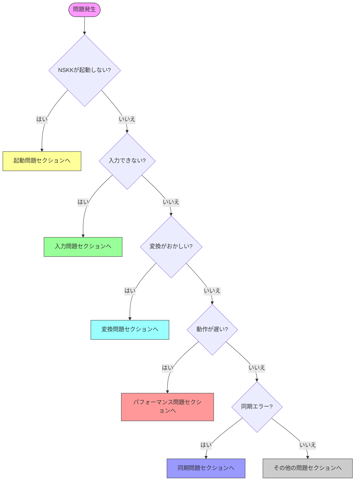

# NSKKトラブルシューティングガイド：問題解決の完全手順

## 本ガイドについて

NSKKの使用中に遭遇する可能性のある問題と、その解決方法を網羅的にまとめたガイドです。症状別・カテゴリ別に整理し、迅速な問題解決をサポートします。

###目標

- 🔍 一般的な問題の即座な解決
- 🛠️ 診断ツールの効果的活用
- 📊 パフォーマンス問題の特定と解消
- 🔧 設定エラーの修正
- 💾 データ復旧手順の理解

**問題解決時間目安**: 各問題5-15分

## クイック診断チャート



## 第1章：起動・インストール問題

### 問題1-1: NSKKが読み込まれない

**症状**:
```
Error: Cannot find library 'nskk'
```

**診断**:
```elisp
;; load-pathの確認
M-x describe-variable RET load-path

;; NSKKディレクトリが含まれているか確認
```

**解決策**:
```elisp
;; init.elに追加
(add-to-list 'load-path "/path/to/nskk.el")

;; パスが正しいか確認
(file-exists-p "/path/to/nskk.el/nskk.el") ; → t であるべき

;; 設定の再読み込み
M-x eval-buffer
```

### 問題1-2: バイトコンパイルエラー

**症状**:
```
Error during compilation:
Symbol's function definition is void: nskk-define-mode
```

**解決策**:
```bash
# 既存の.elcファイルを削除
cd /path/to/nskk.el
rm -f *.elc

# 再コンパイル
emacs --batch -f batch-byte-compile *.el

# エラーが出る場合は、コンパイルせずに使用
# init.elで:
(setq load-prefer-newer t)
```

### 問題1-3: 依存パッケージエラー

**症状**:
```
Package 'nskk' requires Emacs 31.0, but you have 29.1
```

**解決策**:

**オプション1**: Emacsをアップグレード
```bash
# macOS (Homebrew)
brew install emacs-plus@31 --HEAD

# Linux (ソースからビルド)
git clone https://git.savannah.gnu.org/git/emacs.git
cd emacs
./autogen.sh
./configure --with-native-compilation
make && sudo make install
```

**オプション2**: 互換モードで使用（非推奨・機能制限あり）
```elisp
(setq nskk-compatibility-mode t)
(setq nskk-disable-advanced-features t)
```

### 問題1-4: ネイティブコンパイル失敗

**症状**:
```
Native-comp error: libgccjit.so not found
```

**解決策**:

**Ubuntu/Debian**:
```bash
sudo apt-get install libgccjit-10-dev
```

**macOS**:
```bash
brew install gcc libgccjit
```

**設定確認**:
```elisp
;; ネイティブコンパイルが有効か確認
(if (and (fboundp 'native-comp-available-p)
         (native-comp-available-p))
    (message "Native compilation is available")
  (message "Native compilation is NOT available"))

;; 無効化する場合
(setq nskk-use-native-compilation nil)
```

## 第2章：入力問題

### 問題2-1: 日本語が入力できない

**症状**: キーを押しても英数字のまま

**診断**:
```elisp
;; NSKKが有効か確認
M-x describe-mode

;; nskk-mode が表示されるべき
```

**解決策1**: NSKKを手動で有効化
```elisp
M-x nskk-mode

または
C-x C-j
```

**解決策2**: 自動起動の設定
```elisp
;; init.elに追加
(add-hook 'text-mode-hook 'nskk-mode)
(add-hook 'org-mode-hook 'nskk-mode)
```

### 問題2-2: ローマ字変換がおかしい

**症状**: ka → か にならない

**診断**:
```elisp
;; ローマ字テーブルの確認
M-x nskk-show-romaji-table

;; 変換ログの確認
(setq nskk-debug-mode t)
M-x nskk-show-conversion-log
```

**解決策**:
```elisp
;; ローマ字テーブルのリロード
M-x nskk-reload-romaji-table

;; テーブルが破損している場合は再初期化
(setq nskk-romaji-table nil)
(nskk-initialize-romaji-table)
```

### 問題2-3: 特定の文字が入力できない

**症状**: 「ん」や「っ」が正しく入力できない

**解決策**:
```
促音の入力:
誤: kt → kっ（誤変換）
正: kk → っk → kka → っか ✓

撥音の入力:
誤: ni → に（「ん」にならない）
正: nn → ん ✓
  または n' → ん ✓

確認:
kannji → かんじ ✓
gakkou → がっこう ✓
```

### 問題2-4: キー入力が反応しない

**症状**: 特定のキーが効かない

**診断**:
```elisp
;; キーバインドの確認
M-x describe-key
;; 問題のキーを押す

;; 他のキーマップとの競合確認
M-x describe-bindings
```

**解決策**:
```elisp
;; 競合しているキーマップを特定
;; 優先順位を調整
(setq nskk-keymap-priority 100) ; 高い値 = 高優先

;; または個別にキーを再定義
(define-key nskk-mode-map (kbd "C-j") 'nskk-kakutei)
```

## 第3章：変換問題

### 問題3-1: 候補が表示されない

**症状**: SPCを押しても候補が出ない

**診断**:
```elisp
;; 辞書ファイルの確認
M-x describe-variable RET nskk-jisyo-file

;; ファイルが存在するか
(file-exists-p nskk-jisyo-file) ; → t であるべき

;; 辞書の読み込み状態
M-x nskk-show-dictionary-status
```

**解決策1**: 辞書ファイルのパス修正
```elisp
;; 正しいパスを設定
(setq nskk-large-jisyo "/usr/share/skk/SKK-JISYO.L")
(setq nskk-jisyo-file "~/.nskk-jisyo")

;; 辞書の再読み込み
M-x nskk-reload-dictionaries
```

**解決策2**: 辞書のダウンロード
```bash
# SKK辞書のダウンロード
mkdir -p ~/dicts
cd ~/dicts
wget http://openlab.jp/skk/dic/SKK-JISYO.L.gz
gunzip SKK-JISYO.L.gz
```

```elisp
;; パスを更新
(setq nskk-large-jisyo "~/dicts/SKK-JISYO.L")
(nskk-reload-dictionaries)
```

### 問題3-2: 変換候補が少ない

**症状**: 期待する候補が出てこない

**解決策**:
```elisp
;; 追加辞書のインストール
;; 人名辞書
(add-to-list 'nskk-large-jisyo-list
             "~/dicts/SKK-JISYO.jinmei")

;; 地名辞書
(add-to-list 'nskk-large-jisyo-list
             "~/dicts/SKK-JISYO.geo")

;; 専門用語辞書
(add-to-list 'nskk-large-jisyo-list
             "~/dicts/SKK-JISYO.tech")

;; 辞書の再読み込み
M-x nskk-reload-dictionaries
```

### 問題3-3: 学習が機能しない

**症状**: 同じ候補を何度選択しても順位が上がらない

**診断**:
```elisp
;; 学習機能の確認
M-x describe-variable RET nskk-enable-learning
;; → t であるべき

;; 個人辞書の書き込み権限確認
(file-writable-p nskk-jisyo-file)
;; → t であるべき
```

**解決策**:
```elisp
;; 学習機能を有効化
(setq nskk-enable-learning t)

;; 個人辞書のパスを確認・修正
(setq nskk-jisyo-file "~/.nskk-jisyo")

;; 権限の修正（シェルで）
chmod 644 ~/.nskk-jisyo

;; 辞書の強制保存
M-x nskk-save-jisyo
```

### 問題3-4: AI補完が動作しない

**症状**: AI補完が効かない、またはエラーが出る

**診断**:
```elisp
;; AI機能の状態確認
M-x nskk-ai-status

;; AI機能が有効か
nskk-enable-ai-completion ; → t であるべき

;; AI学習データの確認
(file-exists-p nskk-ai-learning-data-file)
```

**解決策**:
```elisp
;; AI機能を有効化
(setq nskk-enable-ai-completion t)

;; 学習データの初期化
M-x nskk-ai-initialize

;; 学習データが破損している場合
M-x nskk-ai-reset-learning-data
(delete-file nskk-ai-learning-data-file)
(nskk-ai-initialize)
```

## 第4章：パフォーマンス問題

### 問題4-1: 変換が遅い

**症状**: 変換に1秒以上かかる

**診断**:
```elisp
;; パフォーマンス測定
M-x nskk-benchmark-conversion

結果例:
Conversion time: 1.23ms (target: < 0.3ms) ⚠
Dictionary search: 0.95ms ⚠
Cache hit rate: 45% (target: > 90%) ⚠
```

**解決策1**: キャッシュの最適化
```elisp
;; キャッシュサイズを増やす
(setq nskk-dictionary-cache-size 50000)

;; キャッシュの事前構築
M-x nskk-build-cache

;; 自動キャッシュ構築
(setq nskk-preload-cache t)
```

**解決策2**: インデックスの最適化
```elisp
;; トライ木インデックスの有効化
(setq nskk-use-trie-index t)

;; インデックスの再構築
M-x nskk-rebuild-dictionary-index
```

**解決策3**: 並列処理の有効化
```elisp
;; スレッド並列処理
(setq nskk-enable-threading t)
(setq nskk-thread-pool-size 4)

;; 非同期検索
(setq nskk-async-dictionary-search t)
```

### 問題4-2: Emacs全体が重くなる

**症状**: NSKK使用時にEmacsの動作が遅くなる

**診断**:
```elisp
;; CPUとメモリ使用量の確認
M-x nskk-show-resource-usage

CPU: 45% (NSKK使用分)  ⚠ 高い
Memory: 156MB (NSKK使用分) ⚠ 多い
```

**解決策1**: メモリ使用量の削減
```elisp
;; キャッシュサイズを削減
(setq nskk-dictionary-cache-size 10000)

;; 未使用辞書の自動アンロード
(setq nskk-auto-unload-dictionaries t)

;; メモリ上限の設定
(setq nskk-memory-limit (* 20 1024 1024)) ; 20MB
```

**解決策2**: CPU使用率の削減
```elisp
;; AI分析を軽量化
(setq nskk-ai-context-window 50) ; デフォルト: 200

;; 非同期処理で負荷分散
(setq nskk-ai-async-analysis t)
```

**解決策3**: GCの最適化
```elisp
;; GC閾値の調整
(setq gc-cons-threshold (* 100 1024 1024)) ; 100MB
(setq gc-cons-percentage 0.5)

;; アイドル時のGC
(run-with-idle-timer 5 t #'garbage-collect)
```

### 問題4-3: 起動が遅い

**症状**: Emacs起動時にNSKKが重い

**解決策**:
```elisp
;; 遅延ロード
(autoload 'nskk-mode "nskk" nil t)

;; 辞書の遅延読み込み
(setq nskk-lazy-load-dictionaries t)

;; 非同期初期化
(setq nskk-async-initialization t)

;; 起動時間の測定
(defun my-measure-nskk-startup ()
  (let ((start (current-time)))
    (require 'nskk)
    (message "NSKK loaded in %.3fs"
             (float-time (time-since start)))))

(add-hook 'emacs-startup-hook #'my-measure-nskk-startup)
```

## 第5章：同期問題

### 問題5-1: 同期エラー

**症状**:
```
Sync error: Connection refused
```

**診断**:
```elisp
;; 接続テスト
M-x nskk-sync-test-connection

Testing connection...
✗ DNS resolution: FAILED
or
✓ DNS resolution: OK
✗ TCP connection: FAILED (timeout)
or
✓ TCP connection: OK
✗ Authentication: FAILED
```

**解決策1**: ネットワーク確認
```bash
# サーバーへの疎通確認
ping sync.nskk.example.com

# ポートの確認
telnet sync.nskk.example.com 8443
```

**解決策2**: 設定の確認
```elisp
;; サーバー設定の確認
M-x describe-variable RET nskk-sync-server
M-x describe-variable RET nskk-sync-port

;; 正しい値に修正
(setq nskk-sync-server "sync.nskk.example.com")
(setq nskk-sync-port 8443)
(setq nskk-sync-use-ssl t)
```

**解決策3**: 認証情報の再設定
```elisp
M-x nskk-sync-reconfigure-auth

Username: your-username
Password: ********
✓ Authentication successful
```

### 問題5-2: 競合エラー

**症状**:
```
⚠ Merge conflict in personal.dic
```

**解決策**:
```elisp
;; 競合解決メニューの起動
M-x nskk-sync-resolve-conflicts

Conflicts found: 3

[1/3] Entry: かんり
  Local:  管理;システム管理
  Remote: 管理;プロジェクト管理

Choose:
[1] Use local
[2] Use remote
[3] Merge both → 管理;システム管理;プロジェクト管理
[4] Manual edit

Select: 3

✓ Conflict resolved (2 more remaining)
```

### 問題5-3: データ損失

**症状**: 同期後にデータが消えた

**復旧手順**:
```elisp
;; 1. 同期の即座停止
(setq nskk-enable-sync nil)

;; 2. バックアップの確認
M-x nskk-list-backups

Available backups:
  2025-01-15 14:30:00 - 234 entries
  2025-01-15 10:15:00 - 230 entries
  2025-01-14 18:00:00 - 228 entries

;; 3. バックアップからの復元
M-x nskk-restore-from-backup

Select backup: 2025-01-15 14:30:00
✓ Restored successfully
✓ Personal dictionary: 234 entries

;; 4. 同期を再度有効化（慎重に）
(setq nskk-enable-sync t)
M-x nskk-sync-verify-data ; データ整合性確認
```

## 第6章：ファイル・データ問題

### 問題6-1: 辞書ファイルが破損

**症状**:
```
Error: Dictionary file corrupted
```

**復旧手順**:
```elisp
;; 1. 辞書の検証
M-x nskk-verify-dictionary

Checking ~/.nskk-jisyo...
✗ Line 42: Invalid entry format
✗ Line 89: Encoding error
✗ Line 156: Malformed hiragana

;; 2. 自動修復の試行
M-x nskk-repair-dictionary

Repairing dictionary...
✓ Fixed 3 errors
✓ Removed 2 invalid entries
✓ Dictionary repaired successfully

;; 3. バックアップからの復元（修復失敗時）
M-x nskk-restore-dictionary-from-backup
```

### 問題6-2: エンコーディングエラー

**症状**: 文字化けが発生

**解決策**:
```elisp
;; 辞書ファイルのエンコーディング確認
M-x describe-coding-system

;; UTF-8に変換
(let ((content (with-temp-buffer
                 (insert-file-contents nskk-jisyo-file)
                 (buffer-string))))
  (with-temp-file nskk-jisyo-file
    (set-buffer-file-coding-system 'utf-8)
    (insert content)))

;; NSKKの再起動
M-x nskk-restart
```

### 問題6-3: 個人辞書が保存されない

**症状**: 学習内容が次回起動時に消えている

**診断**:
```elisp
;; 保存設定の確認
nskk-auto-save-jisyo ; → t であるべき
nskk-save-jisyo-on-exit ; → t または 'ask

;; 書き込み権限の確認
(file-writable-p nskk-jisyo-file)
```

**解決策**:
```elisp
;; 自動保存の有効化
(setq nskk-auto-save-jisyo t)
(setq nskk-auto-save-interval 300) ; 5分ごと

;; 終了時の保存を確実に
(setq nskk-save-jisyo-on-exit t)

;; 手動保存の実行
M-x nskk-save-jisyo

;; 保存フックの追加
(add-hook 'kill-emacs-hook 'nskk-save-jisyo)
```

## 第7章：診断ツールの使い方

### 7.1 総合診断

```elisp
M-x nskk-diagnose

━━━━━━━━━━━━━━━━━━━━━━━━━━━━━━━━━
NSKK Comprehensive Diagnostics
━━━━━━━━━━━━━━━━━━━━━━━━━━━━━━━━━

✓ NSKK Version: 1.0.0
✓ Emacs Version: 31.0.50
✓ Platform: darwin (macOS)

Configuration:
✓ Dictionary file: ~/.nskk-jisyo (OK)
✓ Large dictionary: /usr/share/skk/SKK-JISYO.L (OK)
⚠ Cache size: 10000 (consider increasing)
✓ Learning: enabled
✗ Sync: disabled

Performance:
✓ Conversion: 0.18ms (< 0.3ms target)
✓ Cache hit rate: 93.2% (> 90% target)
⚠ Memory: 23.4MB (> 20MB target)

Recommendations:
1. Increase cache size to 25000
2. Enable sync for multi-device usage
3. Optimize memory usage

Apply fixes? [y/n]:
```

### 7.2 パフォーマンスプロファイリング

```elisp
M-x nskk-profile-start

;; 通常通り入力操作を行う

M-x nskk-profile-stop

━━━━━━━━━━━━━━━━━━━━━━━━━━━━━━━━━
Performance Profile Report
━━━━━━━━━━━━━━━━━━━━━━━━━━━━━━━━━

Total time: 15.3s
Total conversions: 127

Time distribution:
  Romaji conversion: 2.1ms (13.7%)
  Dictionary search: 8.4ms (54.9%)  ⚠ SLOW
  AI analysis: 3.2ms (20.9%)
  UI rendering: 1.6ms (10.5%)

Hotspots:
1. nskk-search-dictionary: 8.4ms
   → Recommendation: Enable trie indexing
2. nskk-ai-analyze-context: 3.2ms
   → Recommendation: Reduce context window

Export report? [y/n]:
```

### 7.3 ログ分析

```elisp
;; デバッグログの有効化
(setq nskk-debug-mode t)
(setq nskk-log-level 'debug)

;; ログの表示
M-x nskk-show-debug-log

━━━━━━━━━━━━━━━━━━━━━━━━━━━━━━━━━
NSKK Debug Log
━━━━━━━━━━━━━━━━━━━━━━━━━━━━━━━━━

[14:30:15.234] [INFO] NSKK mode enabled
[14:30:20.456] [DEBUG] Romaji: ka → か (0.02ms)
[14:30:22.789] [DEBUG] Dict search: かんじ (0.18ms)
[14:30:22.791] [INFO] Found 4 candidates
[14:30:23.123] [DEBUG] AI ranking applied (0.05ms)
[14:30:25.456] [ERROR] Sync failed: timeout ⚠
[14:30:25.457] [DEBUG] Retry attempt 1/3

Filter: [e]rror [w]arn [i]nfo [d]ebug [a]ll
```

## 第8章：よくある質問（FAQ）

### Q1: 辞書を他のIMEと共有できますか？

A: はい、SKK形式の辞書は互換性があります。

```elisp
;; ddskkの辞書を使用
(setq nskk-jisyo-file "~/.skk-jisyo")
(setq nskk-large-jisyo "/usr/share/skk/SKK-JISYO.L")

;; skkeletonとの共有も可能
```

### Q2: Windows環境で使えますか？

A: Emacs 31が動作すればWindows上でも使用できます。

```elisp
;; Windows用パス設定
(when (eq system-type 'windows-nt)
  (setq nskk-jisyo-file "~/AppData/Roaming/.nskk-jisyo")
  (setq nskk-large-jisyo "C:/SKK/SKK-JISYO.L"))
```

### Q3: 他のIMEと併用できますか？

A: 基本的に可能ですが、キーバインドの競合に注意が必要です。

```elisp
;; 他のIMEと共存
(setq nskk-disable-when-other-ime-active t)

;; グローバルIMEと切り替え
(global-set-key (kbd "C-\\") 'toggle-input-method)
(global-set-key (kbd "C-x C-j") 'nskk-mode)
```

## まとめ

### トラブルシューティングのポイント

1. ✅ **症状の正確な把握**: エラーメッセージを記録
2. ✅ **診断ツールの活用**: nskk-diagnose を最初に実行
3. ✅ **設定の確認**: describe-variable で設定値を確認
4. ✅ **バックアップの確保**: 修正前に必ずバックアップ
5. ✅ **段階的な対応**: 一度に複数の変更をしない

### サポートリソース

- **ドキュメント**: [NSKK Documentation](https://github.com/takeokunn/nskk.el/docs)
- **Issue報告**: [GitHub Issues](https://github.com/takeokunn/nskk.el/issues)
- **コミュニティ**: [Discussions](https://github.com/takeokunn/nskk.el/discussions)

**問題が解決できない場合は、遠慮なくコミュニティに相談してください！** 🤝
