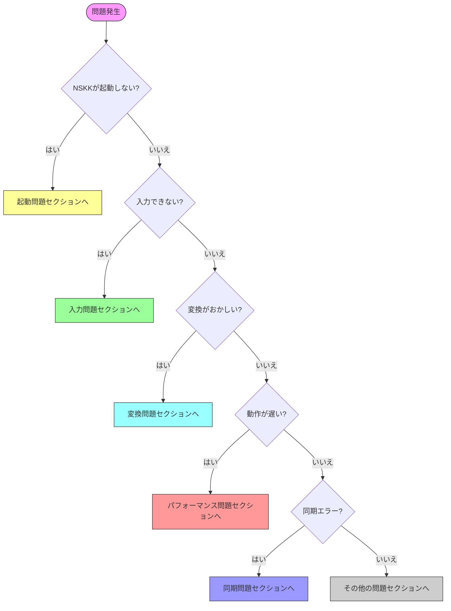

# NSKKトラブルシューティングガイド：問題解決の完全手順

## 本ガイドについて

NSKKの使用中に遭遇する可能性のある問題と、その解決方法を網羅的にまとめたガイドです。症状別・カテゴリ別に整理し、迅速な問題解決をサポートします。

###目標

- 🔍 一般的な問題の即座な解決
- 🛠️ 診断ツールの効果的活用
- 📊 パフォーマンス問題の特定と解消
- 🔧 設定エラーの修正
- 💾 データ復旧手順の理解

**問題解決時間目安**: 各問題5-15分

## クイック診断チャート


```mermaid
flowchart TD
    START([問題発生]) --> Q1{NSKKが起動しない?}
    Q1 -->|はい| STARTUP[起動問題セクションへ]
    Q1 -->|いいえ| Q2{入力できない?}

    Q2 -->|はい| INPUT[入力問題セクションへ]
    Q2 -->|いいえ| Q3{変換がおかしい?}

    Q3 -->|はい| CONV[変換問題セクションへ]
    Q3 -->|いいえ| Q4{動作が遅い?}

    Q4 -->|はい| PERF[パフォーマンス問題セクションへ]
    Q4 -->|いいえ| Q5{同期エラー?}

    Q5 -->|はい| SYNC[同期問題セクションへ]
    Q5 -->|いいえ| OTHER[その他の問題セクションへ]

    style START fill:#f9f,stroke:#333
    style STARTUP fill:#ff9,stroke:#333
    style INPUT fill:#9f9,stroke:#333
    style CONV fill:#9ff,stroke:#333
    style PERF fill:#f99,stroke:#333
    style SYNC fill:#99f,stroke:#333
    style OTHER fill:#ccc,stroke:#333
```

## 第1章：起動・インストール問題

### 問題1-1: NSKKが読み込まれない

**症状**:
```
Error: Cannot find library 'nskk'
```

**診断**:
```elisp
;; load-pathの確認
M-x describe-variable RET load-path

;; NSKKディレクトリが含まれているか確認
```

**解決策**:
```elisp
;; init.elに追加
(add-to-list 'load-path "/path/to/nskk.el")

;; パスが正しいか確認
(file-exists-p "/path/to/nskk.el/nskk.el") ; → t であるべき

;; 設定の再読み込み
M-x eval-buffer
```

### 問題1-2: バイトコンパイルエラー

**症状**:
```
Error during compilation:
Symbol's function definition is void: nskk-define-mode
```

**解決策**:
```bash
# 既存の.elcファイルを削除
cd /path/to/nskk.el
rm -f *.elc

# 再コンパイル
emacs --batch -f batch-byte-compile *.el

# エラーが出る場合は、コンパイルせずに使用
# init.elで:
(setq load-prefer-newer t)
```

### 問題1-3: 依存パッケージエラー

**症状**:
```
Package 'nskk' requires Emacs 30.0, but you have 29.1
```

**解決策**:

**オプション1**: Emacsをアップグレード
```bash
# macOS (Homebrew)
brew install emacs-plus@30 --HEAD

# Linux (ソースからビルド)
git clone https://git.savannah.gnu.org/git/emacs.git
cd emacs
./autogen.sh
./configure --with-native-compilation
make && sudo make install
```

**オプション2**: 互換モードで使用（非推奨・機能制限あり）
```elisp
(setopt nskk-compatibility-mode t)
(setopt nskk-disable-advanced-features t)
```

### 問題1-4: ネイティブコンパイル失敗

**症状**:
```
Native-comp error: libgccjit.so not found
```

**解決策**:

**Ubuntu/Debian**:
```bash
sudo apt-get install libgccjit-10-dev
```

**macOS**:
```bash
brew install gcc libgccjit
```

**設定確認**:
```elisp
;; ネイティブコンパイルが有効か確認
(if (and (fboundp 'native-comp-available-p)
         (native-comp-available-p))
    (message "Native compilation is available")
  (message "Native compilation is NOT available"))

;; 無効化する場合
(setopt nskk-use-native-compilation nil)
```

## 第2章：入力問題

### 問題2-1: 日本語が入力できない

**症状**: キーを押しても英数字のまま

**診断**:
```elisp
;; NSKKが有効か確認
M-x describe-mode

;; nskk-mode が表示されるべき
```

**解決策1**: NSKKを手動で有効化
```elisp
M-x nskk-mode

または
C-x C-j
```

**解決策2**: 自動起動の設定
```elisp
;; init.elに追加
(add-hook 'text-mode-hook 'nskk-mode)
(add-hook 'org-mode-hook 'nskk-mode)
```

### 問題2-2: ローマ字変換がおかしい

**症状**: ka → か にならない

**診断**:
```elisp
;; ローマ字テーブルの確認
M-x nskk-show-romaji-table

;; 変換ログの確認
(setopt nskk-debug-mode t)
M-x nskk-show-conversion-log
```

**解決策**:
```elisp
;; ローマ字テーブルのリロード
M-x nskk-reload-romaji-table

;; テーブルが破損している場合は再初期化
(setopt nskk-romaji-table nil)
(nskk-initialize-romaji-table)
```

### 問題2-3: 特定の文字が入力できない

**症状**: 「ん」や「っ」が正しく入力できない

**解決策**:
```
促音の入力:
誤: kt → kっ（誤変換）
正: kk → っk → kka → っか ✓

撥音の入力:
誤: ni → に（「ん」にならない）
正: nn → ん ✓
  または n' → ん ✓

確認:
kannji → かんじ ✓
gakkou → がっこう ✓
```

### 問題2-4: キー入力が反応しない

**症状**: 特定のキーが効かない

**診断**:
```elisp
;; キーバインドの確認
M-x describe-key
;; 問題のキーを押す

;; 他のキーマップとの競合確認
M-x describe-bindings
```

**解決策**:
```elisp
;; 競合しているキーマップを特定
;; 優先順位を調整
(setopt nskk-keymap-priority 100) ; 高い値 = 高優先

;; または個別にキーを再定義
(keymap-set nskk-mode-map "C-j" #'nskk-kakutei)
```

## 第3章：変換問題

### 問題3-1: 候補が表示されない

**症状**: SPCを押しても候補が出ない

**診断**:
```elisp
;; 辞書ファイルの確認
M-x describe-variable RET nskk-jisyo-file

;; ファイルが存在するか
(file-exists-p nskk-jisyo-file) ; → t であるべき

;; 辞書の読み込み状態
M-x nskk-show-dictionary-status
```

**解決策1**: 辞書ファイルのパス修正
```elisp
;; 正しいパスを設定
(setopt nskk-large-jisyo "/usr/share/skk/SKK-JISYO.L")
(setopt nskk-jisyo-file "~/.nskk-jisyo")

;; 辞書の再読み込み
M-x nskk-reload-dictionaries
```

**解決策2**: 辞書のダウンロード
```bash
# SKK辞書のダウンロード - GitHub (skk-dev/dict) が現在の主要配布元
mkdir -p ~/dicts
cd ~/dicts
curl -O https://raw.githubusercontent.com/skk-dev/dict/master/SKK-JISYO.L
```

```elisp
;; パスを更新
(setopt nskk-large-jisyo "~/dicts/SKK-JISYO.L")
(nskk-reload-dictionaries)
```

### 問題3-2: 変換候補が少ない

**症状**: 期待する候補が出てこない

**解決策**:
```elisp
;; 追加辞書のインストール
;; 人名辞書
(add-to-list 'nskk-large-jisyo-list
             "~/dicts/SKK-JISYO.jinmei")

;; 地名辞書
(add-to-list 'nskk-large-jisyo-list
             "~/dicts/SKK-JISYO.geo")

;; 専門用語辞書
(add-to-list 'nskk-large-jisyo-list
             "~/dicts/SKK-JISYO.tech")

;; 辞書の再読み込み
M-x nskk-reload-dictionaries
```

### 問題3-3: 学習が機能しない

**症状**: 同じ候補を何度選択しても順位が上がらない

**診断**:
```elisp
;; 学習機能の確認
M-x describe-variable RET nskk-enable-learning
;; → t であるべき

;; 個人辞書の書き込み権限確認
(file-writable-p nskk-jisyo-file)
;; → t であるべき
```

**解決策**:
```elisp
;; 学習機能を有効化
(setopt nskk-enable-learning t)

;; 個人辞書のパスを確認・修正
(setopt nskk-jisyo-file "~/.nskk-jisyo")

;; 権限の修正（シェルで）
chmod 644 ~/.nskk-jisyo

;; 辞書の強制保存
M-x nskk-save-jisyo
```

## 第4章：パフォーマンス問題

### 問題4-1: 変換が遅い

**症状**: 変換に1秒以上かかる

**診断**:
```elisp
;; パフォーマンス測定
M-x nskk-benchmark-conversion

;; Expected output format:
;; - Conversion time (target: < 0.1ms)
;; - Dictionary search time (target: < 1ms for exact, < 10ms for prefix)
;; - Cache hit rate
```

**解決策1**: キャッシュの最適化
```elisp
;; キャッシュサイズを増やす
(setopt nskk-dictionary-cache-size 50000)

;; キャッシュの事前構築
M-x nskk-build-cache

;; 自動キャッシュ構築
(setopt nskk-preload-cache t)
```

**解決策2**: インデックスの最適化
```elisp
;; トライ木インデックスの有効化
(setopt nskk-use-trie-index t)

;; インデックスの再構築
M-x nskk-rebuild-dictionary-index
```

**解決策3**: 並列処理の有効化
```elisp
;; スレッド並列処理
(setopt nskk-enable-threading t)
(setopt nskk-thread-pool-size 4)

;; 非同期検索
(setopt nskk-async-dictionary-search t)
```

### 問題4-2: Emacs全体が重くなる

**症状**: NSKK使用時にEmacsの動作が遅くなる

**診断**:
```elisp
;; CPUとメモリ使用量の確認
M-x nskk-show-resource-usage

;; Expected output format:
;; - CPU usage percentage
;; - Memory usage (target: < 50MB)
```

**解決策1**: メモリ使用量の削減
```elisp
;; キャッシュサイズを削減
(setopt nskk-dictionary-cache-size 10000)

;; 未使用辞書の自動アンロード
(setopt nskk-auto-unload-dictionaries t)

;; メモリ上限の設定
(setopt nskk-memory-limit (* 20 1024 1024)) ; 20MB
```

**解決策2**: CPU使用率の削減
```elisp
;; スレッドプールのサイズ調整
(setopt nskk-thread-pool-size 2)

;; 並列化対象を最小限に限定
(setopt nskk-parallel-operations '(dictionary-search))
```

**解決策3**: GCの最適化
```elisp
;; GC閾値の調整
(setq gc-cons-threshold (* 100 1024 1024)) ; 100MB
(setq gc-cons-percentage 0.5)

;; アイドル時のGC
(run-with-idle-timer 5 t #'garbage-collect)
```

### 問題4-3: 起動が遅い

**症状**: Emacs起動時にNSKKが重い

**解決策**:
```elisp
;; 遅延ロード
(autoload 'nskk-mode "nskk" nil t)

;; 辞書の遅延読み込み
(setopt nskk-lazy-load-dictionaries t)

;; 非同期初期化
(setopt nskk-async-initialization t)

;; 起動時間の測定
(defun my-measure-nskk-startup ()
  (let ((start (current-time)))
    (require 'nskk)
    (message "NSKK loaded in %.3fs"
             (float-time (time-since start)))))

(add-hook 'emacs-startup-hook #'my-measure-nskk-startup)
```

## 第6章：ファイル・データ問題

### 問題6-1: 辞書ファイルが破損

**症状**:
```
Error: Dictionary file corrupted
```

**復旧手順**:
```elisp
;; 1. 辞書の検証
M-x nskk-verify-dictionary

;; Expected output format:
;; - File path and validation status
;; - List of any errors found (line numbers, error types)

;; 2. 自動修復の試行
M-x nskk-repair-dictionary

;; Expected output format:
;; - Number of errors fixed/removed
;; - Final repair status

;; 3. バックアップからの復元（修復失敗時）
M-x nskk-restore-dictionary-from-backup
```

### 問題6-2: エンコーディングエラー

**症状**: 文字化けが発生

**解決策**:
```elisp
;; 辞書ファイルのエンコーディング確認
M-x describe-coding-system

;; UTF-8に変換
(let ((content (with-temp-buffer
                 (insert-file-contents nskk-jisyo-file)
                 (buffer-string))))
  (with-temp-file nskk-jisyo-file
    (set-buffer-file-coding-system 'utf-8)
    (insert content)))

;; NSKKの再起動
M-x nskk-restart
```

### 問題6-3: 個人辞書が保存されない

**症状**: 学習内容が次回起動時に消えている

**診断**:
```elisp
;; 保存設定の確認
nskk-auto-save-jisyo ; → t であるべき
nskk-save-jisyo-on-exit ; → t または 'ask

;; 書き込み権限の確認
(file-writable-p nskk-jisyo-file)
```

**解決策**:
```elisp
;; 自動保存の有効化
(setopt nskk-auto-save-jisyo t)
(setopt nskk-auto-save-interval 300) ; 5分ごと

;; 終了時の保存を確実に
(setopt nskk-save-jisyo-on-exit t)

;; 手動保存の実行
M-x nskk-save-jisyo

;; 保存フックの追加
(add-hook 'kill-emacs-hook 'nskk-save-jisyo)
```

## 第7章：診断ツールの使い方

### 7.1 総合診断

```elisp
M-x nskk-diagnose

;; Expected output format:
;; - NSKK/Emacs version and platform information
;; - Configuration status (dictionary paths, cache settings, etc.)
;; - Performance metrics (conversion time, cache hit rate, memory usage)
;; - Recommendations for improvement
```

### 7.2 パフォーマンスプロファイリング

```elisp
M-x nskk-profile-start

;; 通常通り入力操作を行う

M-x nskk-profile-stop

;; Expected output format:
;; - Total profiling time and number of conversions
;; - Time distribution by component (romaji conversion, dictionary search, etc.)
;; - Hotspot identification with optimization recommendations
```

### 7.3 ログ分析

```elisp
;; デバッグログの有効化
(setopt nskk-debug-mode t)
(setopt nskk-log-level 'debug)

;; ログの表示
M-x nskk-show-debug-log

;; Expected output format:
;; - Timestamped log entries with severity levels (ERROR/WARN/INFO/DEBUG)
;; - Key events: mode changes, romaji conversions, dictionary searches
;; - Performance timing for each operation
```

## 第8章：よくある質問（FAQ）

### Q1: 辞書を他のIMEと共有できますか？

A: はい、SKK形式の辞書は互換性があります。

```elisp
;; ddskkの辞書を使用
(setopt nskk-jisyo-file "~/.skk-jisyo")
(setopt nskk-large-jisyo "/usr/share/skk/SKK-JISYO.L")

;; skkeletonとの共有も可能
```

### Q2: Windows環境で使えますか？

A: Emacs 30以上が動作すればWindows上でも使用できます。

```elisp
;; Windows用パス設定
(when (eq system-type 'windows-nt)
  (setopt nskk-jisyo-file "~/AppData/Roaming/.nskk-jisyo")
  (setopt nskk-large-jisyo "C:/SKK/SKK-JISYO.L"))
```

### Q3: 他のIMEと併用できますか？

A: 基本的に可能ですが、キーバインドの競合に注意が必要です。

```elisp
;; 他のIMEと共存
(setopt nskk-disable-when-other-ime-active t)

;; グローバルIMEと切り替え
(keymap-global-set "C-\\" #'toggle-input-method)
(keymap-global-set "C-x C-j" #'nskk-mode)
```

## まとめ

### トラブルシューティングのポイント

1. ✅ **症状の正確な把握**: エラーメッセージを記録
2. ✅ **診断ツールの活用**: nskk-diagnose を最初に実行
3. ✅ **設定の確認**: describe-variable で設定値を確認
4. ✅ **バックアップの確保**: 修正前に必ずバックアップ
5. ✅ **段階的な対応**: 一度に複数の変更をしない

### サポートリソース

- **ドキュメント**: [NSKK Documentation](https://github.com/takeokunn/nskk.el/docs)
- **Issue報告**: [GitHub Issues](https://github.com/takeokunn/nskk.el/issues)
- **コミュニティ**: [Discussions](https://github.com/takeokunn/nskk.el/discussions)

**問題が解決できない場合は、遠慮なくコミュニティに相談してください！** 🤝
